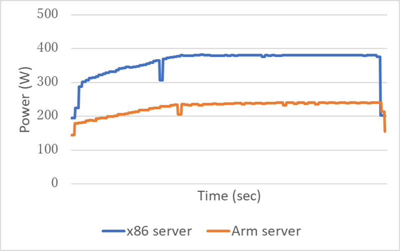

Google first announced [Axion](https://cloud.google.com/products/axion) at their NEXT Event in April, which has gone in GA today. Axion is touted to outperform the ARM-based processors at the rival hyperscaler by **at least 10% per vCPU** on most workloads. It is based on Arm Neoverse™ V2 CPU, just like its counterpart AWS Graviton 4, whereas Azure Cobalt is relying on Arm Neoverse™ N2 Architecture. 

In this article, I'll shed some light on why the hyperscalers are making a massive push towards fabricating their own ARM-based Silicon and then top it off by some metrics for Axion and how you can migrate your workloads to it.

Historically, cloud servers have been predominantly powered by x86 architecture processors. However, with ARM-based processors becoming more powerful and efficient, hyperscalers like AWS, Azure, and Google Cloud are increasingly adopting ARM as a new standard. ARM is no longer just for mobile devices—it’s now powering the cloud.

## Understanding ARM Architecture

### x86 vs ARM
x86 is based on a Complex Instruction Set Computing (CISC) Architecture whereas ARM based processors follow Reduced Instruction Set Computing (RISC) Architecture.

Here's a table comparing RISC and CISC architectures:

| Feature                  | RISC (Reduced Instruction Set Computer)                              | CISC (Complex Instruction Set Computer)                                  |
|--------------------------|----------------------------------------------------------------------|-------------------------------------------------------------------------|
| **Instruction Set**      | Small, highly optimized, simple instructions                        | Large, complex set of instructions                                      |
| **Instruction Complexity** | Simple, each instruction performs a single task                   | Complex, each instruction can perform multiple operations               |
| **Execution Speed**      | Generally faster per cycle (often 1 cycle per instruction)          | Slower per cycle; instructions may take multiple cycles to execute      |
| **Energy Efficiency**    | High efficiency, lower power consumption                            | Higher power usage due to complexity                                    |
| **Memory Usage**         | Can require more instructions, leading to potentially larger code   | Fewer instructions per task, potentially saving memory                  |                                           |
| **General Use Cases**            | Mobile devices, IoT, energy-efficient servers                       | Desktops, laptops, general-purpose servers                              |
| **Advantages**           | Simpler design, lower power, faster per instruction                 | Fewer instructions per operation, potentially lower memory usage        |
| **Drawbacks**            | Higher memory usage due to more instructions                        | Higher power consumption, more complex design                           |

In summary, ARM or Advanced RISC Machine, emphasizes performance-per-watt efficiency, which makes ARM processors highly power-efficient and cost-effective.

## Why Hyperscalers Are Embracing ARM recently?

**Cost Efficiency and Performance**

ARM processors offer a balance of high performance at a lower cost than traditional x86 processors, which is attractive for hyperscalers. Their ability to handle massive parallel workloads efficiently can reduce operational costs.

**Energy Efficiency and Sustainability**

ARM’s power-efficient design can lead to significant reductions in energy consumption, which aligns with the sustainability goals of cloud providers. This energy efficiency is essential as the demand for cloud resources continues to grow. 

See the chart below for comparative power consumption for a java application. For further context on this, read the full article [here](https://www.nttdata.com/global/en/insights/focus/will-java-run-more-sustainably-on-arms-architecture). 

**Customization and Control**

ARM’s open licensing model allows cloud providers to customize processors for specific workloads. 

AWS Graviton 4 Built for: General purpose workloads such as application servers, midsize data stores, microservices, and cluster computing.

### **Comparison of ARM-Based VMs on Different Cloud Providers**

The following table shows the current offerings - older AWS Graviton, Google Cloud Tau and Azure Ampere Altra were the precusors.

| Feature | AWS Graviton 4 | Google Cloud Axion | Azure Cobalt |
| :---- | :---- | :---- | :---- |
| **Processor Architecture** | ARM Neoverse V2 | ARM Neoverse V2 | ARM Neoverse N2 |
| **Availability** | Generally available | Generally available | Generally available |
| **Key Use Cases** | Application servers, midsize data stores, microservices, cluster computing, HPC, ML Inference, Gaming, Memory-cache | Web and App Servers, Databases, Gaming, Media Streaming, Ad Servers, BI & Data Analytics, ML Inference, Network Appliances, Memory-cache  | Web applications, microservices, open-source databases, Memory-cache |
| **Container/K8s Support** | Yes | Yes | Yes |
| **Main Instance Types** | M8g, C8g, R8g | C4a (Standard, High-CPU, High-Mem) | Dpsv6, Dplsv6, Epsv6 |
| **Region Availability** | Select Regions | Select Regions | Select Regions |

### Axion
Axion is Google's custom ARM-based processor with:

* Upto **50% better performance** and
* Upto **60% better energy efficiency**

compared to its x86 counterparts. For certain workloads, you can gain >100% efficiencies.  

It allows upto 72 vCPUs, 576 gb RAM and 100 Gbps networking bandwidth. Configurations are available for the following CPU-to-Memory ratios - 1:2, 1:4 and 1:8 with Local SSD upto 6 TB.

### **Choosing the Right ARM-Based VM**

When selecting an ARM-based VM, consider the following factors:

* **Workload Requirements:** Assess the specific needs of your workload, such as CPU-intensive, memory-intensive, or I/O-bound tasks.  
* **Operating System Compatibility:** Ensure that your desired operating system is supported on the chosen ARM-based VM.  
* **Pricing and Performance:** Compare pricing and performance metrics across different cloud providers to find the best fit for your budget and requirements.  
* **Support and Tools:** Evaluate the availability of support resources, tools, and documentation for ARM-based VMs on each cloud platform.

### Futher Links

[ARM Workloads on GKE(YouTube)](https://www.youtube.com/watch?v=LZoy6jpzfqA)

[Preparing ARM Workloads for deployment on GKE](https://cloud.google.com/kubernetes-engine/docs/how-to/prepare-arm-workloads-for-deployment)

[How to run anything on Google Axion Processors](https://www.youtube.com/watch?v=Ty9KiDF1pWg)

[Google Axion Processors / x86 vs. ARM Processors](https://www.youtube.com/watch?v=0aDJ6GqsJqc)
