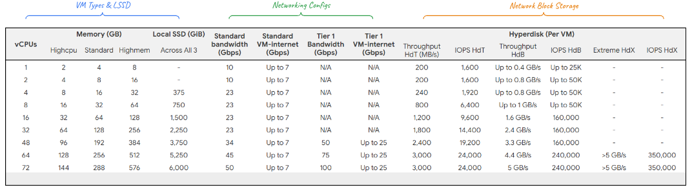

ARM-Based Virtual Machines on AWS, Google Cloud, and Azure

**ARM architecture** has gained significant traction in recent years due to its energy efficiency and performance benefits for many workloads. All major cloud providers \- AWS, Google Cloud, and Azure \- now offer ARM-based virtual machines (VMs) to cater to the growing demand.

### **Key Features and Benefits of ARM-Based VMs**

* **Energy Efficiency:** ARM processors are generally more energy-efficient than traditional x86 processors, leading to lower operating costs.  
* **Performance Optimization:** ARM-based VMs can be optimized for specific workloads, such as web servers, databases, and machine learning, offering competitive performance.  
* **Cost-Effectiveness:** In some cases, ARM-based VMs can provide a more cost-effective solution compared to x86-based VMs, especially for workloads that benefit from energy efficiency.

### **Comparison of ARM-Based VMs on Different Cloud Providers**

Older AWS Graviton, Google Cloud Tau and Azure Ampere are the precusors.

| Feature | AWS Graviton 4 | Google Cloud Axion | Azure Cobalt |
| :---- | :---- | :---- | :---- |
| **Processor Architecture** | ARM Neoverse v2 | ARM Neoverse v2 | ARM Neoverse v2 |
| **Availability** | Generally available | Generally available | Generally available |
| **Supported Operating Systems** | Linux, Windows | Linux, Windows | Linux, Windows |
| **Key Use Cases** | Web servers, databases, machine learning | Web servers, databases, machine learning | Web servers, databases, machine learning |

**Note:** Specific pricing and performance characteristics may vary depending on the exact VM instance type and region.

### Axion
Axion is Google's custom ARM-based processor with:

* Upto 50% better performance and
* Upto 60% better energy efficiency

compared to its x86 counterparts.

### **Choosing the Right ARM-Based VM**

When selecting an ARM-based VM, consider the following factors:

* **Workload Requirements:** Assess the specific needs of your workload, such as CPU-intensive, memory-intensive, or I/O-bound tasks.  
* **Operating System Compatibility:** Ensure that your desired operating system is supported on the chosen ARM-based VM.  
* **Pricing and Performance:** Compare pricing and performance metrics across different cloud providers to find the best fit for your budget and requirements.  
* **Support and Tools:** Evaluate the availability of support resources, tools, and documentation for ARM-based VMs on each cloud platform.

[ARM Workloads on GKE(YouTube)](https://www.youtube.com/watch?v=LZoy6jpzfqA)
[Preparing ARM Workloads for deployment on GKE](https://cloud.google.com/kubernetes-engine/docs/how-to/prepare-arm-workloads-for-deployment)
[How to run anything on Google Axion Processors](https://www.youtube.com/watch?v=Ty9KiDF1pWg)
[Google Axion Processors / x86 vs. ARM Processors](https://www.youtube.com/watch?v=0aDJ6GqsJqc)

