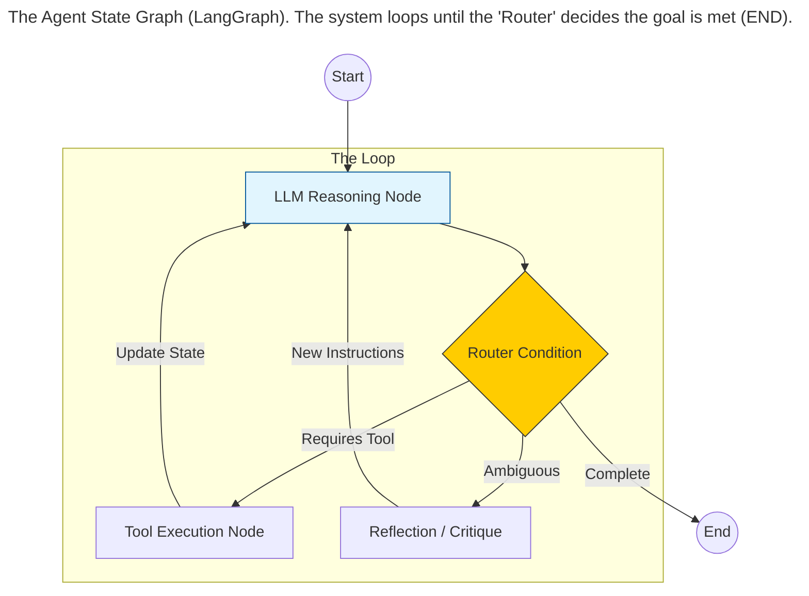
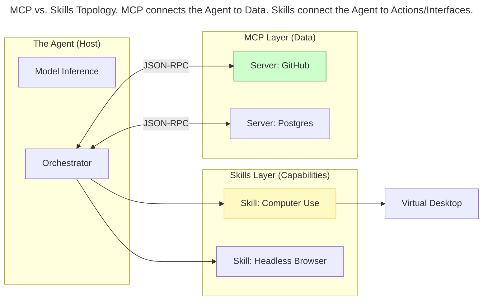
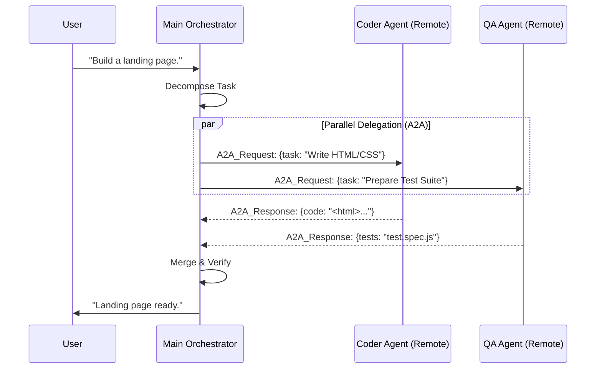
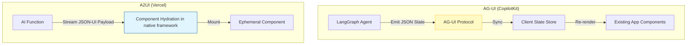

> This article is part of my web book series. All of the chapters can be found [here](https://iamulya.one/tags/generative-ai-handbook//). For any issues around this book or if you'd like the pdf/epub version, contact me on [LinkedIn](https://www.linkedin.com/in/amulya-bhatia-01627a42/)
{: .prompt-info }

The era of the "Chatbot"—a simple text-in, text-out interface—has largely ended for professional tooling. We have moved toward **Agentic Interfaces** and **Generative UI (also called Agentic UI)**.

Users no longer want to just talk to an LLM; they want the LLM to show them information, do work, and negotiate outcomes with other software. This requires a fundamental shift in architecture: from stateless request/response loops to stateful graph orchestrators (Agents), networked via A2A (Agent-to-Agent) protocols, and rendering dynamic interfaces via AG-UI.
This chapter covers the "AI Operating System" stack: **LangGraph** for logic, **MCP/Skills** for data, **A2A** for collaboration, and frameworks like **CopilotKit** for the **generative frontend** experience.

## The Agentic OS: Graphs over Chains

In 2023, frameworks like LangChain popularized the "Chain" (Directed Acyclic Graph). This was brittle. If step 3 failed, the chain crashed.
The alternative to that is the **State Graph** used by LangGraph.

An Agent is treated as a **Finite State Machine (FSM)**. It possesses:

1.  **State Schema:** A typed object (e.g., Pydantic or TypeScript interface) holding the conversation history, current plan, and tool outputs.
2.  **Nodes:** Functions that modify the state.
3.  **Edges:** Control flow logic (conditional jumps).

### Cyclic Graph Architecture

Unlike a chain, a graph can loop. The "Reasoner" node can decide to call a tool, transition to the "Executor" node, receive an error, and transition *back* to the "Reasoner" node to try a different strategy.




> ## Persistence & Time Travel
> Modern frameworks implement **Checkpointers**.
> Every time the state changes (at every node), the snapshot is saved to a database (Postgres/Redis).
> This enables **Time Travel**: If an agent goes down a rabbit hole, a human user can "rewind" the state to 5 steps ago, modify a variable, and fork the execution path.
> {: .prompt-info }

## Connectivity: MCP and Skills

For an agent to be useful, it needs access to the world (Files, Databases, APIs). Historically, this required writing custom "Tool Definitions" for every single API.

### The Model Context Protocol (MCP)

In late 2024, Anthropic introduced the **Model Context Protocol (MCP)**, which has now become the "USB-C of AI". MCP creates a standard client-host-server architecture:

*   **MCP Host:** The AI Application (e.g., Claude Desktop, Cursor, Custom Agent).
*   **MCP Server:** A lightweight process that exposes "Resources" (Data), "Prompts" (Templates), and "Tools" (Functions).
*   **Protocol:** JSON-RPC over Stdio or SSE (Server-Sent Events).

Instead of hardcoding a GitHub integration, your Agent simply connects to a local `github-mcp-server`. The LLM automatically discovers the available tools (`read_file`, `create_issue`) via the protocol capability handshake.

### Anthropic Skills: Beyond Simple Tools

While MCP defines *how* to connect to data, **Anthropic Skills** define *how* to behave. Skills are packaged folders containing instructions, scripts, and resources that teach Claude how to perform a specific task or workflow, such as creating a formatted PowerPoint deck or following brand guidelines.

The most prominent example is **Computer Use**. Instead of calling a JSON API (`get_weather`), the model uses a "Virtual Desktop Skill" to look at a screenshot, calculate coordinates, and emit cursor events (`mouse_move`, `left_click`, `type`).

*   **Tools (MCP):** Atomic functions (`read_file`, `sql_query`). Best for structured data.
*   **Skills:** Agentic behaviors (`computer_use`, `bash_executor`). Best for open-ended workflows.




## A2A (Agent-to-Agent) Protocol
Single agents are insufficient, these days we have Multi-Agent Systems (MAS). A2A is the protocol that allows independent agents to discover, negotiate, and delegate tasks to one another without human intervention.

* **Discovery**: Agent A queries an "Agent Registry" (DNS for Agents) to find a "Travel Agent."
* **Handshake**: Agent A sends a task manifest (schema: TripPlan).
* **Delegation**: Agent B accepts the task, performs work, and returns the result to Agent A.




> ## A2A vs. Multi-Agent Frameworks
> Frameworks like AutoGen or CrewAI run agents in a single process.
> A2A refers to distributed agents. Your "Personal Shopper Agent" (running on your phone) talking to Amazon's "Sales Agent" (running in AWS) is an A2A interaction. This requires strict authentication and economic layers (token payments) often handled by the protocol.
> {: .prompt-info }

## Generative UI (Agentic UI)

Text is a low-bandwidth interface. If a user asks, "Visualize the sales data," a paragraph of numbers is a failure. The user wants a dashboard.

**Generative UI** is the paradigm where the LLM drives the **State of the Interface**, not just the text stream.

### Framework: CopilotKit & Co-Agents

**CopilotKit** is the leading framework for syncing Agent State (Backend) with UI State (Frontend). It introduces the **Co-Agent** pattern.

In standard RAG, the frontend sends a query and waits for text.
In CopilotKit, the Frontend (React) and the Backend (for e.g. LangGraph Agent) share a **Synchronized State Store**.

1.  **Lockstep:** When the Agent thinks "I need to filter the table," it updates `state.filter`.
2.  **Reaction:** The Frontend subscribes to `state.filter` and re-renders the table instantly.
3.  **Human-in-the-Loop:** If the user manually changes the filter in the UI, the Agent's state is updated, changing its subsequent reasoning.

### Protocol: AG-UI (Agent-User Interaction Protocol)

**AG-UI** is the specific JSON protocol used by frameworks like CopilotKit to manage the frontend-backend contract. It is not about generating raw code (which is risky); it is about **Generative Component Orchestration**.

The Agent does not hallucinate HTML/Javascript code. It emits **AG-UI Actions** that map to the application's *existing* Component Registry.

*   **Intent:** "Show a confirmation modal."
*   **AG-UI Payload:**

    ```json
    {
      "component": "Modal",
      "props": {
        "title": "Delete Database?",
        "variant": "danger",
        "actions": ["confirm", "cancel"]
      }
    }
    ```

*   **Render:** The frontend maps `"Modal"` to the actual React component and mounts it into the chat stream or the main application view.

### Alternative: A2UI (AI to UI) / Vercel AI SDK

While AG-UI focuses on **state synchronization**, **A2UI** (often associated with Vercel's `streamUI`) focuses on **Server-Side Component Streaming**.

It is a significant step toward making AI agents first-class UI citizens, as it enables extreme flexibility since it allows the agent to event invent new layouts. 
A2UI defines a **standard JSON structure for UI**, which is exchanged as a sequence of messages between an agent (backend) and a client (frontend). Rather than sending executable code, an agent sends declarative descriptions of a UI – essentially a blueprint of **UI components and their data**. These components cover typical UI needs and are organized by category:

* **Layout**: e.g. `Row`, `Column`, `List` – containers for arranging other components in horizontal/vertical lists or collections.

* **Display**: e.g. `Text`, `Image`, `Icon`, `Video`, `Divider` – static content elements for showing information.

* **Interactive Inputs**: e.g. `Button`, `TextField` (text input), `CheckBox`, `DateTimeInput` (date/time picker), `Slider` – elements that collect user input or trigger actions.

The client application, which implements an A2UI renderer, interprets these messages and renders actual UI widgets using its native framework (Web Frameworks like React, Flutter, iOS, etc.). **This separation means the agent provides the intent and structure of the interface, while the client retains control over rendering, styling, and security**.




## The "Artifact" Pattern

Chat interfaces are ephemeral. The **Artifact** pattern introduces a **Dual-Pane Architecture**.

*   **Left Pane:** Conversation (Ephemeral).
*   **Right Pane:** The Artifact (Persistent Work Product).

When the Agent generates a significant object (a Report, a Code Snippet, a Diagram), it is routed to the Artifact pane.
Using **AG-UI**, the Agent can perform **Mutations** on this artifact.

*   *User:* "Change the chart to a bar graph."
*   *Agent:* Emits AG-UI update: `{ target: "chart_1", action: "update_prop", key: "type", value: "bar" }`.
*   *UI:* Hot-swaps the chart type without regenerating the entire document.

## Summary

The "AI Operating System" is currently a stack of protocols:

1.  **Backend:** We move from Chains to **Cyclic State Graphs** (LangGraph) backed by standard interfaces (**MCP**, **Skills** and **A2A**).
2.  **Frontend:** We move from Text Streams to **Component Streams**, utilizing **CopilotKit/AG-UI** for state sync and **A2UI** for component mapping.
3.  **UX:** We move from Chat to **Artifacts**, treating AI outputs as persistent, editable objects.
