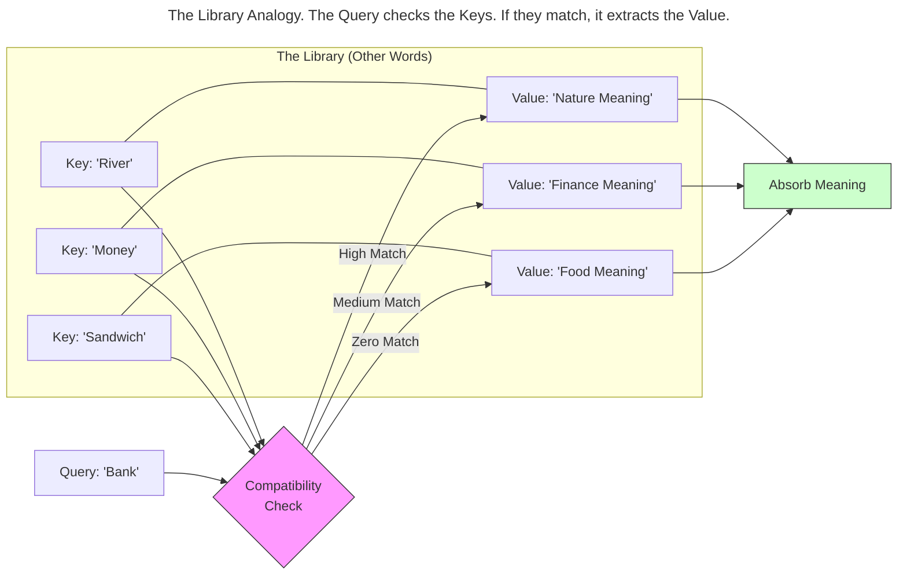
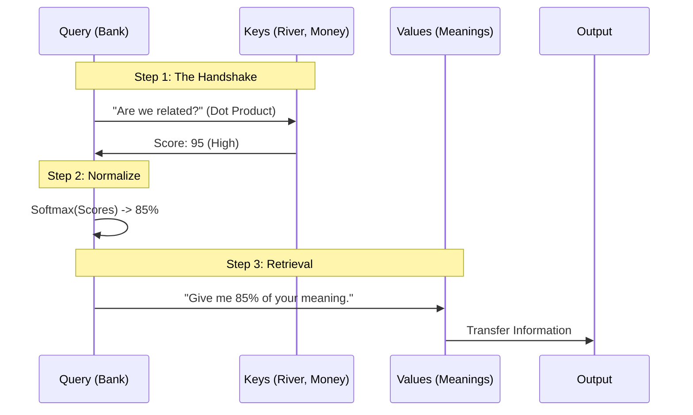
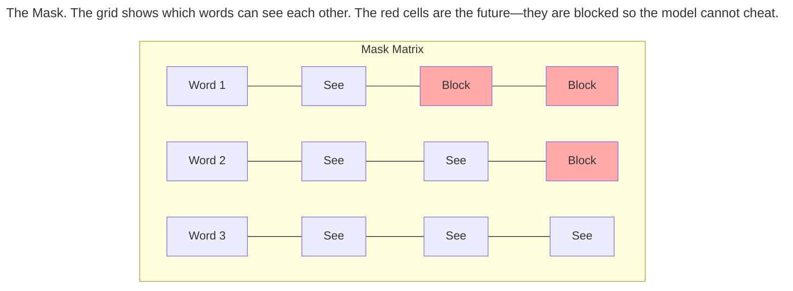

> This article is part of my web book series. All of the chapters can be found [here](https://iamulya.one/tags/generative-ai-handbook//). For any issues around this book or if you'd like the pdf/epub version, contact me on [LinkedIn](https://www.linkedin.com/in/amulya-bhatia-01627a42/)
{: .prompt-info }

In 2017, a team at Google Brain released a paper with a cocky title: *"Attention Is All You Need."*

It was a rejection of everything we just learned in Chapter 1. The authors argued that Recurrent Neural Networks (RNNs)—the standard for years—were doing it wrong.

RNNs read text like a human reads a book: word by word, left to right.
The **Transformer** (the architecture proposed in the paper) reads text like a human looking at a painting: it sees the entire image at once.

This chapter explains the mechanism that makes this possible: **Self-Attention**.

## The Cocktail Party Effect

Imagine you are at a loud party. You are trying to listen to your friend, but the room is filled with noise. 

**Transformer Approach**: You stand in the center of the room. You hear everyone simultaneously. However, your brain subconsciously **tunes out** the background noise and **tunes in** (attends) only to the voice of your friend.

This is **Self-Attention**. It allows a word at the beginning of a sentence to "look at" and "listen to" a word at the end of the sentence, instantly, without having to trudge through all the words in between.

## The Mechanics: Query, Key, and Value

To make this work mathematically, the Transformer breaks every word into three distinct roles. This is often the most confusing part for beginners, so let's use a **Library Analogy**.

Imagine a library database.

1.  **Query (Q) Vector :** This is what you are *looking for*. (e.g., "I need a book on 'Physics'").
2.  **Key (K) Vector :** This is the label on the book's spine. (e.g., "Physics", "Cooking", "Fiction").
3.  **Value (V) Vector :** This is the *content* inside the book.

In the Transformer, **every token creates a Query, a Key, and a Value for itself** for each attention head (We'll see in the next chapter that there are multiple attention heads).

*   **The Query:** "I am the word 'Bank'. I am looking for context to help me define myself."
*   **The Key:** "I am the word 'River'. If you are looking for nature words, I'm your guy."
*   **The Value:** "Here is the meaning of 'River'."

The model compares the **Query** of the current word against the **Key** of every other word.

## The Compatibility Score (Dot Product)

How does the model know if "Bank" and "River" are compatible? It uses a mathematical operation called the **Dot Product**.

Think of the Dot Product as a **Handshake**.

*   If two vectors point in the same direction, they have a firm handshake (High Score).
*   If they point in different directions, they miss each other (Low Score).

The model calculates this handshake for every possible pair of words.

*   *Bank* vs *River*: High Score (95).
*   *Bank* vs *Money*: Medium Score (50).
*   *Bank* vs *Sandwich*: Low Score (0).

### Softmax: The Percentage Converter
The raw scores (95, 50, 0) are messy. Some might be negative, some might be huge. We need to turn them into percentages that add up to 100%.

We pass the scores through a function called **Softmax**.

*   Raw: `[95, 50, 0]`
*   Softmax: `[0.85, 0.14, 0.01]`

This tells the word "Bank": *"Pay 85% of your attention to 'River', 14% to 'Money', and ignore 'Sandwich'."*

## The Output: The Contextual Smoothie

So, what is the result of all this math?

Before Attention, the word "Bank" was just a generic vector that could mean "financial institution" or "river side."
After Attention, the model creates a **Weighted Sum**. It takes the vector for "Bank" and mixes in 85% of the essence of "River."

The result is a new vector that is still "Bank," but now it is **flavored** by its context. It is now a "River-Bank."

> ## Why this changed the world
> In an RNN, if "River" was 50 words away from "Bank", the flavor would have washed away by the time the model got there. In Attention, the distance doesn't matter. The "flavor" is teleported instantly.
> {: .prompt-info }

## Masked Attention: The "No Spoilers" Rule

There is one catch.

When we train a model like GPT (Generative Pre-trained Transformer), we want it to predict the next word.

*   Input: "The quick brown"
*   Target: "fox"

If we let the model use standard Attention, it can "see" the whole sentence at once. It would see the word "fox" sitting right there in the training data and cheat. It wouldn't learn anything; it would just copy the answer.

To fix this, we use a **Mask**.

Think of this like a piece of cardboard covering the right side of the page. The model is allowed to use Attention to look at *past* words, but it is strictly forbidden from attending to *future* words.

Mathematically, we set the Attention Score for all future words to **Negative Infinity**. When we run Softmax on negative infinity, the result is **Zero**.

## Summary

*   **RNNs** struggle because they read sequentially.
*   **Transformers** read everything at once using **Self-Attention**.
*   **Queries, Keys, and Values** act like a library retrieval system to find relevant context.
*   **Softmax** determines how much focus to put on each word to extract the meaning.
*   **Masking** ensures the model doesn't cheat by reading the end of the book before it writes the beginning.

Now that we have a mechanism to understand context, we need to stack these layers on top of each other to build a deep "brain." That structure is the **Transformer Block**.
