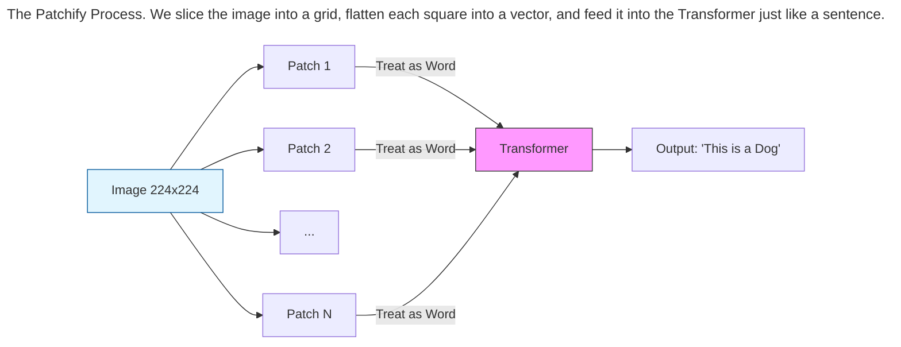
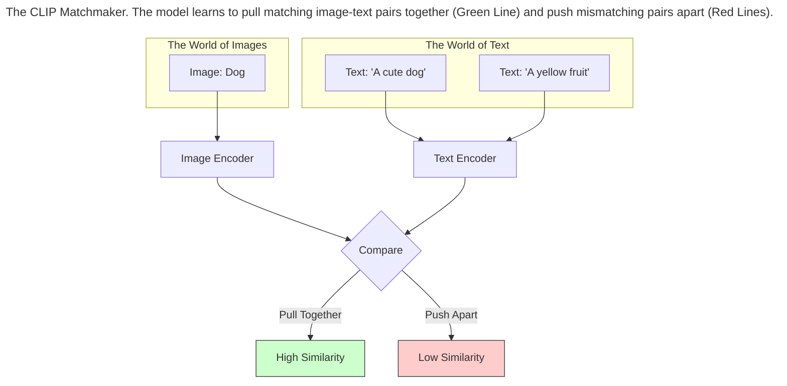
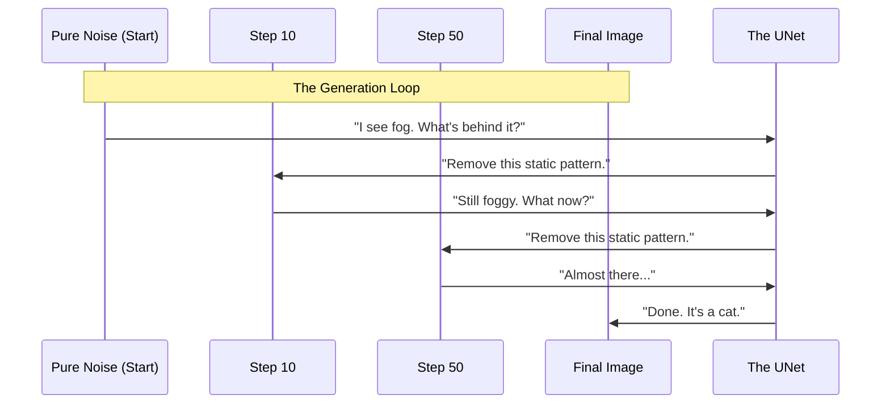
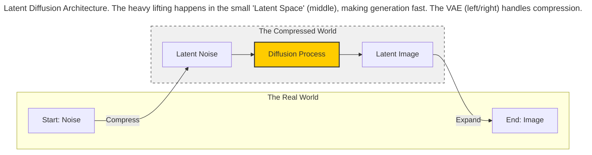

The Transformer revolution began with text, but it didn't stay there.

It turns out that the architecture we built in Chapters 3 and 4 is not a "Language Model"; it is a **Pattern Processing Machine**. It doesn't care if the input is a word, a pixel, a sound wave, or a strand of DNA. As long as you can chop the data into a sequence of pieces, the Transformer can learn to predict what comes next.

This chapter explores how we teach AI to "see" (Vision Transformers) and how we teach it to "hallucinate" visual reality (Diffusion Models).

## Vision Transformers (ViT): How AI Sees

For years, Computer Vision was dominated by **CNNs (Convolutional Neural Networks)**. These networks were built with a strong assumption: "Pixels that are next to each other are related."

In 2020, researchers asked a radical question: *"What if we treat an image like a sentence?"*

*   A sentence is a sequence of words.
*   An image is a sequence of... patches?

They took an image, chopped it into a grid of small squares (e.g., $16 	imes 16$ pixels), and fed these squares into a standard Transformer as if they were words.

*   **Patch 1 (Top-Left):** "The sky is blue."
*   **Patch 2 (Middle):** "There is a dog ear."
*   **Patch 3 (Bottom-Right):** "There is green grass."

Surprising everyone, this worked better than CNNs. The **Vision Transformer (ViT)** learned to "attend" to relationships between distant parts of the image (e.g., a dog's head in the top-left and its tail in the bottom-right) instantly, without needing complex layers to connect them.

## CLIP: The Rosetta Stone

Just because we have a model that understands text (GPT) and a model that understands images (ViT) doesn't mean they can talk to each other. We need a translator.

OpenAI solved this with **CLIP (Contrastive Language-Image Pre-training)**.

Imagine a game where you show the AI a photo of a dog and a list of 10 captions.

1.  "A photo of a banana."
2.  "A photo of a car."
3.  "A photo of a cute dog."

CLIP consists of two encoders (one for text, one for images). It is trained to pull the vector for the *dog image* and the vector for the *dog caption* closer together, while pushing away the vectors for "banana" and "car."

Over millions of examples, CLIP learns a **Shared Vector Space**.
In this space, the mathematical vector for "Spotted Dog" is located right next to the visual vector of a Dalmatian.

## Diffusion: Creating Images from Fog

While CLIP *understands* images, it cannot *draw* them. To generate images, one can use **Diffusion Models** (like Stable Diffusion or Midjourney).

The intuition comes from physics: it's easy to destroy a structure, but hard to rebuild it.

*   **Forward Process (Destruction):** Take a photo of a cat. Slowly add static noise to it until it is unrecognizable gray fuzz.
*   **Reverse Process (Creation):** Train a neural network to look at that fuzz and guess: *"What noise do I need to remove to reveal the image underneath?"*

Generating an image is simply starting with pure random noise (TV static) and asking the model to "remove the noise" step-by-step, guided by a text prompt, until a clear image emerges. Inside the Diffusion loop, we need a neural network to predict the noise. Historically, this role was played by a **UNet** — an architecture that preserves spatial dimensions—though modern models (like Sora) are replacing the UNet with Transformers.

## Latent Diffusion: The Efficiency Hack

Generating a high-resolution image ($1024 	imes 1024$ pixels) is computationally expensive. That's over a million pixels to predict at every single step.

To make this run on consumer laptops, researchers invented **Latent Diffusion**.

Instead of diffusing the actual pixels, they use a compressor (called Variational Autoencoder a **VAE**) to shrink the image into a tiny, compressed representation called the **Latent Space** (e.g., $64 	imes 64$).

The diffusion model does all its work in this tiny space (which is fast). Once it's finished generating the "Latent Image," the VAE expands it back up to full resolution.

*   **Analogy:** Instead of writing a 1,000-page novel by hand (Pixel Space), you write a 1-page detailed outline (Latent Space) and then hire a ghostwriter (The Decoder) to flesh it out into full prose.

## Controlling the Hallucination (Cross-Attention)

How do you tell the model *what* to draw?
We use **Cross-Attention**.

Inside the diffusion model, there is a mechanism that allows the visual generation process to "attend" to the text prompt.

*   The model asks: "I am denoising the top-left corner. What should go here?"
*   The text prompt answers: "Blue sky."
*   The model asks: "I am denoising the center. What should go here?"
*   The text prompt answers: "A red car."

This constant dialogue between the visual noise and the text embeddings (via CLIP) guides the chaotic static into a coherent image that matches your description.

## Summary

*   **ViT:** Proved that Transformers can see images by chopping them into patches.
*   **CLIP:** Connected text and images in a shared mathematical space.
*   **Diffusion:** Learned to generate images by reversing the process of adding noise.
*   **Latent Diffusion:** Made generation fast by working in a compressed space.

This combination of technologies allows us to type "A cyberpunk city in the rain" and watch it materialize from the fog. In the next chapter, we will look at some specific LLM architectures available today and how they differ.
