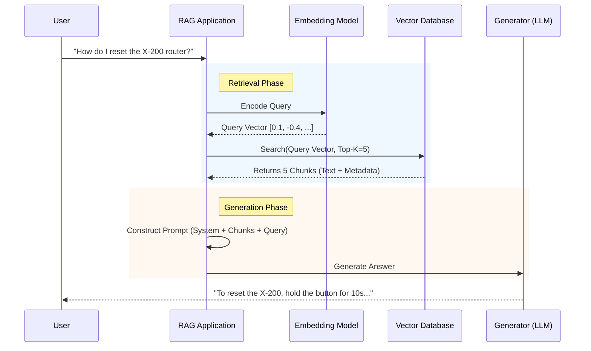
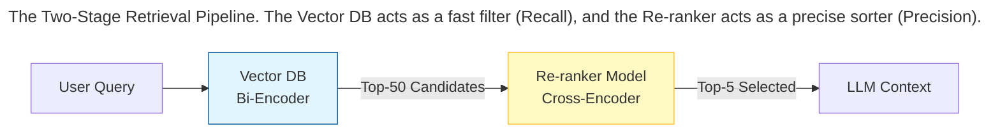
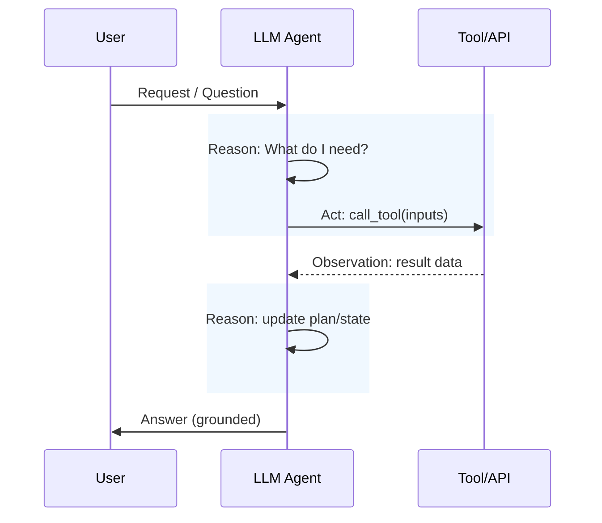

A modern LLM doesn’t run on “the prompt.” It runs on a **context stack**—a structured bundle of inputs that may include:

- **System instructions** (identity, rules, safety constraints)
- **Developer instructions** (how to behave for this app)
- **User request** (the current task)
- **Conversation history** (short-term memory)
- **Retrieved knowledge** (RAG results, docs, tickets, notes)
- **Tool outputs** (search results, database rows, calculator answers)
- **State** (the agent’s plan, checklist, intermediate artifacts)
- **Output contract** (schema, format, tone, citations requirement)

## The Physics of Reasoning (Chain of Thought)

LLMs often fail on multi-step problems for one simple reason: **the model generates the next token based on the current context**. If the context doesn’t contain intermediate structure, it may “jump” to a plausible-looking answer.

### The scratchpad effect

Chain of Thought (CoT) works by forcing a model to **externalize intermediate steps**, making each step part of the context it conditions on next.

- **User:** “What is 23 * 4 + 9?”
- **Model (Standard):** “100.” (Plausible guess, but wrong.)

With CoT:

- **User:** “What is 23 * 4 + 9? Think step by step.”
- **Model (CoT):**
  1. First, 23 * 4 is 92.  
  2. Next, 92 + 9 is 101.  
  3. The answer is 101.

CoT isn’t magic. It’s **context shaping**: by generating “92,” the model changes its own context so that “101” becomes more likely.

## Retrieval Is the New Prompt 

Most “hallucinations” aren’t the model being malicious—they’re the system asking it to answer without the necessary facts in context.

Large Language Models (LLMs) have a fundamental limitation: their knowledge is frozen in time. A model trained in 2024 knows nothing of the events of 2025. Furthermore, LLMs are prone to **hallucination**—confidently stating falsehoods when they lack specific data.

**Retrieval Augmented Generation (RAG)** bridges the gap between the model's frozen weights and dynamic, private data by injecting external knowledge into the context at run time. Instead of relying on the model's internal memory (parametric knowledge), we provide it with an external library (non-parametric knowledge) that it can look up in real-time.

### The Architecture of RAG

Fundamentally, RAG architecture consists of two distinct pipelines: **Ingestion** (Preparation) and **Retrieval** (Inference).

#### The Ingestion Pipeline
Before we can search data, we must structure it.

1.  **Load:** Extract text from PDFs, SQL databases, or APIs.
2.  **Chunk:** Split the text into smaller, manageable pieces.
3.  **Embed:** Convert text chunks into vectors using an Embedding Model.
4.  **Store:** Save vectors and metadata in a Vector Database.

#### The Retrieval Pipeline
1.  **Query:** User asks a question.
2.  **Embed:** Convert the question into a vector.
3.  **Search:** Find the top-K most similar chunks in the Vector DB.
4.  **Generation:** Stuff the chunks into the LLM's context window and ask it to synthesize an answer.

### Chunking Strategies

The most critical hyperparameter in RAG is **Chunk Size**.

*   **Too Small (e.g., 128 tokens):** The model gets fragmented sentences. It lacks the context to understand *who* "he" refers to in a sentence like "He pressed the button."
*   **Too Large (e.g., 2048 tokens):** You retrieve too much irrelevant noise. If the answer is one sentence hidden in a 3-page chunk, the embedding might be diluted, and the retrieval accuracy drops.

#### Semantic Chunking
Instead of arbitrarily splitting by character count (e.g., every 500 chars), **Semantic Chunking** uses a sliding window to measure similarity between sentences. If the topic shifts (similarity drops), a cut is made. This ensures that each chunk represents a distinct, self-contained idea.

> ## The Overlap Rule
> Always include **Overlap** (e.g., 10-20%) between chunks.
> If you split strictly at token 500, you might cut a sentence in half. Overlap ensures that the semantic meaning at the boundaries is preserved in at least one of the chunks.
> {: .prompt-tip }

There are many other strategies for chunking as well, for e.g. 

* **Recursive Chunking:** Chunk whole paragraphs. If it gets too big, chunk sentences.
* **Document-based Chunking:** Chunk based on the intrinsic structure of the document, and not some generic separaters, for e.g. "# or ##" for markdown.
* **LLM-based Chunking:** Ask LLM to do it. It can be costly to do this, but can deliver really high-quality retrieval output.

### Advanced Retrieval: Beyond Cosine Similarity

Naive RAG (Vector Search only) often fails in production.

*   **The Problem:** Vector search is great for *concepts* ("dog" matches "canine") but terrible for *exact matches* ("Model X-200" might match "Model X-300" because they are numerically close).

#### Hybrid Search (Sparse + Dense)
We combine two search algorithms:

1.  **Dense Retrieval (Vector):** Captures semantic meaning (Cosine Similarity).
2.  **Sparse Retrieval (BM25 / Splade):** Captures keyword frequency. Matches exact part numbers, names, or acronyms.

The results are merged using **Reciprocal Rank Fusion (RRF)** to get the best of both worlds.

#### Re-ranking (The Cross-Encoder)
Retrieval is fast but imprecise. It compresses a document into a single vector.
To fix this, we retrieve a large number of candidates (e.g., Top-50) and then pass them through a **Re-ranker Model**.

A Re-ranker is a **Cross-Encoder**. It takes the pair `(Query, Document)` and outputs a relevance score (0 to 1). It is computationally expensive but highly accurate because it attends to the interaction between every query token and every document token.

## Context Budgeting: Long Context Is Powerful, Not Free

Large context windows are useful, but you pay in:

- **Latency** (especially prefill time)
- **Cost**
- **Reliability** (attention isn’t uniform)
- **Serving constraints** (e.g., KV cache growth during generation)

### The “Lost in the Middle” problem (still real)

Models tend to follow a position bias:

- Strong recall of the **beginning** (system/dev instructions)
- Strong recall of the **end** (the user’s latest question)
- Weaker recall of the **middle**

**Engineering fixes that work:**

- Put critical instructions at the **top**
- Provide a short **Key Facts / Evidence Pack**
- Use clear headings and delimiters
- Summarize and compress aggressively

> ## Token Budgeting
> Context is a scarce resource. Use structure, distillation, and retrieval to keep it high-signal.
> {: .prompt-danger }

## Connecting to Reality (ReAct)

LLMs don’t know current facts, can’t see your database, and shouldn’t guess. **ReAct (Reason + Act)** turns the model into an agent by giving it tools and a loop:

1. **Reason:** Decide what’s missing
2. **Act:** Call a tool
3. **Observe:** Read the result
4. **Reason:** Update plan/state
5. **Answer:** Produce a grounded output

## Security + Evals

Hand-tuning prompts doesn’t scale. Context engineering must be **measured**. Modern teams treat context pipelines like code:

- Create **eval sets** (real queries + adversarial edge cases)
- Capture **agent traces** (tool calls, retries, failures, latency)
- Run **regression tests** when changing models or prompts
- Track retrieval metrics (precision/recall), citation accuracy, and correctness

Furthermore, The more external text you feed a model (web pages, PDFs, emails), the more you risk **prompt injection**.

**Core rule:** Only system/developer messages are instructions. Everything else is data.

## Summary

Context Engineering is all about **architecting the model’s working environment**.

1. **Chain of Thought:** Use a scratchpad to turn hard jumps into easy steps; show reasoning at the right fidelity. 
2. **RAG:** Retrieve evidence, then compress it into high-signal facts with provenance.  
3. **Budgeting:** Long context increases cost/latency and failure modes; structure and compress aggressively.  
4. **ReAct:** Tools turn models into grounded agents—Reason → Act → Observe → Repeat.  
5. **Security + Evals:** Context is an attack surface; measure everything and defend boundaries.
 
