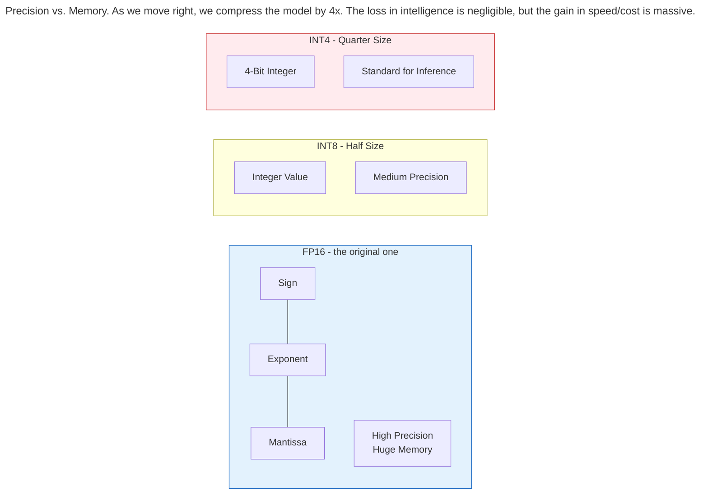
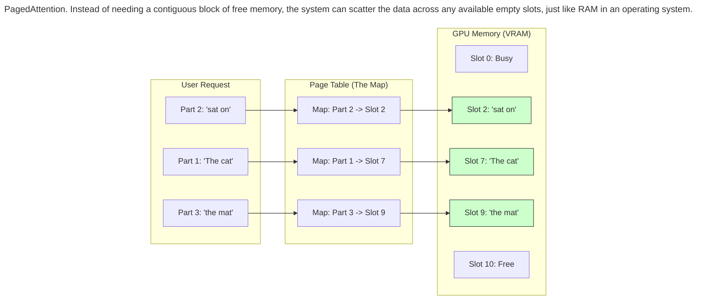
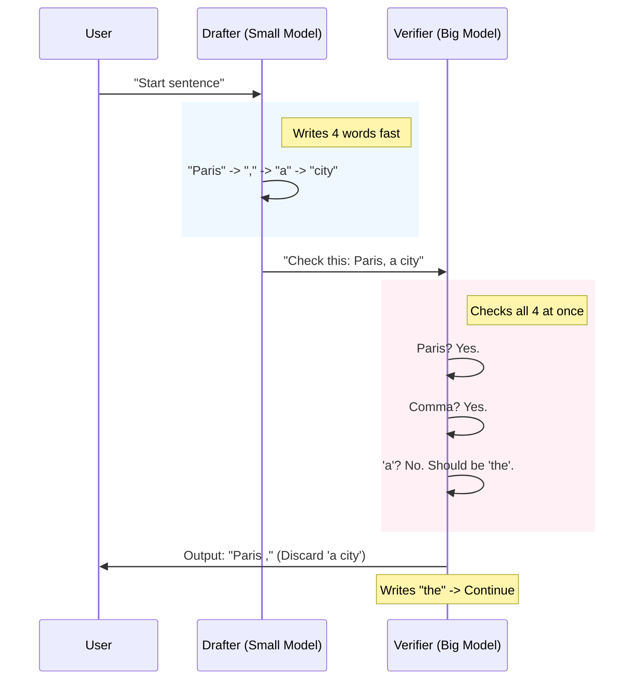

> This article is part of my book [Generative AI Handbook](https://iamulya.one/tags/generative-ai-handbook). For any issues around this book or if you'd like the pdf/epub version, contact me on [LinkedIn](https://www.linkedin.com/in/amulya-bhatia-01627a42/)
{: .prompt-info }

In the world of  training a model is like building a skyscraper: it’s a massive, one-time expense (CapEx).
But **Inference** (actually using the model) is like paying the electricity bill for that skyscraper: it’s a perpetual, daily cost (OpEx).

As models grow into the trillions of parameters, the challenge shifts from *"How do I build this?"* to *"How do I run this without going bankrupt?"*

This chapter explores the physics of inference. We will dissect why generating text is fundamentally different from processing images, why memory speed matters more than compute speed, and how we compress giant brains into 4-bit integers to fit them onto your laptop.

## The Physics of Inference: Bandwidth is King

To understand why AI is slow, you have to understand the hardware bottleneck.

Deep Learning workloads fall into two categories:

1.  **Compute Bound:** The chip is busy doing math (multiplying matrices).
2.  **Memory Bound:** The chip is busy *waiting* for data to arrive.

**Text Generation is Memory Bound.**
Imagine a factory worker (the GPU Core) who can assemble a car in 1 second. However, the parts for the car are stored in a warehouse 10 miles away (the VRAM). The truck driver (Memory Bandwidth) takes 1 hour to bring the parts.
It doesn't matter if the worker gets 10x faster. The factory is limited by the speed of the truck.

> **The Arithmetic Intensity Gap**
> {:.title}
> To generate **one single word** from a 70B parameter model, the GPU must load all 140GB (FP16: Uses 2 bytes per parameter, hence 70 x 2 = 140 GB) of the model's weights from memory into the chip, do the math, and output... one word.
> Then, for the next word, it has to load all 140GB *again*.
> This is why **Memory Bandwidth** (measured in TB/s), not TFLOPS (Math Speed), is the most critical metric for running LLMs.
{: .prompt-danger }

## Quantization: The MP3 of AI

Standard AI models are trained using 16-bit floating-point numbers. This means every single weight takes up 16 bits of memory.

However, neural networks are surprisingly resilient. You can degrade the precision of these numbers significantly without making the model stupid. This process is called **Quantization**.

Think of it like audio files.

*   **WAV (CD Quality):** Perfect sound, huge file size. (This is FP16).
*   **MP3 (Compressed):** Good enough sound, tiny file size. (This is INT4).

### The 2026 Precision Standard
By 2026, the industry standardized on **4-bit Quantization (INT4 / FP4)**.

*   **FP16:** 70B Model = 140GB VRAM (Requires 2x A100 GPUs - $30,000).
*   **INT4:** 70B Model = 35GB VRAM (Fits on 1x Consumer GPU/MacBook - $2,000).

## The Memory Monster: KV-Cache

In a Transformer, generating the 1000th word requires looking back at the previous 999 words. We *could* recalculate everything from scratch every time, but that would be horribly slow.

Instead, we save the math results for the previous words in a cache. This is called the **KV-Cache (Key-Value Cache)**.

The problem? This cache grows linearly.
For a massive model with a massive context window (e.g., summarizing a book), the KV-Cache can become bigger than the model itself. The KV cache is what makes long context expensive — not the parameters!

> **KV size**
> {:.title}
> Lets go through an example. Following is a simplified formula for calculating KV size:
> 
> KV size ≈ `Layers × Tokens (Input prompt AND output tokens) × d_model (Model Dimensions = Token Embedding Size) × 2(K and V)`
> 
> Let’s assume:
> 
> * Context = 1,000,000 tokens (Max)
> * d_model = 4096
> * Layers = 32
> * Data type = FP16 (2 bytes per number)
> 
> This will result in ≈ 524 GB of KV size (Max) **for each user request**! Imagine how much memory would be need for serving millions of user requests per second. This is a problem rife for optimization.
> There are many solutions that are used to combat these including, **Grouped-query attention, Sliding window attention, Chunked attention** etc. but we will look at some of the other approaches.
{: .prompt-tip }

### Multi-Query Attention

Instead of each Attention head having separate K and V, you share K and V across heads.

Then memory becomes: `Layers × Tokens × d_head × 2`, instead of: `Layers × Tokens × d_model × 2`

That can reduce KV size by 8×–32×. 

### MLA: The Compression Trick
In 2025, DeepSeek introduced **MLA (Multi-Head Latent Attention)**.

Instead of storing huge matrices for every single attention head, MLA compresses them into a tiny "Latent Vector." It reduces the memory footprint by 90%, allowing massive context windows (128k+) on consumer hardware.

But there’s another problem: **Memory fragmentation**

In real serving systems:

* Different users have different sequence lengths
* Some finish early
* Some generate long outputs
* Memory gets fragmented

If you allocate one giant contiguous block per request:

* You waste memory
* You can’t efficiently reuse freed space
* GPU memory becomes unusable

This is exactly like heap fragmentation in operating systems.

### Solution: PagedAttention (vLLM)

**PagedAttention** solved the problem by treating memory like pages in a book.

1.  Break the cache into small blocks (e.g., 16 tokens).
2.  Store these blocks wherever there is free space in memory (non-contiguous).
3.  Keep a "Table of Contents" to track where the blocks are.

This eliminated waste (fragmentation) and allowed servers to handle 10x more users at once.

## Speculative Decoding: The Intern and The Editor

The bottleneck in LLMs is that they generate words one by one. But GPUs are massive parallel machines; generating one word leaves 99% of the chip idle.

**Speculative Decoding** puts those idle cores to work.
Imagine a senior editor (the big 70B model) and a fast intern (a small 8B model).

1.  **Draft:** The intern quickly scribbles 5 words. *"The quick brown fox jumps"*
2.  **Verify:** The editor looks at all 5 words *at the same time* (in parallel).
3.  **Approve/Reject:**
    *   If the editor agrees, we keep all 5 words. (5x Speedup!)
    *   If the editor disagrees at word 3, we keep 1 and 2, and discard the rest.

Since the big model can verify 5 words as fast as it can generate 1, this trick drastically speeds up inference without losing any quality.

## Summary

Inference optimization is about cheating physics.

1.  **Quantization (INT4):** Shrinks the model size by 4x so it fits in memory.
2.  **Multi-Query Attention:** Reduce the KV size.
2.  **PagedAttention:** Stops memory waste so we can handle more users.
3.  **MLA:** Compresses the conversational memory (KV-Cache) by 90%.
4.  **Speculative Decoding:** Uses a small model to draft and a big model to verify, doubling the speed.

By combining these four techniques, we turn a model that used to require a $30,000 server into something that runs on a high-end gaming PC.
