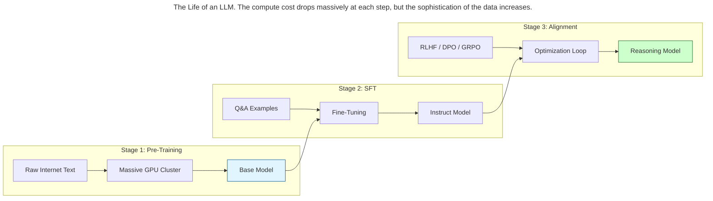
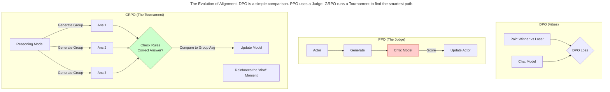

> This article is part of my book [Generative AI Handbook](https://iamulya.one/tags/generative-ai-handbook). For any issues around this book or if you'd like the pdf/epub version, contact me on [LinkedIn](https://www.linkedin.com/in/amulya-bhatia-01627a42/)
{: .prompt-info }

A raw "Base Model" (like Llama 4 Base) is like a brilliant but feral child.
It has read the entire internet. It knows quantum physics, Python code, and French poetry. But if you ask it a question, it might just stare at you, or continue your sentence instead of answering it.

To turn this raw intelligence into a useful assistant (like ChatGPT), we need to send it to school.
This chapter explains the three stages of an LLM's life: **Pre-Training** (Learning to speak), **Fine-Tuning** (Learning to follow instructions), and **Alignment** (Learning to be helpful).

## The Training Lifecycle

Creating an AI model happens in three distinct phases.

1.  **Pre-Training (University):** The model reads 15 trillion words of the internet. It learns grammar, facts, and reasoning.
    *   *Result:* A "Base Model." Smart, but unruly.
2.  **Supervised Fine-Tuning (Trade School):** We show the model millions of examples of `(Instruction, Response)`. It learns that when a human asks a question, it should provide an answer, not just predict the next word.
    *   *Result:* An "Instruct Model." Helpful, but maybe dangerous or rude.
3.  **Alignment (Etiquette & Logic Class):** We teach the model right from wrong using human preferences and math tests. "Don't help build bombs." "Think before you speak."
    *   *Result:* A "Chat/Reasoning Model." Safe and deeply intelligent.

## Parameter-Efficient Fine-Tuning (PEFT)

In the "old days" (2020), if you wanted to teach a model a new skill, you had to retrain all 175 billion parameters. This was impossibly expensive.

Today, we use **PEFT (Parameter-Efficient Fine-Tuning)**. The most popular method is **LoRA (Low-Rank Adaptation)**.

### The "Post-It Note" Analogy
Imagine a massive encyclopedia (The Base Model).

*   **Full Fine-Tuning:** You rewrite every single page of the encyclopedia. (Expensive, slow).
*   **LoRA:** You leave the book exactly as it is. You simply stick a few **Post-It Notes** on the relevant pages with new information.

When the model runs, it reads the original book *plus* your Post-It notes.

*   **Original Weights:** Frozen (0% updated).
*   **Adapter Weights (Post-Its):** Trainable (< 1% of total size).

## Alignment: Dog Training for AI

Once the model knows *how* to talk (SFT), we need to teach it *what* to say (Alignment).
Historically, there were two main goals:

1.  **Style:** "Be polite," "Don't be racist."
2.  **Truth:** "Don't hallucinate," "Solve the math problem correctly."

Different techniques are better for each goal.

### Technique A: DPO (Direct Preference Optimization)
*Best for: Chatbots, Creative Writing, Tone.*

In 2024, DPO became the standard for "Vibe Checking." We simply show the model two answers:

*   **Winner:** "Here is a Python script to sort a list."
*   **Loser:** "I can't do that, I'm just an AI."

We mathematically force the model to increase the probability of the Winner and decrease the Loser. It’s fast, stable, and great for teaching style.

### Technique B: PPO (Proximal Policy Optimization)
*Best for: Complex Tasks where "Right" is hard to define.*

This is the "Old School" Reinforcement Learning method used for GPT-4. It works like training a dog with a strict judge.

1.  **The Critic:** We train a separate AI (Reward Model) to act as a judge.
2.  **The Actor:** The main model tries to answer.
3.  **The Score:** The Critic gives it a score (Scalar Reward).
4.  **The Update:** The model adjusts its weights to get a higher score next time.

*Drawback:* It is computationally heavy because you have to run two massive models (The Actor and The Critic) at the same time.

### Technique C: GRPO (Group Relative Policy Optimization)
*Best for: Reasoning Models (DeepSeek-R1, OpenAI o3).*

In 2025, DeepSeek popularized **GRPO**. It solved the "Critic is too expensive" problem.
Instead of a separate Critic model, GRPO uses "The Tournament."

1.  **Group Generation:** For one question, the model generates a group of answers (e.g., 8 different solutions).
2.  **Rule-Based Check:** We check the answers against ground truth (e.g., "Did the code compile?" or "Is the final answer 42?").
3.  **Relative Scoring:** We compare the answers *against the group average*.
    *   If Answer A got it right in 5 steps, and the average was 10 steps, Answer A gets a huge bonus.
    *   If Answer B got it wrong, it gets a penalty.

**Why GRPO is revolutionary:** It allows the model to "Self-Discover" strategies. By rewarding correct answers, the model creates its own internal "Chain of Thought" (reasoning steps) to verify its work, without humans explicitly teaching it *how* to think.

> **The 'Aha!' Moment**
> {:.title}
> Why use GRPO over DPO?
> DPO prevents the model from exploring. You are telling it exactly what to say.
> GRPO allows **exploration**. The model might try a weird, long chain of thought. If that weird path leads to the correct answer more often, GRPO reinforces it. This is how models learn to "think" and self-correct, creating the "Aha!" moments seen in reasoning models.
{: .prompt-danger }

## Synthetic Data: The Smart Teacher

We have a problem: we are running out of human data. There are no more books or websites left to read.
So, how do we make models smarter? **We use smarter models to teach them.**

This is called **Synthetic Data Distillation**.

1.  **The Teacher:** Take a massive, smart model (like GPT-5).
2.  **The Curriculum:** Ask it to generate incredibly hard questions and perfect reasoning chains.
3.  **The Student:** Train a small, fast model (like Llama 8B) on those perfect answers.

The student learns to mimic the reasoning patterns of the teacher. This is how small models today are smarter than the giant models of 3 years ago.

## Summary

Fine-tuning is the art of specialization.

1.  **SFT:** Teach the model the format.
2.  **LoRA:** Use "Post-It Notes" to add knowledge cheaply.
3.  **DPO:** Use for **Chatbots** (Politeness, Style).
4.  **GRPO/PPO:** Use for **Reasoning** (Math, Code, Logic) to let the model discover how to think.

By combining these steps, we can take a generic model and turn it into a world-class expert, aligned to human values and capable of deep reasoning.
