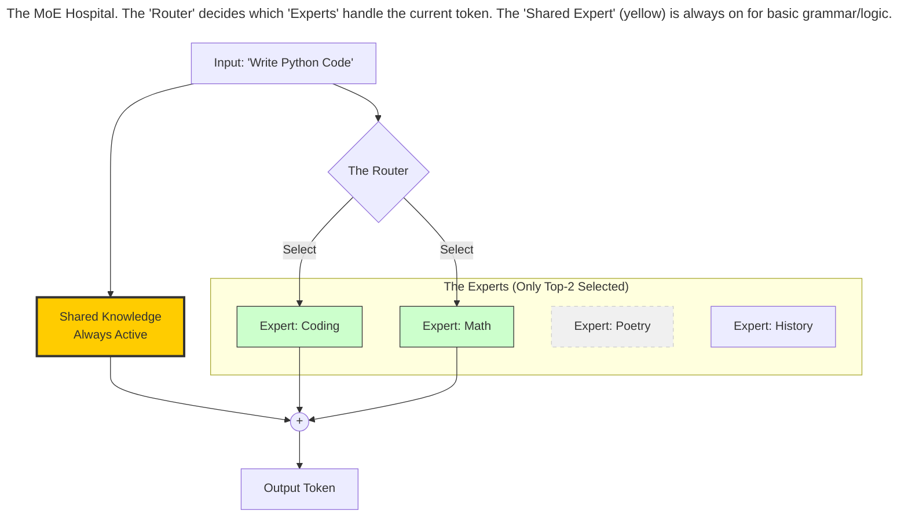
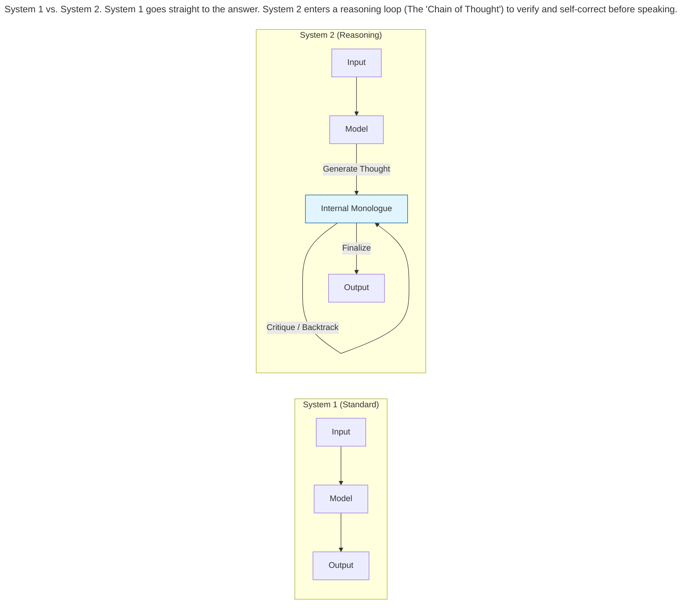

In the early days (2023), most people primarily just used GPT-4. However, the era of "One Model to Rule Them All" has long ended. Today, the landscape is a sprawling ecosystem defined by specialization. We have models that are small enough to run on a phone but smart enough to write code; models that are massive "Omni" brains; and models that don't just speak, but *think*.

## The Geopolitical Axis: Scale vs. Efficiency

The AI arms race has bifurcated into two distinct philosophies led by two superpowers.

### The USA: "Bigger is Better"
The American approach (led by **OpenAI, Google, Anthropic**) has largely focused on **Scale**.

*   **Philosophy:** Throw more compute, more data, and larger clusters at the problem.
*   **The Result:** Closed-source "God Models" (like GPT-5 "Orion" or Claude Opus) that reside in massive data centers. They are incredibly smart but expensive and slow.

### China: "Smarter is Better"
The Chinese approach (led by **DeepSeek, Alibaba Qwen**) has focused on **Efficiency**.

*   **Philosophy:** We have fewer chips (due to sanctions), so we must optimize the architecture.
*   **The Result:** Open-weight models that rival American performance using 10x less memory and cost. They pioneered innovations like MLA (**Multi-Head Latent Attention**, discussed in the next chapter) to fit massive context into consumer hardware.

## Architecture I: The Dense Monolith

The standard Transformer—where every single parameter is active for every single word—is now called a **Dense** model.

Think of a Dense model like a **General Practitioner** doctor. They have studied everything. Whether you ask about a headache or a foot ache, the *entire* doctor is present in the room listening to you.

*   **Pros:** Simple, stable, and easy to deploy on phones/laptops.
*   **Cons:** Inefficient. You don't need the "Foot Knowledge" neurons firing when you are solving a math equation.

**The "Small but Mighty" King:**
The current king of this category is the **8B - 12B parameter** class (e.g., Llama 8B, Gemma). These are "over-trained"—they read more books than a human could in 100 lifetimes, compressed into a file small enough to run on a MacBook.

## Architecture II: Mixture of Experts (MoE)

For massive models, the industry shifted to **Mixture of Experts (MoE)**.

Think of an MoE model not as one doctor, but as a **Hospital**.

1.  **The Router:** You walk into the lobby. The receptionist (The Router) listens to your problem.
2.  **The Experts:**
    *   If you say "My chest hurts," you are sent to the Cardiologist (Expert A).
    *   If you say "Debug this Python code," you are sent to the Computer Scientist (Expert B).

The model might have 400 Billion parameters (total size of the hospital), but for any single word, only 10 Billion are active (the specific doctor you see). This allows models to have massive knowledge but run incredibly fast.

## The Cognitive Axis: System 1 vs. System 2

The biggest shift that came in the recent times was the move from "Chatbots" to "Reasoning Engines."

### System 1: The "Gut Instinct" (Standard LLMs)
Models like GPT-4 or Llama 3 are **System 1** thinkers.
If you ask: *"What is 2 + 2?"* they instantly say *"4"*.
If you ask a complex riddle, they also try to answer instantly. They don't "stop and think." They just predict the next likely word. They are prone to hallucination because they can't backtrack.

### System 2: The "Deep Thinker" (Reasoning Models)
Models like **OpenAI o3** and **DeepSeek-R1** introduce **Inference-Time Compute**.

When you ask a hard question, these models pause. Behind the scenes, they generate thousands of "hidden thoughts" (Chain of Thought).

1.  *User:* "Solve this riddle."
2.  *Model (Internal Monologue):* "Okay, let's try path A. Wait, that leads to a contradiction. Let's backtrack. Let's try path B. Let me double-check that math. Okay, Path B looks solid."
3.  *Model (Output):* "Here is the answer."

This "thinking" phase allows them to solve Ph.D.-level math and coding problems that standard models fail at.

> ## The Selection Matrix
> **Don't just pick the 'Smartest' model.** Pick the right tool for the job.
> 
> *   Need to rewrite an email? Use a fast, cheap **System 1** model.
> *   Need to solve a new physics proof? Use a slow, expensive **System 2** model.
> {: .prompt-tip }

## The Unsolved Frontier

By 2024, the industry had "solved" the easy tests. Benchmarks like **MMLU** (answering multiple-choice trivia) became useless because every top model scored 90%+. It was like measuring NBA players by asking if they could dribble—they all can.

To distinguish them better, we stopped testing for "Knowledge" and started testing for "Agency" and "General Intelligence." We only care about tests where models still struggle.

### **The "Big Four" Hard Benchmarks**

| Benchmark | The Analogy | What it Measures | Current Status |
| :---- | :---- | :---- | :---- |
| **Humanity's Last Exam (HLE)** | **The Final Boss** | 3,000+ questions designed by global experts to be "Google-proof." It covers everything from abstract mathematics to nuance in foreign law. Unlike GPQA, which was hard, HLE is punishing. | **The Gatekeeper.** While models ace the SATs, they are failing this. Top models currently score ~40%, while human experts score 90%+. |
| **SWE-bench Verified** | **The First Job** | It gives the model a real GitHub issue (a bug in a massive codebase) and asks it to navigate the files, reproduce the bug, and fix it. | **Hard.** This measures *engineering*, not just coding. Top models are barely passing as "Junior Developers." |
| **ARC-AGI** | **The IQ Test** | Visual puzzles that require learning a *new* rule on the fly. No memorization possible. It tests fluid intelligence and adaptability. | **Very Hard.** The ultimate test of AGI. Humans score 85%+ easily; most models still look "dumb" here. |
| **GAIA** | **The Assistant** | "General AI Assistants." Tasks that require using tools: "Find the cheapest flight to Tokyo, book it, and add it to my calendar." | **Chaos.** Models often get stuck in loops or fail to recover from web-browsing errors. |

Next, we will look at different approaches used for efficient Inference, i.e. the part where the model is already trained and delivers answers to user queries.

