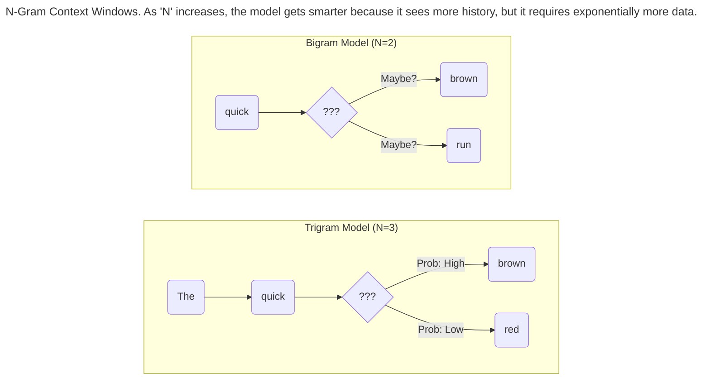
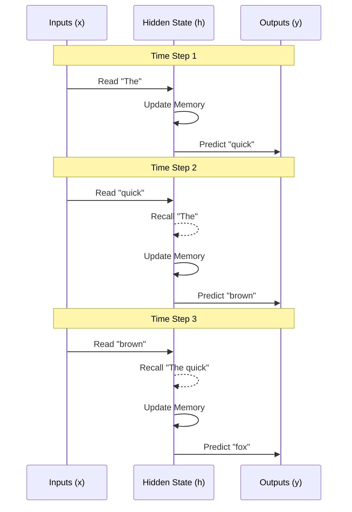
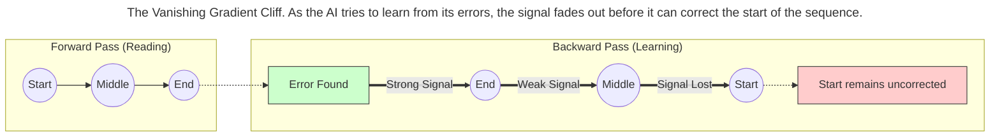
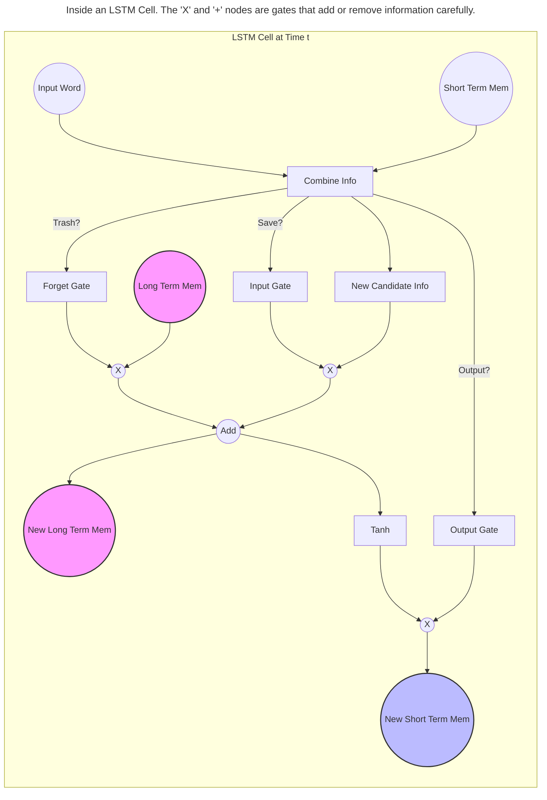
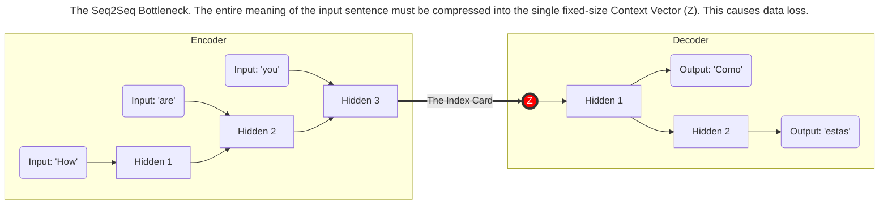

> This article is part of my book [Generative AI Handbook](https://iamulya.one/tags/generative-ai-handbook). For any issues around this book or if you'd like the pdf/epub version, contact me on [LinkedIn](https://www.linkedin.com/in/amulya-bhatia-01627a42/)
{: .prompt-info }

Before the rise of the Transformer and the Large Language Models (LLMs) that define the current era of AI, the field of Natural Language Processing (NLP) struggled with a fundamental problem: **Memory**.

To generate coherent text, a system must understand context. It needs to remember that a sentence starting with *"The heavy rain..."* might end with *"...caused a flood,"* even if those words are separated by a dozen adjectives. 

For decades, AI was like a person with severe short-term amnesia. It could understand the word it was looking at *right now*, but it struggled to connect it to what it read ten seconds ago. This chapter explores the evolution of "teaching machines to read," from simple statistical guessing games to the neural networks that ruled the 2010s, and explains exactly why they eventually hit a wall.

## The Statistical Guessing Game (N-Grams)

In the early days, language generation wasn't about "reasoning"; it was a game of probability. The goal was simple: look at the last few words and guess what comes next based on how often that sequence appears in books or articles.

This approach is called the **N-Gram** model (where *N* is the number of words the computer looks at).

*   **Unigram (1 word):** The computer ignores context entirely. If you ask for a verb, it picks "is" simply because "is" is the most common verb in English.
*   **Bigram (2 words):** It looks at the **one** word before the cursor. If you type "New," it guesses "York."
*   **Trigram (3 words):** It looks at the **two** words before the cursor. If you type "The United," it guesses "States."

### The "Sparsity" Trap
You might ask: *"Why not just make 'N' bigger? Let's make a 50-Gram model so it can remember a whole paragraph!"*

The problem is the **Curse of Dimensionality**. Language is incredibly creative. If you look for a specific sequence of 50 words, you will likely find zero examples of it in human history. 

> **The Curse of Dimensionality**
> {:.title}
> **Sparsity is the killer of N-Grams.**
> If you increase N to capture more context, the number of possible word combinations explodes. Most of these combinations will never appear in your training data. If the model encounters a sequence it has never seen before, its probability calculation hits zero, and it has no idea what to write next.
{: .prompt-warning }

## Recurrent Neural Networks (RNNs)

To solve the sparsity problem, researchers moved away from counting exact word matches and invented the **Recurrent Neural Network (RNN)**.

Imagine reading a book. You don't read each word in isolation; you keep a running "mental summary" of the plot in your head as you move from sentence to sentence. The RNN was designed to mimic this specific behavior.

Unlike standard AI networks that process data in a straight line, an RNN loops back on itself. It maintains a **Hidden State**—effectively a "Short-Term Memory" vector.

1.  It reads Word A.
2.  It updates its memory.
3.  It passes that updated memory to help it understand Word B.

### The "Game of Telephone" Problem
While RNNs were a huge leap forward, they suffered from a critical flaw known as the **Vanishing Gradient**.

Think of this like the children's game "Telephone" (or Chinese Whispers). You whisper a complex story to the first person, who whispers it to the second, and so on. By the time the story reaches the 20th person, the details are gone.

In an RNN, as the "memory" is passed from word to word, the signal from the beginning of the sentence gets weaker and weaker. By the time the model processes the 50th word, it has completely forgotten the subject of the sentence.

## Long Short-Term Memory (LSTM)

In the late 90s, the **LSTM** was introduced to solve the "Telephone" problem. 

If the standard RNN was a person trying to remember *everything* at once, the LSTM is like a CEO with a highly efficient Executive Assistant. The Assistant (the architecture) has a specific job: **Decide what is important enough to write down, and what is safe to delete.**

The LSTM introduced a "Superhighway" for memory (technically called the **Cell State**) that runs through the entire sequence. It uses mechanisms called **Gates** to manage this highway:

1.  **Forget Gate:** "The subject changed from 'He' to 'They'. Forget the singular verb form."
2.  **Input Gate:** "Here is a new name. Write it down."
3.  **Output Gate:** "Based on what we know, predict the next word."

> **Why LSTMs worked**
> {:.title}
> The key innovation of the LSTM was that it allowed gradients (learning signals) to flow backwards through the network without vanishing. This "superhighway" allowed models to finally remember context over long paragraphs, powering a few generations of Google Translate and Siri.
{: .prompt-info }

## The Encoder-Decoder Bottleneck

With LSTMs solving the memory problem, researchers built **Seq2Seq** (Sequence-to-Sequence) models. This is the architecture used for translation (e.g., English to French).

1.  **Encoder:** Reads the English sentence one word at a time and compresses it into a "Context Vector."
2.  **Decoder:** Reads the Context Vector and unpacks it to write the French sentence.

However, this approach hit a hard limit.

### The "Index Card" Problem
Imagine I ask you to read a complex chapter of a textbook. However, I tell you: *"You cannot keep the book. You must summarize the entire chapter—every fact, date, and name—onto a **single 3x5 index card**."*

Then, I take the book away, give that index card to a friend, and say: *"Rewrite the chapter perfectly using only this card."*

No matter how smart you are, you cannot compress that much information into a fixed-size card without losing details. This is exactly what the Encoder-Decoder did. It tried to shove the meaning of a long sentence into a single, fixed-size vector.

### The Speed Limit
Furthermore, RNNs and LSTMs are **Sequential**. To understand the 100th word, you *must* calculate the 99 words before it, one by one. You cannot parallelize this process. It’s like a single-lane road; no matter how much hardware you buy, the cars must go one after another.

This limitation—the inability to "look back" at specific words in the original sentence, and the inability to process data in parallel—set the stage for the greatest breakthrough in modern AI: **Attention**. But before we go there, it's important to understand the concept of **Tokenization** and **Embeddings** which we will look at next.
