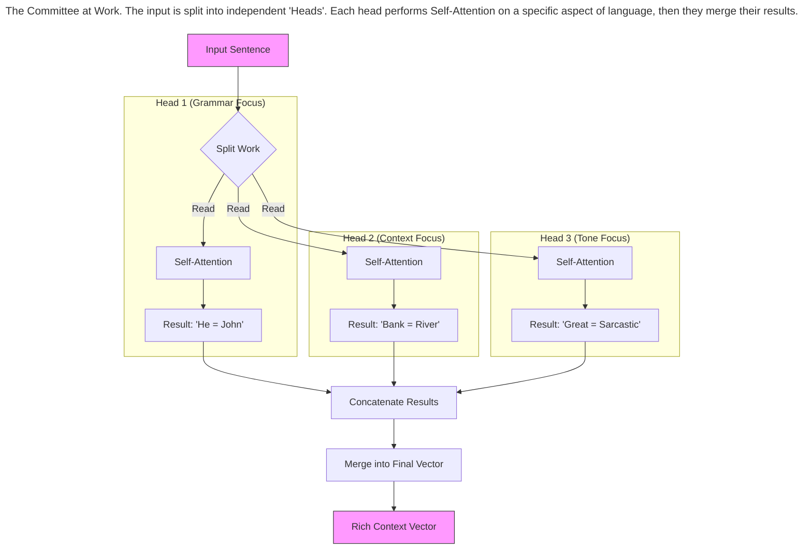
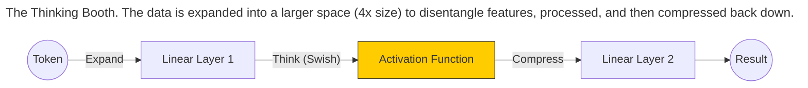
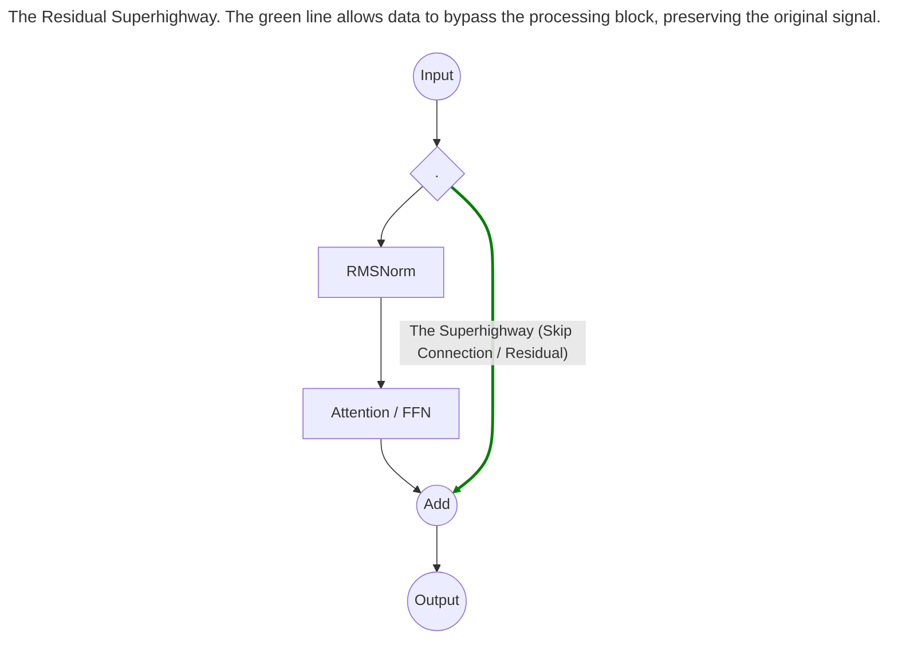
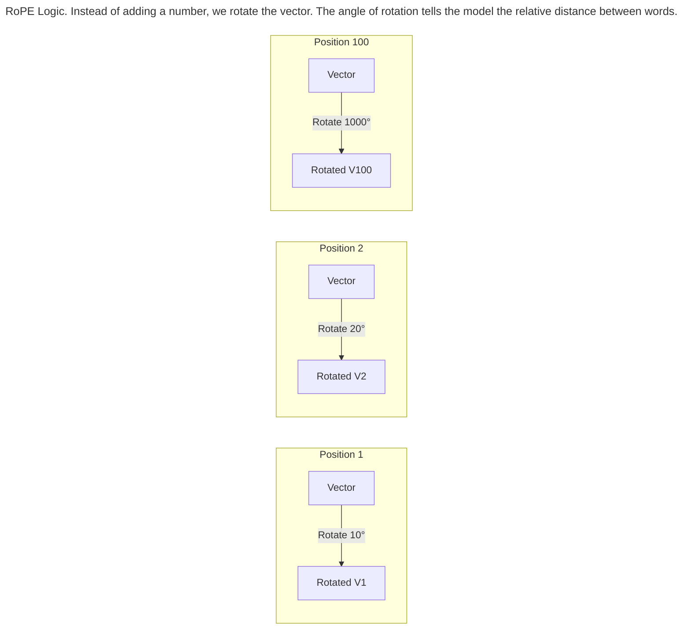
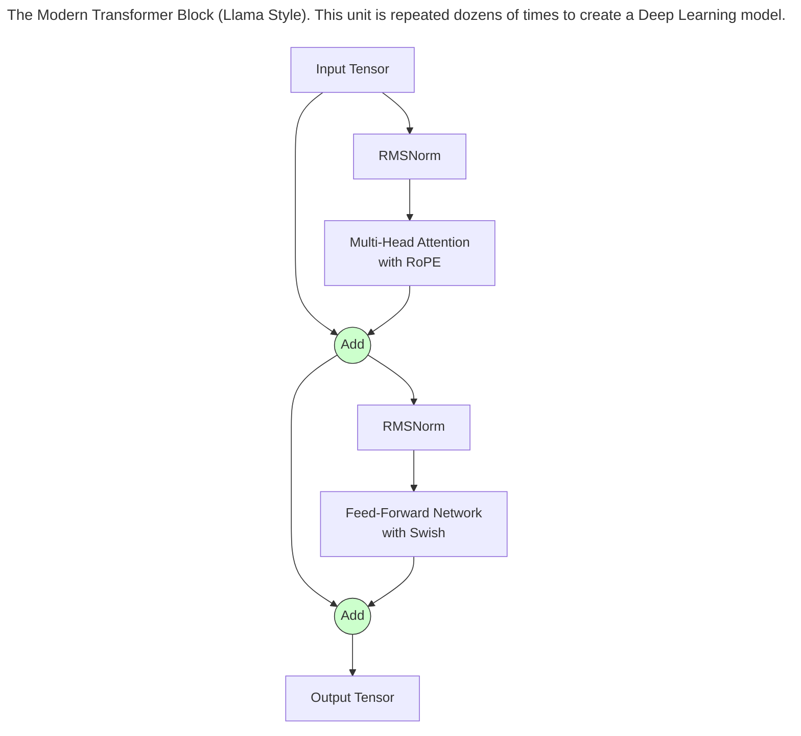

> This article is part of my book [Generative AI Handbook](https://iamulya.one/tags/generative-ai-handbook). For any issues around this book or if you'd like the pdf/epub version, contact me on [LinkedIn](https://www.linkedin.com/in/amulya-bhatia-01627a42/)
{: .prompt-info }

In the previous chapter, we learned about **Attention**—the mechanism that allows words to "talk" to each other.

But Attention alone is not enough. A single conversation between words cannot capture the complexity of human language. To build a brain that can reason, write code, and understand humor, we need to wrap the Attention mechanism into a modular unit called the **Transformer Block**.

We then stack these blocks—dozens or even hundreds deep—like layers of a cake. This chapter dissects the anatomy of this block, exploring how we make the model smarter (Multi-Head Attention), how we teach it facts (Feed-Forward Networks), and how we keep it stable (Normalization).

## Multi-Head Attention: The Committee

In Chapter 3, we treated Attention as a single operation. But language is multifaceted. A word can be related to another word for many different reasons:

*   **Grammar:** "He" refers to "John."
*   **Context:** "Bank" refers to "River."
*   **Tone:** "Great" refers to "Sarcastic."

If we only have one "Attention Head," the model has to choose *one* of these relationships to focus on. It can't see them all at once.

To fix this, we use **Multi-Head Attention**. Instead of one pair of eyes reading the sentence, we hire a whole committee of experts.

*   **Head 1 (The Grammarian):** Focuses purely on syntax and subject-verb agreement.
*   **Head 2 (The Historian):** Focuses on names, dates, and places.
*   **Head 3 (The Poet):** Focuses on rhyme, rhythm, and emotional tone.

Each head performs its own Self-Attention process *independently*. They all read the same sentence, but they look for different things. At the end, they combine their findings into a single, rich understanding.

> **Size of Q, K, V Vectors**
> {:.title}
> For a transformer:
> 
> * Q size per token per head = Size of Embedding / Number of Heads
> * K size per token per head = Size of Embedding / Number of Heads
> * V size per token per head = Size of Embedding / Number of Heads
> 
> Example: For a model with 32 heads and 3096 Embedding Size (GPT 5 mini), that means per token:
> 
> * 32 different Q vectors of size 96
> * 32 different K vectors of size 96
> * 32 different V vectors of size 96
> 
> Add to that billions, sometimes trillions of parameters (weights) and you have the reason why these models need a lot of memory (Cache + VRAM)!
{: .prompt-info }

## The Feed-Forward Network (The Brain)

If Attention is the "Routing" mechanism (moving information *between* words), the Feed-Forward Network (FFN) is the "Thinking" mechanism (processing information *inside* a word).

Think of the FFN as a private thinking booth for each token.

1.  The token enters the booth.
2.  It expands its mind (projects to a higher dimension).
3.  It thinks about the information it gathered from Attention.
4.  It compresses that thought back into a concise vector.

This is where the model stores "static knowledge." If you ask "What is the capital of France?", the Attention layer helps the word "Capital" find the word "France," but the **FFN** is likely where the fact "Paris" is actually retrieved.

### The Activation Function (GELU/Swish)
Inside the FFN, we use a mathematical function to introduce non-linearity. Without this, the entire neural network would just be one big linear equation (essentially a fancy average).

Modern LLMs use activation functions called **GELU** or **Swish**. Unlike the older ReLU (which abruptly cuts off negative values), these are smooth curves. This smoothness helps the model learn complex patterns more effectively during training.

## The Glue: Residuals and Normalization

You cannot simply stack 100 layers of neural networks on top of each other. The signal will get lost, or the numbers will explode into infinity. To make Deep Learning work, we need two architectural tricks.

### The Skip Connection (Residuals)
Imagine a game of "Telephone" where, instead of just whispering to the next person, you also pass a written note with the original message. Even if the whisper gets distorted, the note preserves the truth.

In a Transformer, we add the input of a layer to its output:
$$ 	ext{Output} = 	ext{Layer}(x) + x $$

This creates a "Superhighway" for data. The gradients (learning signals) can flow backwards through the network without getting stopped, allowing us to train unbelievably deep models.

### Normalization (RMSNorm)
As numbers flow through the network, they can drift (become too large or too small). **Normalization** forces them back into a standard range (like scaling a photo to fit a frame).

Modern models use **RMSNorm (Root Mean Square Normalization)**. It simplifies the calculation by focusing only on the magnitude of the numbers, making the model faster and more stable than older methods.

## Rotary Positional Embeddings (RoPE)

In Chapter 2, we discussed adding "Position Vectors" so the model knows word order. But simply adding numbers has a flaw: it handles *absolute* position well, but *relative* position poorly.

We want the model to understand that "King" and "Queen" are related because they are **next to each other**, regardless of whether they appear at Page 1 or Page 50.

The modern solution is **RoPE (Rotary Positional Embeddings)**.

Imagine the embedding vector as a hand on a clock.

*   Word 1 is rotated 10 degrees.
*   Word 2 is rotated 20 degrees.
*   Word 3 is rotated 30 degrees.

When we compare two words using the Dot Product, the math works out so that the result depends only on the **angle difference** between them. This naturally encodes "distance" rather than just "location."

## Putting It All Together

This is the Lego brick of modern AI. To build GPT-4 or Llama 3, we simply stack identical copies of this block on top of each other (often 32 to 96 times).

**The Life of a Tensor in a Block:**

1.  **Normalization:** Clean up the numbers.
2.  **Attention:** Look around and gather context from other words (using RoPE).
3.  **Residual Add:** Remember the original input.
4.  **Normalization:** Clean up again.
5.  **Feed-Forward:** Think about the data and retrieve facts.
6.  **Residual Add:** Remember the input again.

By the time the data exits the final block, it has been compared, contextualized, processed, and refined dozens of times. It is now a rich, intelligent representation ready to predict the next word.
