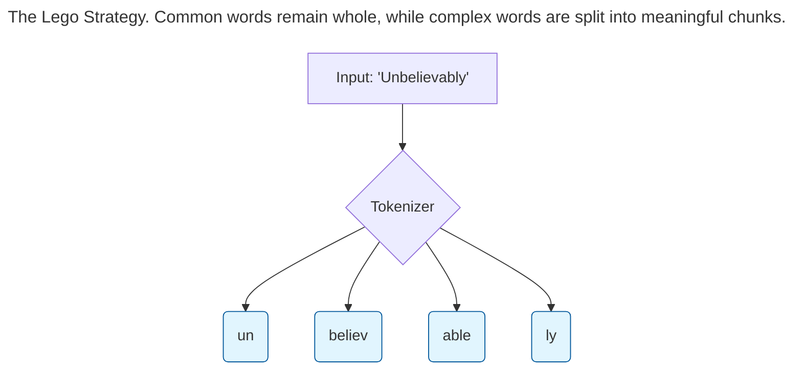
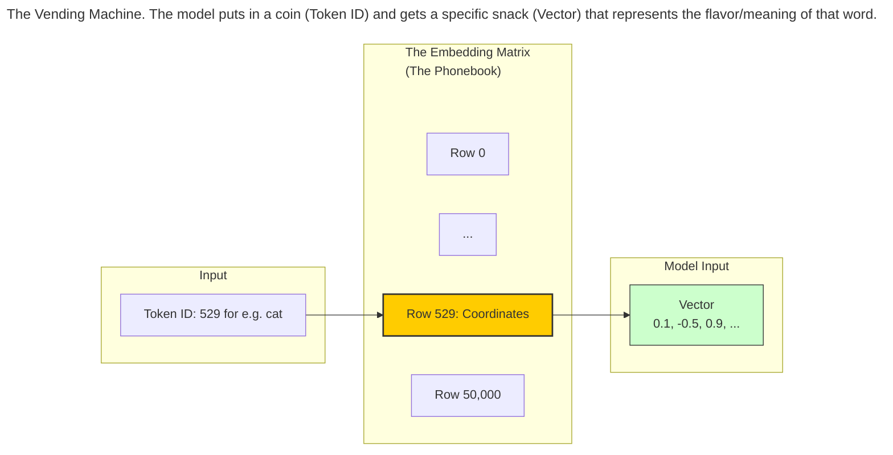
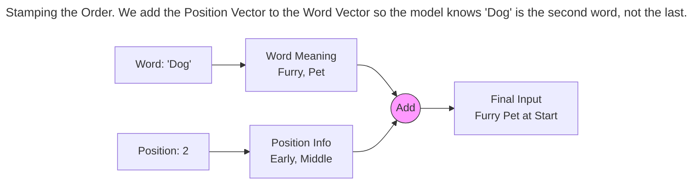

Before a generative model can write a sonnet or summarize a legal document, it must cross a massive divide: **The Language Barrier.**

Computers are calculators. They do not understand "love," "anger," or "syntax." They only understand numbers. If you feed the word "Hello" into a raw neural network, it will crash.

This chapter explains the translation layer—the critical pipeline that turns human language into a format the machine can understand. We call this process **Tokenization** (chopping text up) and **Embedding** (giving text meaning).

## The Atomic Unit (Tokenization)

The first step is to break a sentence down into manageable pieces. In the AI world, these pieces are called **Tokens**.

Historically, there were two ways to do this, both of which had major flaws:

1.  **Word-Level:** You give every word in the dictionary a unique ID number.
    *   *The Problem:* English has over a million words. If you have an ID for "run," you also need one for "running," "runs," and "ran." The dictionary becomes too big to manage.
2.  **Character-Level:** You treat every letter (a, b, c...) as a token.
    *   *The Problem:* This is too granular. It’s like trying to understand a novel by staring at the ink molecules. The model has to memorize that `t` + `h` + `e` means "The." It takes forever to process simple sentences.

### The Modern Solution: The "Lego" Strategy (Subwords)
Modern models use a "Goldilocks" solution called **Subword Tokenization**.

Imagine you have a bucket of Lego bricks.

*   Common words like "apple" or "house" are single, pre-molded bricks.
*   Complex or rare words are built by snapping smaller bricks together.

For example, the model might not know the word **"Unbelievably"**. But it knows **"Un"**, **"believ"**, **"able"**, and **"ly"**. By snapping these four tokens together, it can understand a word it has never seen before.

> ## Byte Pair Encoding (BPE)
> The algorithm used to decide *how* to chop up words is often called **BPE**. It's essentially a frequency contest. If "ing" appears together frequently in the training books, BPE glues them together into a single token. If "zqv" never appears, it keeps them as separate letters.
> {: .prompt-info }

## From Words to Numbers (The ID System)

Once chopped, the tokenizer assigns a specific ID number to each piece.

*   "The" -> `1001`
*   "cat" -> `529`
*   "sat" -> `982`

At this stage, the computer sees the sentence "The cat sat" as `[1001, 529, 982]`.

However, there is a trap here. To a computer, the number `1000` is bigger than `1`. But is the word "Zebra" (ID 1000) *mathematically greater* than the word "Apple" (ID 1)? No. These numbers are just barcodes. They have no meaning yet.

To solve this, we need **Embeddings**.

## The GPS Coordinates of Meaning (Embeddings)

This is perhaps the most "magical" concept in NLP.

We want to turn those ID numbers into coordinates. Imagine a massive, multi-dimensional map—like a supermarket. 

*   **The Fruit Aisle:** All fruit words (Apple, Pear, Banana) hang out here.
*   **The Electronics Aisle:** All tech words (Computer, Phone, Screen) hang out here.
*   **The Royal Corner:** King, Queen, Prince, Princess hang out here.

An **Embedding** is simply the GPS coordinate of a word on this map. When the model sees Token ID `529` ("cat"), it looks up its coordinates in a massive phonebook (The Embedding Matrix) and retrieves a list of numbers.

### The Geometry of Language
In this "Supermarket of Words," concepts that are similar are placed physically close to each other.

If you draw a line from "King" to "Man," and a line from "Queen" to "Woman," those two lines will point in the exact same direction. The model learns that "Queen" is just "King" but with the gender direction flipped.

To measure how similar two words are, the computer calculates the **Cosine Similarity**.

*   It measures the **Angle** between the two words.
*   If the angle is 0° (the arrows point the same way), the words mean the same thing.
*   If the angle is 90° (the arrows are perpendicular), the words are unrelated.

> ## High-Dimensional Brains
> Humans can visualize 3 dimensions (Length, Width, Height). LLMs use thousands of dimensions (e.g., 4096 dimensions).
> 
> Imagine an object that has 4,096 different attributes (Sweetness, Fluffiness, Political Leaning, Color, Speed, etc.). The Embedding Vector captures every single one of such nuances for every word.
> {: .prompt-warning }

## The Missing Piece: Position

There is one final problem.

If I give you a bag of words: `["The", "dog", "bit", "the", "man"]`, you don't know who is in the hospital. Did the dog bite the man, or did the man bite the dog?

Transformers process all words simultaneously (in parallel). They don't naturally know that "The" came first and "Man" came last. They just see a pile of words.

To fix this, we stamp a **Positional Encoding** onto each word.

*   We take the "Dog" vector.
*   We add a "Position 2" vector to it.
*   Result: "Dog-at-position-2".

Now, the model knows not just *what* the word is, but *where* it is.

## Summary

1.  **Tokenization:** We chop text into "Lego bricks" (Subwords) to handle any word in existence.
2.  **IDs:** We give each brick a barcode number.
3.  **Embeddings:** We look up the GPS coordinates for that barcode in a massive multi-dimensional map.
4.  **Positioning:** We add a timestamp so the model knows the word order.

The result is a three-dimensional tensor of shape `[Batch_Size, Sequence_Length, Embedding_Dimension]` where: 

* Batch_Size = Number of sentences to process in parallel. 
* Sequence_Length = Max number of tokens (not words!) in each sentence. This is a generous number so as to accomodate all sentence lengths.
* Embedding_Dimension = The size of each token’s vector representation. 

Hence, a 3D Tensor of shape [2, 3, 4] means:

Batch 0:
    
    Token 0 → [x x x x]
    Token 1 → [x x x x]
    Token 2 → [x x x x]

Batch 1:

    Token 0 → [x x x x]
    Token 1 → [x x x x]
    Token 2 → [x x x x]

This is the lifeblood of the Generative AI model. Now, the text is fully converted into numbers. It is ready to enter the **Transformer**.

