> This article is **Part 3 of 15** in the [Generative AI in Depth](/categories/generative-ai-in-depth/) series.
{: .prompt-info }


Every modern LLM generates tokens by *attending* to all previous tokens. The way this attention is computed — and the way its intermediate results are stored — is the single most important architectural decision in a transformer. It determines how much GPU memory the model needs, how many concurrent users it can serve, and how long a context it can handle.

This post covers every major attention mechanism and KV cache strategy in production today, from first principles. We finish by dissecting Google's Gemma 4 architecture as a real-world case study — using the actual `config.json` from HuggingFace.

---

## What Gets Stored in the KV Cache

During inference, each token generates a **Key** (K) and a **Value** (V) vector **for every KV head in every layer**. In [MHA](#multi-head-attention-mha--the-original-2017), that means one K and one V per KV head — so a 32-head, 80-layer model stores `32 × 2 × 80 = 5,120` vectors per token. These vectors encode what information the token holds (K) and the actual content to retrieve (V). Once computed, they're stored in the KV cache so future tokens can attend to them without recomputation.

The total KV cache per token depends on the attention mechanism:

```
KV cache per token = n_layers × n_kv_heads × 2 × d_head × bytes_per_element
                     ────────   ──────────   ─   ──────   ─────────────────
                     depth      how many     K+V  vector   FP16 = 2 bytes
                                heads store       size     FP8  = 1 byte
                                K,V
```

The `n_kv_heads` is where most attention mechanisms diverge - it becomes about reducing this number without destroying quality in order to reduce the KV Cache size.

> **Terminology note**: "attention heads" and "query heads" are the same thing. In HuggingFace configs, `num_attention_heads` is the number of query heads — it's a fixed architectural constant for a given model. What varies between MHA, GQA, and MQA is **only** `num_key_value_heads`. The query head count determines how many different patterns the model can search for simultaneously. The KV head count determines how much memory that search costs.
{: .prompt-info }

---

## The Attention Mechanism Spectrum

### Multi-Head Attention (MHA) — The Original (2017)

Introduced in [*Attention Is All You Need*](https://arxiv.org/abs/1706.03762), MHA gives every query head its own dedicated K and V head. If you have 32 query heads, you have 32 KV heads.

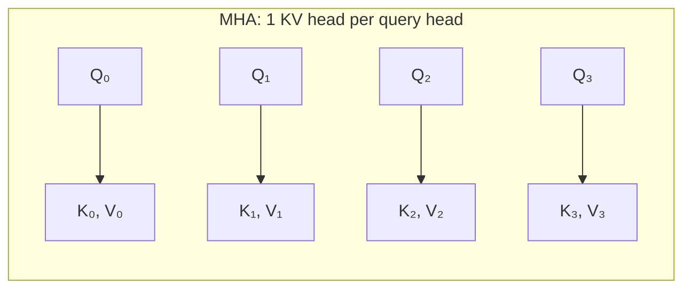
```mermaid
flowchart LR
    subgraph "MHA: 1 KV head per query head"
        Q0["Q₀"] --> KV0["K₀, V₀"]
        Q1["Q₁"] --> KV1["K₁, V₁"]
        Q2["Q₂"] --> KV2["K₂, V₂"]
        Q3["Q₃"] --> KV3["K₃, V₃"]
    end
```

**KV cache**: `n_layers × n_heads × 2 × d_head` — maximum memory usage. Every head maintains full independent KV vectors.

**Used by**: GPT-2, GPT-3, original BERT, early open models.

**Problem**: KV cache scales linearly with head count. A 96-head model stores 96 K vectors and 96 V vectors per token per layer. At 128K context, this becomes unservable.

---

### Multi-Query Attention (MQA) — Maximum Compression (2019)

Introduced by [Noam Shazeer](https://arxiv.org/abs/1911.02150), MQA takes the extreme approach: **all query heads share a single K and V head.**

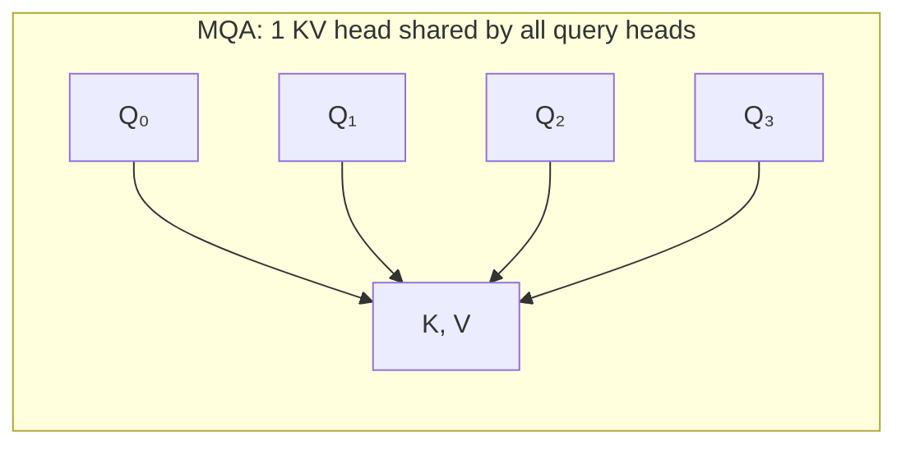
```mermaid
flowchart LR
    subgraph "MQA: 1 KV head shared by all query heads"
        Q0["Q₀"] --> KV["K, V"]
        Q1["Q₁"] --> KV
        Q2["Q₂"] --> KV
        Q3["Q₃"] --> KV
    end
```

**KV cache**: `n_layers × 1 × 2 × d_head` — minimum possible. Regardless of how many query heads exist, you store only 1 K and 1 V per layer per token.

**Used by**: StarCoder (GPTBigCode), PaLM, Falcon (early versions).

**Problem**: Quality degrades. The single KV head becomes an information bottleneck — all the diversity of what query heads can look for is channeled through one shared representation. Noticeable on reasoning tasks.

---

### Grouped-Query Attention (GQA) — The Sweet Spot (2023)

Introduced by [Ainslie et al.](https://arxiv.org/abs/2305.13245) at Google, GQA is the generalization between MHA and MQA. Query heads are divided into **groups**, and each group shares one KV head.

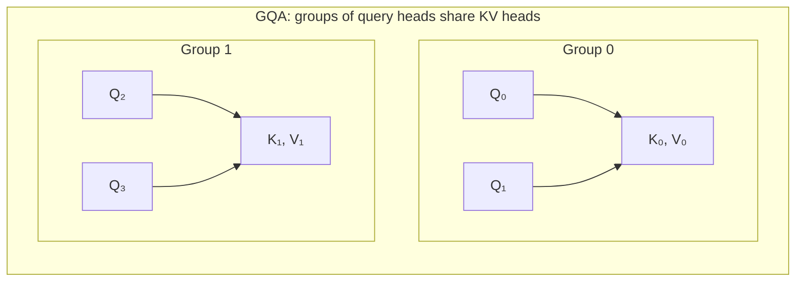
```mermaid
flowchart LR
    subgraph "GQA: groups of query heads share KV heads"
        subgraph "Group 0"
            Q0["Q₀"] --> KV0["K₀, V₀"]
            Q1["Q₁"] --> KV0
        end
        subgraph "Group 1"
            Q2["Q₂"] --> KV1["K₁, V₁"]
            Q3["Q₃"] --> KV1
        end
    end
```

**KV cache**: `n_layers × n_kv_heads × 2 × d_head` — tunable between MHA and MQA. Typical ratios:

| Model | Query Heads | KV Heads | Ratio | KV Savings vs MHA |
|---|---|---|---|---|
| Llama 3.1 8B | 32 | 8 | 4:1 | 4× less KV cache |
| Llama 3.1 70B | 64 | 8 | 8:1 | 8× less |
| Mistral 7B | 32 | 8 | 4:1 | 4× less |
| Gemma 4 12B | 16 | 8 (local) / 1 (global) | 2:1 / 16:1 | varies by layer |

**Used by**: Llama 2/3, Mistral, Gemma, Qwen, most 2024-2026 models.

**Why it works**: Most of the "diversity" in attention comes from the query heads — each head learns to look for different patterns. The KV heads just store what's there to be found. Having 8 independent representations of "what's in the context" turns out to be almost as good as having 64.

---

### Multi-Latent Attention (MLA) — Latent Compression (2024)

Introduced by DeepSeek in [DeepSeek-V2](https://arxiv.org/abs/2405.04434), MLA takes a fundamentally different approach: instead of reducing the *number* of KV heads, it reduces the *dimensionality* of what's stored by projecting into a compressed latent space. Crucially, it applies this trick to **queries as well as keys and values**.

#### The KV Compression Path

Standard attention stores K and V directly. MLA projects the hidden state down into a small **KV latent vector** `c_KV`, caches that, and reconstructs full K and V on the fly during attention:

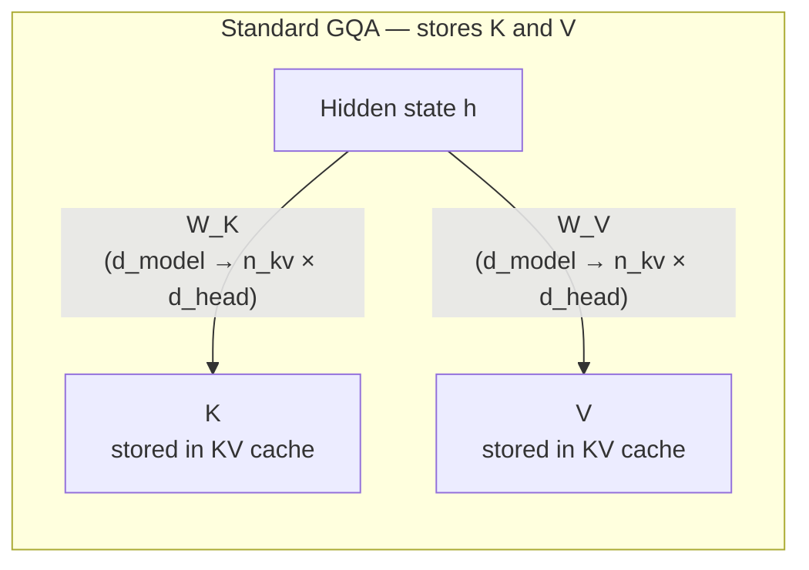
```mermaid
flowchart LR
    subgraph "Standard GQA — stores K and V"
        H_s["Hidden state h"] -->|"W_K\n(d_model → n_kv × d_head)"| K_s["K\nstored in KV cache"]
        H_s -->|"W_V\n(d_model → n_kv × d_head)"| V_s["V\nstored in KV cache"]
    end
```

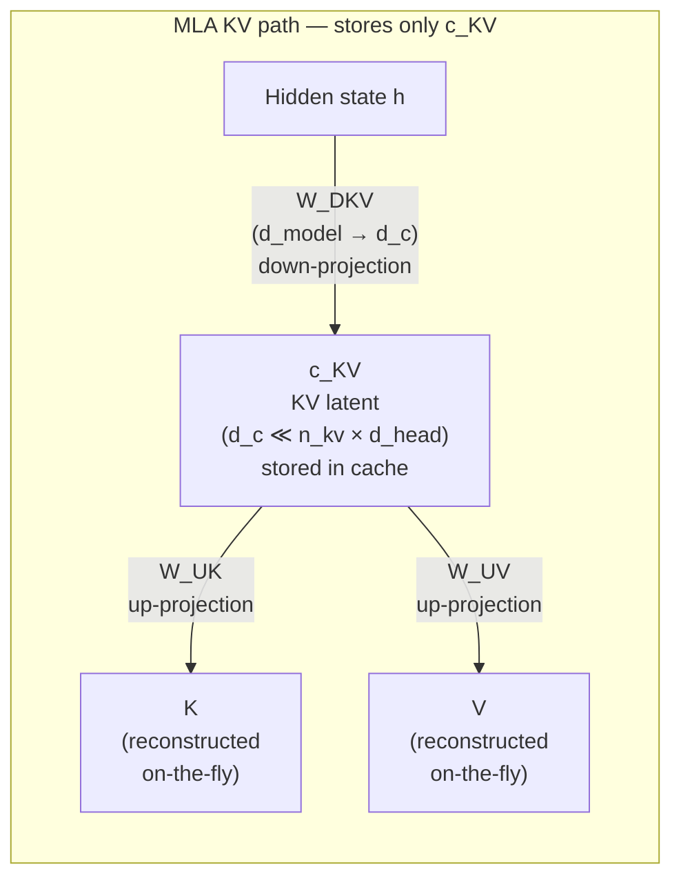
```mermaid
flowchart LR
    subgraph "MLA KV path — stores only c_KV"
        H["Hidden state h"] -->|"W_DKV\n(d_model → d_c)\ndown-projection"| C_KV["c_KV\nKV latent\n(d_c ≪ n_kv × d_head)\nstored in cache"]
        C_KV -->|"W_UK\nup-projection"| K["K\n(reconstructed\non-the-fly)"]
        C_KV -->|"W_UV\nup-projection"| V["V\n(reconstructed\non-the-fly)"]
    end
```

#### The Query Compression Path

MLA also compresses queries. A **query latent** `c_Q` is computed and then up-projected to full query vectors. Unlike the KV latent, `c_Q` is **not cached** — queries are only needed for the current token, not historical ones, so there's no memory cost:

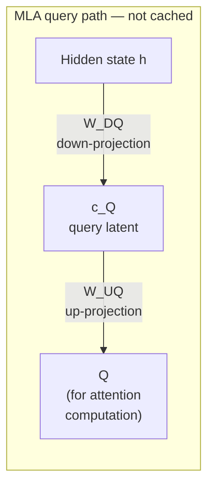
```mermaid
flowchart LR
    subgraph "MLA query path — not cached"
        H_q["Hidden state h"] -->|"W_DQ\ndown-projection"| C_Q["c_Q\nquery latent"]
        C_Q -->|"W_UQ\nup-projection"| Q["Q\n(for attention\ncomputation)"]
    end
```

#### The Decoupled RoPE Problem

Here's the subtle part. After absorbing the up-projection matrices into the weight matrices to avoid materializing full K and V, the resulting K vectors carry **no positional information** — a linear up-projection cannot encode RoPE rotations. Without position encoding, the model cannot distinguish token 1 from token 100,000.

MLA solves this with **decoupled RoPE**: a small additional key vector `k_rope` is computed separately with RoPE applied, and cached alongside `c_KV`:

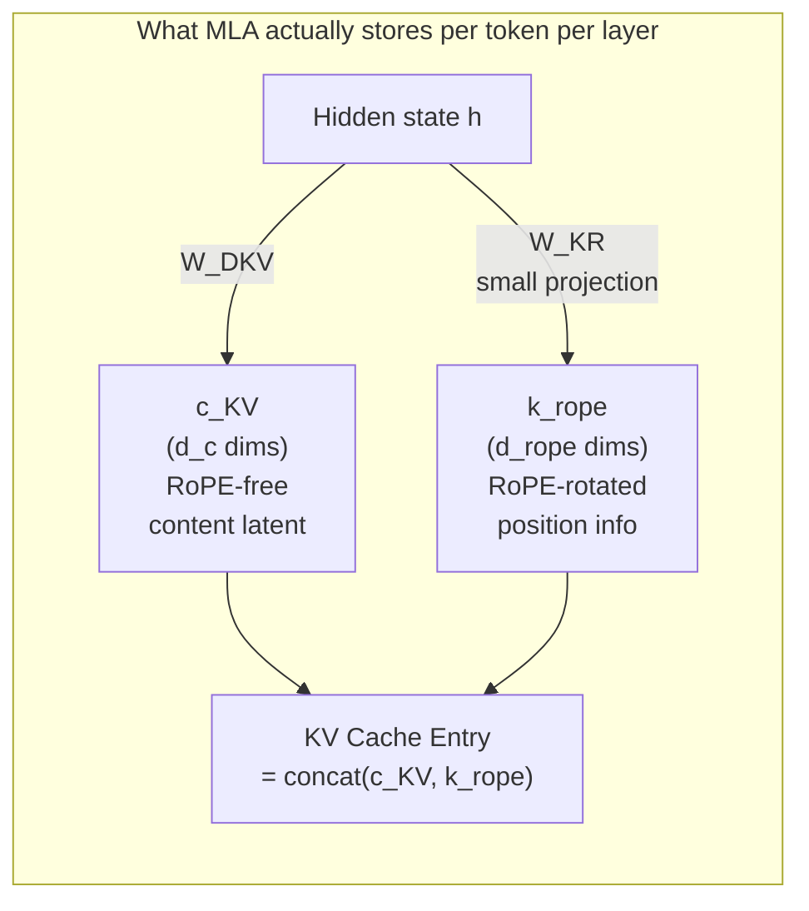
```mermaid
flowchart LR
    subgraph "What MLA actually stores per token per layer"
        H2["Hidden state h"] -->|"W_DKV"| C_KV2["c_KV\n(d_c dims)\nRoPE-free\ncontent latent"]
        H2 -->|"W_KR\nsmall projection"| K_ROPE["k_rope\n(d_rope dims)\nRoPE-rotated\nposition info"]
        C_KV2 & K_ROPE --> Cache["KV Cache Entry\n= concat(c_KV, k_rope)"]
    end
```

Similarly, the query side produces a small `q_rope` (RoPE-rotated, not cached) concatenated with the content-Q at attention time.

#### What Actually Goes in the KV Cache

The cache stores **two tensors per token per layer**:

| Cached tensor | Size | Purpose |
|---|---|---|
| `c_KV` | `d_c` dims (DeepSeek V3: 512) | Content latent — decompressed into K,V for attention |
| `k_rope` | `d_rope` dims (DeepSeek V3: 64) | Position component — concatenated with content-K |

**Total per token per layer**: `d_c + d_rope` ≈ 576 dims, vs `n_kv × d_head = 128 × 128 = 16,384` dims for naive MHA — a **~28× compression**.

**KV cache formula**: `n_layers × (d_c + d_rope) × bytes_per_element`

**The tradeoff**: At attention time, you decompress `c_KV → K, V` for every cached token. This adds compute. But decode is memory-bandwidth-bound — the GPU is waiting on HBM reads, not starved for compute. Reading ~576 dims instead of 16,384 dims per token makes the HBM reads ~28× faster, more than covering the decompression cost.

**Used by**: DeepSeek V2, V3, V4.

**Why it's novel**: GQA reduces KV heads (a discrete architectural choice). MLA learns a continuous low-rank compression during training — the model learns *what information* is most worth preserving in the latent. This achieves higher compression ratios than GQA with less quality loss. Query compression is a bonus: it reduces Q projection parameter count without touching the KV cache at all.

---

### Sliding Window Attention — Bounded Memory (2020+)

Instead of attending to ALL previous tokens, sliding window attention only attends to the last `W` tokens. Tokens older than the window are "forgotten" by that layer.

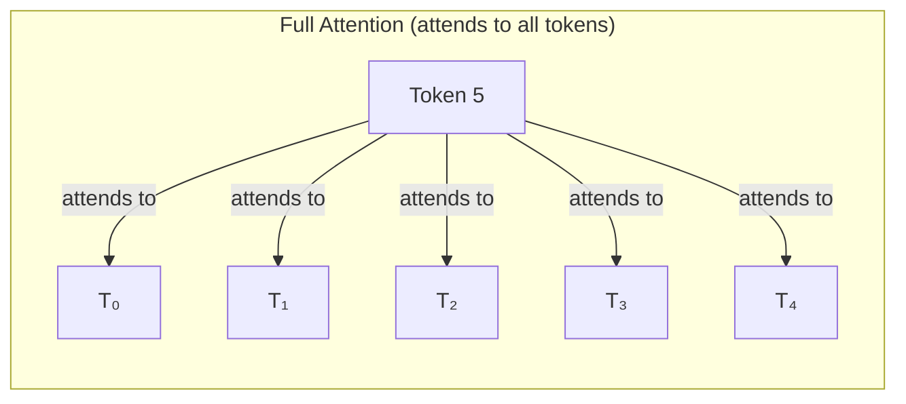
```mermaid
flowchart LR
    subgraph "Full Attention (attends to all tokens)"
        T5_F["Token 5"] -->|"attends to"| T0_F["T₀"] & T1_F["T₁"] & T2_F["T₂"] & T3_F["T₃"] & T4_F["T₄"]
    end
```

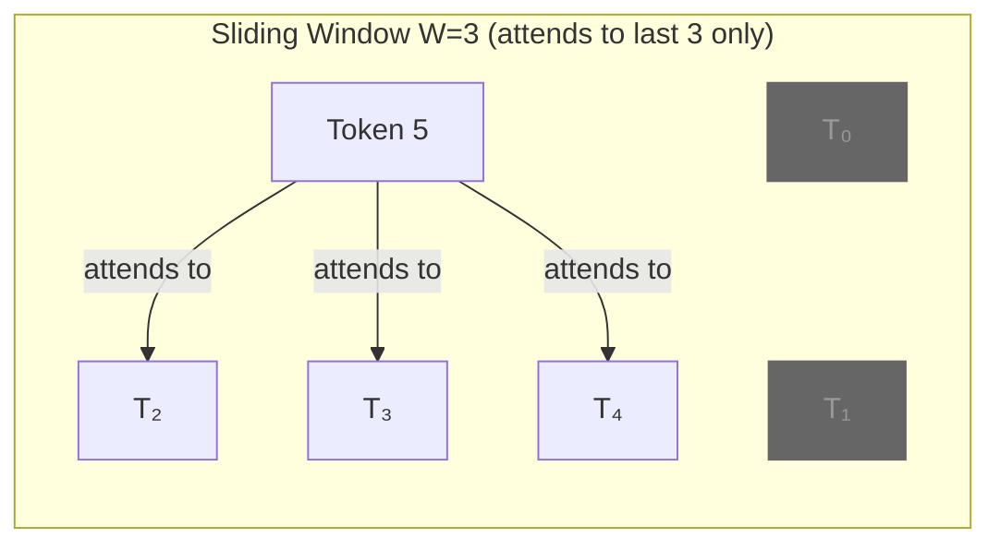
```mermaid
flowchart LR
    subgraph "Sliding Window W=3 (attends to last 3 only)"
        T5_S["Token 5"] -->|"attends to"| T2_S["T₂"] & T3_S["T₃"] & T4_S["T₄"]
        T0_X["T₀"] ~~~ T1_X["T₁"]
        style T0_X fill:#666,color:#999,stroke:#666
        style T1_X fill:#666,color:#999,stroke:#666
    end
```

**KV cache**: `n_layers × n_kv_heads × 2 × d_head × W` — bounded by window size, not sequence length. A 512-token window means at most 512 tokens of KV cache per layer, regardless of whether the total context is 2K or 128K.

**How information flows beyond the window**: Even though layer 1 only sees the last `W` tokens, the hidden states passed to layer 2 carry information from those `W` tokens — which themselves carried information from their `W` predecessors. So across `L` layers, information can propagate up to `L × W` tokens back. This is called **dilated attention** or information diffusion.

```
Layer 3: token 100 attends to tokens 98-100 (W=3)
Layer 2: token 98 attended to tokens 96-98
Layer 1: token 96 attended to tokens 94-96

→ At layer 3, token 100 has indirect access to token 94
  (3 layers × 3 window = 9 tokens of reach)
```

**Used by**: Mistral (all versions), Gemma 3/4 (for local attention layers).

**The catch**: Sliding window alone loses information on tasks requiring precise recall of early context ("What was the third paragraph about?"). That's why modern models don't use it exclusively — they alternate with full attention layers.

> **If the sequence length exceeds the window size W, tokens outside the window are permanently invisible to sliding-window layers — no indirect path can recover them.** The diffusion argument (L×W reach) assumes the relevant information was already carried forward in the hidden state. If the user's key fact appears at token 0 in a 100K-token conversation with W=1024 and L=40, that token's contribution becomes negligible within the first few layers. This is why Gemma 4 uses sliding window for only 83% of layers and reserves 8 full-attention layers for global context.
{: .prompt-warning }

---

### Linear Attention — O(n) via Kernel Trick (2020+)

Standard softmax attention computes:

```
Attention(Q, K, V) = softmax(Q · Kᵀ / √d) · V
```

The `Q · Kᵀ` step produces an `n × n` matrix — and that's the problem. With `n = 128K` tokens, that's 16 billion numbers. **Linear attention** sidesteps this by replacing softmax with a kernel feature map φ, which changes the order of operations:

```
         Standard:  (Q · Kᵀ) · V   → compute n×n matrix first  → O(n²·d)
  Linear attention:  Q · (Kᵀ · V)  → compute d×d matrix first  → O(n·d²)
```

The associativity of matrix multiplication lets you compute `(Kᵀ · V)` first — a `d × d` matrix that's independent of sequence length — and then multiply by Q. You never materialize the `n × n` attention scores.

**The kernel trick**: To make this exact rewrite valid (avoiding softmax, which breaks associativity), you replace:

```
softmax(q · kᵀ) ≈ φ(q) · φ(k)ᵀ
```

where φ is a feature map (e.g., ELU+1, random Fourier features, or learned). The approximation gives O(n) complexity at the cost of some quality loss vs exact softmax.

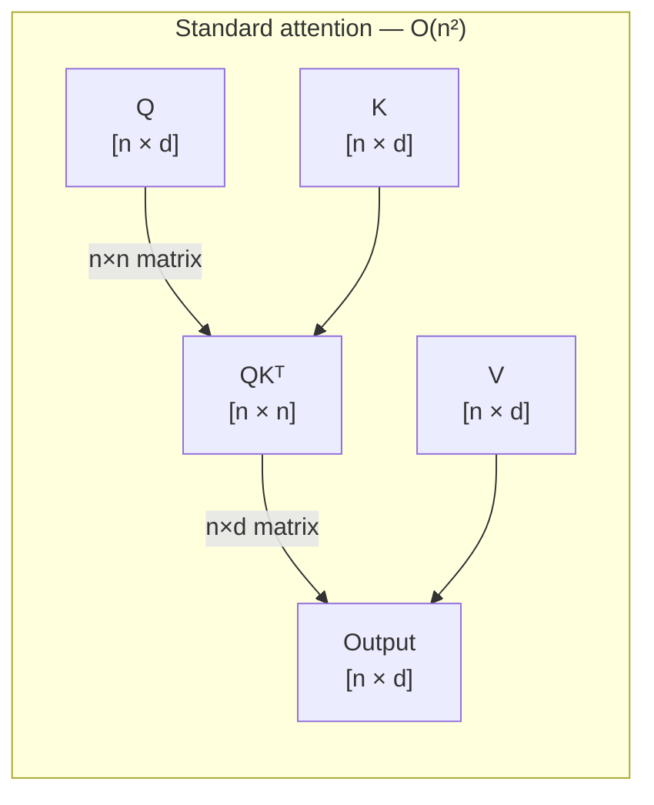
```mermaid
flowchart LR
    subgraph "Standard attention — O(n²)"
        Q_s["Q\n[n × d]"] --"n×n matrix"--> A["QKᵀ\n[n × n]"]
        K_s["K\n[n × d]"] --> A
        A --"n×d matrix"--> O_s["Output\n[n × d]"]
        V_s["V\n[n × d]"] --> O_s
    end
```

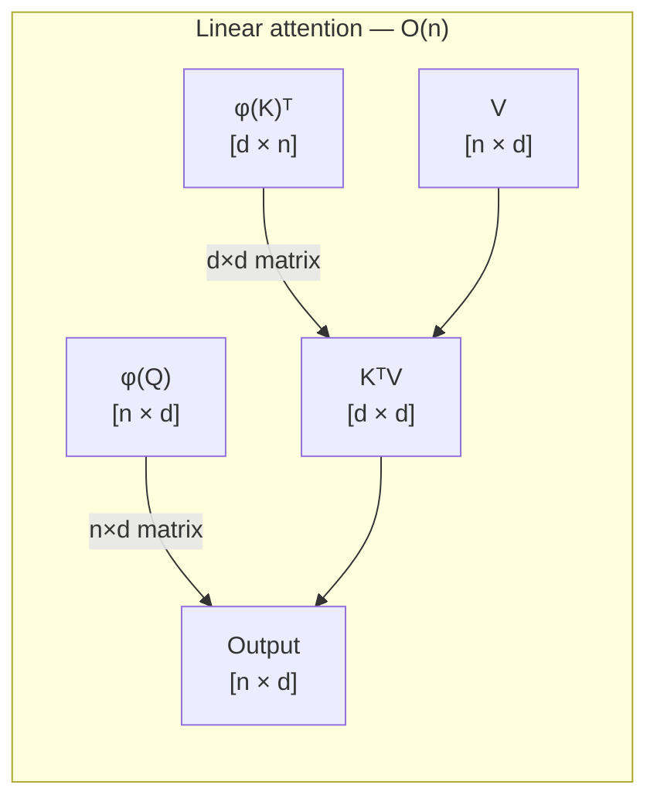
```mermaid
flowchart LR
    subgraph "Linear attention — O(n)"
        K_l["φ(K)ᵀ\n[d × n]"] --"d×d matrix"--> S["KᵀV\n[d × d]"]
        V_l["V\n[n × d]"] --> S
        Q_l["φ(Q)\n[n × d]"] --"n×d matrix"--> O_l["Output\n[n × d]"]
        S --> O_l
    end
```

**KV cache**: No traditional KV cache. During autoregressive inference, the model maintains a **hidden state matrix** `S = Σᵢ φ(kᵢ) · vᵢᵀ` that is updated with each new token. This is an outer product of a d_k-dim key vector and a d_v-dim value vector, so the state is `d_head × d_head` *per head* — constant in sequence length, but note it grows with head dimension, not with context length.

**The architectures that use linear attention**:

- **RWKV** (Receptance Weighted Key Value) — an architecture that reformulates attention as a decaying weighted sum of past keys and values. At inference it runs as a pure RNN: one fixed-size state matrix updated per token, no KV cache growth. 
- **RetNet** (Retentive Network, Microsoft 2023) — uses "retention" instead of attention: each head decays past context by an exponential factor that depends on distance. Supports three modes — parallel (like a transformer, for training), recurrent (like an RNN, for inference), and chunkwise (best of both for long sequences).
- **GLA** (Gated Linear Attention) — linear attention with a learned data-dependent gate that controls how much of the state to carry forward, closing some of the quality gap with softmax attention.

**The fundamental tradeoff**: Linear attention is weaker at **in-context recall**. Softmax attention can sharply focus on a single specific token from thousands of positions away. The hidden state must compress *all* past context into a fixed-size matrix — so older information gets progressively overwritten. RWKV-7 and RetNet narrow this gap considerably, but it remains real on tasks like "What was the name mentioned 20,000 tokens ago?" This is why pure linear attention models haven't replaced transformers in production, but hybrids (a few full-attention layers mixed in) are increasingly common.

**How RWKV differs from Mamba (SSM)**: Both run as O(1)-per-token recurrences during inference, but they work differently. Mamba's state update is **input-dependent** — it decides per token how much of its state to keep or discard based on the current input. RWKV's decay is a **fixed learned value per channel** — the same forgetting rate regardless of what token arrives. Think of Mamba as a selective memory that pays attention to what matters; RWKV as a memory that fades at a steady, pre-set rate. Later RWKV versions (v6/v7) add some input-dependent gating, narrowing this gap.


---

### State Space Models (SSM) / Mamba — Selective Recurrence (2023)

State Space Models take a completely different approach from attention: instead of asking "which past tokens are relevant right now?", they maintain a **fixed-size hidden state** that is updated as each token arrives — like a compressed running summary of everything seen so far. No attention matrix is computed at all.

The core idea comes from control theory: a system with a state `h` that evolves as new inputs `x` arrive:

```
hₜ = A · hₜ₋₁ + B · xₜ     ← update the state with the new token
yₜ = C · hₜ                  ← read the output from the state
```

`A`, `B`, and `C` are learned matrices. At inference, this is a simple recurrence — one matrix multiply per token, constant memory.

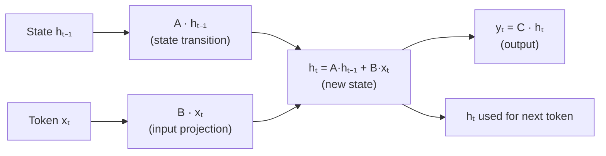
```mermaid
flowchart LR
    X["Token xₜ"] --> B["B · xₜ\n(input projection)"]
    H_prev["State hₜ₋₁"] --> A["A · hₜ₋₁\n(state transition)"]
    A & B --> H_new["hₜ = A·hₜ₋₁ + B·xₜ\n(new state)"]
    H_new --> Y["yₜ = C · hₜ\n(output)"]
    H_new --> H_next["hₜ used for next token"]
```

**What makes Mamba different** ([Gu & Dao, 2023](https://arxiv.org/abs/2312.00752)): In earlier SSMs (like S4), A, B, and C are fixed once trained — the same state update applies to every token regardless of content. Mamba makes them **input-dependent**: for each token, the model computes different B, C, and Δ (a step size) based on what that token is. This "selective" mechanism lets Mamba decide, per token, how much of its current state to carry forward and how strongly to incorporate the new input — similar in spirit to LSTM gates, but much more efficient.

**KV cache**: None — Mamba stores a fixed-size state matrix per layer (the state dimension is a hyperparameter, typically `d_model × d_state`). This doesn't grow with sequence length at all, unlike any attention-based model.

**The tradeoff**: The same as linear attention — compressing all history into a fixed state means the model can forget things. Mamba is much better than naive SSMs at selectively retaining important information, but it still struggles on tasks that require precise retrieval of something specific from far back in the context (\"What was the exact figure from the table on page 3?\").

**Hybrid models**: Because pure Mamba loses on recall tasks where attention excels, the practical answer has been hybrids. **Jamba** (AI21 Labs) interleaves Mamba layers with standard attention layers — most layers are Mamba (cheap, O(1)), with occasional attention layers (expensive but precise). This gives most of the efficiency of SSMs with the recall capability of attention.

**Used by**: Mamba, Mamba-2, Jamba (hybrid with attention), Zamba.

---

### Cross-Attention — Attending Across Sequences (2017+)

All mechanisms above are forms of **self-attention**: Q, K, and V all come from the same sequence. **Cross-attention** breaks this constraint: Q comes from one sequence while K and V come from a *different* sequence.

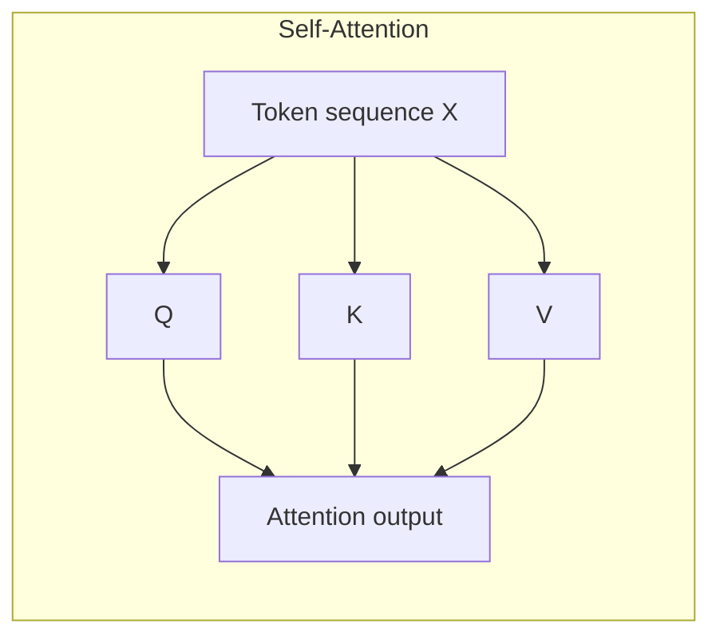
```mermaid
flowchart LR
    subgraph "Self-Attention"
        X_s["Token sequence X"] --> Q_s["Q"]
        X_s --> K_s["K"]
        X_s --> V_s["V"]
        Q_s & K_s & V_s --> A_s["Attention output"]
    end
```

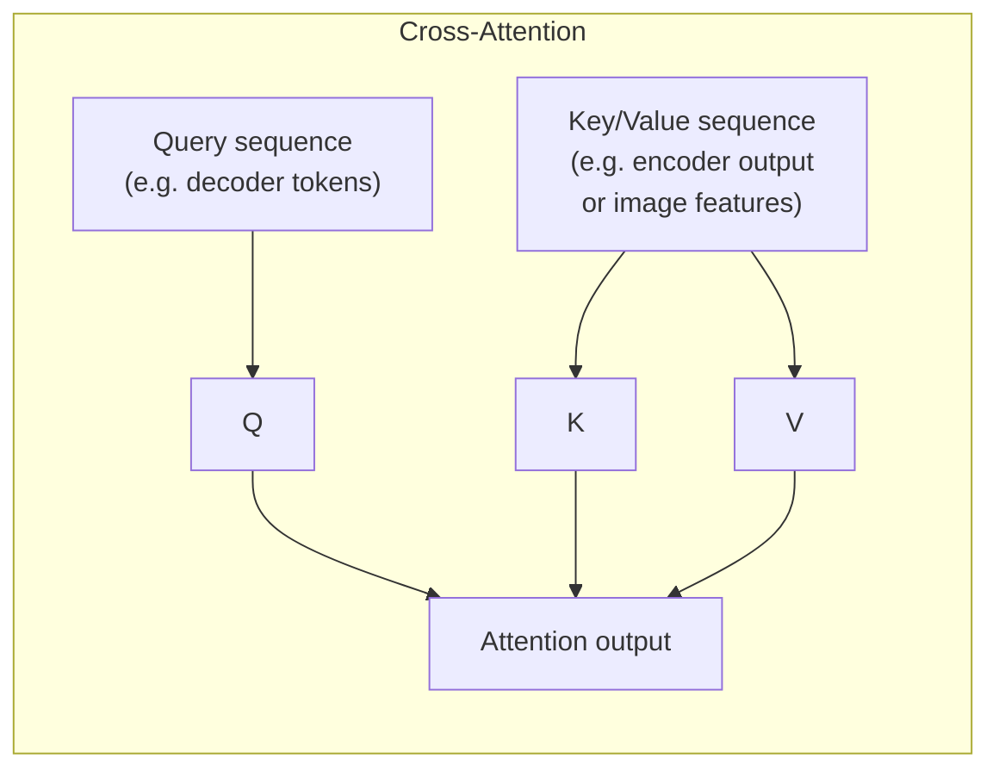
```mermaid
flowchart LR
    subgraph "Cross-Attention"
        X_c["Query sequence\n(e.g. decoder tokens)"] --> Q_c["Q"]
        Y_c["Key/Value sequence\n(e.g. encoder output\nor image features)"] --> K_c["K"]
        Y_c --> V_c["V"]
        Q_c & K_c & V_c --> A_c["Attention output"]
    end
```

**Where it appears**:
- **Encoder-decoder models** (T5, BART, Whisper): The decoder attends to the encoder's output via cross-attention at every decoder layer. Queries are decoder tokens asking "what in the input is relevant to what I'm generating now?"
- **Multimodal models**: The language model's tokens attend to vision encoder outputs (image patches, video frames) via cross-attention layers. This is how LLaVA, Pixtral, and most vision-language models fuse modalities.
- **Audio models**: Whisper uses cross-attention between the text decoder and the mel-spectrogram encoder.

**KV cache for cross-attention**: This is a critically important serving detail. In encoder-decoder models, the encoder output is computed **once** (during prefill) and reused across all decode steps. The cross-attention KV cache is therefore **static** — it doesn't grow as tokens are generated. In contrast, the decoder's self-attention KV cache grows with each output token. This means encoder-decoder models have two separate KV caches with different dynamics.

**Complexity**: O(n_q × n_kv) where query and key/value lengths can differ. For multimodal models, n_kv is the number of image tokens (e.g., 256 patch tokens for a 224×224 image), which is fixed.

---

### Native Sparse Attention (NSA) — Hardware-Aligned Sparsity (2025)

Full attention is O(n²), but most of those n² computations are near-zero — a token rarely needs to attend strongly to every other token. **Sparse attention** aims to only compute the important subset. The challenge is doing this in a way that's actually *faster* on real hardware (not just theoretically).

DeepSeek's NSA ([Feb 2025 paper](https://arxiv.org/abs/2502.11089)) solves this with a three-path hierarchical strategy, each targeting different attention patterns:

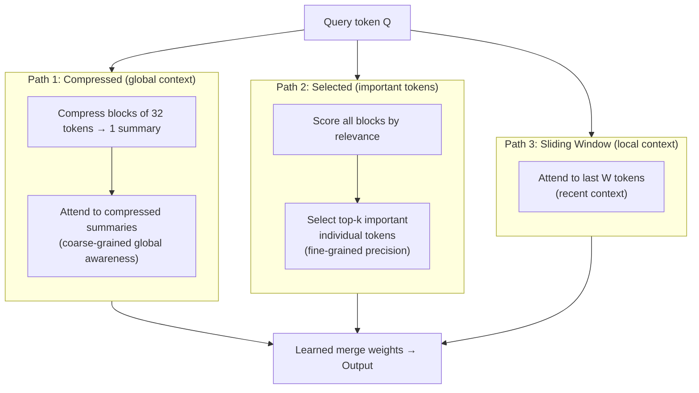
```mermaid
flowchart TB
    Q["Query token Q"] --> P1 & P2 & P3

    subgraph P1["Path 1: Compressed (global context)"]
        direction TB
        Blocks["Compress blocks of 32 tokens → 1 summary"] --> CompAttn["Attend to compressed summaries\n(coarse-grained global awareness)"]
    end

    subgraph P2["Path 2: Selected (important tokens)"]
        direction TB
        Score["Score all blocks by relevance"] --> TopK["Select top-k important\nindividual tokens\n(fine-grained precision)"]
    end

    subgraph P3["Path 3: Sliding Window (local context)"]
        direction TB
        Local["Attend to last W tokens\n(recent context)"]
    end

    P1 & P2 & P3 --> Merge["Learned merge weights → Output"]
```

**What makes it "native"**: Prior sparse attention methods (Longformer, BigBird) were applied as inference-time approximations to models trained with full attention. NSA is **trained from scratch with sparsity** — the model learns what to compress vs select vs window from the beginning. This means sparsity becomes a feature, not a hack: the model develops internal representations that work well with the three-path structure.

**Hardware alignment**: The block sizes and selection granularities are chosen to match GPU memory access patterns (128-byte cache lines, CUDA warp sizes). Random sparse access patterns are catastrophically slow on GPUs — NSA's blocked structure avoids scatter-gather memory access and allows efficient tensor core utilization.

**KV cache**: NSA requires three separate KV caches: compressed summaries (fixed size), selected tokens (fixed budget k), and the local window (fixed size W). Total is sub-linear in sequence length — substantial speedups on 64K+ sequences while maintaining quality comparable to full attention.

**Used by**: A research contribution from DeepSeek (Feb 2025). No confirmed production model has shipped with NSA as of mid-2026, but the hardware-aligned design makes it a strong candidate for future DeepSeek models.

---

### Differential Attention (DiffAttn) — Noise Cancellation (2024)

Standard attention tends to allocate significant attention scores to **irrelevant tokens** — the model is distracted by context that doesn't actually matter. DiffAttn ([Microsoft Research, 2024](https://arxiv.org/abs/2410.05258)) addresses this directly with a noise-cancellation approach: subtract two attention maps to cancel common-mode noise.

```
Standard:   Attn(Q, K, V) = softmax(Q · Kᵀ / √d) · V

DiffAttn:   DiffAttn(Q₁, Q₂, K₁, K₂, V) =
              (softmax(Q₁ · K₁ᵀ / √d) − λ · softmax(Q₂ · K₂ᵀ / √d)) · V
```

The head is split into two halves (Q₁, K₁) and (Q₂, K₂), each computing its own softmax attention map. The second map is subtracted from the first with a learned scalar λ. Because both maps look at the same context, they tend to assign high scores to the same "background" noise tokens — which cancel out. What remains is a sharper, sparser attention pattern focused on genuinely relevant tokens.

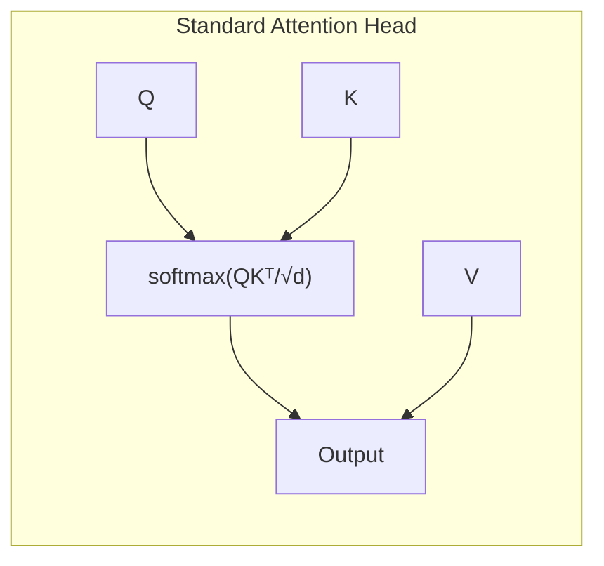
```mermaid
flowchart LR
    subgraph "Standard Attention Head"
        Q1s["Q"] & K1s["K"] --> SM1s["softmax(QKᵀ/√d)"]
        SM1s & V1s["V"] --> O1s["Output"]
    end
```

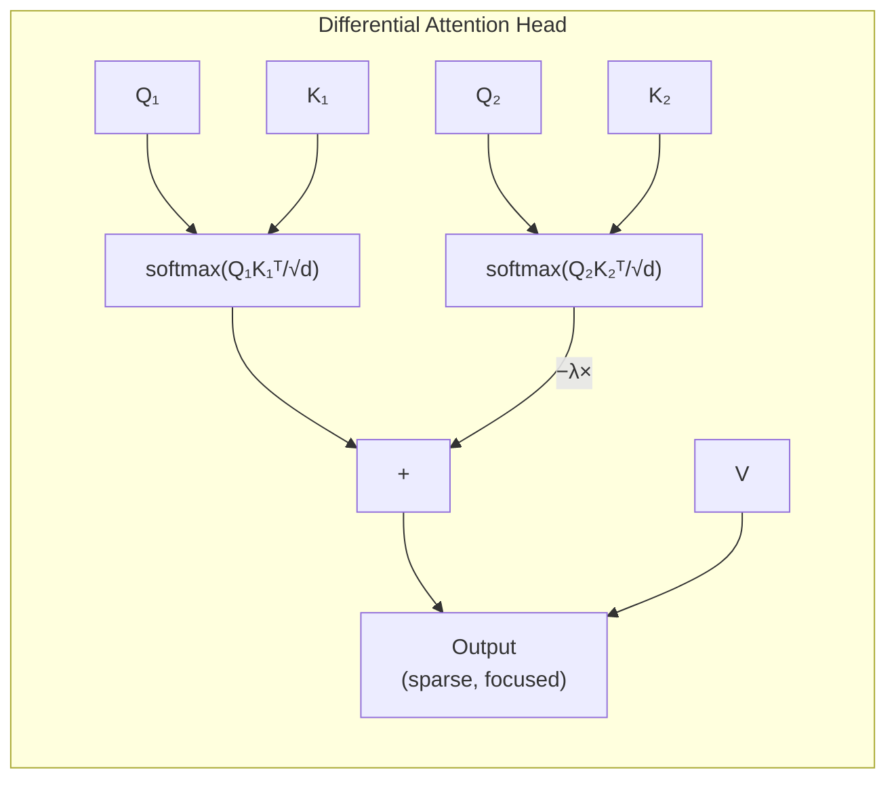
```mermaid
flowchart LR
    subgraph "Differential Attention Head"
        Q1["Q₁"] & K1["K₁"] --> SM1["softmax(Q₁K₁ᵀ/√d)"]
        Q2["Q₂"] & K2["K₂"] --> SM2["softmax(Q₂K₂ᵀ/√d)"]
        SM1 --> Diff["+"]
        SM2 --"−λ×"--> Diff
        Diff & V["V"] --> O["Output\n(sparse, focused)"]
    end
```

**KV cache**: Standard — same as MHA/GQA. DiffAttn is an architectural change to the attention head computation, not to what's stored.

**Benefits**:
- **Reduces hallucination**: Less distraction from irrelevant context means the model is less likely to confuse details across long documents.
- **Better in-context learning**: More robust to the order of examples in the prompt — the "signal" tokens dominate over positional noise.
- **Fewer activation outliers**: Softer activation distributions reduce the precision requirements for quantization.
- **Better long-context retrieval**: Needle-in-a-haystack benchmarks improve significantly.

**The cost**: Each DiffAttn head requires roughly 2× the compute of a standard head (two softmax attention maps). To compensate, DiffAttn models use fewer heads total, keeping the parameter count comparable.

**Status**: Research stage as of 2026 — no major production LLM has shipped DiffAttn as its primary attention mechanism, but the results are compelling enough that it's likely to appear in future architectures.

---

## Combining Strategies: Hybrid Architectures

No production model uses just one strategy. The state of the art is to **combine** multiple attention types across layers.

### The Pattern: Local + Global Alternation

The insight: most attention operations are local — a token mostly needs its recent context. But occasionally, the model needs to reach all the way back to the system prompt or an earlier instruction. So you alternate:

- **Local (sliding window) layers**: Cheap, bounded KV cache. Handle the common case.
- **Global (full attention) layers**: Expensive, unbounded KV cache. Handle long-range dependencies.

The ratio matters enormously for KV cache size:

| Model | Ratio (local:global) | Effect |
|---|---|---|
| Gemma 2 (9B) | 1:1 (alternating) | 50% of layers need full KV |
| Gemma 3/4 | **5:1** | Only ~17% of layers need full KV |
| Mistral | all sliding window | 0% full KV (but limited long-range) |

Going from 1:1 to 5:1 dramatically reduces KV cache for long contexts, which is why Gemma 3/4 can handle 128K+ context on hardware that Gemma 2 couldn't.

---

## KV Cache Management Strategies

The attention mechanism determines *what* gets stored. KV cache management determines *how* it's stored and reused.

### Static Allocation

The naive approach: allocate `max_seq_len × n_layers × n_kv_heads × 2 × d_head` contiguously in GPU memory per request. If `max_seq_len = 128K`, you allocate for 128K tokens even if the actual sequence is 200 tokens. Wastes 60-80% of memory.

### PagedAttention (vLLM)

Treats KV cache like virtual memory: allocates fixed-size pages (e.g., 16 tokens per block) on demand. Pages are freed when requests complete and can be shared across requests with common prefixes. Near-zero waste.

### Automatic Prefix Caching (APC)

When two requests share the same prefix (system prompt + tool definitions), the KV cache for that prefix is computed once and reused. Pages are hashed by their token content — identical prefix blocks hit the cache automatically. Critical for agentic workloads where the system prompt is identical across every turn.

### KV Cache Quantization

Model weights are quantized once (static). KV cache is generated during inference (dynamic) and can also be quantized:

| Method | Compression | Quality Impact |
|---|---|---|
| **FP16** (baseline) | 1× | None |
| **FP8 KV cache** | 2× | <1% degradation on most tasks |
| **INT4 KV cache** | 4× | Noticeable on needle-in-a-haystack |
| **TurboQuant (2-bit)** | 8× | Model-dependent (see below) |

Why is 2-bit KV cache quantization model-dependent? At 2 bits, each KV element can only represent 4 distinct values. Whether that's enough depends on the architecture:
- **Number of KV heads**: More heads = more redundancy. A GQA model with 8 KV heads tolerates quantization better than an MQA model with 1 — errors in one head are compensated by others.
- **Head dimension**: Larger head dimensions (like Gemma 4's 512-dim global heads) have more values to quantize, so the relative error per head is smaller.
- **MLA models**: Already compress KV into a latent. Quantizing on top of MLA compounds two lossy compressions — the model was trained assuming the latent is high-precision.
- **K=V sharing**: When K and V are the same tensor, quantization error is perfectly correlated between them, amplifying the distortion in attention scores.
- **Sliding window layers**: More tolerant because errors only persist for `W` tokens before being discarded. Global layers are more sensitive since errors affect long-range recall permanently.

### KV Cache Eviction

When the KV cache is full and new tokens arrive, something must be evicted:

| Strategy | How It Works | Tradeoff |
|---|---|---|
| **Sliding window** | Drop tokens outside the window | Simple, but loses early context |
| **H2O (Heavy Hitter Oracle)** | Keep tokens with highest cumulative attention scores | Smart eviction, but requires tracking scores |
| **StreamingLLM** | Keep first few tokens ("attention sinks") + recent window | Enables infinite context, but middle context is lost |
| **Scissorhands** | Drop tokens with consistently low attention across heads | Prunes unimportant tokens, keeps key information |

---

## The Full Taxonomy

Here's every major attention/KV strategy in production today, ordered by KV cache efficiency:

| Strategy | KV per Token per Layer | Complexity | Quality vs MHA | Who Uses It |
|---|---|---|---|---|
| **MHA** | `n_heads × d_head × 2` | O(n²) | Baseline | GPT-2/3, BERT, early models |
| **MQA** | `1 × d_head × 2` | O(n²) | ~96-98% | StarCoder, PaLM, Gemma 4 (global) |
| **GQA** | `n_kv_heads × d_head × 2` | O(n²) | ~99% | Llama 2/3, Gemma, Qwen, Mistral |
| **MLA** | `d_latent` (≪ n_kv × d_head) | O(n²) | ~99% | DeepSeek V2/V3/V4 |
| **Sliding Window** | `n_kv_heads × d_head × 2 × W` (fixed) | O(n·W) | Depends on ratio | Mistral, Gemma (local layers) |
| **K=V Sharing** | `n_kv_heads × d_head × 1` | O(n²) | ~98-99% of GQA | Gemma 4 12B (local layers) |
| **Cross-Layer KV Sharing** | amortized across shared layers | O(n²) | Under study | Gemma 4 E4B |
| **Linear / RWKV / RetNet** | Fixed-size `d × d` state | O(n) | Lower on recall tasks | RWKV-7, RetNet, GLA models |
| **Cross-Attention** | Static (encoder output cached once) | O(n_q × n_kv) | N/A (different task) | Whisper, T5, vision-language |
| **Native Sparse Attention** | Sub-linear (compressed + selected + window) | Sub-quadratic | ~= full attention | DeepSeek research (2025) — no confirmed production model yet |
| **Differential Attention** | Same as MHA/GQA | O(n²) | Improved recall/ICL | Research (not yet production) |
| **SSM (no KV cache)** | Fixed-size state | O(n) | Lower on recall tasks | Mamba, Jamba (hybrid) |

Modern architectures combine multiple strategies. Gemma 4 12B uses GQA + MQA + sliding window + K=V sharing simultaneously. DeepSeek V3 uses MLA + MoE. The trend is clear: every new architecture invests more design effort into KV cache reduction, because it's the binding constraint on serving scale.

---

## Case Study: Gemma 4 12B — Dissecting a Real Architecture

Let's look at what Google actually shipped. The following is from the [actual `config.json`](https://huggingface.co/google/gemma-4-12b-it) on HuggingFace:

### The Raw Architecture

| Parameter | Value | What It Means |
|---|---|---|
| `num_hidden_layers` | 48 | 48 transformer layers |
| `num_attention_heads` | 16 | 16 query heads per layer |
| `num_key_value_heads` | 8 | 8 KV heads for sliding window layers (GQA, 2:1 ratio) |
| `num_global_key_value_heads` | 1 | **1 KV head** for full attention layers (MQA!) |
| `head_dim` | 256 | Each head in sliding window layers has 256 dimensions |
| `global_head_dim` | 512 | Each head in full attention layers has 512 dimensions |
| `hidden_size` | 3840 | Model dimension |
| `sliding_window` | 1024 | Local attention sees only the last 1024 tokens |
| `max_position_embeddings` | 262144 | 256K maximum context |
| `attention_k_eq_v` | true | K and V are identical (shared projection) |
| `layer_types` | 40× sliding, 8× full | 5:1 ratio of local to global layers |

### The Layer Pattern

```
Layer  0: sliding_attention  (local, W=1024)
Layer  1: sliding_attention
Layer  2: sliding_attention
Layer  3: sliding_attention
Layer  4: sliding_attention
Layer  5: full_attention     ← GLOBAL (sees all 256K tokens)
Layer  6: sliding_attention
...
Layer 11: full_attention     ← GLOBAL
...
Layer 47: full_attention     ← GLOBAL (8th and final)
```

40 sliding layers + 8 full attention layers = 48 total. The 5:1 ratio means only 17% of layers maintain full-length KV cache.

### What This Means for KV Cache

Here's the concrete memory calculation at 128K context in FP16:

**Sliding window layers (40 layers):**
```
Each layer stores KV for at most 1024 tokens:
40 layers × 8 KV heads × 2 (K+V) × 256 dims × 1024 tokens × 2 bytes
= 40 × 8 × 2 × 256 × 1024 × 2
= 671 MB  (bounded, doesn't grow with context)
```

But wait — `attention_k_eq_v = true` means K and V are the **same tensor** in the 12B model. This deserves explanation because K and V serve *different roles* in standard attention:

In normal attention, K (Key) determines *which* tokens get attended to, and V (Value) determines *what information* flows to the output. They're computed by separate projection matrices: `K = x · W_K` and `V = x · W_V`.

```
Standard:  Attention = softmax(Q · Kᵀ / √d) · V
                       ├── scoring ──────────┤  ├ retrieval ┤
                       K decides the weights     V decides the output

K=V:       Attention = softmax(Q · Kᵀ / √d) · K   ← K replaces V
```

With K=V, there's a single projection `W_KV` and both K and V equal `x · W_KV`. The model is saying: "the representation that makes a token *findable* is the same representation I want to *retrieve* from it." This works because for many tokens, key and value are naturally correlated — the word "Paris" is findable *because* it's about Paris, and the information you want from it is... that it's about Paris. The query heads still provide all the search diversity.

Gemma 4 uses K=V **only on sliding window layers** (1024-token context), where the information is local and K/V overlap is high. The global layers maintain separate K and V with different head configurations. Notably, the smaller E4B model does **not** use K=V (`attention_k_eq_v = false`) — it apparently doesn't have enough capacity to compensate for the information loss.

> **K=V sharing is not free:** forcing Key and Value to share weights reduces the expressiveness of each head. The model must find a single projection that is simultaneously good for *finding* tokens (K's role) and *extracting information* from them (V's role). Gemma 4 compensates by using it only in bounded, local-context layers. For quantised deployments, be aware that K=V sharing can amplify quantisation errors — any rounding noise in the shared KV tensor affects both the attention weights and the output values simultaneously.
{: .prompt-warning }

The result: instead of storing both K and V, you store one tensor. This halves the KV cache for these layers:

```
With K=V: 40 × 8 × 1 × 256 × 1024 × 2 = 335 MB
```

**Full attention layers (8 layers):**
```
Each layer stores KV for ALL tokens (up to 128K):
8 layers × 1 KV head × 2 (K+V) × 512 dims × 128K tokens × 2 bytes
= 8 × 1 × 2 × 512 × 131072 × 2
= 2,147 MB ≈ 2.1 GB
```

**Total KV cache at 128K context: ~2.4 GB**

Compare this to what a hypothetical MHA design would need:
```
48 layers × 16 KV heads × 2 × 256 dims × 128K × 2 bytes = 201 GB
```

> Gemma 4 achieves an **84× reduction** in KV cache versus naive MHA through three combined techniques: GQA (2:1 ratio on local layers), MQA (single KV head on global layers), sliding window (1024 token cap on 83% of layers), and K=V sharing.
{: .prompt-tip }

### The Dual Head Dimension Trick

Notice that sliding window layers use `head_dim = 256` while global layers use `global_head_dim = 512`. Why?

- **Sliding layers** process only 1024 tokens — the attention matrix is small. Larger head dimensions give each head more representational capacity without blowing up memory, since the sequence dimension is bounded.
- **Global layers** process up to 256K tokens — the attention matrix is huge. But they only have 1 KV head (MQA), so the per-head dimension can be large (512) while still keeping total KV cache manageable: `1 head × 512 dims` = 512 values per token, which is much less than `8 heads × 256 dims` = 2048 values for the sliding layers.

This is a deliberate design: allocate representational capacity where it's cheap (bounded-length layers) and be aggressive about compression where it's expensive (unbounded-length layers).

### The Dual RoPE Configuration

**Quick RoPE primer**: Transformers are position-agnostic by default — the self-attention operation treats tokens as a set, not a sequence. Without position information, "the cat sat on the mat" and "mat the on sat cat the" produce the same attention scores. **RoPE** (Rotary Position Embedding) solves this by rotating the Q and K vectors by an angle that depends on their position in the sequence. Token at position 5 gets rotated differently than token at position 500.

The key parameter is **theta (θ)**: it controls the wavelengths of the rotation. A small theta (10,000) creates fast-rotating high-frequency patterns — good for encoding nearby positions precisely. A large theta (1,000,000) creates slow-rotating low-frequency patterns — needed to distinguish positions that are far apart (like position 1 vs position 200,000) without the angles "wrapping around" and aliasing.

```
Position 0:    rotate Q,K by 0°
Position 1:    rotate Q,K by ~0.01° (θ=10K) or ~0.001° (θ=1M)
Position 100K: rotate Q,K by ~1000° (θ=10K, wraps!) or ~100° (θ=1M, fine)
```

With that context, here's Gemma 4's dual configuration:

```json
"rope_parameters": {
  "full_attention": {
    "partial_rotary_factor": 0.25,
    "rope_theta": 1000000.0,
    "rope_type": "proportional"
  },
  "sliding_attention": {
    "rope_theta": 10000.0,
    "rope_type": "default"
  }
}
```

Two different RoPE configurations for the two layer types:
- **Sliding layers**: Standard RoPE with `theta=10000`. Classic, optimized for local patterns. Only needs to encode positions up to 1024 — small theta gives precise nearby-position discrimination.
- **Global layers**: Extended RoPE with `theta=1000000` and `partial_rotary_factor=0.25`. The much higher theta extends the wavelengths to handle 256K positions without aliasing. Only 25% of the head dimension gets rotary encoding (the rest carries no positional information) — this reduces interference between positional and semantic information at extreme context lengths, since most of the head's capacity is devoted to *what* the token means rather than *where* it is.

### Variant Comparison: E4B vs 12B

The Gemma 4 E4B (efficient 4B) uses the same architectural *pattern* but with even more aggressive optimizations:

| Parameter | E4B | 12B |
|---|---|---|
| Layers | 42 | 48 |
| Query heads | 8 | 16 |
| KV heads (local) | 2 | 8 |
| KV heads (global) | null (same as local) | 1 |
| `head_dim` | 256 | 256 |
| `sliding_window` | 512 | 1024 |
| `attention_k_eq_v` | false | true |
| `num_kv_shared_layers` | 18 | 0 |
| `hidden_size` | 2560 | 3840 |

The E4B introduces `num_kv_shared_layers = 18`, meaning **18 consecutive layers share the same KV cache** instead of each computing their own. This is a different KV compression strategy than MLA — instead of compressing the representation, you literally reuse the same K,V tensors across multiple layers. The bet is that adjacent layers attend to similar patterns.


---


## Further Reading

**Foundational**
- [*Attention Is All You Need*](https://arxiv.org/abs/1706.03762) — Original MHA paper (Vaswani et al., 2017)
- [*Fast Transformer Decoding: One Write-Head is All You Need*](https://arxiv.org/abs/1911.02150) — MQA (Shazeer, 2019)
- [*GQA: Training Generalized Multi-Query Transformer Models from Multi-Head Checkpoints*](https://arxiv.org/abs/2305.13245) — GQA (Ainslie et al., 2023)
- [*DeepSeek-V2: A Strong, Economical, and Efficient Mixture-of-Experts Language Model*](https://arxiv.org/abs/2405.04434) — MLA
- [*Gemma 3 Technical Report*](https://arxiv.org/abs/2503.19786) — Sliding window + GQA hybrid architecture

**Linear Attention and Recurrence**
- [*Transformers are RNNs: Fast Autoregressive Transformers with Linear Attention*](https://arxiv.org/abs/2006.16236) — Linear attention (Katharopoulos et al., 2020)
- [*Retentive Network: A Successor to Transformer for Large Language Models*](https://arxiv.org/abs/2307.08621) — RetNet (Sun et al., Microsoft, 2023)
- [*RWKV: Reinventing RNNs for the Transformer Era*](https://arxiv.org/abs/2305.13048) — RWKV v4 (Peng et al., 2023)
- [*Gated Linear Attention Transformers with Hardware-Efficient Training*](https://arxiv.org/abs/2312.06635) — GLA (Yang et al., 2024)

**Sparse and Efficient Attention**
- [*Native Sparse Attention: Hardware-Aligned and Natively Trainable Sparse Attention*](https://arxiv.org/abs/2502.11089) — NSA (DeepSeek, 2025)
- [*Longformer: The Long-Document Transformer*](https://arxiv.org/abs/2004.05150) — Sliding window + global tokens (Beltagy et al., 2020)

**Differential Attention**
- [*Differential Transformer*](https://arxiv.org/abs/2410.05258) — DiffAttn (Ye et al., Microsoft Research, 2024)

**KV Cache Management**
- [*Efficient Memory Management for Large Language Model Serving with PagedAttention*](https://arxiv.org/abs/2309.06180) — PagedAttention (vLLM)
