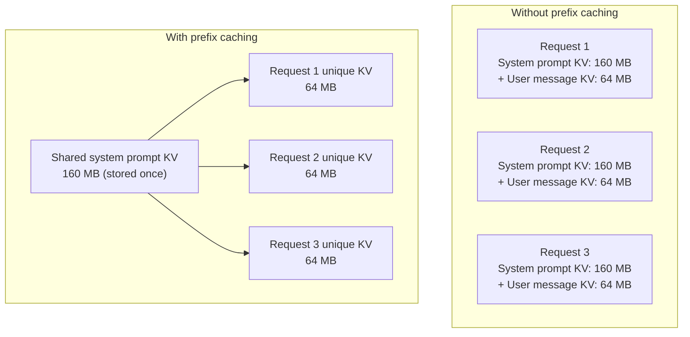

> This article is **Part 4 of 15** in the [Generative AI in Depth](/categories/generative-ai-in-depth/) series.
{: .prompt-info }


Before you can run an LLM, one question matters above all others: **does it fit?** Not approximately — exactly, in bytes, on the specific GPU you have. This article works through that calculation from first principles using Gemma 4 12B as the concrete case study, building directly on the model internals covered in [Inside LLM Inference](/posts/decoder-forward-pass-dimensions).

The answer has three parts: **model weights**, **KV cache**, and **activations**. Each behaves differently and scales differently. Understanding all three tells you not just whether a model fits, but how much room is left for batching and long contexts.

---

## Notation

- **T** — number of tokens in the current context
- **B** — batch size (number of concurrent requests)
- **bytes per element** — depends on the numeric format: BF16 = 2, INT8 = 1, FP8 = 1, INT4 = 0.5

> **@** denotes matrix multiplication throughout this article. All sizes are in bytes unless stated otherwise.
{: .prompt-info }

---

## Part 1: Model Weights

### How many parameters?

From [the forward pass article](/posts/decoder-forward-pass-dimensions), Gemma 4 12B has approximately **11.6 billion parameters** across:

- 1 embedding matrix (shared with LM head): 262,144 × 3,840
- 40 local attention blocks (Q, KV shared, O, FFN, 2× RMSNorm)
- 8 global attention blocks (Q, K, V, O, FFN, 2× RMSNorm)
- 1 final RMSNorm

Each parameter is a floating-point number stored in some numeric format. The format determines the memory cost per parameter:

| Format | Bits per value | Bytes per value | 11.6B params |
|--------|---------------|-----------------|--------------|
| FP32   | 32            | 4               | 46.4 GB      |
| BF16   | 16            | 2               | 23.2 GB      |
| FP8    | 8             | 1               | 11.6 GB      |
| INT8   | 8             | 1               | 11.6 GB      |
| INT4   | 4             | 0.5             | 5.8 GB       |

### Why BF16, not FP16?

Both BF16 and FP16 use 16 bits, so they cost the same in memory. The difference is in how those 16 bits are split:

```
FP16:  1 sign bit · 5 exponent bits · 10 mantissa bits
BF16:  1 sign bit · 8 exponent bits · 7 mantissa bits
```

BF16 has a larger dynamic range (same exponent width as FP32) but lower precision (fewer mantissa bits). For deep learning, the range matters more than the precision: gradients and activations can span many orders of magnitude, which FP16 handles poorly (leading to overflow/underflow). BF16 avoids this without changing memory cost. This is why Google introduced BF16 for TPU training and why it became the default for both training and inference on modern hardware.

FP16 is still common in inference engines (NVIDIA's legacy tooling, some consumer GPUs), but BF16 is the preferred format for inference on A100, H100, and TPUs.

> **FP32 is never used for serving**. Modern LLMs are trained in BF16 or mixed precision and served at BF16, FP8, or quantized formats. See the [quantization primer](/posts/a-quantization-primer) for the trade-offs between INT8, FP8, and INT4.
{: .prompt-info }

**The practical baseline**: Gemma 4 12B at BF16 = **~23.2 GB for weights alone**.

### The multimodal weight overhead

Gemma 4 12B is a multimodal model — it can process images. The text-only transformer accounts for the 11.6B parameters above. The full multimodal model additionally includes:

- **SigLIP vision encoder**: ~400M parameters (~800 MB at BF16)
- **Vision-to-text projector**: small linear layer bridging vision and text embedding spaces

The published parameter count of ~12B includes both components. For memory budgeting, add ~1 GB to the text-only weight cost when running in multimodal mode.

---

## Part 2: KV Cache

The KV cache is where inference memory gets interesting — and where the differences between local and global attention layers in Gemma 4 create a genuinely unusual pattern.

### What is stored per token?

Each token that passes through a layer generates a Key vector and a Value vector, which are stored in the KV cache so that future tokens can attend to them without recomputing.

The size depends entirely on the layer's attention configuration. For Gemma 4 12B:

**Local layers (×40):**
- K and V share one weight matrix (`attention_k_eq_v = true`), so only one tensor is stored
- 8 KV heads × 256 dimensions = 2,048 values per token
- In BF16: 2,048 × 2 bytes = **4,096 bytes = 4 KB per token per local layer**
- Sliding window: only the most recent 1,024 tokens are retained

**Global layers (×8):**
- K and V are separate (standard attention)
- K: 1 KV head × 512 dimensions = 512 values → 1,024 bytes
- V: 1 KV head × 512 dimensions = 512 values → 1,024 bytes
- Total: **2,048 bytes = 2 KB per token per global layer**
- No window: grows with full context up to 262,144 tokens

> The counterintuitive result: local layers cost more KV cache per token (4 KB vs 2 KB) but are bounded to 1,024 tokens. Global layers are cheaper per token but grow unboundedly with context length.
{: .prompt-info }

### KV cache formula

```
KV cache (local, BF16) = 40 layers × min(T, 1024) tokens × 4,096 bytes
KV cache (global, BF16) =  8 layers × T tokens        × 2,048 bytes
```

### KV cache at common context lengths (BF16, single request)

| Context length (T) | Local KV cache | Global KV cache | Total KV |
|--------------------|---------------|-----------------|----------|
| 1,024 tokens       | 160 MB        | 16 MB           | 176 MB   |
| 4,096 tokens       | 160 MB        | 64 MB           | 224 MB   |
| 32,768 tokens      | 160 MB        | 512 MB          | 672 MB   |
| 131,072 tokens     | 160 MB        | 2,048 MB        | 2.2 GB   |
| 262,144 tokens     | 160 MB        | 4,096 MB        | 4.2 GB   |

Notice that local KV cache **saturates at 160 MB** regardless of context length — the sliding window ensures the local cache never grows beyond 1,024 tokens. All context growth cost falls on the 8 global layers.

### KV cache quantization

> **KV cache quantization is independent of weight quantization.** You can serve BF16 weights with INT8 KV cache, or FP8 weights with BF16 KV cache. Each is a separate knob. INT8 KV cache (`--kv-cache-dtype int8` in vLLM) approximately **doubles concurrent request capacity** with minimal quality loss — it's one of the highest-leverage, lowest-risk optimisations for production serving.
{: .prompt-tip }

The KV cache does not have to be stored at the same precision as the weights. Because the KV cache is read many times (once per decode step, for every request in the batch) rather than once per request startup, it benefits strongly from quantization:

- **INT8 KV cache**: halves KV cache memory with minimal quality impact. The quantization happens per-head or per-token, preserving relative magnitudes. At T=4K, total KV shrinks from 224 MB to 112 MB per request.
- **FP8 KV cache**: similar savings to INT8. Supported natively in vLLM from v0.6+.
- **INT4 KV cache**: more aggressive, used in some production deployments but can degrade quality on attention-heavy tasks.

With INT8 KV cache on a single A100 (53.8 GB available):
```
KV cache per request at 4K context: 224 MB / 2 = 112 MB (INT8 vs BF16)
Concurrent requests: 53.8 GB / 0.112 GB ≈ 480   (vs 240 at BF16)
```

Halving KV precision approximately doubles the serving capacity — a large gain for a modest quality cost.

### Prefix caching: eliminating duplicate KV computation

> If your deployment uses a system prompt, **enable prefix caching** in your serving framework. vLLM enables it with `--enable-prefix-caching`; SGLang enables it by default. For a 1K-token system prompt serving 100 concurrent users, prefix caching can free ~17 GB of KV cache memory — room for dozens of additional concurrent requests at no hardware cost.
{: .prompt-tip }

Many LLM deployments send the same system prompt at the start of every request. Without prefix caching, every request recomputes and stores the KV cache for that system prompt from scratch. With **prefix caching** (also called prompt caching), the KV cache for the shared prefix is computed once and reused across all requests.



For a 1,024-token system prompt with Gemma 4 12B:
```
System prompt KV cache = 40 local layers × 1024 tokens × 4 KB + 8 global layers × 1024 tokens × 2 KB
                       = 160 MB + 16 MB = 176 MB per request without caching

With prefix caching serving 100 concurrent requests:
  Without: 100 × 176 MB = 17.6 GB allocated to system prompt alone
  With:    1 × 176 MB = 176 MB allocated (shared)
  Savings: 17.4 GB → room for ~78 more concurrent requests
```

Prefix caching is standard in vLLM (automatic prefix caching, enabled by default), SGLang (RadixAttention), and TensorRT-LLM. It requires PagedAttention to work efficiently, since shared blocks must be reference-counted rather than owned by a single request.

---

## Part 3: Activations

Activations are the intermediate tensors produced during the forward pass — the hidden states between layers. For inference, these are tiny compared to weights and KV cache.

### Decode step (T = 1 per request)

At each decode step, only one token is processed. The largest intermediate tensors are:

```
After embedding:      [1 × 3,840]  = 7,680 bytes  ≈  0.007 MB
After FFN (expand):   [1 × 15,360] = 30,720 bytes ≈  0.03 MB
Per request, per layer:             < 0.1 MB total
48 layers, 1 request:               < 5 MB
```

Even with a batch of 100 concurrent requests, activations total less than 500 MB — a rounding error compared to weights and KV cache.

### Prefill (T = full prompt length)

During prefill, all T tokens are processed in parallel:

```
Batch B, prompt length T:
  hidden state at any layer: [B × T × 3,840] floats
  FFN expand intermediate:   [B × T × 15,360] floats
```

For B=1, T=4,096 this is:
```
hidden state: 1 × 4,096 × 3,840 × 2 bytes = 31.5 MB
FFN expand:   1 × 4,096 × 15,360 × 2 bytes = 126 MB
```

Still manageable. Large batches with long prompts are where activation memory starts to matter.

FlashAttention further reduces activation memory during prefill by never materialising the full `[T × T]` attention score matrix — see [CUDA Kernels and FlashAttention](/posts/cuda-kernels-and-flashattention) for the details.

> **Activation memory during training** is an entirely different story. The backward pass must retain intermediate activations from the entire forward pass to compute gradients. A 4K-token training batch can require tens of gigabytes of activations alone — covered in the [Training vs Inference](/posts/training-vs-inference) article.
{: .prompt-info }

---

## Part 4: Putting It Together

### Total memory formula (inference)

```
Total = weights + KV cache + activations + framework overhead

≈ weights + KV cache              (activations negligible for inference)
```

With a small fixed overhead for the serving framework, CUDA context, and page tables (~2–4 GB), the practical formula is:

```
GPU memory needed ≈ weights + (B × KV cache per request) + ~3 GB overhead
```

### Fitting Gemma 4 12B on common GPUs

**A10G (24 GB VRAM):**

> **BF16 Gemma 4 12B does not fit on an A10G** — 23.2 GB weights + 2 GB overhead already exceeds the card's 24 GB. You must use INT8 or FP8 weights to serve this model on an A10G or any 24 GB consumer GPU (RTX 3090, RTX 4090 also have 24 GB).
{: .prompt-warning }

```
BF16 weights:    23.2 GB
Overhead:         2.0 GB
Available for KV: -1.2 GB  ← does not fit!
```

BF16 Gemma 4 12B does not fit on an A10G. At INT8 or FP8:

```
INT8 weights:    11.6 GB
Overhead:         2.0 GB
Available for KV: 10.4 GB  → handles ~46 concurrent requests at 4K context (BF16 KV)
                            → handles ~92 concurrent requests at 4K context (INT8 KV)
```

**A100 80GB:**

```
BF16 weights:    23.2 GB
Overhead:         3.0 GB
Available for KV: 53.8 GB

At 4K context per request (224 MB KV each):
53.8 GB / 0.224 GB ≈ 240 concurrent requests (BF16 KV)
53.8 GB / 0.112 GB ≈ 480 concurrent requests (INT8 KV)
```

**H100 80GB SXM:**

Same memory capacity as A100 80GB but ~3.35 TB/s memory bandwidth vs 2 TB/s — the same number of concurrent request slots, but each step is served ~67% faster. For latency-sensitive workloads this matters more than capacity.

H100 also adds native FP8 tensor cores, enabling FP8 weights without emulation:

```
FP8 weights:    11.6 GB
Overhead:         3.0 GB
Available for KV: 65.4 GB → ~290 concurrent requests at 4K context (BF16 KV)
                           → ~580 concurrent requests at 4K context (INT8 KV)
```

**Two A100 80GB (tensor parallel):**

```
Weights per GPU:   11.6 GB  (each GPU holds half the model)
Overhead:           3.0 GB
Available for KV:  65.4 GB per GPU

At 4K context, across both GPUs:
(65.4 + 65.4) GB / 0.224 GB ≈ 584 concurrent requests (BF16 KV)
```

### Summary table: Gemma 4 12B serving

| GPU | Precision | KV dtype | Fits? | Concurrent (4K ctx) |
|-----|-----------|----------|-------|---------------------|
| A10G 24 GB | BF16 | BF16 | ✗ | — |
| A10G 24 GB | INT8 | BF16 | ✓ | ~46 |
| A10G 24 GB | INT8 | INT8 | ✓ | ~92 |
| A100 80 GB | BF16 | BF16 | ✓ | ~240 |
| A100 80 GB | BF16 | INT8 | ✓ | ~480 |
| A100 80 GB | FP8 | INT8 | ✓ | ~530 |
| H100 80 GB | BF16 | BF16 | ✓ | ~240 (but 1.67× faster) |
| H100 80 GB | FP8 | INT8 | ✓ | ~580 |
| 2× A100 80 GB | BF16 | BF16 | ✓ | ~584 |

---

## Part 5: The KV Cache Scaling Problem

KV cache scales with **B × T** — both the number of concurrent requests and the context length. This creates a hard trade-off: longer contexts mean fewer concurrent requests for a fixed GPU budget.

### Memory budget as a dial

```
Fixed GPU budget (e.g., 53.8 GB on a single A100, BF16 weights, BF16 KV):

T = 4K context:   53.8 / 0.224 ≈ 240 requests
T = 32K context:  53.8 / 0.672 ≈  80 requests
T = 131K context: 53.8 / 2.200 ≈  24 requests
T = 256K context: 53.8 / 4.200 ≈  13 requests
```

This is why long-context models are so expensive to serve at scale: every doubling of context length roughly halves the number of concurrent requests you can handle.

With INT8 KV cache, the same budget handles roughly twice the concurrent requests at each context length. For providers offering 128K-context APIs, KV quantization is essentially mandatory for economic viability.

### Why PagedAttention matters

Pre-allocating KV cache for the maximum context length per request is extremely wasteful — most requests finish long before they reach that limit. PagedAttention (used in vLLM) solves this by allocating KV cache in fixed-size pages, only when each page is actually needed, and releasing pages immediately when a request completes. This dramatically improves actual GPU utilisation. Covered in detail in [LLM Serving in Depth](/posts/llm-serving-in-depth).

### Multi-GPU KV cache

When serving across multiple GPUs with tensor parallelism, the KV cache is also split. Each GPU holds the KV data for the attention heads it owns:

```
2-way tensor parallelism, Gemma 4 12B local layer:
  GPU 0: KV for heads 0–3  (4 of 8 KV heads)
  GPU 1: KV for heads 4–7  (4 of 8 KV heads)

KV per GPU per token per local layer: 4 × 256 × 2 bytes = 2,048 bytes
  (4 KV heads × 256 dims × 2 bytes BF16; K=V share one tensor so no double-counting)
```

Total KV cache cost per request is unchanged — it's just split across GPUs. Each GPU's available KV memory is doubled compared to the single-GPU case, directly doubling concurrent request capacity as we showed earlier.

---

## Part 6: Format Comparison Summary

```
Gemma 4 12B on a single A100 80 GB (BF16 weights):

Format  | Weights  | KV cache budget | Max concurrent (4K ctx, BF16 KV)
--------|----------|-----------------|---------------------------------
BF16    | 23.2 GB  | 53.8 GB         | ~240
FP8     | 11.6 GB  | 65.4 GB         | ~292
INT4    |  5.8 GB  | 71.2 GB         | ~318

With INT8 KV cache:
BF16    | 23.2 GB  | 53.8 GB         | ~480
FP8     | 11.6 GB  | 65.4 GB         | ~584
```

The compounding effect of weight quantization + KV quantization is significant: switching from BF16 weights + BF16 KV to FP8 weights + INT8 KV more than doubles concurrent request capacity on the same hardware.

For most production serving, FP8 weights + INT8 KV hits the best balance: ~2× capacity versus the BF16 baseline, with very small quality loss on modern hardware with native FP8 tensor cores (H100).

---

## Key Takeaways

- **Weights dominate at rest**: at BF16, 11.6B parameters = 23.2 GB, a fixed cost regardless of batch size or context length
- **KV cache is the variable cost**: scales linearly with B × T; the dominant constraint for long-context serving
- **BF16 over FP16**: same memory cost, larger dynamic range — the default format for modern serving
- **Gemma 4 12B's local/global attention split** creates a natural cap on local KV cache (160 MB max) — all context scaling cost lands on the 8 global layers
- **KV cache quantization (INT8) doubles serving capacity** with minimal quality loss — a high-leverage optimisation
- **Prefix caching eliminates redundant system prompt KV** for multi-turn or template-based deployments — can free tens of GB at scale
- **Activations are negligible for inference** — under 1 GB even for large batches; irrelevant compared to weights and KV cache
- **Two levers compound**: halving weight size (BF16 → INT8) and halving KV size together can 4× the concurrent request capacity on fixed hardware

---

## Further Reading

- [Inside LLM Inference: Every Calculation from Text to Token](/posts/decoder-forward-pass-dimensions) — where the KV cache shapes in this article come from
- [A Quantization Primer](/posts/a-quantization-primer) — formats and their quality trade-offs in detail
- [LLM Serving in Depth](/posts/llm-serving-in-depth) — PagedAttention, continuous batching, and prefix caching
- [CUDA Kernels and FlashAttention](/posts/cuda-kernels-and-flashattention) — why memory bandwidth (not compute) is the bottleneck
- [Training vs Inference](/posts/training-vs-inference) — how training memory dwarfs inference memory for the same model
