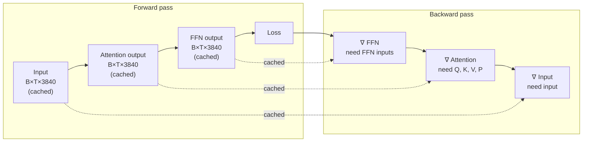
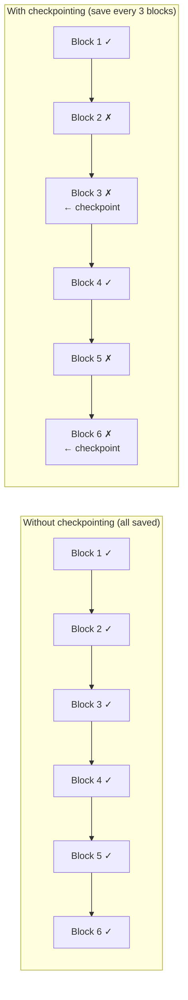

> This article is **Part 5 of 15** in the [Generative AI in Depth](/categories/Generative AI in Depth/) series.
{: .prompt-info }


You can run Gemma 4 12B inference on a single A100 with 23 GB to spare. Training the same model requires at least four A100s. The model is identical — the difference is entirely in what the GPU must hold during training vs during inference.

This article traces exactly why: the backward pass, gradient storage, optimizer state, activation memory, and the techniques that make training feasible at all. All numbers use Gemma 4 12B as the reference, building on the memory analysis from [The Memory Math](/posts/llm-memory-math).

---

## The Forward Pass (Shared)

Both training and inference start identically: the model reads its weights, runs them on input tokens, and produces output logits. The [forward pass article](/posts/decoder-forward-pass-dimensions) covers this in detail.

For Gemma 4 12B: ~11.6B parameters, ~23.2 GB at BF16.

**Inference stops here.** Sample a token. Discard the activations. Done.

**Training continues.** The output logits are compared to the target tokens (the next token in the training sequence), a loss is computed (cross-entropy), and the loss is propagated backwards through the entire computational graph to compute gradients for every weight.

---

## The Backward Pass: Chain Rule Through Every Layer

The backward pass computes the gradient of the loss with respect to every parameter using the chain rule. For any matrix multiply `Y = X @ W`:

```
Forward:   Y = X @ W                             (we computed and stored this)
Backward:  ∂L/∂W = Xᵀ @ (∂L/∂Y)               (gradient for the weight)
           ∂L/∂X = (∂L/∂Y) @ Wᵀ               (gradient to pass to previous layer)
```

To compute `∂L/∂W`, you need **X** — the input to that layer during the forward pass. This means the backward pass must have access to every layer's input activations from the forward pass.

Walking through one transformer block backward (in reverse order of the forward pass):

| Step (forward order) | Backward step | Activations needed |
|---|---|---|
| 1. RMSNorm | 7. ∂L/∂RMSNorm_scale | x_pre_norm |
| 2. Q/K/V projection | 6. ∂L/∂W_Q, W_K, W_V | pre-projection input |
| 3. Attention | 5. ∂L/∂Q, ∂L/∂K, ∂L/∂V | Q, K, V, attention weights P |
| 4. O projection | 4. ∂L/∂W_O | attention output |
| 5. Residual add | 3. gradient passes through | — |
| 6. FFN gate/up/down | 2. ∂L/∂W_gate, W_up, W_down | x_pre_ffn, gate, up pre-activations |
| 7. Residual add | 1. gradient passes through | — |

The dashed arrows show which cached activations each backward step requires:



This is the core memory problem: **all intermediate activations must be retained until their corresponding backward pass step**.

---

## Activation Memory

### What is an "activation"?

Every intermediate tensor produced during the forward pass is an activation: the hidden state after each layer, the expanded FFN intermediate, the attention score matrix, the softmax probabilities, the pre-projection inputs. All of these are needed by at least one backward pass step.

For one local decoder block during training, the tensors that must be retained (at minimum) are:

```
Input to block (x):          [B × T × 3840]    needed for ∂L/∂W_norm, ∂L/∂W_Q...
Q before RoPE:               [B × T × 4096]    needed for ∂L/∂W_Q = x^T @ ∂L/∂Q
K before RoPE:               [B × T × 2048]    needed for ∂L/∂W_K
V:                           [B × T × 2048]    needed for ∂L/∂W_V
Attention scores P:          [B × T × T × 16]  needed for ∂L/∂(softmax)
Attention output:            [B × T × 4096]    needed for ∂L/∂W_O
FFN gate pre-activation:     [B × T × 15360]   needed for ∂L/∂W_gate
FFN up pre-activation:       [B × T × 15360]   needed for ∂L/∂W_up
```

### Activation memory estimate

For Gemma 4 12B with B=1, T=512 tokens (a modest training sequence length), one local block:

```
Input:                1 × 512 × 3840 × 2 bytes  =   3.9 MB
Q (pre-RoPE):         1 × 512 × 4096 × 2 bytes  =   4.2 MB
K+V:                  1 × 512 × 2048 × 2 × 2    =   4.2 MB (K and V share matrix but both stored)
Attention P:          1 × 512 × 512 × 16 × 2    =   4.2 MB (T×T per head, local window)
FFN gate+up:          2 × 1 × 512 × 15360 × 2   =  31.5 MB
Subtotal per block:                              ≈  48 MB

40 local blocks:                                  ≈ 1,920 MB
8 global blocks (larger T for attention P):       ≈ 500 MB
Total activations (B=1, T=512):                  ≈ 2,420 MB ≈ 2.4 GB
```

This scales linearly with B and T. At B=8, T=2048:

```
Activations: 8 × (2048/512) × 2.4 GB = 38.4 GB
```

At 38 GB of activations alone, plus 23.2 GB of weights — we're already over the 80 GB limit of a single A100 before counting gradients and optimizer state.

---

## Gradient Storage

During the backward pass, the gradient of the loss with respect to every weight is computed and stored. Each gradient has the same shape as its corresponding weight.

In mixed precision training, gradients are accumulated in FP32 (even when weights are in BF16) to avoid numerical precision loss during accumulation of many small values:

```
∂L/∂W for all 11.6B parameters (FP32): 11.6B × 4 bytes = 46.4 GB
```

This is double the BF16 weight cost. The reason for keeping gradients in FP32:

Gradients are typically very small values (on the order of 1e-4 to 1e-7). When many gradients are summed (as happens with large batch sizes or gradient accumulation), the numerical errors from BF16's limited mantissa (7 bits, giving precision of ~1/128 = 0.78%) compound. FP32 (24 mantissa bits) avoids this.

---

## Optimizer State

Once gradients are computed, they are used by the optimizer to update the weights. The most common optimizer for LLM training is **Adam** (Kingma & Ba, 2014) or its variant **AdamW** (adds weight decay).

Adam maintains two additional vectors per weight:

```
mₜ = β₁ × mₜ₋₁ + (1 - β₁) × gₜ        (first moment: EMA of gradients)
vₜ = β₂ × vₜ₋₁ + (1 - β₂) × gₜ²       (second moment: EMA of squared gradients)

Weight update: θₜ = θₜ₋₁ - α × m̂ₜ / (√v̂ₜ + ε)
```

Where β₁=0.9, β₂=0.999 are typical values. The second moment `v` effectively tracks a per-parameter learning rate — parameters with consistently large gradients get smaller updates, preventing unstable oscillation.

Both `m` and `v` are kept in **FP32** for numerical stability, and are the same size as the weights:

```
Adam m (FP32): 11.6B × 4 bytes = 46.4 GB
Adam v (FP32): 11.6B × 4 bytes = 46.4 GB
```

### Full training memory breakdown

```
Gemma 4 12B — BF16 training, Adam, B=1, T=512, no checkpointing:

BF16 working weights:          23.2 GB
FP32 gradients:                46.4 GB
Adam m (FP32):                 46.4 GB
Adam v (FP32):                 46.4 GB
Activations (B=1, T=512):      2.4 GB
                               ─────────
Total:                        164.8 GB  → requires 3× A100 80GB minimum
```

For a useful training batch (B=8, T=2048):

```
Activations (B=8, T=2048):    38.4 GB
Other components:             162.4 GB
Total:                       ~200 GB   → requires 3–4× A100 80GB minimum (without checkpointing)
```

This is why the rule of thumb is that training requires roughly **6–10× more GPU memory than inference** for the same model at a minimal batch size.

> The 6–10× rule: inference for Gemma 4 12B needs ~24 GB (BF16 weights + overhead); full training at B=1, T=512 needs ~165 GB. At B=8, T=2048, it's ~200 GB. The multiplier grows with batch size because activations scale with B×T while weights, gradients, and optimiser states are fixed.
{: .prompt-info }

---

## Gradient Checkpointing

Gradient checkpointing (also called activation recomputation) is the primary technique to reduce activation memory. Instead of storing all activations during the forward pass, only a subset of **checkpoint** activations are saved. The rest are recomputed from the nearest checkpoint during the backward pass when needed.



During the backward pass through blocks 5 and 6, the framework recomputes the block 3 → 5 forward pass to recover the activations needed for the backward steps.

**The trade-off**: activation memory is reduced by a factor of √N for full gradient checkpointing (save every √N layers). For Gemma 4 12B with 48 blocks, saving every ~7 layers:

```
Checkpointed activations (B=8, T=2048): 38.4 GB / 7 ≈ 5.5 GB
Recompute overhead: ~33% extra compute (roughly one additional forward pass)
```

With gradient checkpointing, the full training memory becomes:

```
BF16 working weights:          23.2 GB
FP32 gradients:                46.4 GB
Adam m + v (FP32):             92.8 GB
Activations (checkpointed):     5.5 GB
Total:                        167.9 GB → still 3× A100 80GB
```

The checkpointing doesn't reduce the optimizer state — that's fixed regardless of batch size or sequence length. But for very large batches or long sequences, it makes activation memory manageable.

**Selective gradient checkpointing** is a more targeted approach: rather than checkpointing uniformly, checkpoint only the most memory-intensive activations (typically the FFN expand tensors `[B×T×15360]`) and retain cheaper ones (the hidden states `[B×T×3840]`). This recovers most of the memory savings with less compute overhead than full checkpointing.

---

## Distributing Training Across GPUs

The Gemma 4 12B training memory (167–200 GB) doesn't fit on any single GPU. Three main strategies split the work:

### Data Parallelism

Each GPU holds a **full copy of the model** and processes a different subset of the training batch. After each backward pass, gradients are averaged across all GPUs via AllReduce before the weight update.

```
4× A100 (data parallel):
  Each GPU: full model (164 GB) + activations for B/4 batch
  Communication: AllReduce on 46.4 GB of FP32 gradients per step
  Total memory per GPU: ~167 GB ← still doesn't fit on an 80 GB GPU!
```

Data parallelism doesn't help with the memory problem — each GPU must hold the full model. It only scales throughput (more data processed per step).

### ZeRO: Sharding Optimizer State

**ZeRO** (Zero Redundancy Optimizer, Rajbhandari et al., 2020) partitions the optimizer state, gradients, and (optionally) weights across GPUs in data-parallel training:

| ZeRO Stage | What is sharded | Per-GPU optimizer state | Per-GPU total (approx.) |
|---|---|---|---|
| **None (DP)** | Nothing | 92.8 GB (full m+v) | ~167 GB — doesn’t fit |
| **ZeRO-1** | Optimizer state (m, v) | 23.2 GB (1/4) | ~93 GB — fits on 2× 80 GB |
| **ZeRO-2** | + Gradients | 23.2 GB | ~58 GB + activations |
| **ZeRO-3** | + Model weights | 23.2 GB | ~40 GB + activations ✔ |

ZeRO-3 comes with communication overhead: to run a layer forward, the GPU must gather (AllGather) the weights for that layer from other GPUs, then discard them after use. This adds communication proportional to weight size per layer — acceptable on NVLink, slower on InfiniBand.

### FSDP: PyTorch's ZeRO-3

**FSDP** (Fully Sharded Data Parallel), integrated into PyTorch natively, implements ZeRO-3 semantics with native support for mixed precision and gradient checkpointing. It's the primary tool for training large models in PyTorch without DeepSpeed.

For Gemma 4 12B on 4× A100 80GB with FSDP + ZeRO-3 + gradient checkpointing:
```
Weights per GPU:          5.8 GB (1/4)
Gradients per GPU:       11.6 GB (1/4, FP32)
Optimizer state per GPU: 23.2 GB (1/4, FP32 m+v combined)
Activations (B=2, T=1024, ckpt): ~1.5 GB
Overhead:                 3.0 GB
Total per GPU:           ~45 GB ← fits on A100 80GB ✓
```

---

## Mixed Precision Training

> **Mixed precision training does NOT save total memory** — it uses *more* total memory than pure FP32 training (208.8 GB vs ~185 GB). The phrase "mixed precision saves memory" refers only to **activation memory** (BF16 activations take half the space of FP32 activations). The speed benefit (2× faster BF16 tensor cores) is the real reason to use it.
{: .prompt-warning }

Modern LLM training uses **mixed precision**: weights and activations in BF16 (fast, low memory), but master weights and optimizer state in FP32 (stable updates).

```
Working weights (BF16):   23.2 GB   ← used in forward/backward pass
Master weights (FP32):    46.4 GB   ← used for weight updates (kept in sync)
Gradients (FP32):         46.4 GB
Adam m (FP32):            46.4 GB
Adam v (FP32):            46.4 GB
                          ─────────
Total (no activations):  208.8 GB
```

Wait — mixed precision uses *more* memory than FP32-only training would! The "mixed precision saves memory" claim refers specifically to **activations and FFN intermediate tensors** — at BF16, the `[B×T×15360]` FFN tensors cost half what they would in FP32. The overall system memory is higher because of the master weight copy.

The benefit of mixed precision is speed, not memory: BF16 tensor cores operate ~2× faster than FP32 on A100, and BF16 activations halve activation memory. For a fair comparison:

```
FP32-only training:   4 bytes × N params × (weights + grads + opt)
                    = 4 × 11.6B × (1 + 1 + 2) = 185 GB

Mixed precision:      working weights BF16 + master FP32 + grads FP32 + opt FP32
                    = 23.2 + 46.4 + 46.4 + 92.8 = 208.8 GB (more total, but faster compute)
```

Mixed precision training is a speed optimisation that comes with a memory cost — it's worth it because the compute gain (2×) far exceeds the memory penalty.

---

## Model FLOPs Utilisation (MFU)

How do you know if your training job is running efficiently? The standard metric is **MFU (Model FLOPs Utilisation)**: the fraction of the GPU's peak theoretical compute that is actually being used productively.

```
MFU = (actual training throughput in FLOP/s) / (peak GPU FLOP/s)
```

For Gemma 4 12B training on A100 (312 TFLOPS BF16 peak):
```
FLOPs per forward+backward pass ≈ 6 × 11.6B × T (tokens)
  (factor 6: 2 for forward matmul + 2 for backward ∂W + 2 for backward ∂X, approximately)

At T=1024, batch=8:
  FLOPs per step ≈ 6 × 11.6B × 8,192 = 570 × 10¹² FLOPs

If step takes 2 seconds:
  Actual throughput = 570 × 10¹² / 2 = 285 TFLOPS
  MFU = 285 / 312 = 91%   (excellent!)
```

Well-optimised distributed training of large LLMs achieves 40–60% MFU on A100 with FSDP and gradient checkpointing. The remaining overhead comes from:
- AllReduce/AllGather communication between GPUs
- Gradient checkpointing recomputation
- Data loading
- Activation checkpointing

MFU above 50% is generally considered good for distributed training. Single-GPU training without communication overhead often achieves 60–75% MFU.

---

## LoRA: Fine-Tuning Without Full Training Memory

For adapting a pre-trained model to a new task, **LoRA** (Low-Rank Adaptation, Hu et al., 2021) offers a far cheaper alternative to full training.

Instead of updating all 11.6B parameters, LoRA freezes the pre-trained weights and adds small low-rank adapter matrices to specific layers:

```
W_adapted = W_pretrained + (A @ B)
                            ↑
                    A: [d_model × r]   (small)
                    B: [r × d_model]   (small)
                    r = rank, typically 8–64
```

Only A and B are trained (and their gradients and optimizer states). For rank=16, applied to Q, K, V, and O projections in all 48 layers:

```
LoRA parameters:
  4 matrices × 48 layers × 2 × (3840 × 16) parameters ≈ 23.6M parameters

LoRA training memory:
  Frozen weights (BF16, no gradient):   23.2 GB
  LoRA A, B working (BF16):              0.045 GB
  LoRA gradients (FP32):                 0.09 GB
  LoRA Adam state (FP32):                0.18 GB
  Activations (checkpointed, B=1, T=1024): 0.8 GB
  Total:                                ~24 GB  ← fits on a single A100!
```

The frozen pre-trained weights require no gradients and no optimizer state — they're loaded once and read-only. Only the 23.6M LoRA parameters need the full training treatment.

### QLoRA

**QLoRA** (Dettmers et al., 2023) takes this further: the frozen base model is quantized to **4-bit NF4** (Normal Float 4) before training. This compresses the base model weights from 23.2 GB to ~5.8 GB, while LoRA adapters are still trained in BF16.

```
QLoRA memory for Gemma 4 12B:
  Frozen weights (NF4, 4-bit):    5.8 GB
  LoRA A, B (BF16):               0.045 GB
  LoRA gradients (FP32):          0.09 GB
  LoRA Adam state (FP32):         0.18 GB
  Activations (B=1, T=1024, ckpt): 0.8 GB
  Total:                          ~7 GB  ← fits on a consumer A10G or even a 12 GB GPU!
```

QLoRA enables fine-tuning a 12B model on a 12 GB consumer GPU. The quality is slightly lower than full BF16 LoRA training due to the 4-bit base model, but often indistinguishable on task-specific benchmarks.

> **QLoRA quality note:** For instruction-following and chat fine-tunes, QLoRA quality is usually indistinguishable from full BF16 LoRA. For domain adaptation tasks where the base model must be significantly repositioned (e.g., medical or legal specialisation), BF16 LoRA is preferable if you have the hardware. When in doubt, start with QLoRA and measure quality on a held-out eval set before investing in more expensive hardware.
{: .prompt-tip }

---

## Comparison: Inference vs Training

| Component | Inference | Full Training | LoRA (rank=16) | QLoRA (4-bit base) |
|---|---|---|---|---|
| Weights | 23.2 GB (BF16) | 23.2 GB BF16 + 46.4 GB FP32 master | 23.2 GB BF16 (frozen) | 5.8 GB NF4 (frozen) |
| Gradients | — | 46.4 GB (FP32) | 0.09 GB (LoRA only) | 0.09 GB (LoRA only) |
| Optimizer state | — | 92.8 GB (Adam m+v FP32) | 0.18 GB (LoRA only) | 0.18 GB (LoRA only) |
| Activations | < 1 GB (freed per layer) | 2.4 GB (B=1, T=512) | 0.8 GB (checkpointed) | 0.8 GB (checkpointed) |
| **Total** | **~24 GB** | **~211 GB (3–4× A100)** | **~24 GB (1× A100)** | **~7 GB (A10G or 12 GB GPU)** |

---

## Key Takeaways

- **The backward pass requires all forward activations**: the root cause of training memory explosion — every layer must retain its inputs until the backward step reaches it
- **Adam optimizer adds 8 bytes per parameter** (two FP32 moments): 46.4 GB each for Gemma 4 12B
- **Mixed precision training costs more memory than pure FP32** (master weight copy) but runs ~2× faster (BF16 tensor cores)
- **Gradient checkpointing** trades ~33% compute overhead for a 10–13× reduction in activation memory — almost always worth it
- **ZeRO-3 / FSDP** shards weights, gradients, and optimizer state across GPUs, making it possible to train any size model given enough GPUs
- **MFU (Model FLOPs Utilisation)** is the training efficiency metric: 40–60% is typical for well-optimised distributed training
- **LoRA** enables fine-tuning on a single GPU by training only a tiny fraction of parameters while keeping the base model frozen
- **QLoRA** compresses the frozen base to 4-bit, enabling fine-tuning of 12B models on 12 GB consumer GPUs

---

## Further Reading

- [The Memory Math](/posts/llm-memory-math) — inference memory calculation that forms the baseline for this comparison
- [Inside LLM Inference](/posts/decoder-forward-pass-dimensions) — the forward pass that both training and inference share
- [A Quantization Primer](/posts/a-quantization-primer) — quantisation-aware training vs post-training quantisation
- [CUDA Kernels and FlashAttention](/posts/cuda-kernels-and-flashattention) — FlashAttention's memory savings also benefit training by reducing activation memory for the attention step
- [LLM Serving in Depth](/posts/llm-serving-in-depth) — how the trained model is deployed after training
