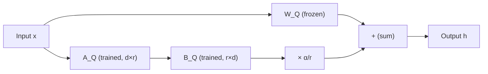
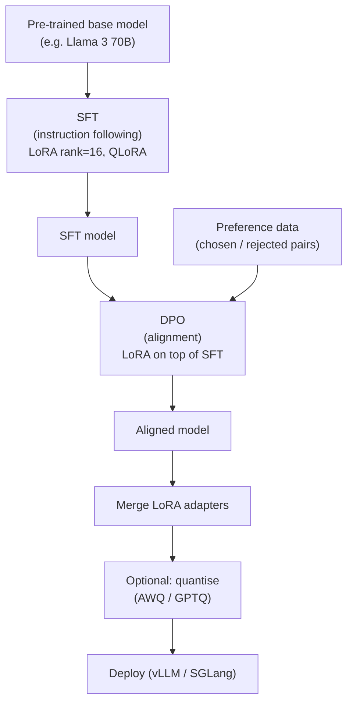

> This article is **Part 6 of 15** in the [Generative AI in Depth](/categories/Generative AI in Depth/) series.
{: .prompt-info }


Pre-training gives you a model that knows a lot. Fine-tuning gives you a model that does what you want. This article explains the full stack of adaptation techniques — why full fine-tuning is often impractical, how LoRA works mathematically, what QLoRA adds, how alignment (RLHF and DPO) fits in, and the memory trade-offs at each stage.

---

## Why Fine-Tune At All?

A pre-trained model like Llama 3 70B or Gemma 4 12B has learned to predict the next token across trillions of tokens of internet text. This gives it broad world knowledge and language understanding. But raw pre-training does not give you:

- **Instruction following**: "Summarise this document in 3 bullet points" — the model may ramble rather than respond to the instruction format
- **Domain specialisation**: A medical or legal model that uses the right terminology and avoids generic hedges
- **Style consistency**: A model that always responds in a particular voice, format, or language
- **Safety alignment**: A model that declines harmful requests and doesn't hallucinate authoritative-sounding nonsense
- **Task-specific accuracy**: A coding model that reliably generates runnable Python, not pseudocode

Fine-tuning is the process of continuing to train the model on a smaller, curated dataset to instill these properties.

---

## Full Fine-Tuning: The Baseline

The simplest approach: take all of the model's parameters and continue training with gradient descent on your target dataset.

**Memory cost of full fine-tuning** (see [Training vs Inference](/posts/training-vs-inference) for the full derivation):

Full fine-tuning requires memory for four things simultaneously: the model weights, the gradients (one per weight), and the two Adam optimiser state tensors (momentum and variance). In BF16, a 70B model already costs 140 GB for weights alone — then the gradients add another 140 GB, and Adam states add another 560 GB (kept in FP32 for numerical stability). That totals roughly **840 GB** — the equivalent of around 11 A100 80 GB GPUs, just for parameters and optimiser states, before counting activations.

With FSDP (Fully Sharded Data Parallel) or DeepSpeed ZeRO-3, each GPU only holds a shard of each tensor, so the per-GPU memory comes down — but you still need a large cluster in total. With activation checkpointing the activation memory also shrinks at the cost of extra compute (recomputing activations on the backward pass instead of storing them).

**When full fine-tuning makes sense:**
- You have enough data to justify moving every weight (typically > 100k examples)
- You're doing domain adaptation where the distribution shift is large (e.g., pre-training on code, then fine-tuning on medical literature)
- You need the maximum possible quality and have the hardware budget

For most teams, the hardware requirement rules out full fine-tuning of 7B+ models. This is where parameter-efficient fine-tuning (PEFT) comes in.

---

## LoRA: Low-Rank Adaptation

LoRA (Hu et al., 2021) is the dominant PEFT technique. To understand it, you first need to understand what "low-rank" means — because it's doing a lot of work in that sentence.

### What does "rank" mean?

A weight matrix stores learned relationships between inputs and outputs. You can think of the **rank** of a matrix as *how many independent directions of information it contains*.

A simple analogy: imagine describing a city's street layout with a list of directions. A full grid city (Manhattan) needs many independent directions — the information is rich and spread across many dimensions. A city built along one river has much lower rank — almost everything flows in one direction, so you can describe it compactly.

A 4096×4096 weight matrix has *up to* 4096 independent directions. But "up to" is the key — in practice, much of that capacity is redundant or correlated.

**Why fine-tuning updates are low-rank:**

When you fine-tune a pre-trained model on a specific task — say, making it always respond in formal English, or making it better at SQL — you're asking it to make a focused, targeted change. The shift required is **narrow in scope**. You're not asking it to rewire its entire understanding of language; you're adjusting how it applies that understanding in a particular way.

Empirically, researchers have found that when you let a model fine-tune fully (updating the entire weight matrix), the actual *change* in the weights — the difference between before and after — tends to live almost entirely within a small number of directions. The other directions barely move. The update matrix is approximately low-rank even when you didn't constrain it to be.

LoRA exploits this: instead of wasting gradient computation on directions that barely change anyway, just *constrain* the update to a small number of directions from the start. Use two thin matrices whose product captures those essential directions, freeze everything else.

### The Intuition

Instead of updating the full weight matrix directly, LoRA adds a small "side path" made of two thin matrices. One matrix is tall and narrow (say, 4096×8), the other is short and wide (8×4096). Their product approximates the weight update, but the total number of trainable values is just 4096×8 + 8×4096 = 65,536 — versus 16.7 million for the full matrix. The original weights are frozen; only these two small matrices are trained.

Why does this work? Research on how neural networks learn suggests that the most important directions of change during fine-tuning are surprisingly few — the "essential" knowledge for a task often fits in a low-dimensional update. The full matrix update during standard fine-tuning is mostly redundant.

**Parameter count comparison:**

| Method | Trainable params per attention matrix |
|---|---|
| Full fine-tuning | 16.8M (4096×4096) |
| LoRA rank=8 | 65.5K |
| LoRA rank=16 | 131K |
| LoRA rank=64 | 524K |

At rank=8, LoRA trains **256× fewer parameters** than full fine-tuning for that layer.

### Initialisation

A critical detail: the narrow matrix is initialised to zero. This means the entire side path contributes nothing at step 0 — the model starts from exactly the pre-trained weights, not a random perturbation.

> **Why zero initialisation matters:** If the narrow matrix were randomly initialised, the side path at step 0 would produce a non-zero random perturbation on top of the pre-trained weights — equivalent to corrupting the model before you start training. Zero initialisation means the pre-trained model's behaviour is preserved exactly at step 0, and the LoRA update grows gradually from there. This is why you should **never** skip LoRA initialisation or use pre-existing non-zero weights in the narrow matrix unless you understand the consequences.
{: .prompt-info }

### Scaling Factor

LoRA includes a scaling factor (alpha divided by rank) that controls how strongly the adapter influences the output relative to the base weights. It decouples learning rate sensitivity from rank choice — so you can change the rank without also having to retune the learning rate from scratch. In practice, setting alpha = 2× rank is a common default that keeps the effective contribution stable as you vary rank.

### Which Layers to Apply LoRA To?

The original LoRA paper applied the adapter to the attention projection matrices $W_Q$ and $W_V$ only. Subsequent work found that applying to **all linear layers** (Q, K, V, O, gate, up, down) gives better results. Modern frameworks like Unsloth and PEFT default to targeting all linear layers.



### Zero Inference Overhead

After training, the LoRA adapter can be **merged** into the base weights by simply adding the adapter's contribution to each frozen weight matrix. The merged model is identical in size and inference speed to the original — no extra matrices, no extra computation. This is a key advantage over methods that insert new layers (which add inference latency).

If you want to serve multiple fine-tunes of the same base model, you can also keep the adapters separate and hot-swap them per request — this is how multi-LoRA serving works in vLLM and SGLang.

---

## Memory Cost of LoRA Training

LoRA dramatically reduces the **gradient and optimiser memory** because only the adapter parameters are trained.

For a Llama 3 70B model with LoRA rank=16, targeting all linear layers:

- Total base parameters: 70B (frozen, no gradients)
- LoRA adapter parameters: ~160M (varies by architecture)
- Gradient memory: $2 \times 160M \approx 320$ MB
- Adam states: $8 \times 160M \approx 1.28$ GB

**Total training memory (BF16 base + FP32 adapter states):**

| Component | Memory |
|---|---|
| Base model weights (BF16, frozen) | 140 GB |
| LoRA adapter weights (BF16) | 320 MB |
| LoRA gradients (BF16) | 320 MB |
| Adam states (FP32) | 1.28 GB |
| Activations (gradient checkpointing) | ~8–16 GB |
| **Total** | **~150 GB** |

That's still 2× A100 80 GB, but now we're in the realm of feasibility for most teams. With QLoRA, we can go further.

---

## QLoRA: Quantised LoRA

QLoRA (Dettmers et al., 2023) combines LoRA with aggressive quantisation of the base model, enabling fine-tuning of 70B models on a **single 48 GB GPU**.

### The Three Ingredients

**1. NF4 (NormalFloat4) quantisation:**

Standard 4-bit quantisation uniformly divides the value range into 16 buckets. NF4 uses quantile-based bucketing: the 16 levels are placed at the quantiles of a standard normal distribution (since pre-trained weights are approximately normally distributed). This gives more precision near zero (where most weights cluster) and less precision in the tails.

The quantile levels for NF4 are approximately:
```
-1.0, -0.6962, -0.5251, -0.3949, -0.2844, -0.1848, -0.0911,
 0.0000, 0.0796, 0.1609, 0.2461, 0.3379, 0.4407, 0.5626, 0.7230, 1.0
```

Each weight takes exactly 4 bits, giving a **4× compression** over FP16.

**2. Double quantisation:**

The scale factors used to quantise each block of weights are themselves quantised (from FP32 to FP8). This saves an additional ~0.5 bits per parameter — not huge, but meaningful at 70B scale.

**3. Paged optimiser:**

When GPU memory is full during a gradient step, the optimiser states (Adam's momentum and variance) are paged to CPU RAM using unified memory (similar to virtual memory). This handles occasional memory spikes without crashing.

### QLoRA Training Flow

```
Base model weights (NF4, 4-bit, frozen)
           ↓
  Dequantise to BF16 for computation
           ↓
Forward pass: W_BF16 · x + B · A · x
           ↓
Loss and backward pass (gradients flow only to B, A)
           ↓
Optimiser step (Adam on B, A in BF16/FP32)
```

The dequantisation happens **on the fly** per compute operation. The weights are stored in NF4 but the matrix multiplications happen in BF16. This means:
- Storage: 4 bits per parameter
- Compute: BF16 (no accuracy loss in the computation itself)
- The quantisation error is fixed (the weights don't change) — only the LoRA adapters are trained

**Memory comparison (Llama 3 70B):**

| Method | Minimum GPU memory |
|---|---|
| Full fine-tuning (BF16) | ~840 GB |
| LoRA (BF16 base) | ~150 GB |
| QLoRA (NF4 base + BF16 LoRA) | ~48 GB |

QLoRA makes fine-tuning a 70B model possible on **2× A100 40 GB** or **1× H100 80 GB**.

### Quality Cost of QLoRA

The NF4 quantisation of the frozen base model introduces a small but non-zero quality penalty. In practice:
- For instruction-following fine-tunes: QLoRA quality ≈ full LoRA quality (the fine-tuning signal dominates)
- For domain adaptation requiring precise weight adjustment: full LoRA on BF16 is preferable
- The QLoRA paper showed QLoRA models matching full fine-tuned 16-bit models on many benchmarks

---

## LoRA Variants and Extensions

### DoRA (Weight-Decomposed Low-Rank Adaptation)

DoRA decomposes the weight update into **magnitude** and **direction** components, applying LoRA only to the directional part while learning a separate small scalar per row that controls magnitude. This more closely mimics how full fine-tuning changes weights — which tends to adjust both direction and scale — and typically outperforms standard LoRA, especially at smaller ranks.

### LoRA+

A simple improvement: use a **higher learning rate for the output matrix than the input matrix**. Empirically, the output side benefits from a learning rate 4–16× higher. This is now the default in many frameworks.

### RSLoRA (Rank-Stabilised LoRA)

Changes the scaling denominator from rank to the square root of rank. This stabilises training at higher ranks and allows using larger rank values without the scaling factor dominating the gradient signal.

### GaLore (Gradient Low-Rank Projection)

Rather than adding low-rank matrices to the weights, GaLore projects the **full weight gradients** into a low-rank subspace during the optimiser step. This allows full fine-tuning semantics (all weights updated) but with much lower optimiser memory — because the gradient's low-rank projection is stored rather than the full gradient matrix.

---

## What Should You Fine-Tune On?

The data question is often more important than the method question.

### Instruction Tuning Datasets

The key format is **instruction-response pairs**:

```
{"instruction": "Summarise this article in 3 bullets.",
 "input": "<article text>",
 "output": "• First bullet\n• Second bullet\n• Third bullet"}
```

Common open datasets:
- **Alpaca** (52K): early influential dataset, GPT-3.5 generated
- **OpenHermes** (1M): high-quality GPT-4 generated, widely used
- **ShareGPT**: real ChatGPT conversations, diverse
- **Dolly** (15K): human-written by Databricks employees
- **FLAN**: Google's instruction-formatted version of many academic tasks

Quality > quantity: 10K well-curated, diverse examples typically beats 100K noisy examples.

### Chat Formatting

Modern models use **chat templates** that structure the conversation:

```
<|begin_of_text|><|start_header_id|>system<|end_header_id|>
You are a helpful assistant.<|eot_id|>
<|start_header_id|>user<|end_header_id|>
What is the capital of France?<|eot_id|>
<|start_header_id|>assistant<|end_header_id|>
Paris.<|eot_id|>
```

During fine-tuning, loss is typically computed **only on the assistant's tokens** (the response), not on the system prompt or user messages. This focuses the gradient signal on what the model should generate.

> **Common fine-tuning bug: computing loss on user tokens.** If your training pipeline accidentally includes system prompt and user message tokens in the loss, the model receives gradients for text it should only *read*, not *generate*. This wastes training signal, degrades instruction following, and can cause the model to generate fragments of system prompts mid-response. Always set the loss mask to `0` for non-assistant turns. Most fine-tuning frameworks (Unsloth, Axolotl, TRL) handle this automatically if you use the correct chat template — but verify with a loss-per-token debug print.
{: .prompt-warning }

---

## Alignment: Making Models Helpful and Safe

Instruction tuning teaches format. Alignment teaches values — what kinds of responses are helpful, honest, and safe. There are now several distinct approaches, each with different cost, data requirements, and trade-offs.

### RLHF (Reinforcement Learning from Human Feedback)

RLHF (InstructGPT, 2022) is a three-stage pipeline:

**Stage 1 — SFT (Supervised Fine-Tuning):**
Fine-tune the base model on high-quality demonstration data to produce a model that follows instructions. This is the foundation everything else builds on.

**Stage 2 — Train a Reward Model:**
Human labellers compare pairs of model outputs and say which they prefer. A separate neural network (the *reward model*) is trained to predict those preferences — essentially learning to score any response on a scale from "bad" to "good". Crucially, this reward model captures human judgment as a callable function.

**Stage 3 — RL Fine-Tuning (PPO):**
The SFT model is treated as an agent that generates responses. For each response, the reward model assigns a score. The agent is trained (via PPO — a reinforcement learning algorithm) to maximise that score. A *KL penalty* is also applied to prevent the model from drifting too far from the SFT baseline — without it, the model quickly learns to game the reward model with degenerate outputs that score high but aren't actually good. This is called **reward hacking**.

**RLHF's practical problems:**
- Requires training, hosting, and maintaining a separate reward model
- PPO is notoriously unstable — sensitive to learning rate, reward scaling, KL coefficient
- Expensive: the model must *generate* samples during training (unlike standard fine-tuning, which is just forward+backward on fixed data)
- The reward model can be gamed even with the KL penalty

### DPO (Direct Preference Optimisation)

DPO (Rafailov et al., 2023) eliminates the reward model entirely. The key insight: mathematically, the optimal RLHF policy (what you'd get if you ran PPO perfectly) has a closed-form relationship to the reference model. DPO rearranges the problem so you can train directly on preference pairs without any RL loop.

**How to think about it:** Given a pair of responses (a chosen one and a rejected one), DPO nudges the model to assign *relatively higher* likelihood to the chosen response compared to what the frozen reference model would predict — and simultaneously lowers the relative likelihood of the rejected response. The "relative to the reference model" framing is what implicitly implements the KL penalty that RLHF achieves explicitly with PPO.

**DPO advantages over RLHF:**
- No separate reward model to build or maintain
- Stable training — just a standard gradient descent step on fixed data
- Much cheaper: no sampling during training, no RL instabilities
- Empirically matches or exceeds RLHF on most benchmarks

**DPO limitations:**
- Preference pairs ideally come from the same model you're training (on-policy data); off-policy pairs degrade results
- No explicit reward signal — harder to surgically target specific behaviours
- Can be brittle if the reference model and the policy diverge significantly

### GRPO (Group Relative Policy Optimisation)

GRPO (DeepSeek, 2025) is the alignment technique behind DeepSeek-R1's reasoning capabilities. It drops both the reward model *and* the need for a reference model — instead using the model's own outputs as the baseline.

**How it works:** For each prompt, generate a *group* of responses (say, 8–16 completions). Score them all with a reward function — for math and code tasks, this can be a simple rule-based check (did the code pass the tests? is the final answer correct?). Compute each response's advantage relative to the group average: responses better than average get positive signal, worse than average get negative signal. The model is updated to increase the probability of above-average responses and decrease below-average ones.

**Why it's notable:**
- No reward model needed — works well when reward can be verified automatically (math, code, formal reasoning)
- No reference model — simpler and cheaper than DPO
- Self-improving: the model generates its own training signal by comparing its own outputs
- Scales naturally with compute: more samples per prompt → better baseline estimate → more stable gradient

**Limitation:** Requires a reliable reward signal. Works well for tasks where correctness is verifiable (math, code, structured output). Harder to apply to open-ended creative or conversational tasks where "correct" isn't well-defined.

### Constitutional AI / RLAIF (AI Feedback)

Constitutional AI (Anthropic, 2022) replaces human preference labellers with an AI. Instead of humans comparing outputs, a separate LLM (a "critic" model) evaluates responses against a written *constitution* — a set of principles like "be helpful", "avoid harmful content", "don't deceive".

**The pipeline:**
1. Generate responses to prompts
2. Have a critic LLM critique each response against the constitution
3. Revise the response based on the critique
4. Use the (original, revised) pairs as preference data for DPO or RLHF

**Why it matters:**
- Scales much better than human labelling — AI critics are fast and cheap
- The constitution makes alignment *explicit and auditable* — you can see exactly what principles were enforced
- The AI feedback can be applied iteratively: critique → revise → critique again

**RLAIF** (Reinforcement Learning from AI Feedback) is the generalisation: any approach where an AI generates the preference signal rather than humans. Google's work showed RLAIF can match or exceed human RLHF quality at a fraction of the cost.

### Process Reward Models (PRM)

All approaches above reward the *final output* — did the full response get a high score? Process Reward Models (PRMs) instead reward *each step* of a reasoning chain.

**Why it matters for reasoning:** If a model produces a 10-step math solution with the right final answer but a wrong step 4, an outcome reward model says "good job". A process reward model catches the error at step 4, providing a much richer training signal.

**The key distinction:**
- **ORM (Outcome Reward Model):** rewards the final answer only — simple to train, can reinforce lucky correct guesses
- **PRM (Process Reward Model):** rewards each reasoning step — richer signal, better for learning reliable multi-step reasoning, but requires step-level human (or AI) annotations

PRMs are central to training reasoning-capable models. The intuition: you want the model to develop a *reliable reasoning process*, not just learn to produce correct-looking answers. Rewarding the process directly is the most principled way to get there.

### DPO Variants

**SimPO (Simple Preference Optimisation):** Removes the reference model entirely, using the model's own length-normalised log probabilities as the implicit reference. Even simpler than DPO.

**ORPO (Odds Ratio Preference Optimisation):** Combines SFT and preference optimisation into a single training stage — no separate DPO phase needed.

**KTO (Kahneman-Tversky Optimisation):** Works with single-sided feedback (just "this response is good" or "this response is bad") rather than requiring paired comparisons. Much easier to collect at scale — you can label individual responses rather than needing to compare two.

**SPIN (Self-Play Fine-Tuning):** The model plays against its own previous version. Responses from the current model are "chosen"; responses from the previous checkpoint are "rejected". No human labels needed at all — the model bootstraps its own improvement.

---

## The Full Fine-Tuning Pipeline in Practice

A complete adaptation pipeline for a production model looks like this:



**Typical hyperparameters:**

| Hyperparameter | Typical range | Notes |
|---|---|---|
| LoRA rank | 8–64 | Higher = more capacity, more memory |
| LoRA alpha | 1–2× rank | Controls scaling of the adapter output |
| LoRA dropout | 0–0.1 | Light regularisation |
| Learning rate (SFT) | 1e-4 to 3e-4 | With cosine decay |
| Batch size | 2–16 per GPU | With gradient accumulation |
| Epochs | 1–3 | More risks overfitting on small datasets |
| DPO beta | 0.1–0.5 | Lower = more deviation from reference |

---

## Evaluating Your Fine-Tune

Fine-tuning metrics to watch:

- **Training loss**: should decrease smoothly; spikes indicate bad data
- **Validation loss**: should track training loss; divergence = overfitting
- **Reference model KL**: how far the model has drifted from the base (DPO)
- **Task-specific metrics**: ROUGE, pass@k (code), accuracy on held-out benchmark
- **Human preference win rate**: the gold standard — have humans compare outputs

**Red flags during fine-tuning:**
- Loss goes to zero quickly → the dataset is too small or contains near-duplicates
- Output degenerates to repetitive text → rank is too high, learning rate too large, or too many epochs
- Model loses capabilities ("catastrophic forgetting") → learning rate too high, need interleaving with general data

> **Measure base capabilities after every epoch**, not just task-specific performance. Run a standard benchmark subset (e.g., 200 questions from MMLU or HellaSwag) before and after fine-tuning. A drop of more than 2–3 points signals catastrophic forgetting. Once it's gone, it's expensive to recover — you typically need to restart from the base model with a lower learning rate and interleaved general data.
{: .prompt-warning }

---

## Multi-Task Fine-Tuning and Merging

When you need a model to be good at multiple tasks, you have two options:

**1. Multi-task SFT:** Mix all task datasets into a single fine-tuning run, with appropriate sampling ratios.

**2. Model merging:** Fine-tune separate LoRA adapters for each task, then merge them into the base model using techniques like:
- **Linear merging**: $W = W_0 + \lambda_1 B_1 A_1 + \lambda_2 B_2 A_2$ (weighted sum of adapters)
- **TIES merging**: resolves sign conflicts between adapters before merging
- **DARE**: prunes redundant parameters from each adapter before merging

Merging allows you to combine capabilities without catastrophic interference, though it works best when the tasks are not too different.

---

## Key Takeaways

- **Full fine-tuning** maximises quality but costs ~840 GB of GPU memory for a 70B model — impractical without a large cluster
- **LoRA** adds small trainable adapter matrices alongside frozen base weights, reducing trainable parameters by 100–1000× at minimal quality cost
- **QLoRA** quantises the frozen base model to 4-bit and trains LoRA adapters in 16-bit, enabling 70B fine-tuning on a single 80 GB GPU
- **RLHF** trains a reward model on human preferences then uses PPO to optimise the policy — powerful but expensive and unstable
- **DPO** directly optimises on preference pairs without a reward model or RL loop — simpler, cheaper, and empirically competitive
- **GRPO** uses the model's own group of outputs as a baseline — no reward model, no reference model — works especially well for verifiable tasks (math, code)
- **Constitutional AI / RLAIF** replaces human preference labellers with an AI critic evaluating responses against written principles — scales cheaply and makes alignment auditable
- **Process Reward Models** reward each reasoning step rather than the final answer — the right tool when you need reliable multi-step reasoning, not just correct-looking outputs
- The typical production pipeline is: base → SFT (LoRA/QLoRA) → alignment (DPO/GRPO) → merge → quantise → serve
- **Data quality dominates method choice**: 10K curated examples beats 100K noisy ones regardless of technique

---

## Further Reading

> **Fine-tuning vs distillation?** Fine-tuning specialises *what* a model does. Distillation makes it *smaller*. If your goal is a faster, cheaper model rather than a differently-behaved one, see [Knowledge Distillation in Depth](/posts/knowledge-distillation).
{: .prompt-info }

- [Knowledge Distillation in Depth](/posts/knowledge-distillation) — teacher-student distillation, reasoning distillation, hardware and frameworks
- [Training vs Inference](/posts/training-vs-inference) — the memory math that motivates LoRA and QLoRA
- [A Quantization Primer](/posts/a-quantization-primer) — NF4, AWQ, and other quantisation formats in depth
- [The Memory Math](/posts/llm-memory-math) — how to budget GPU memory for fine-tuning
- [Which Serving Framework?](/posts/llm-serving-frameworks-comparison) — deploying your fine-tuned model
- LoRA paper: Hu et al., [arXiv 2106.09685](https://arxiv.org/abs/2106.09685)
- QLoRA paper: Dettmers et al., [arXiv 2305.14314](https://arxiv.org/abs/2305.14314)
- DPO paper: Rafailov et al., [arXiv 2305.18290](https://arxiv.org/abs/2305.18290)

