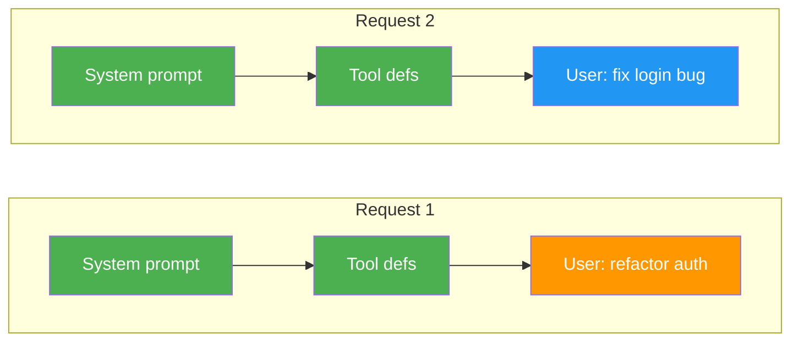
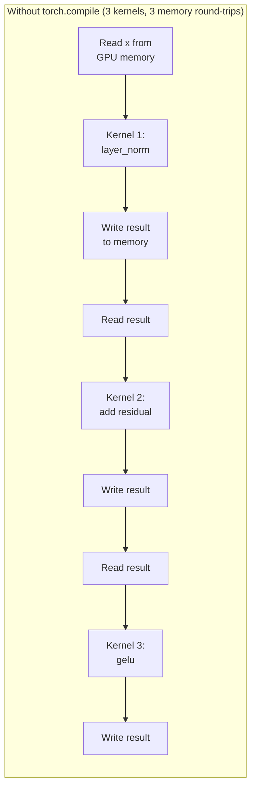
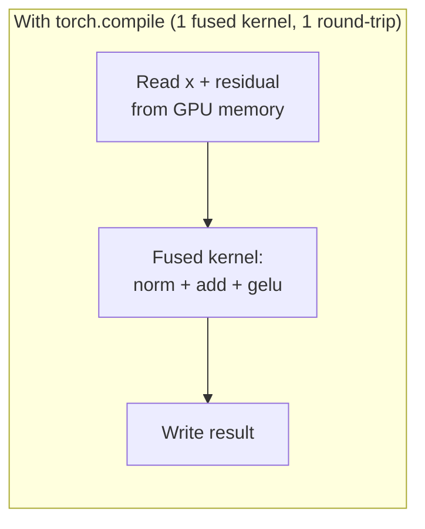

> This article is Part 1 of the [vLLM Deep Dive Series](/tags/vllm-deep-dive-series). Based on vLLM v0.18+ (June 2026).
{: .prompt-info }

vLLM is the most widely deployed open-source LLM inference server. It powers everything from single-GPU side projects to multi-node production clusters serving millions of requests per day. But very few people who use it understand *why* it's fast.

This three-part series breaks down every major feature in vLLM — not just what they do, but the first-principles reasoning behind them. Part 1 covers the core engine: the scheduling, memory management, and kernel optimizations that make a single GPU serve 10x more requests than a naive implementation.

## PagedAttention: The Foundation

Every LLM generates tokens by attending to all previous tokens. The intermediate results of this attention — the Key and Value vectors — are stored in the **KV cache**. This cache is the single largest consumer of GPU memory during inference, often exceeding the model weights themselves.

The naive approach allocates a contiguous block of GPU memory for each request's maximum possible sequence length. A 70B model serving 128K context allocates ~40GB of KV cache *per request* — even if the actual sequence only uses 2K tokens. This wastes 98% of the allocated memory.

PagedAttention treats KV cache like virtual memory. Instead of one big contiguous allocation, it divides the cache into fixed-size **pages** (blocks of 16 tokens). Pages are allocated on demand as the sequence grows, and freed when the request completes. Two requests with a shared prefix can point to the same physical pages.

> The result: vLLM achieves near-zero memory waste, compared to 60-80% waste with static allocation. This directly translates to more concurrent requests on the same hardware.
{: .prompt-tip }

Published as [*Efficient Memory Management for Large Language Model Serving with PagedAttention*](https://arxiv.org/abs/2309.06180) at SOSP 2023.

## Continuous Batching: No Wasted Slots

With **static batching**, you group N requests together and run them all to completion before starting the next batch. If request A needs 10 tokens and request B needs 500, A finishes at step 10 — but the GPU can't accept new requests until B finishes at step 500. The GPU isn't *idle* (it's still generating for B), but **A's batch slot is wasted.** The GPU could be processing a new request in that slot but isn't:

```mermaid
gantt
    title Static Batching — A's slot wastes 490 steps
    dateFormat X
    axisFormat %s
    section Batch 1
    Request A (10 tokens)         :a, 0, 10
    A's slot sits empty           :crit, 10, 500
    Request B (500 tokens)        :b, 0, 500
    section Batch 2
    Request C (starts only after B finishes) :c, 500, 700
    Request D                     :d, 500, 600
```



With continuous batching, the scheduler checks after **every single token generation step** whether any request has finished. If A finishes at step 10, a new request C immediately fills A's slot:

```mermaid
gantt
    title Continuous Batching — slots immediately reused
    dateFormat X
    axisFormat %s
    section Slot 1
    Request A             :a, 0, 10
    Request C (fills A's slot) :c, 10, 60
    Request E             :e, 60, 120
    section Slot 2
    Request B             :b, 0, 500
    Request D             :d, 500, 600
```



The GPU does the same amount of compute per step, but it's doing **useful work** in every batch slot instead of wasting slots on completed requests. This is why vLLM achieves 2-4x higher throughput than static batching.

## Chunked Prefill: Don't Block the Queue

Before generating tokens, the model must process the entire input prompt — this is called **prefill**. For a 10K token prompt, prefill might take 2 seconds of solid GPU compute. During those 2 seconds, ALL other users' decode steps (token generation) are blocked. Their stream of tokens just freezes.

Instead of processing all 10K tokens at once, chunked prefill breaks it into chunks (e.g., 512 tokens each):

```mermaid
gantt
    title Without Chunked Prefill — B and C freeze for 2s
    dateFormat X
    axisFormat %s
    section GPU
    Prefill A (10K tokens, 2 seconds) :crit, 0, 2000
    Decode B :b, 2000, 2050
    Decode C :c, 2050, 2100
```

```mermaid
gantt
    title With Chunked Prefill — interleaved, nobody freezes
    dateFormat X
    axisFormat %s
    section GPU
    Prefill A chunk 1   :a1, 0, 100
    Decode B,C          :b1, 100, 130
    Prefill A chunk 2   :a2, 130, 230
    Decode B,C          :b2, 230, 260
    Prefill A chunk 3   :a3, 260, 360
    Decode B,C          :b3, 360, 390
```





The prefill for A takes slightly longer overall (overhead of switching), but every other user's latency stays smooth.

### Can you start decoding A early?

After processing chunk 1 (tokens 0-511), those tokens have valid KV entries. But to generate A's **first output token**, the model needs the hidden state of the **last input token** — and that hidden state depends on attention to ALL input tokens. `token_9999`'s representation = `attention(token_9999, all of tokens 0-9998)`. You can't compute that until all chunks are processed.

The KV entries from chunk 1 ARE valid and reused (the model doesn't recompute them in chunk 2), but they're insufficient to produce any output. Chunked prefill helps **other users** during A's prefill — it doesn't help A itself start generating sooner.

## Automatic Prefix Caching (APC)

When the model processes tokens, it computes KV vectors for each token. APC detects when two requests share the same prefix tokens, and reuses the already-computed KV cache instead of recomputing it.

### But KV depends on context, not just one token

Correct — a token's K and V values at layer L depend on the hidden state at layer L, which depends on all *preceding* tokens via attention. But in a **causal (autoregressive) transformer**, token at position `i` can ONLY attend to tokens at positions `0..i` (the causal mask blocks everything after):



At the prefix tokens (green), the causal mask means token 500 in the system prompt only sees tokens 0-500. It has **no knowledge** that "refactor auth" or "fix login bug" comes later — those are masked. So the hidden states, and therefore the K/V values, for ALL prefix tokens are **mathematically identical** across both requests. Only at the divergence point (the user message) do the hidden states differ.

vLLM divides the KV cache into fixed-size blocks (e.g., 16 tokens). Each block is hashed by its token content. When a new request arrives, vLLM hashes its prefix blocks and checks: "have I computed KV for this exact block before?" If yes, skip computation and reuse.

| | Without APC | With APC |
|---|---|---|
| Request 1 | Compute full 2000 prefix + msg → **400ms** | Compute full 2000 prefix + msg → **400ms** (miss) |
| Request 2 | Compute full 2000 prefix + msg → **400ms** | Reuse prefix KV, only compute msg → **20ms** (hit!) |
| Request 3 | Compute full 2000 prefix + msg → **400ms** | Reuse prefix KV, only compute msg → **20ms** (hit!) |
| **Total** | **1200ms** | **440ms** (2.7x faster) |

> For agentic workloads, APC is transformative. The system prompt + tool definitions + conversation history is identical across every turn. Only the new user message changes. APC means turn 2+ skips almost all prefill work. Enabled by default in vLLM v1.
{: .prompt-tip }

## CUDA Graph Capture: Eliminating Launch Overhead

A single forward pass through a transformer launches **hundreds of GPU kernels** — matrix multiplications, attention, layer norms. Each kernel launch has CPU overhead (~10μs). At 200 kernels per step, that's 2ms of pure overhead per token — which can dominate at small batch sizes.

**CUDA Graphs** record the entire sequence of kernel launches once, then replay it as a single unit:

```
Without CUDA Graphs:
  200 kernel launches × ~10μs each = 2ms overhead per token

With CUDA Graphs:
  1 graph replay = ~10μs overhead per token (200x reduction)
```

vLLM supports two modes:
- **Full graph capture**: Records the entire forward pass as one graph. Fastest replay but can't handle variable batch sizes without re-capturing.
- **Piecewise graph capture**: Records individual sections (attention, MLP) as separate graphs. Slightly more overhead but handles dynamic shapes by composing pieces.

HIP Graphs are the AMD ROCm equivalent.

## torch.compile: Fusing the Gaps

PyTorch 2.0 introduced `torch.compile()` — a JIT compiler that traces operations and generates optimized GPU kernels automatically. Instead of running Python → PyTorch → CUDA kernel by kernel, it fuses multiple operations into single kernels:





Since GPU inference is often **memory-bandwidth-bound**, reducing memory reads/writes by fusing ops gives 10-30% speedup.

> torch.compile does NOT replace FlashAttention. Attention already has hand-written optimized kernels. torch.compile handles the **other ~60%** — residual connections, normalizations, MLP activations, position encodings — that would otherwise be separate small kernels.
{: .prompt-warning }

## Quantization: Trading Precision for Capacity

vLLM supports one of the widest ranges of quantization methods of any inference server:

### Weight Quantization

| Method | Bits | Notes |
|---|---|---|
| **FP8 (E4M3/E5M2)** | 8-bit float | Best speed/quality on Hopper+. Native support. |
| **MXFP8 / MXFP4** | 8/4-bit float | Microscaling formats |
| **NVFP4** | 4-bit float | NVIDIA's FP4 for Blackwell |
| **INT8 / INT4** | 8/4-bit int | Per-channel/per-tensor or weight-only |
| **GPTQ** | 3/4/8-bit | Post-training, widely available models |
| **AWQ** | 4-bit | Activation-aware, fast inference |
| **GGUF** | 2-8 bit | Compatible with llama.cpp quantizations |
| **compressed-tensors** | Various | Neural Magic's format |
| **TorchAO / AutoRound** | Various | PyTorch-native / Intel PTQ |

### KV Cache Quantization

Model weights are static — you quantize them once. But the KV cache grows dynamically and can dominate GPU memory at long contexts. A 70B model's weights use ~35GB, but its KV cache for 128K context can use 40GB+.

- **FP8 KV cache** — halves KV memory with <1% quality loss. Production-ready.
- **TurboQuant** — pushes to 4-bit or 2-bit KV cache. Still under active research — quality degrades on needle-in-a-haystack tasks at extreme compression, and the optimal configuration is model-dependent.

## Attention Kernels: Why There Are Five

The attention mechanism (`Q·K^T·V`) is the most compute-intensive operation in a transformer. A "kernel" is a specific GPU implementation of this math.

The naive implementation materializes an `[seq_len × seq_len]` attention matrix — for 8K context, that's 268MB per layer. **FlashAttention** avoids this entirely by computing attention in tiles that fit in GPU SRAM (~20MB on-chip). The full matrix never exists in main memory: **2-4x faster, O(n) memory instead of O(n²).**

vLLM has multiple kernel implementations because different situations need different specializations:

| Kernel | What Makes It Special |
|---|---|
| **FlashAttention** | Best general-purpose. Supports GQA (broadcasting shared K/V to query heads), sliding window (skipping tiles outside the window), and various head dimensions (SRAM tile sizes must match). |
| **FlashInfer** | Optimized for serving. Natively understands PagedAttention's non-contiguous memory layout — no gather/scatter needed. |
| **TRTLLM-GEN** | NVIDIA's hand-tuned assembly for H100/B200. Fastest on NVIDIA hardware, not portable. |
| **FlashMLA** | For DeepSeek's Multi-Latent Attention, where K/V are compressed into a latent space with completely different tensor shapes. |
| **Triton** | Written in Triton. Runs on both NVIDIA and AMD GPUs. Used as the ROCm fallback. |

vLLM auto-selects the best kernel based on your hardware and model.

## What's Next

[Part 2](/posts/vllm-deep-dive-part-2) covers the performance multipliers: speculative decoding, all five parallelism strategies, disaggregated serving, and the hardware support matrix. [Part 3](/posts/vllm-deep-dive-part-3) covers the 60+ supported model architectures, serving features, and the cutting-edge 2026 additions.
