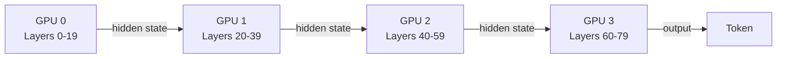
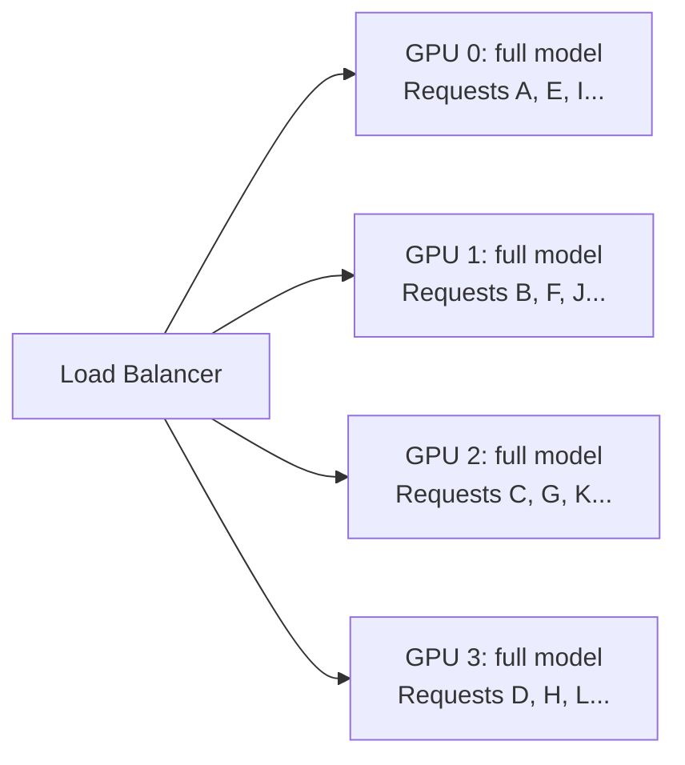
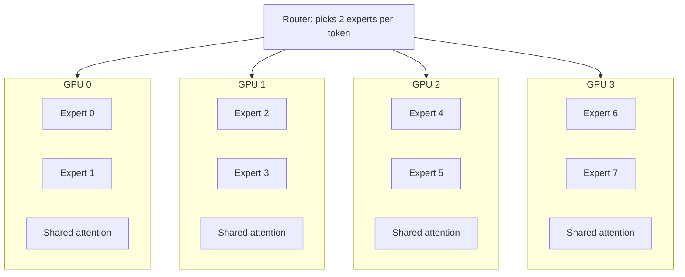

> This article is Part 2 of the [vLLM Deep Dive Series](/tags/vllm-deep-dive-series). [Part 1](/posts/vllm-deep-dive-part-1) covered the core engine. For first-principles foundations, see the [Generative AI in Depth](/categories/generative-ai-in-depth/) series.
{: .prompt-info }

Part 1 explained how vLLM makes a single GPU fast. This part covers how you make it *faster* — speculative decoding to accelerate individual requests, five parallelism strategies to distribute work across GPUs, disaggregated serving to separate the two fundamentally different phases of inference, and the hardware support matrix.

## Speculative Decoding: Guess, Then Verify

LLM token generation is **sequential** — token N depends on token N-1. Each token requires a full forward pass through the model. But here's the thing: during decode, the GPU is processing one tiny token at a time. The compute units are mostly idle — the bottleneck is reading model weights from memory, not doing math.

The insight: **guess** the next 5 tokens cheaply, then **verify** all 5 in a single forward pass of the big model.

```
Standard decoding (1 token per forward pass):
  Step 1: forward("The")           → "capital"     [full GPU, 1 token]
  Step 2: forward("The capital")   → "of"          [full GPU, 1 token]
  Step 3: forward("The capital of")→ "France"      [full GPU, 1 token]
  Step 4: forward("... France")    → "is"          [full GPU, 1 token]
  Step 5: forward("... is")        → "Paris"       [full GPU, 1 token]
  = 5 forward passes for 5 tokens

Speculative decoding:
  Draft: small model guesses ["capital", "of", "France", "is", "Paris"]
  Verify: big model checks ALL 5 in ONE forward pass
         → "capital" ✓ "of" ✓ "France" ✓ "is" ✓ "Paris" ✓
  = 1 forward pass for 5 tokens (+ cheap draft cost)

If the draft is wrong:
  Draft guesses: ["capital", "city", "in", ...]
  Verify: "capital" ✓ "city" ✗ → reject, generate correct token "of"
  = 1 forward pass for 2 tokens (still faster than standard)
```

Speculative decoding uses a rejection sampling algorithm that guarantees the output is **mathematically identical** to running the big model alone. It's not an approximation — it's the exact same output, just faster.

### Methods Compared

| Method | How It Generates Draft Tokens | Pros | Cons |
|---|---|---|---|
| **N-gram** | Finds matching patterns in the prompt and predicts what follows | Zero cost, no extra model | Only works if prompt contains the pattern |
| **Suffix** | Builds suffix array of the prompt, matches longest suffix | Good for repetitive/structured text | Needs patterns in prompt |
| **Draft model** | Runs a small model (e.g., 1B) to generate 5-10 candidates, big model (e.g., 70B) verifies | Works for any text | Uses extra VRAM for second model |
| **MTP** | Prediction modules baked into the model at pretraining time — run in the same forward pass | Near-zero overhead, no extra VRAM | Only available if the model was pretrained with MTP (DeepSeek V3/R1, Qwen 3) |
| **EAGLE 3.1** | Trained lightweight head using the big model's hidden states — much more accurate than a separate draft model | ~80% acceptance rate, best speedup | Needs model-specific trained head |
| **DFlash** | Diffusion model generates multiple tokens simultaneously | Novel, potentially very fast | Newest, least mature (2026) |

### Why Isn't It Enabled by Default?

This is the question everyone asks. Five reasons:

**1. No universal best method.** N-gram is free but only works for repetitive text. EAGLE is best but needs a trained head. Draft models use VRAM. The right choice depends on your model, workload, and hardware.

**2. VRAM tradeoff.** A 1B draft model uses VRAM that could otherwise hold more KV cache = more concurrent requests. At high concurrency, more concurrent requests often beats faster individual requests.

**3. Acceptance rate varies by task.** Code completion (repetitive) → high acceptance, great speedup. Creative writing (unpredictable) → low acceptance, wasted work.

**4. Throughput vs latency.** This is the counter-intuitive one. Here's the concrete math:

```
Standard decoding, batch size 32 (32 concurrent users):
  Each step: forward pass for 32 tokens (1 per user) → takes 10ms
  Throughput: 32 tokens / 10ms = 3,200 tokens/sec
  Per-user latency: 1 token every 10ms = 100 tok/s

Speculative decoding, batch size 32, verify 5 tokens each:
  Each step: forward pass for 32 × 5 = 160 tokens → takes 35ms
  (NOT 5× slower — attention over 5 tokens is mostly parallel,
   but the KV cache reads and memory traffic ARE larger)
  On average 3 of 5 accepted → 32 × 3 = 96 tokens produced
  Throughput: 96 tokens / 35ms = 2,743 tokens/sec  ← LOWER
```

At **high batch sizes**, the GPU is already fully utilized. Making each forward pass larger increases memory traffic disproportionately. Speculative decoding shines at **low batch sizes** (1-4 users), where the GPU has spare capacity and the verification work is essentially "free."

**5. EAGLE heads need training.** You can't just flip a flag — you need a trained head for your specific model, and not all models have one available.

> **Concept covered in depth:** [Speculative Decoding](/posts/speculative-decoding) covers draft models, MTP, EAGLE, DFlash, and the acceptance-rate/throughput tradeoff from first principles, with hardware guidance on when each method makes sense.
{: .prompt-info }

## Parallelism: Five Ways to Split Work

When a model is too large for one GPU, or you need more throughput, you split the work. Each strategy splits differently.

### Tensor Parallelism (TP) — Split Each Layer

Each layer's weight matrices are sliced across GPUs. Every GPU holds a **fraction** of every layer and they compute in parallel.

```mermaid
flowchart TB
    subgraph "TP=4: Every layer split across 4 GPUs"
        direction LR
        subgraph GPU0["GPU 0"]
            L0_0["25% of Layer 0"]
            L1_0["25% of Layer 1"]
            LN_0["..."]
            L79_0["25% of Layer 79"]
        end
        subgraph GPU1["GPU 1"]
            L0_1["25% of Layer 0"]
            L1_1["25% of Layer 1"]
            LN_1["..."]
            L79_1["25% of Layer 79"]
        end
        subgraph GPU2["GPU 2"]
            L0_2["25% of Layer 0"]
            L1_2["25% of Layer 1"]
            LN_2["..."]
            L79_2["25% of Layer 79"]
        end
        subgraph GPU3["GPU 3"]
            L0_3["25% of Layer 0"]
            L1_3["25% of Layer 1"]
            LN_3["..."]
            L79_3["25% of Layer 79"]
        end
    end
    GPU0 <-->|"AllReduce\nafter each layer"| GPU1
    GPU1 <-->|"AllReduce"| GPU2
    GPU2 <-->|"AllReduce"| GPU3
```



**Pros:** Lowest latency — all GPUs work simultaneously on every token.
**Cons:** Requires fast GPU-to-GPU interconnect (NVLink). AllReduce after every layer = high communication. Best within a single node.

### Pipeline Parallelism (PP) — Split Layers Sequentially

Different GPUs hold different layers. Data flows through them like a pipeline.



**Pros:** Low communication (only between adjacent GPUs). Works across nodes with slower networks.
**Cons:** Pipeline bubbles — GPU 3 idles while GPUs 0-2 process. Higher per-token latency.

### Data Parallelism (DP) — Full Copies

Each GPU has a complete copy of the model. Different requests go to different GPUs.



**Pros:** Linear throughput scaling. Zero inter-GPU communication during inference.
**Cons:** Model must fit on a single GPU. Multiplied VRAM usage.

### Expert Parallelism (EP) — For MoE Models

Mixture-of-Experts models (DeepSeek V3, Mixtral) have many "expert" sub-networks but only activate a few per token. EP distributes experts across GPUs.



**Elastic EP** extends this to dynamically add/remove GPU workers based on load — important for production MoE serving where traffic varies.

> **Concept covered in depth:** [Mixture of Experts](/posts/mixture-of-experts) explains how MoE routing, expert selection, and load balancing work — and why MoE architectures require dedicated parallelism strategies that dense models don't need.
{: .prompt-info }

### Context Parallelism (CP) — For Very Long Contexts

Splits the input **sequence** across GPUs. Each GPU processes a portion of the context. Attention requires ring communication between GPUs (each GPU's Q needs to attend to all other GPUs' K/V).

### When to Use What

| Situation | Best Strategy |
|---|---|
| 70B model, 1 node with 8 GPUs | TP=8 |
| 70B model, 2 nodes with 4 GPUs each | TP=4, PP=2 |
| 8B model, 4 GPUs, need max throughput | DP=4 |
| DeepSeek V3 (MoE, 671B) | EP + TP |
| 1M token context | CP + TP |

## Disaggregated Serving: Split Prefill and Decode

This is one of the most important architectural innovations in recent vLLM development. The key insight: prefill and decode have **fundamentally different hardware profiles**.

- **Prefill** is **compute-bound** — processing thousands of tokens in parallel, GPU ALUs are saturated
- **Decode** is **memory-bandwidth-bound** — generating 1 token at a time, bottleneck is reading model weights from GPU memory

When both run on the same GPU, they interfere: a long prefill blocks all decode steps. Users see their token stream freeze.


The prefill pool processes incoming prompts (compute-optimized). The decode pool generates tokens (bandwidth-optimized). They communicate via KV cache transfer. The result: prefill never blocks decode.

Multiple KV transfer backends are available:
- **Mooncake Store** — distributed KV cache for agentic workloads (**3.8x throughput**)
- **MORI-IO** — AMD's connector (**2.5x throughput** on MI300X)
- **PegaFlow** — external KV cache as standalone Rust process
- **LMCache / FlexKV** — KV cache sharing across instances

> **Concept covered in depth:** [LLM Serving in Depth](/posts/llm-serving-in-depth) covers why the prefill/decode distinction exists — the compute-bound vs memory-bandwidth-bound profiles, head-of-line blocking, and how chunked prefill partially addresses it before disaggregation becomes necessary.
{: .prompt-info }

## Hardware Support Matrix

Before deploying vLLM, you need to know whether it runs on your hardware — and at what quality level. vLLM's performance optimizations (FlashAttention, CUDA Graphs, TRTLLM-GEN kernels) are NVIDIA-specific by default; other platforms use different kernel backends with different performance characteristics.

| Hardware | Status | Notes |
|---|---|---|
| **NVIDIA (CUDA)** | ✅ Full | Ampere, Hopper, Ada, Blackwell (sm_121 / DGX Spark) |
| **AMD (ROCm)** | ✅ Good | MI250X, MI300X. Triton attention kernels. Disaggregated serving. |
| **Google TPU** | ✅ Supported | Separate package (`vllm-tpu`). Day-0 Gemma 4 support. |
| **CPU** | ✅ Supported | Intel AVX-512/AMX, x86_64. Slower but functional. |
| **Intel Gaudi** | ⚠️ Community | Via Intel's fork / Habana integration |
| **AWS Trainium** | ⚠️ Community | Via NeuronX integration |
| **Apple Silicon** | ❌ None | Use oMLX or llama.cpp instead |

> The DGX Spark / GB10 (Blackwell, sm_121) is the newest addition — unified memory support and NVFP4 quantization. vLLM has a [dedicated blog post](https://blog.vllm.ai/2026/06/01/vllm-dgx-spark/) with configuration and benchmarks.
{: .prompt-info }

## What's Next

[Part 3](/posts/vllm-deep-dive-part-3) covers the 60+ supported model architectures (grouped by what actually makes them different), the full serving feature set (tool calling, structured output, LoRA, reasoning), and the cutting-edge 2026 additions like the Semantic Router, DiffusionGemma, and native RL APIs.
