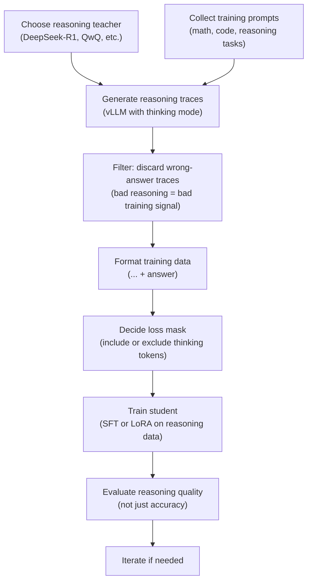

> This article is **Part 7 of 15** in the [Generative AI in Depth](/categories/generative-ai-in-depth/) series.
{: .prompt-info }

The DeepSeek-R1-Distill-Qwen-7B model — a 7B model beating GPT-4 on maths olympiad problems — made distillation impossible to ignore. But distillation is often confused with fine-tuning. They solve different problems. This article explains the difference, how distillation actually works, and how to do it in practice.

---

## Fine-Tuning vs Distillation: Choose the Right Tool First

Before any technique, the question: **what problem are you solving?**

| Question | Fine-Tune | Distil |
|---|---|---|
| Do you want to change *what* the model does? | ✓ | — |
| Do you want to make the model *smaller/faster*? | — | ✓ |
| Do you have labelled task data? | ✓ Required | Not needed |
| Do you have a strong teacher model? | Not needed | ✓ Required |
| Do you care about inference cost at scale? | Indirectly | ✓ Primary goal |
| Do you want to preserve general capability? | Harder | Easier |

**Fine-tuning** adapts a model's *behaviour* — it learns to do something differently. The model size stays the same; what changes is how it responds.

**Distillation** transfers a large model's *capability* into a smaller model. The behaviour can be similar; what changes is the model size and therefore its inference cost.

**When to do both:** Fine-tune the large teacher first (to specialise it for your task), then distil that specialised teacher into a smaller student. You get a small model that's both capable and task-specific.

**When to quantise instead:** If you just need to fit a model on smaller hardware and can accept a small quality loss with no retraining budget, quantisation is faster and cheaper than distillation. See [A Quantization Primer](/posts/a-quantization-primer).

---

## What Is Distillation? The Core Intuition

### Hard Labels vs Soft Labels

A standard training example has a hard label: the answer is *cat*. Every other option is wrong.

A teacher model's output looks different. When it processes the word "kitty", its probability distribution might be:

```
cat    → 68%
kitten → 18%
feline → 7%
tabby  → 4%
pet    → 2%
...
```

That distribution is richer than the hard label "cat = 1, everything else = 0". It tells you:
- *cat* and *kitten* are closely related (high probability for both)
- *feline* and *tabby* are plausible but less likely
- Completely unrelated words have near-zero probability

When the student trains on this distribution rather than the hard label, it absorbs the teacher's understanding of *relationships between concepts*, not just the correct answer. This is called **dark knowledge** — the information encoded in the teacher's non-winning predictions.

### Temperature Scaling

Raw teacher outputs are often very confident (e.g., 99% for *cat*). The soft-label signal is almost identical to a hard label.

**Temperature scaling** divides the raw scores before computing probabilities, making the distribution softer:

- **Temperature = 1**: normal, often peaked distribution
- **Temperature = 2–4**: softer, more informative — the relationships between tokens become more visible
- **Temperature > 4**: too flat — almost uniform, loses signal

In practice, start at temperature = 2 and tune from there. The goal is a distribution soft enough to be informative but peaked enough to carry meaningful signal.

### The Student-Teacher Frame

Think of it this way: the student isn't trying to memorise correct answers — it's trying to mimic *how the teacher thinks* about the problem, including what alternatives it considers. A student that learns to produce the same confident distributions as the teacher will generalise better than one that only learned "correct answer = 1".

---

## Types of Distillation

### Response-Based (Output-Level)

The student learns from the teacher's final outputs. Two sub-approaches:

**Hard-label SFT** (most common in practice):
- Generate teacher responses offline (batch inference with vLLM or SGLang)
- Store them as a standard instruction dataset
- Train the student on this data exactly as you would fine-tune on human-written data
- Teacher not needed during student training — cheapest approach

**Soft-label KD** (better signal, more complex):
- Store the teacher's top-K token probabilities alongside each response
- Train student with a KD loss that matches the student's distribution to the teacher's
- Requires either the teacher to be present during training, or pre-stored logprobs (can be large)

For most practical use cases, hard-label SFT gets you 80–90% of soft-label KD quality at a fraction of the complexity.

### Feature-Based

The student also matches the teacher's intermediate layer representations — hidden states, attention patterns. Richer training signal but requires the student and teacher to have compatible architectures (similar hidden dimensions). Rarely used for LLMs because cross-architecture matching is difficult.

### Relation-Based

The student matches relationships *between* samples in the teacher's representation space, rather than the representations themselves. Even rarer for LLM distillation.

---

## Modern Distillation Patterns

### Offline vs Online

**Offline distillation** (recommended starting point):
1. Run the teacher once at scale to generate responses / logprobs
2. Store everything to disk
3. Train the student on stored data — teacher not needed again

Teacher cost is paid once. Student training is cheap and independent.

**Online distillation**:
Teacher runs in parallel during student training, generating new responses each step. Better signal (the teacher adapts its examples to the student's current state), but requires both models in memory simultaneously.

### Self-Distillation

The model distils from a larger version of itself in the same family. Works especially well because shared tokenisers and similar architectures make the knowledge transfer efficient. Used in the Phi and Gemma model families.

### The Speculative Decoding Connection

The draft model in speculative decoding is essentially a distilled version of the target model. For speculative decoding to work well, the draft model needs to predict tokens similarly to the target — which is exactly what distillation achieves. Same-family distillation (same tokeniser, similar vocab distribution) produces the best draft models.

---

## Reasoning Distillation: Distilling How to Think

### Why It's Different

Standard distillation transfers answers. Reasoning distillation transfers the *process of arriving at answers*.

A reasoning teacher (like DeepSeek-R1 or QwQ) produces explicit thinking traces:

```
<think>
The question asks for the sum of primes less than 20.
Primes less than 20: 2, 3, 5, 7, 11, 13, 17, 19.
Sum: 2+3=5, 5+5=10, 10+7=17, 17+11=28, 28+13=41, 41+17=58, 58+19=77.
</think>
77
```

A student trained on these traces learns not just "the answer is 77" but *how to approach* this type of problem — building a reliable reasoning process rather than pattern-matching to correct-looking answers.

This is why DeepSeek-R1-Distill-Qwen-7B performs so well on reasoning benchmarks. The 7B student absorbed the reasoning methodology of a much larger teacher, not just its answers.

### Step-by-Step: Reasoning Distillation Workflow



**Step 1 — Choose your teacher:**
The teacher must produce explicit thinking traces. Not every model does. Confirmed reasoning teachers: DeepSeek-R1 and its variants, QwQ-32B. Same family as your student (shared tokeniser) preferred.

**Step 2 — Collect prompts:**
Your prompts should cover the reasoning distribution you care about. For math: a mix of difficulty levels, different problem types. For code: a mix of algorithmic and practical problems. Quality and diversity matter more than raw count.

**Step 3 — Generate traces at scale:**
Run the teacher via vLLM with thinking enabled. Collect the full `<think>...</think>` block plus the final answer for each prompt. Store as JSONL.

**Step 4 — Filter wrong-answer traces:**
This is critical. If the teacher's reasoning led to a wrong answer, that trace is bad training data. A student that learns from flawed reasoning chains will repeat those reasoning errors. For verifiable tasks (math, code), filter mechanically — run the final answer against a validator. For harder tasks, sample-and-check manually.

> **Why filtering matters so much:** A 30% wrong-trace rate in your training data can degrade the student's reasoning reliability significantly. Spend time on your filter — it's one of the highest-leverage steps in the pipeline.
{: .prompt-warning }

**Step 5 — Format training data:**
Structure each example to include the full thinking trace plus the answer. The student sees the complete output the teacher produced, including the reasoning.

**Step 6 — Loss mask decision:**
- **Include thinking tokens in loss**: the student learns to generate its own reasoning traces. More useful for deployment (reasoning students are more capable) but takes longer to train and the student will output longer responses.
- **Exclude thinking tokens from loss**: the student learns to give correct answers but not to think aloud. Faster inference, but weaker generalisation.

Most practitioners include thinking tokens — a student that can reason aloud is more flexible and handles novel problems better.

**Step 7 — Train the student:**
Standard SFT setup. LoRA works well if the student is large enough (7B+). Watch for **thinking collapse**: the student learns to output `<think></think>` with empty content and then guess the answer. This is the reasoning distillation equivalent of reward hacking — the model finds a shortcut that satisfies the format without doing the work. If you see it: increase the loss weight on thinking tokens, or filter training examples where the thinking block is very short.

**Step 8 — Evaluate reasoning quality, not just accuracy:**
- Does the student's reasoning chain *actually support* its answer, or is it post-hoc rationalisation?
- Does it generalise to problem types not in the training set?
- Is the reasoning length appropriate — not so short it's shallow, not so long it's repetitive?

---

## Hardware Requirements

| Scenario | GPU memory needed | Notes |
|---|---|---|
| Offline distillation (hard-label SFT) | Student only (~8–48 GB) | Teacher ran separately; responses stored to disk |
| Offline distillation (soft labels pre-stored) | Student only | Logprobs stored to disk; teacher not needed at training time |
| Online distillation | Teacher + student simultaneously | e.g., 70B teacher + 7B student ≈ 160 GB |
| Reasoning distillation (offline) | Student only at training time | Teacher traces pre-generated, then teacher not needed |
| Same-family self-distillation | Varies by family | Often feasible on 2–4× A100 |

**The offline advantage:** Separating teacher inference from student training is the most practical choice for most teams. You pay the teacher's hardware cost once for generation, then train the student on cheap hardware (or quantised base weights via QLoRA). The teacher never needs to be co-resident with the student.

**Quantising the teacher for generation:**
You can quantise the teacher to 4-bit (with tools like llama.cpp or vLLM's quantisation support) to reduce the generation hardware cost. The quality of the teacher's outputs degrades slightly but is usually acceptable for distillation purposes. A 70B teacher at 4-bit fits on 2× A100 40 GB vs. 2× A100 80 GB at BF16.

---

## Frameworks and Tools

### Generating Teacher Outputs (Offline Step)

**vLLM** — recommended for large-scale offline generation:
- High-throughput batch inference
- Can output token-level log probabilities for soft-label distillation
- `sampling_params.logprobs = 5` stores top-5 token probabilities per position

**SGLang** — similar throughput to vLLM, good for structured output generation

**llama.cpp** — useful for running quantised teachers on consumer hardware; slower but accessible

### Training the Student

**Hugging Face TRL** (`SFTTrainer`):
- Hard-label distillation: treat teacher responses as training targets, standard SFT
- Soft-label KD: implement a custom `compute_loss` function using the stored logprobs

**Axolotl** — supports distillation data formats natively; good YAML-based configuration for reasoning distillation data

**Unsloth** — fastest LoRA training; combine with a custom KD loss hook for soft labels; 2–4× faster than standard HuggingFace training on the same hardware

**ms-swift** — Microsoft's framework with built-in teacher-student training modes

### Evaluation

**lm-evaluation-harness** (`lm-eval`) — standard benchmark comparison of student vs teacher

**LightEval** — faster evaluation with good reasoning task support

For reasoning distillation specifically, also evaluate on out-of-distribution problems (not from your training prompts) to measure whether the student actually learned to reason vs memorise.

---

## Quality vs Size Trade-offs

**The general rule:** a distilled model punches above its parameter count on the tasks the teacher was trained on, but does not match the teacher's breadth.

| Scenario | Typical quality retention |
|---|---|
| Same-family distillation, narrow task | 85–95% of teacher quality |
| Cross-family distillation, narrow task | 70–85% of teacher quality |
| Same-family, general capability | 60–75% of teacher quality |
| Reasoning distillation (chain-of-thought) | Best-in-class for reasoning tasks |

**Stacking: distil then quantise, not the reverse:**
Distillation then quantisation compounds the efficiency gains. Quantising first then distilling is harder — the quantised teacher produces noisier soft labels. The right order: full-precision teacher → distillation → (optional) quantise the student.

**Cross-architecture distillation:**
Works, but is harder. When teacher and student have different tokenisers, you can only do response-based distillation (soft labels don't transfer across vocabulary spaces). Same-family distillation (e.g., large Qwen → small Qwen) outperforms cross-family (Gemini → Qwen) because the shared tokeniser and similar training distribution make the knowledge transfer efficient.

---

## Case Study: Gemma4-12B-Coder (Fable5 × Composer 2.5)


[yuxinlu1/gemma-4-12B-coder-fable5-composer2.5-v1-GGUF](https://huggingface.co/yuxinlu1/gemma-4-12B-coder-fable5-composer2.5-v1-GGUF) is a practical example of reasoning distillation applied to coding, using almost every technique described in this article. 268K downloads and 1.7K likes at the time of writing suggests it's working.

### What It Is

| Property | Value |
|---|---|
| **Base model** | `google/gemma-4-12B-it` (Gemma 4 12B Instruct) |
| **Training type** | Reasoning (chain-of-thought) distillation |
| **Task** | Coding — algorithmic / function-level problems |
| **Output format** | GGUF (Q2_K through Q8_0) for local use via llama.cpp |
| **Context** | 256K tokens (full Gemma 4 12B context) |

### The Two-Teacher Pipeline

This model uses two teachers rather than one — an important practical pattern for handling cases where your main teacher fails:

**Teacher 1 — Composer 2.5 (main pass):**
All coding problems are sent to Composer 2.5. For each problem, it generates a reasoning trace plus a solution. The solution is then **run against the task's test suite** — only traces where the code actually passes the tests enter the training set. Failed solutions are discarded entirely.

**Teacher 2 — Fable 5 (recovery pass):**
Problems where Composer 2.5 failed (code didn't pass tests) are sent to Fable 5. Fable 5 re-derives a fresh chain-of-thought and a new solution from scratch — not patching the failed solution, but regenerating the whole reasoning. Again, the result is gated on passing the tests.

The insight: rather than discarding hard problems entirely, use a second teacher to rescue them. This increases the diversity and difficulty coverage of the training set without introducing bad reasoning traces.

### Why This Design Makes Sense

**Execution as the filter:** Coding is the perfect domain for reasoning distillation because correctness is mechanically verifiable — either the code passes the tests or it doesn't. There's no ambiguity in the label. The entire filtering pipeline is automatic.

**Gated filtering means clean data:** Every reasoning trace in the training set has been verified end-to-end: the reasoning led to code that actually works. The student doesn't just learn to *look* like it's reasoning — it learns reasoning patterns that *produce* working code.

### Cross-Architecture Distillation — And Why It Works Here

The teachers (Composer 2.5 and Fable 5) are not Gemma models. They're a different family, almost certainly with a different tokeniser and architecture from the student (`gemma-4-12B-it`). So this is cross-architecture distillation.

As we covered earlier, soft-label KD breaks across architectures — the teacher's logit probabilities are over its own vocabulary, which can't be directly matched to the student's vocabulary. But this pipeline avoids that problem entirely by using **response-based hard-label distillation**: the teacher's output is reasoning traces stored as plain text. A string is a string regardless of what tokeniser generated it. The student reads those traces through its *own* tokeniser and learns from them with no vocabulary mismatch.

This is exactly why execution-gating matters even more in cross-architecture distillation. You can't fall back on soft-label signal to partially recover from a bad trace — you're working with hard labels, so if the trace is wrong, it's just wrong. The test-pass filter is the quality gate.

### Distil First, Quantise After

The full-precision `safetensors` master model is what was trained. The GGUF quantized files (Q4_K_M, Q2_K, etc.) are derived from the trained master. This follows the correct order: **distil the capability first at full precision, then quantise for deployment**. Reversing this order would mean the teacher generates lower-quality traces against a quantised student — wasted data quality.

### What This Illustrates

What makes this a good case study is that it doesn't just apply one technique — it applies the whole stack in the right order. The offline approach means the expensive teachers (Composer 2.5 and Fable 5) ran once at generation time; the student trained independently on the stored traces without either teacher in memory. The execution-gated filter isn't a nice-to-have — it's what makes the reasoning traces trustworthy. Every trace the student learns from has been verified to actually produce working code, so the student isn't absorbing confident-sounding but wrong reasoning. The two-teacher recovery pass solves the problem most distillation pipelines ignore: what do you do with the hard problems your main teacher can't crack? Rather than dropping them (and ending up with an easy-biased training set), Fable 5 gets a second attempt — expanding coverage without contaminating quality. And finally, the GGUF quants are derived from the full-precision trained master, not the other way around. The capability was built first, then made portable.

---

## Common Pitfalls


**Capacity gap:** The student is too small to absorb the teacher's distribution. The student memorises surface patterns rather than generalising. Fix: use a larger student, an intermediate student (distil in stages), or narrow the task scope.

**Distribution mismatch:** The teacher was trained on different prompts than your training set. The teacher's responses on your prompts may be off-distribution for the teacher itself, producing lower-quality soft labels. Fix: ensure your generation prompts match the teacher's training distribution, or verify teacher output quality before storing.

**Temperature tuning neglect:** Default temperature (1.0) makes soft labels almost identical to hard labels. Fix: start at temperature = 2.0 for distillation and tune from there.

**Thinking collapse (reasoning distillation):** The student learns to produce empty or near-empty reasoning blocks and then guess the answer. Fix: upweight the loss on thinking tokens; filter training examples with very short thinking blocks.

**Forgetting base capabilities:** A student trained exclusively on distillation data for one task may degrade on general language tasks. Fix: interleave with a small amount of general instruction data during training.

**Wrong-answer contamination:** Not filtering traces where the teacher produced the wrong answer. Fix: always validate final answers for verifiable tasks.

---

## Key Takeaways

- **Fine-tuning** changes *what* a model does. **Distillation** changes *how big* it is. They solve different problems and can be combined.
- The power of distillation comes from **soft labels** — the teacher's probability distribution carries more signal than hard correct/incorrect labels, encoding relationships between concepts
- **Offline distillation** (generate teacher outputs → store → train student) is the most practical approach: teacher and student never need to be in memory at the same time
- **Reasoning distillation** transfers the *process* of reasoning, not just answers — the key behind DeepSeek-R1-Distill's strong results; requires filtering wrong-answer traces and deciding whether to include thinking tokens in the loss
- **Same-family distillation** (same tokeniser, similar training) consistently outperforms cross-family distillation
- **Watch for thinking collapse**: a student that learns to output empty reasoning blocks has learned to shortcut, not to reason
- **Stack distillation before quantisation**: distil first from a full-precision teacher, then quantise the student

---

## Further Reading

- [Fine-Tuning and Adaptation](/posts/finetuning-and-adaptation) — LoRA, QLoRA, RLHF, DPO, and GRPO for behaviour alignment
- [A Quantization Primer](/posts/a-quantization-primer) — when to quantise instead of (or after) distilling
- [Speculative Decoding](/posts/speculative-decoding) — how distilled draft models enable faster inference
- [Mixture of Experts](/posts/mixture-of-experts) — DeepSeek's MoE architecture, the teacher behind DeepSeek-R1-Distill
- DeepSeek-R1 paper: [arXiv 2501.12948](https://arxiv.org/abs/2501.12948)
- Hinton et al. "Distilling the Knowledge in a Neural Network": [arXiv 1503.02531](https://arxiv.org/abs/1503.02531)
