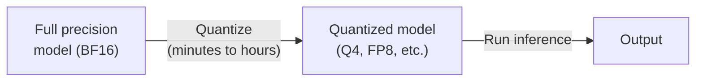
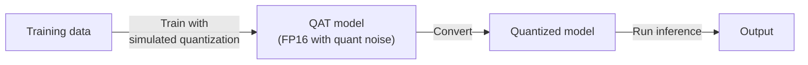
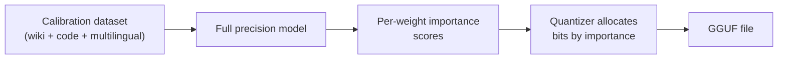
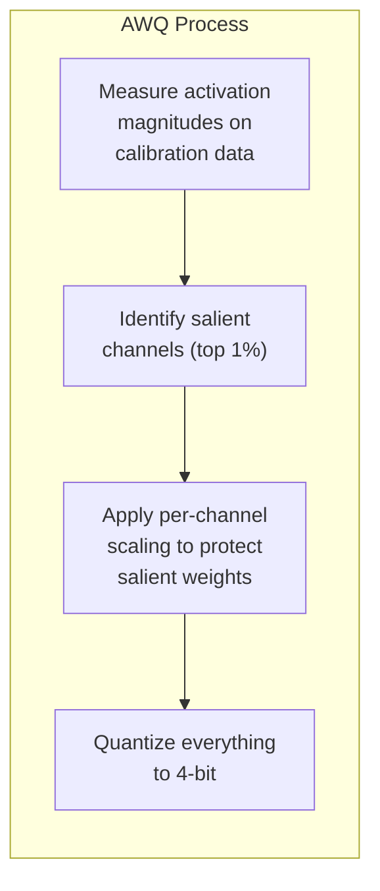
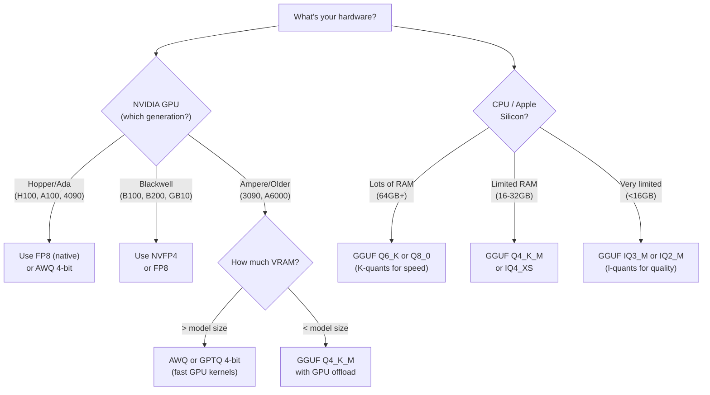

> This article is **Part 8 of 15** in the [Generative AI in Depth](/categories/generative-ai-in-depth/) series.
{: .prompt-info }


A 70B parameter model in FP16 weighs 140GB. That won't fit on any consumer GPU. Quantization is how you shrink it to 35GB (Q4) or even 18GB (Q2) — trading precision for the ability to actually run the model. But quantization isn't just "make numbers smaller." Different methods work differently on different architectures, and the wrong choice can turn a brilliant model into an incoherent mess.

This post covers the most widely used quantization formats in production today, explains why model architecture determines which quantizations work well, and uses Gemma 4 12B as a concrete case study with real file sizes from [Bartowski's GGUF quantizations](https://huggingface.co/bartowski/gemma-4-12B-it-GGUF).

> **Not covered in detail**: HQQ (zero-shot, no calibration), AQLM (vector quantization for extreme 2-bit), QuIP# (incoherence-based), SmoothQuant (activation-weight co-quantization), Marlin (vLLM's fast 4-bit kernel), and compressed-tensors (Neural Magic/vLLM native format). These are worth exploring if you're pushing the boundaries of quantization research.
{: .prompt-info }

---

## What Quantization Actually Does

Neural network weights are stored as numbers. The question is: how many bits per number?

| Precision | Bits | Bytes per weight | 12B model size | Description |
|---|---|---|---|---|
| FP32 | 32 | 4.0 | 48 GB | Full precision. Training default. |
| BF16 | 16 | 2.0 | 24 GB | Brain Float 16. Same range as FP32, less precision. Training/inference standard. |
| FP16 | 16 | 2.0 | 24 GB | Half precision. Slightly different range than BF16. |
| FP8 (E4M3) | 8 | 1.0 | 12 GB | 4-bit exponent, 3-bit mantissa. Native on Hopper/Ada GPUs. |
| INT8 | 8 | 1.0 | 12 GB | Integer quantization. Requires calibration. |
| INT4/Q4 | 4 | 0.5 | 6 GB | The sweet spot for consumer hardware. |
| Q2 | 2 | 0.25 | 3 GB | Extreme compression. Quality degrades noticeably. |

> This table is a simplification. Real quantization isn't uniform — different parts of the model get different bit-widths.
{: .prompt-warning }
---

## The Two Quantization Paradigms

### Post-Training Quantization (PTQ)

Take a pre-trained model and convert its weights to lower precision *after* training. No retraining needed. This is what most quantizations you download are.



### Quantization-Aware Training (QAT)

Train the model *knowing* it will be quantized. The model learns to be robust to precision loss during training itself. Better quality at the same bit-width, but requires retraining.



QAT models are rarer because retraining is expensive. Most quantized models you find on HuggingFace are PTQ.

---

## Every Major Quantization Format

### GGUF (llama.cpp) — The CPU/Edge Standard

GGUF is the format used by llama.cpp, LM Studio, Ollama, and most local inference tools. It uses a mix of **k-quants** and **i-quants** — different algorithms for converting weights to lower precision.

#### K-Quants (Q-series)

K-quants use **block quantization**: weights are grouped into blocks (typically 32 or 256 values), and each block gets its own scale factor and zero point. The "K" denotes mixed precision across different layer types.

**BPW (Bits Per Weight)** is the average number of bits used per parameter across the entire model. Since K-quants apply different precision to different layers (attention might get 5-bit while MLPs get 4-bit), the BPW is an average. It's the most useful size metric: `file size ≈ (num_params × BPW) / 8`.

| Format | Avg BPW | Strategy | Quality |
|---|---|---|---|
| **Q8_0** | 8.5 | 8-bit per block | Near-lossless. Unnecessary unless you need maximum quality. |
| **Q6_K** | 6.6 | 6-bit with mixed precision | Very high quality, near-perfect. |
| **Q5_K_M** | 5.7 | 5-bit, attention/MLP get different precision | High quality. Great balance. |
| **Q5_K_S** | 5.5 | 5-bit, uniform | High quality. |
| **Q4_K_M** | 4.8 | 4-bit, sensitive layers get 5-bit | **The default recommendation.** Best quality/size tradeoff for most users. |
| **Q4_K_S** | 4.6 | 4-bit, uniform | Good quality with more space savings. |
| **Q3_K_M** | 3.9 | 3-bit, mixed | Noticeable quality loss. Use only if memory-constrained. |
| **Q3_K_S** | 3.5 | 3-bit, uniform | Low quality, not recommended for most uses. |
| **Q2_K** | 3.3 | 2-bit with higher-precision scales | Very low quality. Surprisingly usable for simple tasks. |

The **"M"** in Q4_K_M means "medium" — attention layers and the first/last layers get slightly higher precision than MLP layers. **"S"** means "small" — all layers get the same (lower) precision. **"L"** variants (Q4_K_L, Q6_K_L) use Q8_0 specifically for the embedding and output layers, which are particularly sensitive.

#### I-Quants (IQ-series)

I-quants use **importance-aware quantization** — the importance matrix (imatrix) determines which weights matter most. They achieve better quality at the same bit-width as k-quants, especially below 4-bit.

| Format | Avg BPW | When to use |
|---|---|---|
| **IQ4_XS** | 4.3 | Similar to Q4_K_S but better quality at the cost of slower CPU inference |
| **IQ4_NL** | 4.5 | Non-linear quantization. Supports ARM online repacking. |
| **IQ3_M** | 3.4 | Comparable to Q3_K_M quality in a smaller file |
| **IQ3_XS** | 3.3 | Better than Q3_K_S at similar size |
| **IQ3_XXS** | 3.1 | Extreme 3-bit compression |
| **IQ2_M** | 2.7 | Uses state-of-the-art techniques. Surprisingly usable. |
| **IQ2_S** | 2.5 | Minimum viable quantization for coherent output. |

> **Rule of thumb**: Use K-quants above 4 bits. Below 4 bits, I-quants are meaningfully better, especially on GPU (cuBLAS/rocBLAS). On CPU, I-quants are slower than K-quants at the same bit-width — speed vs quality tradeoff.
{: .prompt-tip }

### The Importance Matrix (imatrix)

The importance matrix is the key innovation that makes aggressive quantization viable. Here's how it works:

1. **Calibrate**: Run a diverse text dataset through the full-precision model
2. **Measure**: For each weight, compute how much changing that weight affects the model's output (via activation statistics)
3. **Prioritize**: Weights with high importance scores get more bits; unimportant weights get fewer



**All of Bartowski's GGUF quantizations** use imatrix calibration. The calibration dataset is [publicly available](https://gist.github.com/bartowski1182/82ae9b520227f57d79ba04add13d0d0d) and includes a mix of English text, code, and diverse content.

**Why calibration data matters**: If you calibrate on English Wikipedia, the importance matrix optimizes for English prose. Code-related weights might get deprioritized. A code model calibrated on prose will perform worse on code than one calibrated on a mixed dataset.

> **Match calibration data to your use case.** If you're deploying primarily for code generation, include substantial code in the calibration dataset. If your users write in non-English languages, include multilingual data. GGUF calibration (like Bartowski's) uses a mixed English + code + multilingual dataset — a reasonable general-purpose choice, but not optimal for narrow domain deployments.
{: .prompt-warning }

---

### GPTQ — GPU-Optimized Post-Training Quantization

GPTQ (GPT Quantized) uses a second-order method based on the **Hessian matrix** to minimize the quantization error. Instead of just rounding weights to the nearest quantized value, it compensates: when one weight is rounded down, neighboring weights are adjusted upward to reduce the overall error.

```
Naive rounding:     weight 0.73 → 0.75 (nearest Q4 value)
                    Error accumulates independently per weight

GPTQ:              weight 0.73 → 0.75 (round)
                    weight 0.81 → 0.79 (compensate for previous rounding)
                    Error is minimized across the layer as a whole
```

| Property | Details |
|---|---|
| **Format** | Safetensors with quantization config |
| **Bit-widths** | 2, 3, 4, 8-bit |
| **Runtime** | GPU only (exllama, AutoGPTQ, vLLM, TGI) |
| **Calibration** | Required (128+ samples from a text dataset, typically [C4](https://huggingface.co/datasets/allenai/c4) — Google's Colossal Clean Crawled Corpus of web text) |
| **Speed** | Fast on GPU thanks to optimized CUDA kernels |
| **Quality** | Very good at 4-bit. Better than naive rounding, comparable to AWQ. |

---

### AWQ — Activation-Aware Weight Quantization

AWQ's insight: not all weights are equally important. A small fraction of weights (~1%) are **salient** — they correspond to large activation values and disproportionately affect the output. AWQ identifies these salient weights and protects them:



Instead of keeping salient weights at higher precision (which would require mixed-precision kernels), AWQ **scales** the weight matrix so that salient weights fall in a range where quantization error is minimal. Clever math trick that achieves protection without format complexity.

| Property | Details |
|---|---|
| **Format** | Safetensors with AWQ config |
| **Bit-widths** | 4-bit (primary), 3-bit experimental |
| **Runtime** | GPU only (vLLM, TGI, AutoAWQ) |
| **Speed** | Generally faster than GPTQ at same quality |
| **Quality** | Excellent at 4-bit. Often slightly better than GPTQ, especially on smaller models. |

---

### FP8 — Hardware-Native 8-Bit Float

FP8 isn't a software quantization trick — it's a **hardware data type** supported natively by NVIDIA Hopper (H100), Ada (RTX 4090), and newer GPUs. Two variants:

| Format | Exponent | Mantissa | Range | Precision | Use Case |
|---|---|---|---|---|---|
| **E4M3** | 4 bits | 3 bits | ±240 | 8 levels of precision | Weights and activations |
| **E5M2** | 5 bits | 2 bits | ±57,344 | 4 levels of precision | Gradients (wider range needed) |

Because it's a hardware type, FP8 operations run at **2× the throughput** of FP16 on H100 Tensor Cores. No quantization error distribution tricks needed — the hardware computes in FP8 directly.

| Property | Details |
|---|---|
| **Runtime** | NVIDIA Hopper/Ada/Blackwell GPUs, vLLM, TensorRT-LLM |
| **Quality** | <1% degradation on most benchmarks |
| **Speed** | 2× throughput vs FP16 on supported hardware |
| **Calibration** | Static (pre-computed scales) or dynamic (per-tensor at runtime) |

---

### NVFP4 & MXFP4 — 4-Bit Float (Blackwell)

NVIDIA's Blackwell architecture (B100, B200, GB10/DGX Spark) introduces native FP4 support via **microscaling** formats:

- **NVFP4**: NVIDIA's proprietary 4-bit float. Each group of weights shares a scaling factor.
- **MXFP4/MXFP8**: Open Microscaling formats (OCP standard). Groups of 32 elements share a scale stored in FP8.

These offer **4× throughput vs FP16** on Blackwell hardware. vLLM supports both.

---

### EXL2 — Mixed-Precision for ExLlamaV2

EXL2 is the quantization format for [ExLlamaV2](https://github.com/turboderp/exllamav2). Its killer feature: **arbitrary bits-per-weight (BPW)** with per-layer optimization.

Instead of quantizing the entire model to Q4 or Q5, EXL2 lets you specify a target average BPW (e.g., 4.5) and then allocates bits optimally across layers. Sensitive layers get more bits, tolerant layers get fewer.

| Property | Details |
|---|---|
| **Runtime** | ExLlamaV2 only (GPU) |
| **BPW range** | 2.0 to 8.0, arbitrary granularity |
| **Calibration** | Required, uses perplexity measurement per layer |
| **Speed** | Very fast on NVIDIA GPUs, optimized CUDA kernels |
| **Quality** | Best-in-class at any given BPW target due to per-layer optimization |

---

### BitsAndBytes — Integration-First Quantization

BitsAndBytes is the most widely used quantization library in the HuggingFace ecosystem, primarily for fine-tuning (QLoRA) rather than inference.

| Format | Bits | Description |
|---|---|---|
| **INT8** (LLM.int8()) | 8 | Mixed-precision decomposition. Outlier features stay in FP16. |
| **NF4** (Normal Float 4) | 4 | 4-bit data type optimized for normally-distributed weights. Used by QLoRA. |
| **FP4** | 4 | Standard 4-bit float. |

BitsAndBytes is slower for inference than GPTQ/AWQ because it doesn't have dedicated inference kernels. Its strength is enabling 4-bit fine-tuning (QLoRA) where you train LoRA adapters on a frozen 4-bit base model.

---

## Why Architecture Matters for Quantization

Here's the part most guides skip: **the same quantization format performs differently on different model architectures.** This isn't a minor effect — it can be the difference between "works great" and "useless."

### 1. Embedding and Output Layers Are Uniquely Sensitive

The embedding layer maps discrete token IDs to continuous vectors. The output (lm_head) layer maps hidden states back to vocabulary logits. These layers are qualitatively different from transformer layers:

- **Vocabulary is huge** (262,144 tokens in Gemma 4). Each row must distinguish one token from 262,143 others.
- **Small errors in output logits** shift probability mass between tokens, directly corrupting generation.
- **These layers can't be "averaged out"** — there's no redundancy.

This is why Bartowski provides `_L` variants (Q3_K_XL, Q4_K_L, Q6_K_L) that keep embedding/output weights at Q8_0 while quantizing everything else more aggressively. For Gemma 4 12B, the difference between Q3_K_L (6.65GB) and Q3_K_XL (6.90GB) is 250MB — the cost of protecting those two layers.

### 2. Attention vs MLP Sensitivity

In K-quant naming, the "M" (medium) variants give attention layers slightly higher precision than MLP layers. This reflects an empirical finding: attention weights are more sensitive to quantization than MLP weights.

**Why?** Attention weights (Q, K, V projections) directly compute what the model "looks at." A quantization error in Q·K^T distorts which tokens get attended to — and this error propagates through every subsequent layer. MLP weights transform representations locally — errors in one MLP don't cascade as severely.

### 3. Sliding Window vs Global Attention Layers

This is Gemma-specific but generalizable. Gemma 4 has two types of layers:
- **Sliding window layers** (40 of 48) — attend to last 1024 tokens
- **Global layers** (8 of 48) — attend to ALL tokens

Global layers are more quantization-sensitive because:
- They handle long-range information retrieval (system prompt recall, early context)
- Errors in global layers can't be compensated by later layers — there are only 8 of them
- They use MQA (single KV head) with larger head dimensions (512 vs 256), meaning each weight carries proportionally more information

### 4. MoE Models Need Special Care

In Mixture-of-Experts models (DeepSeek V3, Mixtral), only 2-8 of 256 experts activate per token. During calibration:
- Popular experts see lots of calibration data → accurate importance scores
- Rare experts see little data → noisy importance scores → worse quantization

This means MoE models can have **expert-dependent quality degradation**: most of the model quantizes well, but the rarely-activated experts (which handle niche knowledge) degrade disproportionately.

### 5. K=V Sharing Changes Quantization Math

Gemma 4 12B uses `attention_k_eq_v = true` — K and V are the **same tensor**. This means quantizing K implicitly quantizes V with the same error. In models where K and V are separate, their quantization errors are independent and can partially cancel out in the attention output. With K=V sharing, they correlate perfectly, amplifying the error.

This doesn't mean K=V sharing is bad — it halves the KV cache. But it means Gemma 4 may be **slightly more sensitive** to attention weight quantization than models with separate K and V projections.

---

## GPU vs CPU Quantization Considerations

| Factor | GPU (CUDA/ROCm) | CPU (AVX2/ARM) |
|---|---|---|
| **Best format** | GPTQ, AWQ, or FP8 for dedicated GPU; GGUF for llama.cpp | GGUF (K-quants for speed, I-quants for quality) |
| **Below 4-bit** | I-quants strongly preferred (cuBLAS optimized) | K-quants faster; I-quants slower but better quality |
| **FP8** | Native on Hopper/Ada, 2× throughput | Not applicable |
| **Q4_0 vs Q4_K_M** | Q4_K_M better quality | Q4_0 supports online repacking for ARM NEON (faster) |
| **Key bottleneck** | Memory bandwidth (reading weights from VRAM) | Memory bandwidth (reading weights from RAM) |

---

## KV Cache Quantization: Separate from Weight Quantization

Weight quantization is a one-time conversion. KV cache quantization happens **during inference** — the KV vectors generated at each step are quantized on-the-fly.

| Method | Compression | Quality Impact | Where Supported |
|---|---|---|---|
| **FP16 KV** (default) | 1× | Baseline | Everywhere |
| **FP8 KV** | 2× | <1% degradation | vLLM (Hopper+), TensorRT-LLM |
| **INT4 KV** (TurboQuant) | 4× | Noticeable on needle-in-haystack | vLLM (experimental) |
| **INT2 KV** (TurboQuant) | 8× | Model-dependent, under research | vLLM (experimental) |

KV cache quantization is independent of weight quantization. They compress different things:

```
Total GPU memory = model weights (quantized once) 
                 + KV cache (quantized during inference) 
                 + activation memory (not quantized)
```

### Mixed Precision Is Normal — But There Are Rules

During a single inference forward pass, a model routinely uses multiple numeric formats simultaneously — this is called **mixed precision** and is completely standard:

```
Weights in memory:     FP8 E4M3
        ↓
Tensor core multiply:  FP8 inputs → FP32 accumulator (hardware does this automatically)
        ↓
Output activations:    BF16 (cast down after accumulation)
        ↓
KV cache stored:       FP8, FP16, or INT8 (separate choice)
```

At any given moment, the GPU holds values in at least 3 different formats. Each format is chosen for what that value needs to do — fine precision for weights, wide range for accumulators, compressed for memory-bound KV cache.

### FP8 Weight + FP8 KV Cache: A Subtle Trap

You might expect that if your model weights are FP8, using FP8 for the KV cache too would be a natural pairing. In practice it's the most common FP8 misconfiguration.

The problem is **calibration scales**. A pre-calibrated FP8 checkpoint (like Qwen3.6's) doesn't just store weights in FP8 — it ships with pre-computed scaling factors that say "multiply this tensor by *this scale* to convert to BF16." Those scales were computed end-to-end assuming E4M3 throughout the weight→activation→KV data path.

When you try to store the KV cache in E5M2 instead:
1. You need a *second* set of calibration scales for the E4M3→E5M2 re-quantisation
2. The checkpoint doesn't have those scales — it only has E4M3 scales
3. vLLM detects this mismatch and rejects the configuration at model load time

| Scenario | Works? | Why |
|---|---|---|
| E4M3 weights + BF16 KV cache | ✅ | Standard |
| E4M3 weights + E4M3 KV cache (`--kv-cache-dtype auto`) | ✅ | One format, one calibration set |
| E4M3 weights + E5M2 KV cache | ❌ | vLLM raises a hard `ValueError` regardless of dynamic/static — it refuses to mix FP8 checkpoint scales with a different KV dtype |
| BF16 weights + E5M2 KV cache | ✅ | No pre-baked weight scales to conflict with; KV scales computed at runtime |

> **If you're using a pre-calibrated FP8 checkpoint (e.g., a quantized Qwen3 or Gemma 4 from Hugging Face), always set `--kv-cache-dtype auto`.** This tells vLLM to use the checkpoint's calibrated E4M3 format for the KV cache, avoiding the E5M2 mismatch error. Using any other explicit FP8 variant will fail at model load time with a `ValueError`.
{: .prompt-warning }

**Resolution**: Use `--kv-cache-dtype auto` — this tells vLLM to use the checkpoint's native format for both weights and KV cache, sharing the same calibrated scales throughout.

> **Note**: The `auto` setting means "match the checkpoint's weight dtype". For an FP8 E4M3 checkpoint, the KV cache will be stored in FP8 E4M3 — which gives you the 2× memory reduction anyway.
{: .prompt-tip }

---

## Case Study: Gemma 4 12B Quantization

### Available Quantizations

From [Bartowski's GGUF repo](https://huggingface.co/bartowski/gemma-4-12B-it-GGUF), all quantized with imatrix:

| Format | File Size | BPW | Compression | Quality Assessment |
|---|---|---|---|---|
| BF16 | 23.83 GB | 16.0 | 1× | Full precision baseline |
| Q8_0 | 12.67 GB | 8.5 | 1.9× | Near-lossless. Generally unnecessary. |
| Q6_K_L | 10.48 GB | 6.6 | 2.3× | Embed/output at Q8_0. Near-perfect. ✅ Recommended |
| Q6_K | 10.24 GB | 6.6 | 2.3× | Near-perfect. ✅ Recommended |
| Q5_K_L | 9.02 GB | 5.7 | 2.6× | Embed/output at Q8_0. High quality. ✅ Recommended |
| Q5_K_M | 8.77 GB | 5.7 | 2.7× | High quality. ✅ Recommended |
| Q4_K_L | 7.91 GB | 4.8 | 3.0× | Embed/output at Q8_0. Good quality. ✅ Recommended |
| Q4_K_M | 7.66 GB | 4.8 | 3.1× | **Default recommendation.** Best balance. ✅ |
| Q4_K_S | 7.17 GB | 4.6 | 3.3× | Slightly lower quality, more savings. ✅ |
| IQ4_XS | 6.78 GB | 4.3 | 3.5× | Better quality than Q4_K_S at smaller size. ✅ |
| Q3_K_XL | 6.90 GB | 3.9 | 3.5× | Embed/output at Q8_0. Usable. |
| Q3_K_L | 6.65 GB | 3.9 | 3.6× | Usable. Good for low RAM. |
| Q3_K_M | 6.30 GB | 3.9 | 3.8× | Low quality. |
| IQ3_M | 5.97 GB | 3.4 | 4.0× | Better than Q3_K_M at smaller size. |
| Q2_K_L | 5.32 GB | 3.3 | 4.5× | Embed/output at Q8_0. Very low but usable. |
| Q2_K | 5.08 GB | 3.3 | 4.7× | Very low quality. Surprisingly usable for simple tasks. |
| IQ2_M | 4.94 GB | 2.7 | 4.8× | SOTA techniques. Surprisingly usable. |
| IQ2_S | 4.71 GB | 2.5 | 5.1× | Minimum viable coherence. |

### Which Quantization for Gemma 4 12B?

The answer depends on your hardware:

| Hardware | VRAM/RAM | Recommended Quant | Reasoning |
|---|---|---|---|
| **RTX 4090 (24GB)** | 24 GB VRAM | Q6_K_L (10.48 GB) | Fits with room for 8K+ context KV cache |
| **RTX 3090/4080 (16GB)** | 16 GB VRAM | Q4_K_M (7.66 GB) | Fits with room for moderate context |
| **DGX Spark / GB10 (128GB unified)** | 128 GB | BF16 (23.83 GB) | Plenty of room, no need to quantize |
| **Apple M3 Max (96GB)** | 96 GB unified | Q8_0 or BF16 | Unified memory, run full precision |
| **Apple M4 (16GB)** | 16 GB unified | Q4_K_M (7.66 GB) | Tight fit, Q4 is the sweet spot |
| **CPU only (32GB RAM)** | 32 GB | Q4_K_M (7.66 GB) | K-quants are faster than I-quants on CPU |
| **CPU only (16GB RAM)** | 16 GB | IQ3_M (5.97 GB) | I-quants give better quality at this size |

### Gemma 4 Architecture Considerations

Gemma 4 12B has several architectural features that affect quantization decisions:

1. **Large vocabulary (262K tokens)**: The embedding layer is proportionally large. The `_L` variants that protect it at Q8_0 are worth the ~300MB premium.

2. **48 layers with 5:1 local:global ratio**: Only 8 global layers handle long-range attention. These 8 layers should ideally be protected at higher precision (which is what the "M" variants do — mixed precision across layer types).

3. **K=V sharing**: As discussed above, quantization errors in attention weights are amplified because K and V share the same quantized tensor. This makes Gemma 4 slightly more sensitive to attention quantization than models with separate K/V.

4. **Multimodal (vision encoder)**: The vision encoder has separate weights. GGUF quantization typically handles this, but check that your runtime supports Gemma 4's multimodal architecture.

5. **KV cache**: At 128K context, Gemma 4 uses ~2.4 GB for the KV cache (FP16). Using FP8 KV (`--kv-cache-dtype auto` with an FP8 checkpoint, or explicit FP8 with BF16 weights) cuts this to ~1.2 GB — worthwhile if you're targeting long contexts on a memory-constrained GPU.

> **Practical recommendation**: For Gemma 4 12B on consumer hardware, start with **Q4_K_M** (7.66 GB). If you notice quality issues on reasoning or long-context tasks, step up to **Q5_K_M** (8.77 GB). If you have the VRAM, **Q6_K_L** (10.48 GB) is near-indistinguishable from full precision and protects the large embedding layer.
{: .prompt-tip }

---

## The Full Quantization Decision Tree



---

## Summary: Format Selection Guide

| Format | Best For | Runtime | GPU Required? | Quality |
|---|---|---|---|---|
| **GGUF (K-quants)** | Local inference, CPU, mixed CPU+GPU | llama.cpp, Ollama, LM Studio | No | Good to excellent |
| **GGUF (I-quants)** | Aggressive compression (<4 bit) on GPU | llama.cpp with cuBLAS | Recommended | Better than K-quants at same BPW |
| **GPTQ** | GPU inference servers | vLLM, TGI, ExLlama | Yes | Very good |
| **AWQ** | GPU inference, slightly faster than GPTQ | vLLM, TGI, AutoAWQ | Yes | Very good to excellent |
| **EXL2** | Maximum quality at any target BPW | ExLlamaV2 only | Yes | Best-in-class |
| **FP8** | Production serving on Hopper+ | vLLM, TensorRT-LLM | Hopper/Ada+ | Near-lossless |
| **NVFP4** | Blackwell hardware | vLLM, TensorRT-LLM | Blackwell | Good (4× throughput) |
| **BitsAndBytes** | Fine-tuning (QLoRA), not inference | Transformers | Yes | Good for training |

---

## Further Reading

- [Artefact2's GGUF quality charts](https://gist.github.com/Artefact2/b5f810600771265fc1e39442288e8ec9) — Visual perplexity comparisons across quant types
- [llama.cpp feature matrix](https://github.com/ggml-org/llama.cpp/wiki/Feature-matrix) — Which quant types support which backends
- [GPTQ: Accurate Post-Training Quantization for Generative Pre-trained Transformers](https://arxiv.org/abs/2210.17323) — The original GPTQ paper
- [AWQ: Activation-aware Weight Quantization](https://arxiv.org/abs/2306.00978) — The original AWQ paper
- [Bartowski's imatrix calibration dataset](https://gist.github.com/bartowski1182/82ae9b520227f57d79ba04add13d0d0d) — The calibration data used for GGUF quantizations
- [Gemma 4 12B GGUF](https://huggingface.co/bartowski/gemma-4-12B-it-GGUF) — All quantizations used in this article
