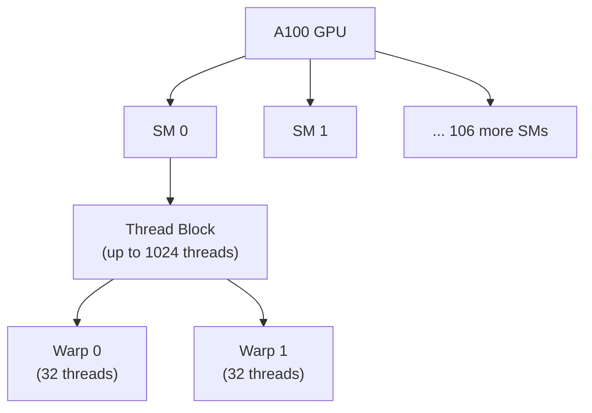
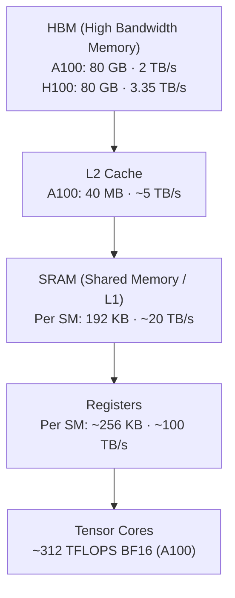
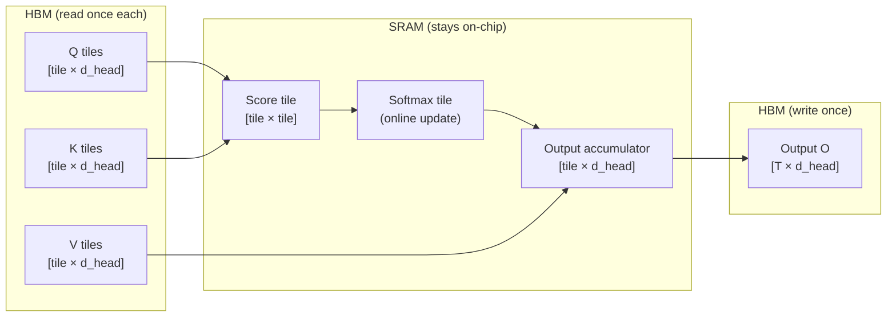
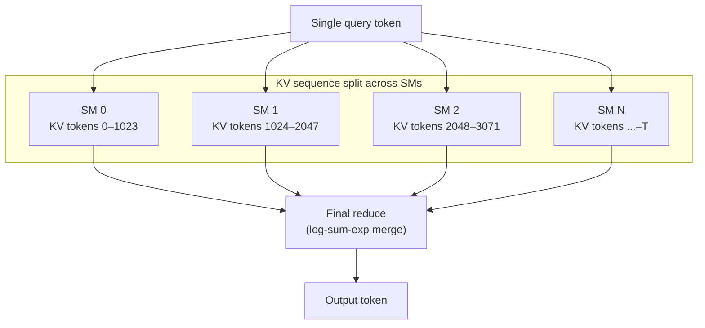

> This article is **Part 9 of 15** in the [Generative AI in Depth](/categories/generative-ai-in-depth/) series.
{: .prompt-info }


LLM inference is fast — but not because GPUs are good at computing. It's because GPUs have enormous memory bandwidth and framework engineers have spent years minimising how much data moves between memory and compute units. This article explains the hardware constraints, why standard attention is memory-bound, how FlashAttention solves it, and what kernel fusion means in practice.

We use Gemma 4 12B as the running example, grounding every claim in concrete numbers.

---

## What Is a CUDA Kernel?

A **CUDA kernel** is a function written in C++ (using NVIDIA's CUDA extension) that runs **on the GPU** rather than the CPU. When you call a normal Python function — say `torch.matmul(A, B)` — PyTorch internally launches one or more CUDA kernels that execute the actual computation on the GPU's cores.

The defining characteristic of a kernel is **massive parallelism**. Instead of a loop:

```c
// CPU: sequential loop
for (int i = 0; i < N; i++) {
    output[i] = input[i] * 2.0f;
}
```

A CUDA kernel expresses the same operation as a **single function body** that runs simultaneously across thousands of threads, each responsible for one element:

```cuda
// CUDA kernel: runs in parallel across N threads
__global__ void scale_kernel(float* output, const float* input, int N) {
    int i = blockIdx.x * blockDim.x + threadIdx.x;  // which element am I?
    if (i < N) {
        output[i] = input[i] * 2.0f;
    }
}

// Launch: 1024 threads process the array in parallel
scale_kernel<<<N/1024, 1024>>>(output, input, N);
```

The `<<<N/1024, 1024>>>` syntax is the **kernel launch configuration** — it specifies how many thread blocks to launch and how many threads per block. The GPU scheduler assigns blocks to available Streaming Multiprocessors (SMs) and runs them concurrently.

### Why kernels matter for LLMs

Every operation in a forward pass — the matrix multiplications in Q/K/V projections, the softmax, the RMSNorm, the GELU activation — is a separate kernel (or a fused group of kernels). Framework performance comes down to:

1. **How efficiently each kernel uses the GPU's memory bandwidth and compute** (this is what FlashAttention optimises)
2. **How many separate kernel launches are needed** (each launch has overhead; fusion reduces this)
3. **How much data is written to and read from HBM between kernels** (the core bottleneck for memory-bound operations)

PyTorch ships with general-purpose kernels that work for any shape and dtype. Frameworks like vLLM, TensorRT-LLM, and SGLang replace many of these with **custom kernels** — hand-written CUDA or Triton code tuned specifically for LLM inference shapes (large sequence lengths, specific head dimensions, quantised dtypes). The difference is typically 2–4× in throughput for the same hardware.

> **NVIDIA's moat is as much software as hardware.** CUDA has existed since 2006. In that time, the ecosystem has accumulated: cuBLAS (optimised BLAS for GPU), cuDNN (deep learning primitives), NCCL (multi-GPU communication), Nsight (profiling), CUTLASS (custom kernel templates), and millions of lines of CUDA kernel code across PyTorch, TensorFlow, JAX, vLLM, TensorRT, and every other framework. FlashAttention-3 specifically targets H100 hardware features (the Tensor Memory Accelerator, asynchronous WGMMA instructions) that have no equivalent on other vendors — it is non-portable by design. When AMD or Intel release competitive hardware, the bottleneck is not the chip: it's that none of this software runs on it natively. ROCm (AMD's CUDA equivalent) supports a large subset of CUDA APIs via HIP translation, but library coverage, kernel tuning, and profiling tooling still lag. Switching hardware requires either rewriting kernels or accepting worse utilisation of the new chip's actual capabilities. This is the software moat: **you can copy the transistors, but not the 18 years of kernel libraries, developer muscle memory, and hardware-specific optimisations built on top of them.**
{: .prompt-info }

---

## The GPU Programming Model

Before talking about memory, it helps to understand how GPUs execute work.

An A100 GPU has **108 Streaming Multiprocessors (SMs)**. Each SM can run thousands of threads simultaneously. Threads are organised into groups of 32 called **warps** — the fundamental unit of GPU execution. All 32 threads in a warp execute the same instruction simultaneously (SIMT: Single Instruction, Multiple Threads).



When you launch a CUDA kernel, you specify a **grid** of thread blocks. Each block is assigned to one SM. Blocks cannot communicate with each other during execution — they only communicate via HBM. Within a block, threads can communicate via **shared memory** (SRAM), which is the fast on-chip memory.

This hierarchy directly shapes kernel design: operations that need to cooperate must be in the same thread block (and thus fit in one SM's shared memory). Operations across blocks communicate expensively through HBM.

### Warp Divergence

All 32 threads in a warp execute the **same instruction at the same time**. This is what makes GPUs fast — one instruction dispatches work across 32 threads simultaneously. But it creates a problem when threads need to take different code paths.

If a warp encounters a branch where some threads should go left and others right, the GPU has no choice but to run **both branches serially**, masking off the inactive threads during each pass. A 50/50 split halves the effective throughput of that warp.

**The causal masking problem**

In the attention score computation, each thread typically handles one `(query position i, key position j)` pair. For a decoder-only model, positions where `j > i` must be masked — token `i` cannot attend to future token `j`. A naive implementation branches on this:

```cuda
// Each thread computes one (i, j) score
if (j > i) {
    score = -INFINITY;   // future token: mask out
} else {
    score = dot(Q[i], K[j]) / sqrtf(d_head);  // past/present: attend
}
```

The problem: threads within a warp compute adjacent `(i, j)` pairs. When `i` and `j` are close to the diagonal of the attention matrix, some pairs will have `j > i` and some `j <= i` — the warp diverges.

```
Attention matrix (T=8):

         j=0  j=1  j=2  j=3  j=4  j=5  j=6  j=7
i=0  [   ✓    ✗    ✗    ✗    ✗    ✗    ✗    ✗  ]
i=1  [   ✓    ✓    ✗    ✗    ✗    ✗    ✗    ✗  ]
i=2  [   ✓    ✓    ✓    ✗    ✗    ✗    ✗    ✗  ]
i=3  [   ✓    ✓    ✓    ✓    ✗    ✗    ✗    ✗  ]
i=4  [   ✓    ✓    ✓    ✓    ✓    ✗    ✗    ✗  ]
i=5  [   ✓    ✓    ✓    ✓    ✓    ✓    ✗    ✗  ]
i=6  [   ✓    ✓    ✓    ✓    ✓    ✓    ✓    ✗  ]
i=7  [   ✓    ✓    ✓    ✓    ✓    ✓    ✓    ✓  ]

✓ = compute score   ✗ = mask to -∞
The boundary is diagonal: row i attends to columns 0..i, masks i+1..T-1.
Threads near the diagonal see mixed ✓/✗ within the same warp → divergence.
```

**How FlashAttention avoids it**

FlashAttention operates on **tiles** rather than individual `(i, j)` pairs. Each tile is a rectangular block of the attention matrix. Instead of checking each element, it classifies entire tiles:

- **Tiles fully below the diagonal**: every `(i, j)` pair satisfies `j ≤ i` — all threads attend, no branch needed
- **Tiles fully above the diagonal**: every pair satisfies `j > i` — the tile is **skipped entirely** (no compute, no divergence)
- **Diagonal tiles** (where the boundary passes through): masking is applied, some threads diverge — but this is unavoidable and affects only a small fraction of tiles

For T=1024 with tile size 64: the matrix is 16×16 = 256 tiles. Only the 16 diagonal tiles require masking. The 120 tiles below the diagonal run at full throughput; the 120 above are skipped. **Divergence affects only ~6% of tiles** — a tiny cost compared to the naive per-element branch.

This design principle — moving branches from the thread level (where divergence is immediate) to the tile level (where tiles can be classified branch-free) — is a recurring pattern in high-performance GPU kernels. The same idea applies to quantisation (apply dequantisation per-block, not per-element) and sparse attention masks.

---

## The GPU Memory Hierarchy

A modern GPU (A100, H100) has three tiers of memory, with dramatically different sizes, bandwidths, and latencies:



| Memory tier | A100 capacity | A100 bandwidth | Latency |
|-------------|--------------|----------------|---------|
| HBM (DRAM)  | 80 GB        | 2 TB/s         | ~600 ns |
| L2 cache    | 40 MB        | ~5 TB/s        | ~50 ns  |
| SRAM (per SM) | 192 KB     | ~20 TB/s       | ~5 ns   |
| Registers   | ~256 KB/SM   | ~100 TB/s      | ~1 ns   |

The key tension: **per-SM SRAM is ~10× higher bandwidth than HBM** (20 TB/s vs 2 TB/s) and **~120× lower latency** (5 ns vs 600 ns) — but **~437,000× smaller per SM** (192 KB vs 80 GB). Every kernel design decision is essentially about how to maximise SRAM reuse and minimise HBM round-trips.

### Memory coalescing

Threads within a warp access memory simultaneously. When all 32 threads in a warp access consecutive memory addresses, the hardware coalesces these into a single HBM transaction — maximally efficient. When threads access scattered addresses, each access becomes a separate transaction, potentially using 32× the bandwidth for the same amount of data.

For LLM weight matrices stored in row-major order:
- Accessing a row across threads (consecutive in memory) → coalesced ✓
- Accessing a column across threads (strided in memory) → non-coalesced ✗

This is why weight matrix transpositions in attention (`Q @ Kᵀ`) must be handled carefully — simply transposing in memory is expensive. Frameworks instead pass transpose flags to matrix multiply kernels that handle access patterns internally.

---

## Compute-Bound vs Memory-Bandwidth Bound

Every GPU operation falls somewhere on a spectrum between two limits:

- **Compute-bound**: the bottleneck is the tensor core throughput (TFLOPS). Adding more compute without changing data movement doesn't help; reducing data movement doesn't help either.
- **Memory-bandwidth bound**: the bottleneck is how fast data can be read from and written to HBM. The tensor cores sit idle waiting for data.

The **arithmetic intensity** (AI) of an operation determines where it falls:

```
Arithmetic intensity = FLOPs performed / bytes read+written from HBM
```

If AI > hardware roofline threshold → compute-bound
If AI < hardware roofline threshold → memory-bandwidth bound

### The roofline threshold

```
A100:
  Peak compute (BF16): ~312 TFLOPS = 312 × 10¹² FLOPs/s
  Peak bandwidth:       2 TB/s     = 2   × 10¹² bytes/s
  Roofline threshold:  312 / 2 = 156 FLOPs per byte

H100 SXM:
  Peak compute (BF16): ~990 TFLOPS
  Peak bandwidth:      3.35 TB/s
  Roofline threshold:  990 / 3.35 ≈ 295 FLOPs per byte
```

Any operation with arithmetic intensity above the threshold is compute-bound. Below it, it's memory-bandwidth bound. H100's threshold is higher, which means more operations are memory-bound on H100 than on A100 (the compute gain outpaced the bandwidth gain).

### Where LLM operations fall

**Matrix multiplication** (the dominant operation in Q/K/V projections, FFN):

For a `[1 × 3840] @ [3840 × 4096]` projection (one decode step, B=1):

Each output element requires 3840 multiplications and 3840 additions = 2 × 3840 operations. There are 1 × 4096 output elements. So:

```
FLOPs = 2 × output_rows × output_cols × inner_dim
      = 2 ×     1       ×    4096     ×   3840
      = 31.5M FLOPs

Bytes read/written from HBM:
  Weight matrix : 3840 × 4096 elements × 2 bytes (BF16) = 31.46 MB
  Input vector  : 1 × 3840 elements × 2 bytes           = 0.008 MB  (≈ negligible)
  Output vector : 1 × 4096 elements × 2 bytes           = 0.008 MB  (≈ negligible)
  Total ≈ 31.5 MB

AI = 31.5M FLOPs / 31.5 MB = ~1 FLOPs/byte
```

The weight matrix completely dominates the byte count — 3840 × 4096 × 2 bytes = 31.46 MB, while the input and output vectors together are ~16 KB. For a single request, generating one token means reading the entire weight matrix to produce a tiny 8 KB output.

This is **drastically below the 156 FLOPs/byte roofline**. During the decode step, the model spends its time reading weight matrices from HBM — the tensor cores are mostly idle.

With B=32 (32 concurrent requests), the weight matrix is still read once, but the work done against it multiplies by 32:

```
FLOPs = 2 × 32 × 4096 × 3840 = 1,006M FLOPs

Bytes:
  Weight matrix : 3840 × 4096 × 2 = 31.46 MB  (same as B=1 — read once)
  Output matrix : 32  × 4096 × 2 = 0.25 MB   (32 output rows now)
  Total ≈ 32 MB

AI = 1,006M / 32M ≈ 31 FLOPs/byte
```

Still below the roofline (156), but improving. This is why serving throughput scales well with batch size — and why continuous batching (maximising effective batch size) is so valuable.

> **Why batch size is the key lever for decode throughput.** The weight matrix (31.46 MB) is read from HBM once per decode step regardless of batch size. Every additional request in the batch performs more FLOPs against the same bytes:
>
> | Batch size | FLOPs | Bytes (HBM) | AI (FLOPs/byte) | Status vs A100 |
> |---|---|---|---|---|
> | B=1 | 31.5M | ~31.5 MB | ~1 | deeply memory-bound |
> | B=4 | 126M | ~31.5 MB | ~4 | memory-bound |
> | B=16 | 503M | ~31.7 MB | ~16 | memory-bound |
> | B=32 | 1,006M | ~31.9 MB | ~31 | memory-bound |
> | B=64 | 2,013M | ~32.5 MB | ~62 | memory-bound |
> | B=156 | 4,906M | ~34.0 MB | ~144 | approaching roofline |
> | B=512 | 16.1B | ~36.2 MB | ~445 | **compute-bound** |
>
> The weights are fixed; FLOPs grow with B; bytes barely grow (output is tiny). So AI ≈ B. Adding the 16th request to a batch of 15 costs almost nothing in extra memory traffic but adds a full share of compute work — that's nearly free throughput.
{: .prompt-info }

**This holds equally for requests from different users.** Weight matrices are model parameters — they are the same tensor for every request from any user. The batched multiply is `[B × d_model] @ [d_model × d_out]`: each row of the left matrix is one user's current token hidden state (~7.5 KB), and the right matrix is the shared weight (31.46 MB), read once regardless of whether B=32 represents 32 requests from one user or one request each from 32 different users. This is precisely why continuous batching works as a serving strategy — it deliberately aggregates requests from many users into each decode step to amortise that single expensive weight read.

### Prefill vs decode: two different hardware problems

The roofline analysis reveals a key asymmetry between the two phases of LLM inference:

**Prefill** processes all T prompt tokens simultaneously. The Q/K/V projection matmul is `[T × d_model] @ [d_model × d_head]`:

```
FLOPs: 2 × T × d_model × d_head
Bytes: d_model × d_head × 2  (weights, read once)  +  T × d_head × 2  (output)
AI    ≈ 2 × T × d_model × d_head / (d_model × d_head × 2)
      = T  FLOPs/byte
```

At T=1024 tokens, AI ≈ 1024 FLOPs/byte — **well above the A100 roofline of 156**. Prefill is compute-bound. The tensor cores are fully utilised.

**Decode** generates one token. The same projection becomes `[1 × d_model] @ [d_model × d_head]`:

```
AI ≈ 1 FLOPs/byte
```

Decode is **150× below** the roofline. The tensor cores idle while waiting for weight matrices to stream from HBM.

| Phase | Query shape | AI (FLOPs/byte) | Bottleneck | Hardware want |
|---|---|---|---|---|
| Prefill (T=1024) | [1024 × d] | ~1024 | Compute | High TFLOPS (H100 SXM) |
| Decode (B=1) | [1 × d] | ~1 | Memory BW | High HBM bandwidth |
| Decode (B=32) | [32 × d] | ~32 | Memory BW | High HBM bandwidth |

This asymmetry is the reason **disaggregated prefill/decode** exists: run prefill on high-compute GPUs (H100 SXM with high TFLOPS), run decode on high-bandwidth GPUs (or A100s serving large batches). It's also why chunked prefill — breaking long prefills into chunks — meaningfully shifts the compute balance of the running batch.

**Self-attention** (the softmax and score computation) is also memory-bandwidth bound — but for a different reason.

---

## Standard Attention: Why It's Slow

The standard attention computation (as described in [Inside LLM Inference](/posts/decoder-forward-pass-dimensions)) works like this:

```
step 1: S = Q @ Kᵀ          [T × T] attention scores
step 2: S = S / √d_head      scale
step 3: P = softmax(S)       [T × T] probabilities
step 4: O = P @ V            [T × d_head] output
```

For a local Gemma 4 12B layer during prefill with T=1024 tokens, each of 16 query heads:

```
S matrix: [1024 × 1024] = 1M values = 2 MB (BF16)
P matrix: [1024 × 1024] = 1M values = 2 MB (BF16)
```

The naive implementation writes S to HBM after step 1, reads it back for softmax in step 3, writes P to HBM, reads it back for the matmul in step 4. For all 16 heads across 40 local layers:

```
HBM reads/writes for attention scores alone:
16 heads × 40 layers × (write S + read S + write P + read P)
= 16 × 40 × 4 × 2 MB = 5,120 MB = 5 GB of HBM traffic
```

At 2 TB/s bandwidth (which is reasonably high, for e.g. GB10 Blackwell only has around 300 GB/s!!), this alone takes 2.5 milliseconds. The actual matmul FLOPs take far less time than this memory movement — the compute is starved waiting for data.

The arithmetic intensity of the score computation:
```
Q @ Kᵀ: FLOPs = 2 × T × T × d_head = 2 × 1024 × 1024 × 256 ≈ 537M FLOPs
Bytes read: Q + K = 2 × T × d_head × 2 bytes = 2 × 1024 × 256 × 2 = 1 MB
Bytes written: S = T × T × 2 = 2 MB
AI ≈ 537M / 3M ≈ 179 FLOPs/byte  ← marginally above roofline (156)
```

Interestingly, the raw Q@Kᵀ multiply is just barely compute-bound. The problem is the subsequent softmax (element-wise, trivially memory-bound) and P@V, plus all the HBM round-trips between steps.

---

## FlashAttention: IO-Aware Attention

> **This section assumes familiarity with the standard attention mechanism.** If the terms Q, K, V, softmax attention, or KV cache are unfamiliar, read these first:
> - [Inside LLM Inference](/posts/decoder-forward-pass-dimensions) — what Q, K, V are and how attention fits into the forward pass
> - [Attention Mechanisms and KV Cache](/posts/attention-mechanisms-and-kv-architectures) — the standard attention computation this section optimises
> - [The Memory Math](/posts/llm-memory-math) — why HBM capacity and bandwidth are the binding constraints
>
> The FlashAttention algorithm is mathematically non-trivial. The tiling and online softmax sections in particular are dense — it may help to read them slowly, with the diagrams as reference.
{: .prompt-warning }

FlashAttention (Dao et al., 2022) restructures the attention computation to eliminate most of these HBM round-trips by keeping intermediate results in SRAM.

### The key insight: fused tiling

Instead of computing the full `[T × T]` score matrix and writing it to HBM, FlashAttention processes the Q, K, V matrices in **tiles** that fit in SRAM, computing the softmax incrementally as tiles are processed.



Each tile of Q, K, V is read from HBM **once**. The score matrix and softmax probabilities are computed and discarded within SRAM — they never touch HBM. Only the final output O is written back.

### Online softmax

The mathematical trick that makes this work is **online softmax** (based on the log-sum-exp identity). When computing `softmax` over a sequence, you normally need to see all scores before normalising. Online softmax maintains a running maximum and normalisation factor that can be updated incrementally as new tiles arrive:

```
After tile 1:
  m₁ = max(S_tile_1)                    ← running max
  l₁ = sum(exp(S_tile_1 - m₁))         ← running normaliser
  O₁ = (1/l₁) × (exp(S_tile_1 - m₁) @ V_tile_1)

After tile 2:
  m₂ = max(m₁, max(S_tile_2))           ← update max
  l₂ = l₁ × exp(m₁ - m₂) + sum(exp(S_tile_2 - m₂))
  O₂ = (1/l₂) × [ l₁ × exp(m₁-m₂) × O₁  +  exp(S_tile_2-m₂) @ V_tile_2 ]

After all tiles: O₂ is the correct softmax-weighted output
```

The final result is mathematically identical to the standard computation, but the intermediate `[T × T]` matrix is never materialised in HBM.

### Tile size constraints

The tile size is limited by SRAM capacity. For one A100 SM with 192 KB of shared memory, running one attention head with d_head=256 (Gemma 4 12B local):

```
One tile of Q: tile × 256 × 2 bytes
One tile of K: tile × 256 × 2 bytes
One tile of V: tile × 256 × 2 bytes
Score tile:    tile × tile × 2 bytes
Output acc:    tile × 256 × 4 bytes (FP32 accumulator)

Setting tile=64:
  Q + K + V: 3 × 64 × 256 × 2 = 98,304 bytes
  Scores:        64 × 64 × 2 = 8,192 bytes
  Output:        64 × 256 × 4 = 65,536 bytes
  Total: ~172 KB  ← fits in 192 KB SRAM ✓
```

### HBM traffic comparison

| Method | HBM reads+writes | Asymptotic | Time (A100, T=1024, 16 heads, local layer) |
|--------|-----------------|------------|---------------------------------------------|
| Standard attention | O(T² · d_head) | ~5 GB total (all local heads) | ~2.5 ms |
| FlashAttention | O(T · d_head · layers/batch) | ~300 MB | ~0.15 ms |

For T=1024, FlashAttention reduces attention memory traffic by roughly 16×. The benefit scales with T — at T=8192 the standard method would move 20× more data than FlashAttention.

> FlashAttention's reduction from O(T²) to O(T) HBM traffic is why long-context models became practical. Without it, a 256K-context window would require hundreds of gigabytes of HBM traffic per attention layer per forward pass.
{: .prompt-info }

### FlashAttention 2 and 3

**FlashAttention 2** (Dao, 2023) improves over FA1 by:
- Reducing non-matmul FLOPs in the online softmax update (the rescaling operations)
- Better partitioning of work across warps: separate warps handle Q (outer loop) vs K/V (inner loop), reducing synchronisation overhead
- Causal masking applied only to diagonal tiles, skipping it for off-diagonal tiles
- Result: ~2× throughput improvement over FA1 on A100

**FlashAttention 3** (Shah et al., 2024), targeting H100:
- Exploits H100's asynchronous memory copy engine (can overlap HBM loads with tensor core computation)
- Uses H100's FP8 tensor cores for the score computation
- Exploits H100's second-generation Tensor Memory Accelerator (TMA) for coalesced block loads
- Result: ~1.5–2× throughput improvement over FA2 on H100, approaching ~75% of peak H100 throughput

### Flash-Decoding

FlashAttention tiles across the **query dimension** — the outer loop iterates over Q tiles, with each tile processed by a thread block. For prefill (T_q large), this means many Q tiles and good SM utilisation. For decode, T_q = 1. There is exactly **one query token** and therefore one Q tile. Every SM except one sits idle while the single tile is computed.

**Flash-Decoding** (Tri Dao et al., 2023) re-parallelises attention for the decode case by splitting over the **KV sequence dimension** instead:



Each SM independently computes partial attention over its KV slice, recording a partial output and its local log-sum-exp normaliser. A fast final reduction step (itself a tiny kernel) merges the partials using the same online softmax identity that FlashAttention uses within tiles:

```
Partial output from SM_i:   O_i, log_lse_i
Merge step:
  lse_total = log(sum(exp(log_lse_i)))   ← log-sum-exp of partial normalisers
  O = sum(O_i × exp(log_lse_i - lse_total))   ← re-weighted sum
```

This is mathematically identical to single-SM attention — the result is exact.

**Why it matters for long contexts**: At KV length = 32K tokens, a standard FA2 decode kernel runs on 1 SM. Flash-Decoding can split this across 32 SMs, each handling 1K tokens — a 32× SM utilisation improvement. Benchmarks show up to **8× speedup** over FA2 for decode at long KV lengths with batch=1.

Flash-Decoding is now the default attention kernel for the decode phase in vLLM, SGLang, and TensorRT-LLM. For short KV lengths (≤ 512 tokens), it degrades gracefully to standard FA2 behaviour.

---

## Kernel Fusion

Beyond FlashAttention, the broader technique of **kernel fusion** applies to many other parts of the forward pass.

A GPU **kernel** is a function that runs on the GPU. Every kernel launch has overhead (scheduling, memory setup), and every time a kernel writes to HBM for another kernel to read, that's wasted bandwidth.

Kernel fusion merges multiple sequential operations into a single kernel that keeps intermediate results in registers or SRAM.

### Example: GeGLU FFN fusion

The GeGLU FFN in Gemma 4 12B runs four operations:

```
gate   = x @ W_gate     → [T × 15,360]
up     = x @ W_up       → [T × 15,360]
hidden = GELU(gate) × up → [T × 15,360]    ← element-wise
out    = hidden @ W_down → [T × 3,840]
```

Without fusion, the `[T × 15,360]` intermediate tensors `gate`, `up`, and `hidden` are each written to HBM and read back:

```
HBM traffic: 3 × T × 15,360 × 2 bytes = 3 × 30 MB = 90 MB (at T=1024, BF16)
```

With a fused kernel that computes `GELU(gate) × up` inside SRAM immediately after each tile of the matrix multiplies:

```
HBM traffic: T × 15,360 × 2 bytes = 30 MB  (only the final hidden written once)
```

A 3× reduction in HBM traffic for this step alone.

### RMSNorm fusion

RMSNorm operates element-wise: compute the root-mean-square of each token's hidden state vector, then divide. For Gemma 4 12B:

```
RMSNorm per token: [1 × 3,840]
  step 1: rms = sqrt(mean(x²))      ← one pass through x (read)
  step 2: x_norm = x / rms          ← another pass (read + write)
  step 3: x_scaled = x_norm × gain  ← element-wise (read + write)
```

Without fusion: 3 HBM passes × 3,840 × 2 bytes = 23 KB per token, negligible but multiplied by 48 layers × every decode step. Fused: one pass (read once, write once = 7.7 KB per token per norm).

### What is typically fused in production

| Operation group | What gets fused |
|---|---|
| Attention | Q/K/V projection → RoPE → FlashAttention → output projection |
| FFN | gate/up matmul → GELU activation → element-wise multiply → (tile into down projection) |
| Residual + norm | add residual → RMSNorm (one pass) |
| Sampling | logit computation → temperature scaling → top-p filtering → sampling |
| Embedding | lookup → rotary position embedding |

The extent of fusion depends on the framework. vLLM, TensorRT-LLM, and SGLang all have custom fused kernels for these operations. The unfused PyTorch eager mode baseline is typically 2–4× slower for the same model.

### PagedAttention Kernel Considerations

FlashAttention assumes K and V are stored as **contiguous tensors** in HBM — a single array of `[T × d_head]` values that can be streamed sequentially. This enables memory coalescing: 32 warp threads reading 32 consecutive K vectors = 1 HBM transaction.

PagedAttention breaks this assumption. KV cache is stored in **non-contiguous blocks** of 16–32 tokens each, scattered across HBM. A block table maps (request, layer, block_index) → physical_block_address. To compute attention for request A, the kernel must follow a series of pointer dereferences:

```
For each block in request A's block table:
    physical_addr = block_table[request_id][layer][block_idx]
    load K_block = HBM[physical_addr : physical_addr + block_size × d_head × 2]
    load V_block = HBM[physical_addr + offset : ...]
    compute partial attention score
```

The physical addresses of consecutive blocks may be far apart in HBM. If a warp processes multiple requests simultaneously, threads read from completely different physical locations — each access is a separate HBM transaction rather than a coalesced one.

Production PagedAttention kernels handle this with a two-phase approach:

1. **Gather phase**: each warp reads the block table into SRAM — these addresses are small (a few KB) and coalesced within the table itself
2. **Compute phase**: within each block, K and V values are contiguous (blocks are allocated as contiguous units). The kernel uses the pre-loaded addresses to stream each block sequentially — coalesced within the block, non-coalesced between blocks

The result: PagedAttention has slightly lower peak memory bandwidth utilisation than contiguous FlashAttention (~85–90% vs ~95% of theoretical peak) due to inter-block pointer chasing, but the elimination of KV fragmentation (recovering 20–30% of VRAM) more than compensates in overall throughput.

---

## CUDA Graph Capture

Kernel fusion reduces HBM round-trips *within* a sequence of operations. But each kernel launch — even a fused one — still carries **CPU-side dispatch overhead**.

Every kernel launch requires the CPU to validate kernel arguments, enqueue the kernel onto the CUDA stream, and signal the GPU driver. For small kernels (RMSNorm, residual add), this overhead (~5–15μs per launch) can exceed the actual GPU execution time.

A single decode step through Gemma 4 12B launches roughly:

```
48 layers × ~5 kernels (Q/K/V proj, FlashAttention, O proj, rotary) = 240
48 layers × ~3 kernels (gate+up, GELU×up, down)                     = 144
48 layers × ~2 kernels (pre/post-attention RMSNorm)                  = 96
Sampling + embedding                                                  =   5
                                                          Total ≈ 485 launches

At ~10μs per launch: 4.85ms of CPU dispatch overhead per token
GPU execution time at B=1: ~5–8ms
```

The CPU is spending roughly as much time *dispatching* work as the GPU spends *executing* it. The GPU idles while the CPU fills the stream queue one kernel at a time.

### How CUDA Graph Capture works

CUDA Graphs (introduced in CUDA 10) solve this by recording and then replaying the entire launch sequence as a single GPU command.

**Step 1: Capture phase (runs once at startup)**

```python
stream = torch.cuda.Stream()
graph  = torch.cuda.CUDAGraph()

with torch.cuda.graph(graph, stream=stream):
    # Full forward pass runs here — recording kernel calls, not executing
    output = model.forward(input_template)

# graph now encodes the exact sequence of ~485 kernel launches,
# their arguments, and the tensor addresses they operate on
```

**Step 2: Replay phase (every decode step)**

```python
# Update the input data in-place — same memory address, new content
input_template.copy_(new_tokens)

# One CPU call triggers all ~485 kernels on the GPU
graph.replay()
```

The entire step runs as a single GPU command. CPU overhead collapses from ~485 × 10μs = **4.85ms** to a single dispatch of **~10μs** — a ~500× reduction.

### The constraint: static shapes and memory addresses

The graph records tensor *addresses*, not values. During replay, every tensor must be at the same address with the same shape as during capture. This means:

- Batch size must be fixed (different batch size = different tensor shapes)
- Sequence length must be fixed (or padded)
- No dynamic control flow that branches on runtime tensor values

For LLM serving, batch size changes constantly as requests arrive and complete. Production inference servers solve this with **batch-size bucketing** — capturing separate graphs for a fixed set of batch sizes, then rounding the current batch up to the nearest captured size. For example, [vLLM](https://github.com/vllm-project/vllm) — the most widely deployed open-source LLM inference server, which we cover in depth in the [vLLM Deep Dive Series](/tags/vllm-deep-dive-series) — uses the following approach:

```
Captured graphs:  B = 1, 2, 4, 8, 16, 32, 64, 128, 256

Incoming batch of B=20:
  → Use B=32 graph (nearest bucket ≥ 20)
  → 12 padding slots compute but results are discarded
  → Still ~15× faster than 20 un-graphed steps
```

Each captured graph requires its own set of static buffers. The default bucket set above adds roughly **200–500 MB** to baseline VRAM — which is why graph capture can be disabled on very small GPU budgets (in vLLM, `--enforce-eager` turns it off).

### Full capture vs piecewise capture

| Mode | What it records | Overhead | Handles dynamic shapes? |
|---|---|---|---|
| **Full capture** | Entire forward pass as one graph | Lowest replay overhead | No — batch size must match exactly |
| **Piecewise capture** | Each attention/FFN block as a sub-graph | Slightly higher overhead | Yes — sub-graphs composed at runtime |

vLLM defaults to piecewise capture. Each layer's attention and FFN blocks are captured separately; the scheduler composes them per batch at runtime without re-capturing. The overhead difference is typically <5% vs full capture.

### Interaction with kernel fusion and torch.compile

CUDA Graph Capture and kernel fusion target different overheads and work together:

```
Without either:
  485 kernel launches × 10μs CPU overhead  = 4.85ms overhead
  485 kernels × variable GPU time          = ~7ms GPU work
  Total: ~12ms/token

With kernel fusion (torch.compile fuses ~60% of small kernels):
  ~200 kernel launches × 10μs             = 2ms overhead
  ~200 fused kernels                       = ~6ms GPU work
  Total: ~8ms/token

With both fusion + CUDA Graph Capture:
  1 graph replay × 10μs                   = 0.01ms overhead
  ~200 fused kernels (recorded)            = ~6ms GPU work
  Total: ~6.01ms/token
```

`torch.compile` reduces the *number* of kernels by merging element-wise operations; CUDA Graphs then eliminate the launch overhead for whichever kernels remain. In vLLM, both are typically active simultaneously.

> The speedup from CUDA Graphs is largest at **small batch sizes**, where GPU execution time is short and CPU launch overhead dominates. At B=64, GPU execution time swamps the ~5ms launch overhead and graph capture provides marginal improvement. At B=1, the CPU overhead is nearly half the total step time — capturing it is critical.
{: .prompt-info }

---

## Tensor Cores and Shape Requirements

GPU tensor cores operate on fixed-size tiles. On A100 (BF16), the native MMA (Matrix Multiply Accumulate) instruction shape is:

```
16 × 16 × 16:  input_A [16×16], input_B [16×16], output_C [16×16]
```

Larger matrix multiplies are decomposed into tiles of this size by the CUDA library (CUTLASS for high-performance kernels, cuBLAS for standard use). For efficient utilisation, matrix dimensions should be multiples of 16 — and ideally multiples of 64 or 128 for better tiling.

This is not accidental in Gemma 4 12B. Check the key dimensions:

```
d_model:           3,840 = 240 × 16  ✓
d_head (local):      256 = 16 × 16   ✓  (also = 4 × 64)
d_head (global):     512 = 32 × 16   ✓  (also = 8 × 64)
d_ff:             15,360 = 960 × 16  ✓  (also = 240 × 64)
n_q_heads:            16 = 1 × 16    ✓
n_kv_heads (local):    8             ✓
vocab_size:       262,144 = 16,384 × 16  ✓
```

All dimensions are multiples of 16. If any were not — say d_model = 3841 — the tensor core tiles would be padded with zeros, wasting compute and memory. Model architects choose these dimensions deliberately.

> **Designing or modifying a custom model?** All hidden dimensions, feed-forward dimensions, and head dimensions must be **multiples of 64** (ideally 128) for efficient tensor core utilisation on A100/H100. Dimensions that are merely multiples of 16 work but leave throughput on the table. Vocabulary size should be a multiple of 64 as well — most frameworks pad it internally, but padding wastes embedding memory.
{: .prompt-tip }

### Quantized kernel shapes

For INT8/FP8 quantized inference, the tensor core instructions change:

```
A100 INT8 MMA:  16 × 16 × 32  (doubles the K dimension vs BF16)
H100 FP8 MMA:   16 × 16 × 32  (native FP8 support)
```

This means quantized kernels can process twice as many elements per MMA instruction in the reduction dimension, doubling arithmetic intensity for the same data volume — one reason quantized models can be faster than BF16 even at the same number of parameters.

---

## Writing Custom Kernels: Triton, CUTLASS, and FlexAttention

All the kernels discussed above — FlashAttention, fused GeGLU, PagedAttention — are custom GPU programs. Understanding how they're written matters when you need to extend or debug them.

### CUTLASS

**CUTLASS** (CUDA Templates for Linear Algebra Subroutines and Solvers) is NVIDIA's C++ template library for composing high-performance matrix operations. FlashAttention 1 and 2 are implemented in CUTLASS. It provides:

- Tile iterators for loading matrix chunks from HBM into registers/SRAM
- Warp-level MMA primitives that map directly to tensor core instructions
- Pipeline scheduling (double-buffering between HBM loads and compute)

Writing a CUTLASS kernel requires specifying every detail of the memory hierarchy: which SM, which warp, which thread handles which tile. A production FlashAttention-2 kernel in CUTLASS is **thousands of lines** of templated C++. The benefit is maximum control and maximum performance — within a few percent of theoretical peak.

### Triton

**Triton** (OpenAI) is a Python-embedded DSL that compiles to GPU kernels. Rather than specifying warp-level behaviour, you write operations at **tile granularity** and let the Triton compiler handle memory coalescing, warp scheduling, and shared memory allocation:

```python
# Triton kernel structure (conceptual)
@triton.jit
def flash_attention_kernel(Q_ptr, K_ptr, V_ptr, O_ptr,
                            stride_q, stride_k, stride_v,
                            T, d_head: tl.constexpr, BLOCK_T: tl.constexpr):
    # Each kernel instance handles one Q tile
    tile_id = tl.program_id(0)
    
    # Load Q tile from HBM into SRAM (Triton handles coalescing)
    q = tl.load(Q_ptr + tile_id * BLOCK_T * stride_q, ...)
    
    # Iterate over K/V tiles
    acc = tl.zeros([BLOCK_T, d_head], dtype=tl.float32)
    for k_tile in range(0, T, BLOCK_T):
        k = tl.load(K_ptr + k_tile * stride_k, ...)
        v = tl.load(V_ptr + k_tile * stride_v, ...)
        # Score, online softmax, accumulate…
        scores = tl.dot(q, tl.trans(k)) / tl.sqrt(d_head)
        # ... online softmax update ...
        acc += tl.dot(softmax_scores, v)
    
    tl.store(O_ptr + tile_id * BLOCK_T * stride_q, acc)
```

The FlashAttention 2 Triton implementation is ~300 lines. It achieves ~90% of the CUTLASS implementation's throughput with a fraction of the code. Triton has become the default for research-level custom kernels — new attention variants (sliding window, ALiBi, document masking) are prototyped in Triton before being ported to CUTLASS if performance demands it.

### FlexAttention

**FlexAttention** (PyTorch 2.5+) extends Triton one level higher. It lets you express an attention **bias mask** as an ordinary Python function, which PyTorch compiles into a fused Triton kernel:

```python
from torch.nn.attention.flex_attention import flex_attention, create_block_mask

# Sliding window: attend only to tokens within distance W
def sliding_window(b, h, q_idx, kv_idx):
    return q_idx - kv_idx <= WINDOW_SIZE

mask = create_block_mask(sliding_window, B, H, T, T)
output = flex_attention(Q, K, V, block_mask=mask)  # → fused Triton kernel
```

FlexAttention automatically generates an efficient kernel for any attention pattern expressible in this functional form — causal, sliding window, ALiBi, document masking, relative position biases, and arbitrary combinations. This eliminates the need to write custom CUDA for most new attention variants.

| Tool | Abstraction level | Lines for FA2 | Peak efficiency | Use case |
|---|---|---|---|---|
| CUTLASS | Warp / tensor core | ~3,000+ | ~98% | Production: maximum throughput |
| Triton | Tile | ~300 | ~90% | Research: custom attention variants |
| FlexAttention | Mask function | ~10 | ~85–90% | Application: flexible bias masks |

---

## Putting It Together: One Decode Step

For a single decode step with batch size B=1, the bottleneck for each operation is:

| Operation | FLOPs | HBM bytes | AI (FLOPs/byte) | Bottleneck |
|---|---|---|---|---|
| Q projection [1×3840] @ [3840×4096] | 31.5M | 31.5 MB | 1.0 | memory BW |
| KV projection [1×3840] @ [3840×2048] | 15.7M | 15.7 MB | 1.0 | memory BW |
| FlashAttention (decode, kv_len=1024) | ~2M | ~0.5 MB | ~4 | memory BW |
| O projection [1×4096] @ [4096×3840] | 31.5M | 31.5 MB | 1.0 | memory BW |
| FFN gate+up [1×3840] @ [3840×15360]×2 | 236M | 236 MB | 1.0 | memory BW |
| FFN down [1×15360] @ [15360×3840] | 118M | 118 MB | 1.0 | memory BW |
| RMSNorm (×2) | 7.7K | 0.015 MB | 0.5 | memory BW |

**Everything is memory-bandwidth bound for B=1**. The tensor cores are underutilised throughout.

As batch size increases, arithmetic intensity increases proportionally:
```
B=1:   AI ≈ 1   FLOPs/byte (deeply memory-bound)
B=16:  AI ≈ 16  FLOPs/byte (still memory-bound)
B=156: AI ≈ 156 FLOPs/byte (at roofline threshold)
B=512: AI ≈ 512 FLOPs/byte (compute-bound)
```

At B=156, the matrix multiplications cross the A100 roofline — above this, adding more requests no longer improves throughput proportionally, as you're now compute-constrained.

> **Serving trade-off:** For Gemma 4 12B on A100, batch sizes above ~156 move into compute-bound territory — you gain less throughput per additional request added. Below ~32, you're deeply memory-bound and adding more requests to the batch is nearly free. This is why maximising batch size (up to ~64–128) is always the right first optimisation for throughput, regardless of other tuning.
{: .prompt-info }

---

## Key Takeaways

- **Decode is memory-bandwidth bound, not compute-bound**: at B=1, arithmetic intensity ≈ 1 FLOPs/byte, far below the 156 FLOPs/byte A100 roofline
- **Prefill is compute-bound**: at T=1024, AI ≈ 1024 FLOPs/byte, well above the roofline. This asymmetry is why disaggregated prefill/decode exists
- **Warp divergence** halves throughput when threads in a warp take different branches. High-performance kernels restructure algorithms to push branches to tile boundaries, minimising divergent warps
- **FlashAttention eliminates O(T²) HBM traffic** by tiling attention computation in SRAM, reducing attention memory traffic by 16× at T=1024; online softmax makes this numerically exact
- **Flash-Decoding re-parallelises attention for decode** by splitting over the KV dimension instead of the Q dimension, enabling all SMs to contribute even when T_q=1 — up to 8× speedup at long KV lengths
- **Kernel fusion reduces HBM round-trips** between operations, typically delivering 2–4× speedup over unfused implementations
- **PagedAttention** trades a small bandwidth penalty (~10–15%) for eliminating KV fragmentation, recovering 20–30% of VRAM that contiguous allocation wastes
- **Model dimensions are multiples of 16** (and often 64/128) to align with tensor core tile sizes — a deliberate architectural choice
- **Quantized kernels have higher intrinsic AI**: INT8/FP8 tensor core instructions handle twice the reduction depth, making quantized models faster even before considering weight loading bandwidth
- **Larger batch sizes increase arithmetic intensity** and move operations toward compute-bound; the crossover for Gemma 4 12B on A100 is around B=156
- **Triton** (tile-level DSL) and **CUTLASS** (warp-level C++) are the two main tools for writing custom GPU kernels; **FlexAttention** extends this to PyTorch-native attention bias patterns

---

> **See it in production:** [vLLM Deep Dive Part 1](/posts/vllm-deep-dive-part-1) covers how vLLM selects between FlashAttention, FlashInfer, TRTLLM-GEN, FlashMLA, and Triton kernels depending on hardware and model architecture — and what torch.compile handles on top of that.
{: .prompt-tip }

## Further Reading

- [Inside LLM Inference](/posts/decoder-forward-pass-dimensions) — the forward pass operations whose memory access patterns are analysed here
- [The Memory Math](/posts/llm-memory-math) — GPU memory sizes and bandwidth numbers used throughout
- [LLM Serving in Depth](/posts/llm-serving-in-depth) — how batching and scheduling interplay with the memory-bandwidth constraint
- [Speculative Decoding](/posts/speculative-decoding) — using a small model to reduce the number of large-model decode steps
- [Attention Mechanisms and KV Cache](/posts/attention-mechanisms-and-kv-architectures) — the GQA, MQA, and sliding window patterns that determine KV cache shapes
- FlashAttention: Dao et al., [arXiv 2205.14135](https://arxiv.org/abs/2205.14135)
- FlashAttention-2: Dao, [arXiv 2307.08691](https://arxiv.org/abs/2307.08691)
- Flash-Decoding: Dao et al., [EfficientML blog post (2023)](https://crfm.stanford.edu/2023/10/12/flashdecoding.html)
- Triton: Tillet et al., [MAPL 2019](https://dl.acm.org/doi/10.1145/3315508.3329973)
