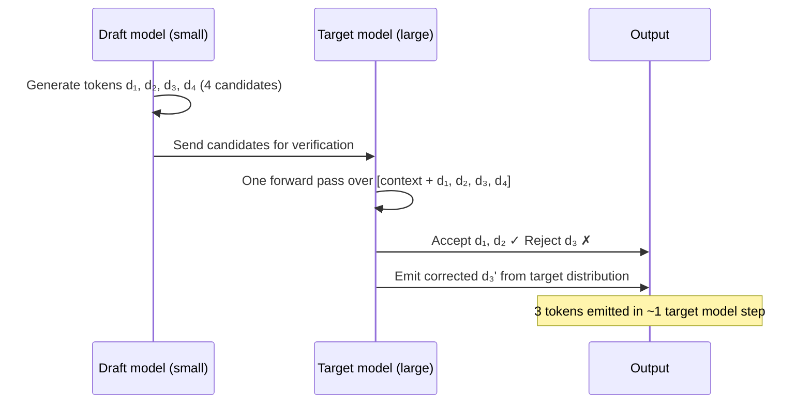
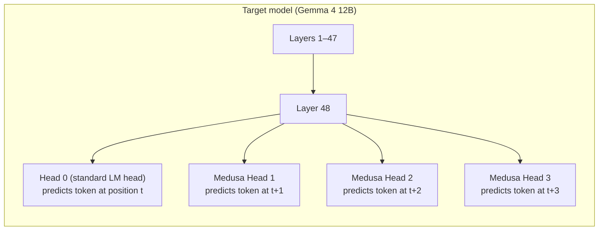
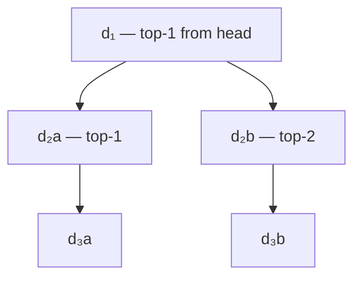
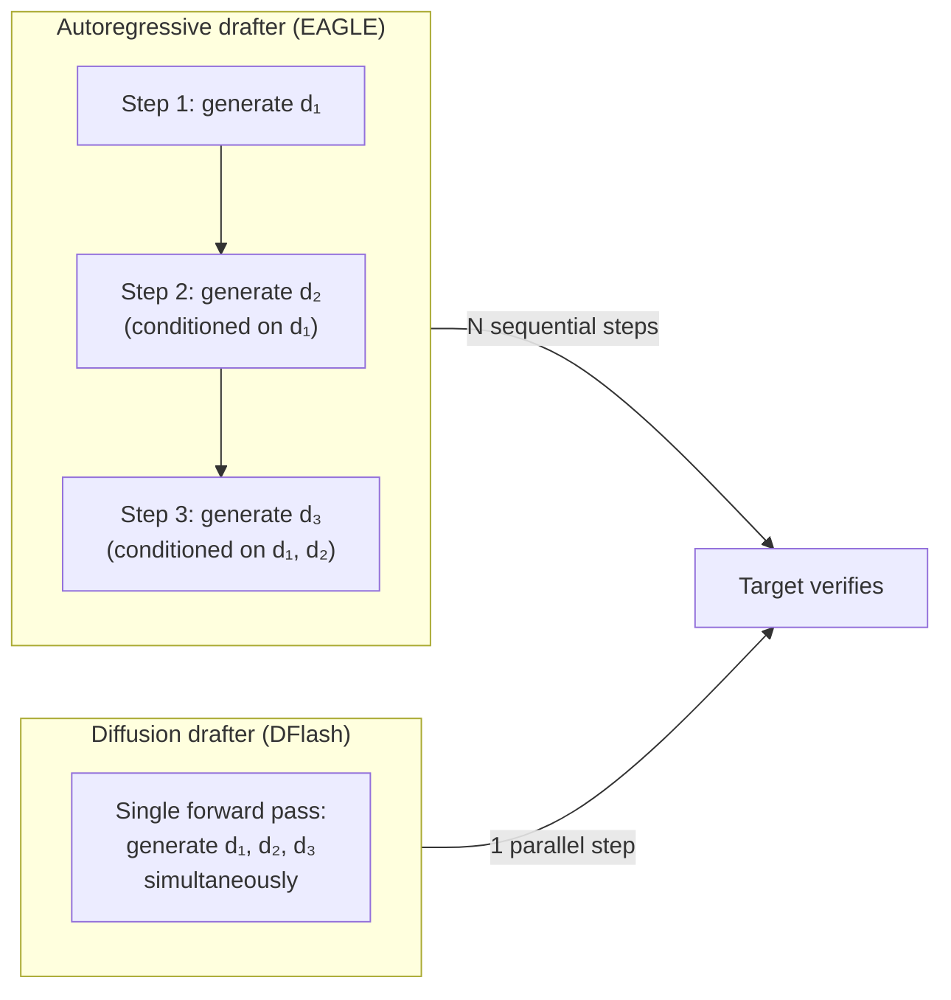

> This article is **Part 10 of 15** in the [Generative AI in Depth](/categories/Generative AI in Depth/) series.
{: .prompt-info }


Standard LLM decoding generates one token per forward pass. Speculative decoding generates multiple. Not by breaking the mathematics of autoregressive sampling — the output distribution is provably identical — but by exploiting a key asymmetry: **verifying N candidate tokens costs no more than generating 1**.

This article explains how speculative decoding works, what determines its speedup, and where it helps and where it doesn't.

---

## The Bottleneck: Sequential Decode Steps

As established in [CUDA Kernels and FlashAttention](/posts/cuda-kernels-and-flashattention), a single decode step is memory-bandwidth bound. For Gemma 4 12B at BF16 on an A100:

- Each decode step reads ~47M parameters per block × 48 blocks = ~2.25B parameter reads
- At 2 bytes per BF16 value and 2 TB/s bandwidth: ~4.5 GB / 2 TB/s ≈ 2.25 ms per token
- **Minimum latency** for 100 output tokens: ~225 ms — regardless of how fast the compute is

Each token requires a separate forward pass. You cannot skip a step — token N+1 requires token N as input.

Speculative decoding breaks this one-token-per-step limit without breaking causality.

---

## The Core Idea

Speculative decoding (Leviathan et al., 2023; Chen et al., 2023, published concurrently and independently) works in two phases per iteration:

**Draft phase**: a small, fast **draft model** proposes N candidate tokens autoregressively. Because the draft model is small (e.g., 2B parameters instead of 12B), generating N tokens takes roughly the same wall-clock time as one step of the large model.

**Verification phase**: the large **target model** runs a single forward pass over the N draft tokens in parallel — like a prefill of length N — and decides which tokens to accept.



If the draft model gets all N tokens right, N tokens are emitted in roughly one target model step. If only K tokens are accepted (K < N), K+1 tokens are emitted (K accepted + 1 corrected from the target).

---

## Why Verification Is Free: The Parallelism Trick

**First, the obvious question:** if the target model can process multiple tokens in a prefill-like pass, why not do that all the time and generate many tokens at once?

The answer is that prefill processes tokens whose values are **already known**. During normal autoregressive decoding, you cannot know what token 2 will be until you've sampled token 1 — the distribution for token 2 depends on token 1's specific value, which is only determined after sampling. Each step creates a sequential dependency you cannot skip.

Speculative decoding sidesteps this because the **draft model has already committed to specific values** for d₁, d₂, d₃, d₄. Those are now known quantities. The target model's job is to *check* them — not generate them. And checking a known sequence is exactly what prefill does: process a fixed input, produce distributions at each position.

So the trick is:
1. Draft model generates d₁…d₄ autoregressively (sequential, cheap — small model)
2. Target model runs **one** forward pass over all of d₁…d₄ (expensive model, called once regardless of how many tokens are ultimately accepted)
3. Runtime verifies each position: if k out of 4 drafts are accepted, that one call produced k+1 tokens (k accepted + 1 correction at the rejection point) — replacing what would otherwise have been k+1 separate decode calls
4. Accepted tokens advance the sequence; the first rejection terminates the iteration

In the best case (all 4 accepted): 1 target call instead of 4 — 4× speedup on target model calls. In the worst case (first token immediately rejected): 1 target call, 1 correction token, 0 accepted — same cost as normal decoding, so you break even.

Consider the target model processing the sequence:

```
context:    [t₀, t₁, t₂, ... t_prev]         ← already in KV cache
candidates: [d₁, d₂, d₃, d₄]                 ← draft tokens (known values)

Target forward pass input: [t_prev, d₁, d₂, d₃, d₄]  ← 5 tokens processed in parallel
```

The target model processes all 5 tokens in **one prefill-like pass**. This is a completely standard neural network forward pass — nothing special about the model itself. Because of causal attention masking, position i only sees tokens 0..i, so the output at each position is the distribution the target model assigns to the *next* token given what came before:

```
Forward pass outputs (5 probability distributions, all computed in one pass):
  Position 0 input: t_prev   → output: p(· | context, t_prev)          ← what does target think follows t_prev?
  Position 1 input: d₁       → output: p(· | context, t_prev, d₁)     ← what does target think follows d₁?
  Position 2 input: d₂       → output: p(· | context, t_prev, d₁, d₂) ← what does target think follows d₂?
  ...and so on
```

The forward pass is done. The model has no idea it’s doing speculative decoding — it just ran a prefill.

**The verification step happens after the forward pass, in the runtime framework** — not inside the model. The speculative decoding runtime now has:
- 4 draft tokens (d₁, d₂, d₃, d₄) with their draft probabilities from the small model
- 4 output distributions from the target's forward pass (one at each position)

For each position it asks: *"given the target's distribution at this position, how likely is the draft token that was actually placed here?"* This is **rejection sampling** — the target either accepts the draft's choice (if its own distribution agrees it was a plausible token) or rejects it and samples a correction from its own distribution instead. Crucially, all four comparisons can be evaluated in parallel immediately after the single forward pass — no further model calls needed. The next section formalises the exact acceptance rule and shows why it guarantees the output is drawn from the target distribution, not a biased mixture of draft and target.

So the efficiency gain is: **one target model call** (the prefill-like pass) **yields verification of up to N draft tokens**, instead of N separate decode calls.

The "runtime framework" here means the serving system — **vLLM, SGLang, TensorRT-LLM**, etc. The model itself has no idea speculative decoding is happening; it just runs a standard forward pass when called. Everything else — draft scheduling, rejection sampling, KV cache bookkeeping, correction sampling — is implemented in the serving framework:

- **Draft scheduling**: the framework decides how many tokens to draft, runs the small model N times, and records both the tokens and their probability distributions
- **Rejection sampling**: implemented as a GPU kernel — comparing p and q tensors at each position is just elementwise tensor math, run on the GPU immediately after the target forward pass
- **KV cache management**: the framework discards physical KV blocks for rejected token positions, keeps only accepted entries
- **Correction sampling**: samples from the adjusted distribution `max(0, p−q)` on GPU, still inside the framework

This is why enabling speculative decoding in vLLM is a configuration flag, not a model change — `speculative_model` and `num_speculative_tokens` in the engine args are all that's needed.

### KV cache management during verification

The draft tokens also generate KV cache entries during the verification pass. If a draft token is rejected, its KV entry is discarded and the target's correction is used instead. Only accepted tokens' KV entries are kept.

```
Before verification:
  KV cache: [context tokens]

After verification (2 accepted, 1 rejected):
  KV cache: [context tokens] + [d₁ KV] + [d₂ KV] + [d₃' KV]
  ← KV entries for d₃ (rejected) are discarded; d₃' (corrected) KV is used
  ← The 4th draft token d₄ is never even considered (stop after first rejection)
```

This means speculative decoding doesn't increase peak KV cache size — at most N+1 new tokens are added per iteration (N draft + 1 correction), the same as N+1 separate decode steps would add.

---

## The Acceptance Rule: Maintaining the Target Distribution

A naive approach would accept draft token dᵢ if the target also assigns it the highest probability. But this would change the output distribution — you'd be sampling from a biased mixture of draft and target.

Speculative decoding uses a **rejection sampling** rule that guarantees the output is sampled exactly from the target distribution, regardless of the draft model's quality:

```
For each draft token dᵢ with draft probability q(dᵢ) and target probability p(dᵢ):

  Accept dᵢ with probability min(1, p(dᵢ) / q(dᵢ))

  If rejected:
    Sample a correction token from (p - q)₊ / Z  where (·)₊ = max(0, ·), Z = normaliser
    Stop accepting further tokens in this iteration
```

**What this means in practice:**
- If the draft model assigns probability 0.9 to "Paris" and the target assigns 0.8 → accept with probability min(1, 0.8/0.9) = 0.89
- If the target assigns 0.95 to "Paris" and the draft assigns 0.5 → accept with probability min(1, 0.95/0.5) = 1.0 (always accept — target is even more confident)
- If the target assigns 0.1 to "Paris" and the draft assigns 0.8 → accept with probability min(1, 0.1/0.8) = 0.125 (usually reject)

The corrected token after a rejection is sampled from `max(0, p - q)`, which is the distribution of tokens where the target assigns more probability than the draft. This ensures no token can be systematically over-represented or under-represented in the output.

**Mathematical guarantee**: the output stream produced by speculative decoding has the same statistical distribution as standard sampling from the target model. Not approximately — exactly. This is proven by showing the marginal distribution of any token position is equal under both methods.

> **This is an exact guarantee, not a heuristic.** Speculative decoding does not introduce any quality degradation or distribution shift — it is mathematically proven to sample from the same distribution as the target model alone. The only effect on output quality is through numerical precision (floating-point arithmetic), which is identical to any other multi-step computation. If you observe quality differences when enabling speculative decoding, the cause is almost always a tokenizer mismatch or a bug in the implementation.
{: .prompt-info }

---

## Expected Speedup

The speedup depends on the **mean acceptance rate** α — the average fraction of draft tokens accepted per iteration.

```
Expected tokens per target step = (1 - αᴺ⁺¹) / (1 - α)

where N = number of draft tokens proposed per iteration
      α = per-token acceptance rate
```

Derivation: the probability that exactly k tokens are accepted is α^k × (1-α) (k successes then one failure), plus the probability all N are accepted is α^N (all succeed). The expected number accepted is:

```
E[accepted] = Σₖ₌₁ᴺ k × α^(k-1) × (1-α) + N × α^N
            = (1 - α^(N+1)) / (1 - α)
```

| α (acceptance rate) | N=4 draft tokens | N=8 draft tokens |
|---------------------|-----------------|-----------------|
| 0.9                 | 3.4 tokens/step | 5.7 tokens/step |
| 0.7                 | 2.6 tokens/step | 3.3 tokens/step |
| 0.5                 | 1.9 tokens/step | 2.0 tokens/step |
| 0.3                 | 1.4 tokens/step | 1.4 tokens/step |

At α=0.9 and N=8, you get 5.7 tokens per target step — a ~5.7× latency improvement over standard decoding, assuming the draft model is free. Notice that increasing N beyond a certain point gives diminishing returns when α is low.

The **overall speedup** also depends on the relative cost of draft vs target:

```
Speedup ≈ expected_tokens_per_step / (1 + draft_cost_fraction)

where draft_cost_fraction = cost of N draft steps / cost of 1 target step
```

For a 2B draft model vs 12B target (6× smaller, so 6× cheaper per step):
```
Draft cost fraction ≈ N × (2/12) = 4 × 0.17 ≈ 0.67

At α=0.9, N=4:
Speedup ≈ 3.4 / (1 + 0.67) ≈ 2.0×
```

Real-world speedups on well-matched models are typically **1.5–3× latency improvement**.

---

## When Speculative Decoding Helps (and When It Doesn't)

### Good conditions

**High acceptance rate (α > 0.7)**: The draft model must frequently agree with the target. Draft models work best when:
- The prompt is formulaic or predictable (code, structured output, continuation of a known pattern)
- The draft and target are in the same model family (same architecture, same tokenizer, similar training data)
- The task has low-entropy outputs (factual recall, translation, summarising a specific passage)
- Temperature is low (deterministic or near-deterministic outputs — the most likely token is always the same)

**Latency-sensitive, low-batch serving**: Speculative decoding exploits the memory-bandwidth bottleneck — at B=1, the target model spends its time loading weights, so replacing 4 decode calls with 1 verification pass saves real time. But in LLM serving, **latency and throughput decouple at high batch sizes**: at B=64 the target model is approaching compute-bound territory (AI ≈ 64 FLOPs/byte), the weight-loading bottleneck is less acute, and the gain from fewer decode steps shrinks. Meanwhile the draft model still consumes VRAM and GPU compute that could otherwise serve more concurrent users. So speculative decoding improves latency at low batch sizes but can actually reduce maximum throughput capacity at high batch sizes — these are genuinely different operating regimes, not just the same optimisation at different scales.

> **Don't apply speculative decoding when running near GPU capacity.** At B > ~32, the target model approaches compute-bound territory and the memory-bandwidth savings speculative decoding provides become marginal while the draft model overhead remains constant. Chatbots, code completions, and assistants are latency-sensitive, but they are only low-batch if the **number of concurrent users is small**. At high concurrency, even interactive applications have large effective batch sizes — and speculative decoding will reduce how many users you can serve with fixed GPU resources. Reserve it for situations where you are GPU-underutilised and care more about individual response speed than maximum user capacity.
{: .prompt-warning }

### Poor conditions

**Low acceptance rate (α < 0.5)**: Creative generation, diverse sampling, high-temperature outputs — the draft model frequently disagrees with the target. Most draft tokens are rejected, and you've spent draft compute for little gain.

**High batch sizes (B > ~32)**: When many requests are batched together, the target model's arithmetic intensity increases. The memory-bandwidth bottleneck is less severe, so the savings from fewer decode steps are smaller. The draft model adds overhead without proportional benefit.

**Mismatched models**: If the draft model was trained on a different distribution or uses different tokenisation, acceptance rates collapse. A draft trained on code will have low acceptance when the target is generating prose.

> **The draft model must use the exact same tokenizer as the target model.** If the tokenizers differ, the draft model's token IDs map to different strings than the target expects — every draft token will be rejected, producing zero speedup and potential garbage output. Always verify tokenizer identity (`tokenizer_config.json` and vocabulary files must match) before enabling speculative decoding in production.
{: .prompt-warning }

**High temperature**: At temperature=1.0+, the target distribution is more uniform and less predictable. Acceptance rates drop because the draft is less likely to guess correctly.

---

## Prompt Lookup Decoding

A zero-overhead variant of speculative decoding: instead of a draft model, scan the **input prompt** for sequences that might appear in the output.

For tasks where the output frequently copies text from the input (summarisation, editing, RAG-augmented responses), draft tokens can be proposed by finding the N-gram context in the input and copying the following tokens:

```
Input prompt:
  "Summarise the following article in two sentences:
   France is a country in Western Europe. Its capital is Paris,
   which has a population of over 2 million people. France is
   known for its cuisine, art, and the Eiffel Tower..."

During decode, after the model generates "Its capital is":
  Search input tokens for "Its capital is" → found at position 18
  Propose following tokens: "Paris", ",", "which", "has"
  Submit to target for verification
```

The model is summarising by copying key phrases verbatim from the source document in the prompt. Prompt lookup decoding detects this pattern and proposes the continuation without running any draft model — it just looks up what comes next in the input.

Since no draft model runs, the overhead is minimal — just a string search over the input tokens. For the right tasks, acceptance rates can exceed 0.8, yielding 2–4× speedup with zero quality cost and zero added complexity.

This is implemented in vLLM as "prompt lookup decoding" and in llama.cpp as a built-in option. It's particularly effective for:
- Document editing (most output repeats the original)
- Long-form summarisation (key phrases are copied verbatim)
- Code refactoring (variable names and structure are preserved)

---

## Variants: Self-Speculative Decoding

Instead of a separate draft model, several approaches generate draft tokens using the **target model itself**.

### Medusa

Medusa (Cai et al., 2024) trains multiple auxiliary prediction heads attached to the **final layer** of the target model:



Each Medusa head is a small two-layer MLP trained on top of the frozen target model's last hidden state. During inference:
1. Run the target model's full forward pass → get hidden state at layer 48
2. All Medusa heads run in parallel (they all read the same hidden state) → N candidate tokens for positions t+1, ..., t+N
3. Verify candidates against the target's predicted distributions → accept/reject chain

Since the heads run in parallel and share the target model's hidden state, the draft cost is small (just the MLP heads, not another full forward pass). Medusa typically achieves **1.5–2.5× speedup** without a separate draft model.

The limitation: Medusa heads predict independently per position. Token t+2's prediction doesn't condition on what the head predicts for t+1 — it conditions on the target's hidden state at t, which is the same for all heads. This independence means lower acceptance rates than a draft model that generates autoregressively.

### EAGLE and EAGLE-2

EAGLE (Li et al., 2024) addresses Medusa's independence limitation. Instead of predicting future tokens from the final-layer hidden state alone, EAGLE uses a lightweight draft model that:
1. Receives the target model's hidden states (not just the final layer, but intermediate layers)
2. Runs one step of a small transformer to condition on the previously-predicted draft token

This makes EAGLE's draft tokens causally conditioned on each other, significantly improving acceptance rates.

**EAGLE-2** (Li et al., 2024) further improves by using a dynamic draft tree rather than a fixed chain. Instead of proposing d₁, d₂, d₃, d₄ as a linear sequence, EAGLE-2 constructs a tree of candidates:



The target verifies the entire tree in one pass, potentially accepting different branches for different tokens. This increases the expected number of tokens accepted per iteration by exploring the top-k candidates at each position rather than just the top-1.

EAGLE-2 reported **2–3× speedup** on standard benchmarks (MT-Bench, HumanEval, Alpaca) with acceptance rates of 0.75–0.85 on typical chat tasks.

### Lookahead decoding

A different self-speculative approach: instead of training extra heads, use **Jacobi iteration** to generate candidates from the target model itself.

In standard decoding, we solve `x_{t+1} = argmax(LM(x_{1:t}))` sequentially. Jacobi iteration solves a system of equations in parallel by starting from an initial guess and refining:

```
Iteration 0 (initial guess): [?₁, ?₂, ?₃, ?₄] (e.g., random or copied from input)
Iteration 1: LM processes [context, ?₁, ?₂, ?₃, ?₄] in parallel
             → produces new predictions [!₁, !₂, !₃, !₄]
             If !₁ = ?₁ → token 1 is "fixed" (self-consistent)
             Replace ?ᵢ with !ᵢ and repeat
```

Tokens that reach self-consistency early are emitted. This requires no additional model components — just multiple forward passes of the target. The trade-off: acceptance rate is always 1 (no rejection, output distribution unchanged) but throughput improvement is more modest (~1.3–2×) since you're doing multiple full model passes.

### DFlash: Block Diffusion for Parallel Drafting

All of the approaches above — EAGLE, Medusa, Lookahead — use some form of autoregressive process to generate draft tokens: even EAGLE's lightweight draft model still generates d₁, then d₂, then d₃ sequentially. **DFlash** (Chen, Liang & Liu, ICML 2026; arXiv 2602.06036) breaks this by replacing the autoregressive drafter with a **block diffusion model** that generates the entire draft block in a single forward pass.

**How it works:**

Instead of an autoregressive draft model that generates d₁, then waits, then generates d₂ conditioned on d₁, etc., DFlash uses a **block diffusion model** as the drafter. A block diffusion model starts from B masked or noise-corrupted token positions and denoises all B positions **simultaneously in a single forward pass** — producing d₁ through d_B in one shot, with no sequential dependency between draft positions. The diagram below contrasts the two approaches:



The draft model is conditioned on **context features extracted from the target model** (similar to EAGLE), giving it enough signal to produce high-quality drafts despite not having seen the exact preceding tokens in autoregressive fashion.

**Why this matters:**

In autoregressive speculative decoding, the draft cost grows linearly with N — generating 8 draft tokens requires 8 draft model forward passes. With DFlash, the draft cost is essentially **constant** regardless of block size: one diffusion forward pass generates all B positions simultaneously.

| Drafter | Draft cost for N=8 tokens |
|---|---|
| Autoregressive (EAGLE) | 8 × cost of one draft step — scales with N |
| DFlash (block diffusion) | 1 × cost of one diffusion pass — constant |

This means DFlash can propose larger blocks without proportionally increasing draft overhead, enabling higher expected acceptance lengths without the usual cost penalty.

**Results:**

DFlash reports:
- **>6× lossless acceleration** over standard autoregressive decoding
- **Up to 2.5× higher speedup than EAGLE-3** (the state-of-the-art autoregressive drafter at the time of publication)
- Acceptance rates competitive with EAGLE despite parallel generation

> DFlash represents a paradigm shift: rather than making the autoregressive drafter cheaper or smarter, it replaces the sequential draft process entirely. The block diffusion drafter sacrifices some per-position accuracy (tokens are not causally conditioned on each other within the block) but recovers this through target-model conditioning and the elimination of sequential draft overhead.
{: .prompt-info }

**The follow-on ecosystem:**

DFlash sparked a wave of subsequent work:

- **DDTree** (Ringel & Romano, 2026): instead of verifying a single DFlash-drafted chain, constructs a draft *tree* from DFlash's per-position output distributions using best-first search, increasing expected acceptance length further
- **DFlare** (Zhang et al., 2026): addresses DFlash's conditioning bottleneck (all draft layers shared one target representation) via layer-wise fusion, achieving ~5–11% further speedup
- **WhiFlash** (Kwon et al., 2026): dynamically switches between EAGLE-3 (autoregressive) and DFlash (diffusion) per token based on entropy, capturing the best of both paradigms — reported up to 69.6% gain over EAGLE-3 and 37.3% over DFlash alone

The WhiFlash observation — that neither paradigm dominates across all token positions — is important: autoregressive drafters excel at reasoning-heavy or strongly-conditioned positions; diffusion drafters excel at structured or weakly-conditioned positions where parallel generation is accurate.

---

## Evaluating a Draft/Target Pair: A Worked Example

The speedup formula gives a practical way to evaluate whether a given draft model is worth using. The key inputs are:

1. **Draft cost fraction** — what fraction of a target forward pass does one draft step cost?
2. **Acceptance rate α** — what fraction of draft tokens does the target accept on your workload?
3. **Number of draft tokens N** — how many drafts to propose per iteration?

Using Gemma 4 12B as the target and a hypothetical 2B-class draft model (roughly 1/6 the cost per forward pass):

```
Draft cost fraction = (draft_params / target_params) × overhead_factor
                    ≈ (2 / 12) ≈ 0.17 per draft step

For N=4 draft tokens:
  Total draft cost fraction = 4 × 0.17 ≈ 0.67
  (the draft run costs ~67% of one additional target forward pass)
```

Applying the speedup formula for two illustrative acceptance rate scenarios:

```
Scenario A: α = 0.7 (moderate agreement — mixed tasks)
  Expected tokens per step = (1 - 0.7⁵) / (1 - 0.7) = (1 - 0.168) / 0.3 ≈ 2.77
  Speedup ≈ 2.77 / (1 + 0.67) ≈ 1.66×

Scenario B: α = 0.9 (high agreement — code completion, factual tasks)
  Expected tokens per step = (1 - 0.9⁵) / (1 - 0.9) = (1 - 0.59) / 0.1 ≈ 4.1
  Speedup ≈ 4.1 / (1 + 0.67) ≈ 2.46×
```

> **Note:** these α values are illustrative — actual acceptance rates depend heavily on workload, temperature, and how well the draft model's training distribution matches the target's. Always measure α on your specific task before deploying speculative decoding.
{: .prompt-warning }

**The draft cost trade-off:** a larger draft model (e.g., 4B instead of 2B) may have a higher acceptance rate but also costs more per step. Whether the higher acceptance rate compensates for the higher cost depends on the specific numbers:

```
4B draft model:
  Draft cost fraction = 4 × (4/12) ≈ 1.33
  At α = 0.85: expected tokens = 3.2, speedup ≈ 3.2 / (1 + 1.33) ≈ 1.37×
  At α = 0.95: expected tokens = 4.7, speedup ≈ 4.7 / (1 + 1.33) ≈ 2.0×

2B draft model:
  Draft cost fraction = 4 × (2/12) ≈ 0.67
  At α = 0.70: expected tokens = 2.77, speedup ≈ 2.77 / (1 + 0.67) ≈ 1.66×
  At α = 0.90: expected tokens = 4.1,  speedup ≈ 4.1  / (1 + 0.67) ≈ 2.46×
```

In this comparison, the 2B draft with α=0.70 already beats the 4B draft with α=0.85 — illustrating that a cheaper draft at moderate acceptance often outperforms an expensive draft at high acceptance. Measure α on your workload before choosing the draft model size.

---

## Batch Speculative Decoding: A Complication

Speculative decoding is clean for single requests but complicated for batched serving.

Different requests in the same batch will have different acceptance sequences: request A might accept all 4 draft tokens while request B accepts only 1. This means the batch produces variable-length outputs per iteration, which breaks standard fixed-length batching.

Solutions:
- **Per-request speculation**: draft and verify independently per request. The batch runs the draft model in parallel for all requests, then the target model verifies all in one batched pass. Accepted lengths vary, but each request's KV cache is updated independently.
- **Shared draft tokens**: for requests with the same prompt (e.g., a shared prefix), draft tokens can be shared across requests, reducing draft overhead.
- **SpecInfer / S3 (Miao et al., 2023)**: a serving system that manages a pool of draft and target GPUs, batching requests across both and handling variable acceptance lengths with a specialised scheduler.

At B > ~32, the target model is already approaching compute-bound territory, and the marginal benefit of speculative decoding shrinks. Most production deployments of speculative decoding are for **interactive, low-batch workloads**.

---

## Key Takeaways

- **One target step can verify N tokens**: a single prefill-like pass produces all predictions needed to check N draft tokens simultaneously
- **The output distribution is preserved exactly**: the rejection sampling rule is mathematically guaranteed — not just empirically observed — to sample from the target distribution
- **KV cache management**: only accepted tokens and the correction token's KV entries are kept; draft tokens that are rejected are discarded without wasting KV memory
- **Speedup formula**: `(1 - α^(N+1)) / (1 - α)` × `1 / (1 + draft_cost_fraction)` — both acceptance rate and draft efficiency matter
- **Prompt lookup decoding** offers speculative decoding benefits at zero cost for copy-heavy tasks (summarisation, editing, RAG)
- **EAGLE-2** and **Medusa** avoid managing a separate model by using the target model's own hidden states, achieving 1.5–3× speedup on typical tasks
- **DFlash** (ICML 2026) replaces autoregressive drafting with a block diffusion model that generates the entire draft block in **one forward pass** — constant draft cost regardless of block size, achieving >6× acceleration and up to 2.5× over EAGLE-3
- **No single drafting paradigm dominates**: autoregressive drafters (EAGLE) excel at reasoning-heavy outputs; diffusion drafters (DFlash) excel at structured outputs — WhiFlash dynamically switches between them per token
- **Best for latency-sensitive, low-batch workloads**: high batch serving is already efficient at the throughput level; speculative decoding helps most for single-user interactive applications


---

## Further Reading

- [LLM Serving in Depth](/posts/llm-serving-in-depth) — how speculative decoding integrates with continuous batching and scheduling
- [CUDA Kernels and FlashAttention](/posts/cuda-kernels-and-flashattention) — why latency is memory-bandwidth bound and what speculative decoding is actually improving
- [Inside LLM Inference](/posts/decoder-forward-pass-dimensions) — the forward pass steps that both draft and target model execute
- [The Memory Math](/posts/llm-memory-math) — memory constraints that affect draft model sizing choices
