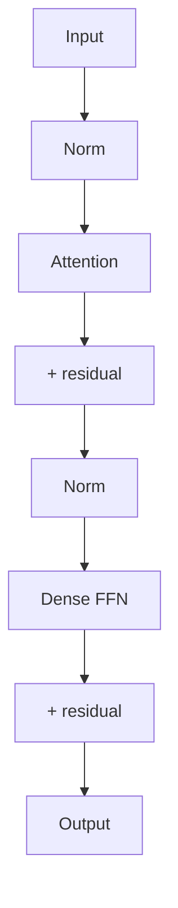
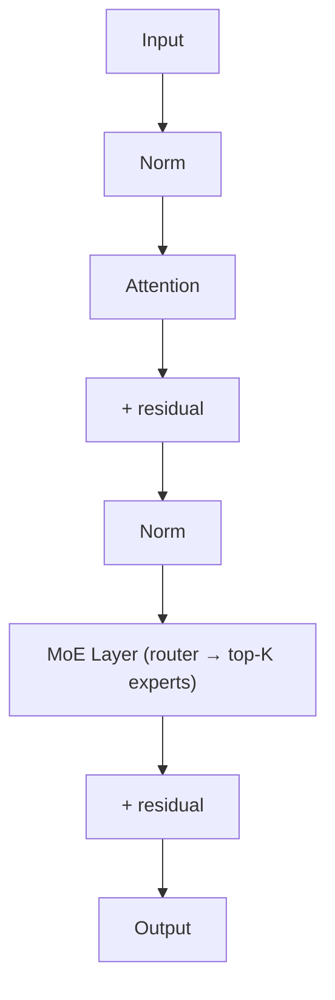
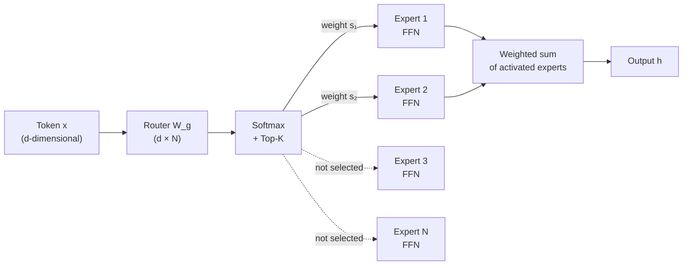
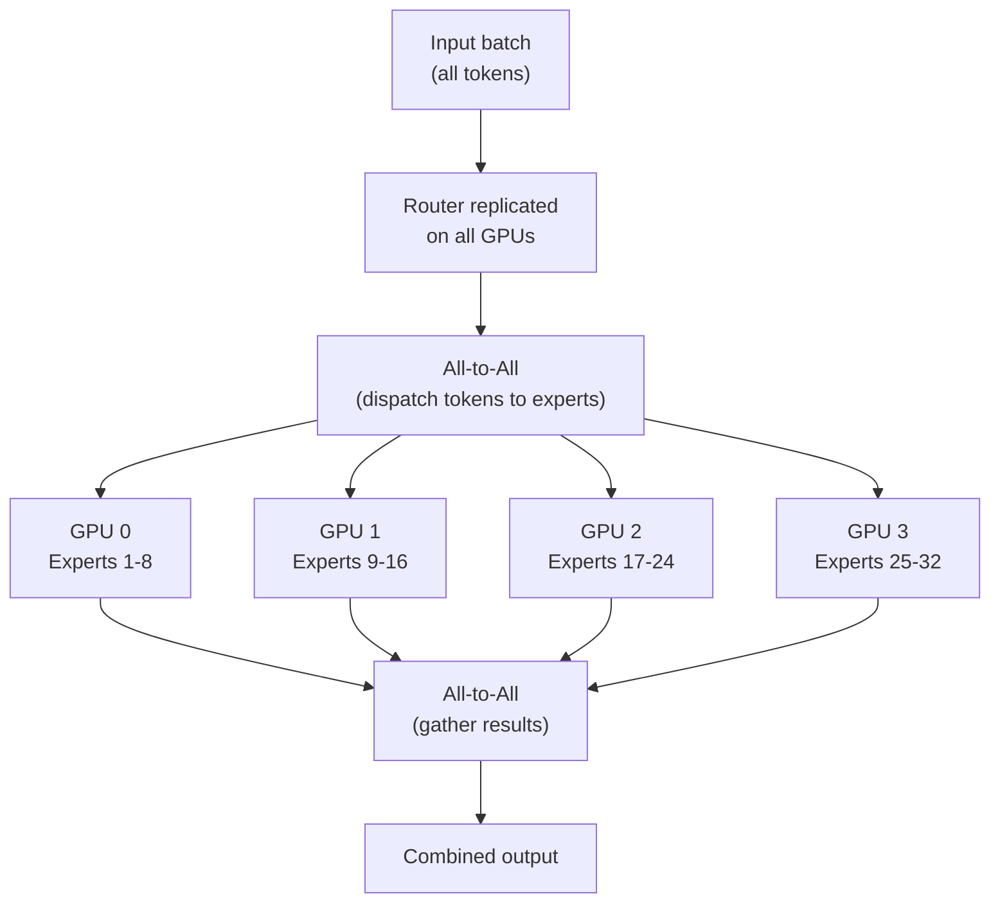

> This article is **Part 11 of 15** in the [Generative AI in Depth](/categories/generative-ai-in-depth/) series.
{: .prompt-info }

The largest and most capable LLMs are not dense transformers — they are **Mixture of Experts (MoE)** models. Confirmed MoE architectures include Mixtral 8×7B/8×22B, DeepSeek V2/V3/R1, Gemma 4 26B, and most frontier closed models are widely believed to follow the same pattern. Understanding MoE is now essential to understanding frontier AI.

---

## The Core Idea: Conditional Computation

A standard dense transformer processes every input token through **all** of the model's parameters on every forward pass. A 70B parameter model uses all 70B parameters to process each token.

MoE replaces this with **conditional computation**: only a subset of the parameters — the "experts" — are active for any given token. The key relationship:

For Mixtral 8×7B:
- Total parameters: ~46.7B
- Active parameters per token: ~12.9B (2 experts out of 8, each ~7B)
- Compute cost ≈ a 12.9B dense model
- Knowledge capacity ≈ a 46.7B dense model

For Gemma 4 26B (Google, 2025):
- Total parameters: 26B
- Active parameters per token: 4B
- Compute cost ≈ a 4B dense model
- A 6.5× ratio between capacity and per-token compute

This is MoE's central promise: **the compute of a small model, the capacity of a large one**.

---

## Architecture: Where MoE Fits

MoE replaces the FFN (Feed-Forward Network) sublayer in each transformer block. Recall that a standard transformer block is:

**Standard transformer block:**

> **LayerNorm vs RMSNorm:** The "Norm" blocks shown here represent the normalization layer. Older models (BERT, GPT-2) use **LayerNorm**, which normalizes by mean and variance. Most modern models (LLaMA, Mistral, DeepSeek, Gemma) use **RMSNorm**, which skips the mean-centering step — making it ~10–15% faster with no quality loss. The architecture is otherwise identical.
{: .prompt-info }

**MoE transformer block** — FFN replaced by a sparse MoE layer:

Where the MoE layer consists of:
- **N expert FFNs** (e.g., 8 in Mixtral, 64 in DeepSeek V2) — each a full feed-forward network with its own weights
- A **router** that selects which **K experts** to use for each token (e.g., K=2 means each token picks its best 2 experts)

The attention layers remain dense — every token still goes through the full attention computation with all heads. Only the FFN is made sparse.

**Why FFN, not attention?**

FFN layers account for roughly 2/3 of transformer parameters (in standard architectures) and are independent across tokens (each token processed separately). This makes them easy to parallelise and replace with sparse alternatives. Attention, by contrast, must mix information across all tokens in the sequence — making sparse attention harder to implement correctly.

---

## The Router: Selecting Experts

The router takes the hidden state of each token — its internal representation after the attention layer — and decides which experts should handle it. This happens in three steps:

**Step 1 — Score every expert.** The router multiplies the token's representation by a small learned weight matrix (one column per expert). This produces a raw "affinity score" for each expert — how well-suited is this expert for this token right now?

**Step 2 — Pick the top K.** Only the K experts with the highest scores are selected. The rest are completely skipped — their weights aren't loaded, no computation runs through them for this token.

**Step 3 — Blend the outputs.** Each selected expert processes the token independently and produces its own output. The final result is a weighted average of those outputs, where the weights come from the router scores (renormalised to sum to 1). An expert the router was very confident about contributes more; a borderline pick contributes less.

**Visualising the routing:**

---

## The Load Balancing Problem

The routing mechanism has a critical failure mode: **expert collapse**. If the router learns to route almost all tokens to the same few experts, those experts become very good (because they see lots of training signal) while the others receive almost no gradients and degenerate. You end up with an effectively smaller model — the capacity of 2 experts, not N.

> **Expert collapse is a silent failure mode.** The training loss can continue to decrease while expert utilisation becomes increasingly uneven — the model is learning, but from far fewer experts than intended. Monitor per-expert routing histograms throughout training (most MoE training frameworks expose this via the auxiliary loss statistics). If you see the top-1 expert receiving > 30% of all tokens, your balancing coefficient $\alpha$ is too low. If the auxiliary loss term is too high and task loss is suffering, $\alpha$ is too high.
{: .prompt-warning }

### Auxiliary Load Balancing Loss

The standard solution (Fedus et al., Switch Transformer 2022) adds a small **auxiliary loss** term during training that penalises unequal expert utilisation. The idea: if expert A is receiving 40% of all tokens and expert B is receiving only 2%, the auxiliary loss makes that imbalance costly. The training process is nudged toward distributing tokens more evenly — not by hard rules, but by making imbalance pay a small tax on every training step.

The strength of this penalty is controlled by a single coefficient (often written as α, typically a small value like 0.01). Too small and expert collapse happens anyway; too large and the model spends so much effort on balance that task performance suffers. Finding the right value is a hyperparameter search, and most MoE training frameworks expose it as a key tuning knob.

### Expert Capacity

To handle variable routing, each expert has a **capacity** — the maximum number of tokens it can process in one batch. If an expert receives more tokens than its capacity, the excess tokens are **dropped** (passed through unchanged via a residual skip). In practice, capacity is set slightly above what perfect load balance would require — a buffer of 10–25% is common — so that natural token-count fluctuations don't cause drops during normal operation.

---

## Expert Parallelism

MoE models introduce a new parallelism dimension: **expert parallelism (EP)**. Different GPUs host different experts, and tokens are routed (via all-to-all communication) to the appropriate GPU.

Expert parallelism is combined with tensor parallelism (for attention layers) and pipeline parallelism (across model depth) to create a multi-dimensional parallelism strategy.

**The all-to-all bottleneck:** The two all-to-all collectives (dispatch + gather) are a significant communication cost. MoE inference is more network-bound than dense model inference. This is why MoE models see larger benefits from high-speed interconnects (NVLink/InfiniBand) than dense models.

---

## Mixtral 8×7B: The Architecture

Mixtral 8×7B (Mistral AI, 2023) was the first high-quality open MoE model to gain wide adoption. Key specs:

| Property | Value |
|---|---|
| Total parameters | ~46.7B |
| Active parameters/token | ~12.9B |
| Number of experts (N) | 8 |
| Experts per token (K) | 2 |
| Expert FFN dim | 14,336 |
| Hidden dim (d) | 4,096 |
| Attention heads | 32 |
| KV heads (GQA) | 8 |
| Context length | 32,768 |

**Architecture details:**

Each transformer layer has 8 expert FFNs. Each expert is a standard SwiGLU FFN with hidden dim 14,336. The router is a linear projection followed by softmax and top-2 selection.

Crucially, Mixtral uses **GQA** (Grouped Query Attention) in the attention layers — a dense, non-sparse component — meaning attention is still shared across all tokens. Only the FFN is sparse.

**Why Mixtral 8×7B punches above its compute weight:**

- Knowledge capacity scales with total parameters: 46.7B total gives it the breadth of a large model
- Compute scales with active parameters: 12.9B active per token means inference is as fast as a ~13B dense model
- Training compute scales with total parameters × tokens (but inference is cheap)

---

## DeepSeek MoE Architecture

DeepSeek V2/V3 introduces several innovations beyond Mixtral that have pushed MoE performance significantly.

### Fine-Grained Expert Segmentation

Standard MoE uses $N$ large experts. DeepSeek uses $N_s$ **shared experts** + $N_r$ **routed experts**, where the routed experts are further split into many small experts:

- DeepSeek V2: 64 routed experts + 2 shared experts, top-6 routing (from 64 routed + 2 shared = top-8 total)
- The routed experts are 4× smaller in hidden dim than standard experts

**Why fine-grained experts?** More, smaller experts allow more flexible routing — a token can activate a more precise combination of specialised modules. The diversity of combinations grows exponentially with the number of small experts.

### Shared Experts

**Why shared experts?** Think of it as a two-tier system. The shared experts run on every token — they absorb universal knowledge (grammar, common facts, punctuation handling) that every token needs regardless of its content. The routed experts then handle the specialised, content-specific part. This cleanly separates "things every token needs" from "things this particular token needs", making both tiers better at their respective jobs.

### MLA (Multi-Head Latent Attention)

DeepSeek V2/V3 also replaces standard GQA with **Multi-Head Latent Attention (MLA)**, which compresses the KV cache by projecting keys and values into a much smaller shared representation. Instead of storing full-size K and V vectors for every token and every layer, MLA stores a single compact vector per token and reconstructs the K and V on demand.

**KV cache savings:** Standard multi-head attention stores a large K and V matrix per token per layer. MLA compresses this down by roughly 5–10×, storing only the compact latent vector.

For DeepSeek V3 (236B total parameters, 21B active):
- MLA reduces KV cache from ~60 GB to ~5 GB at long context
- This enables much larger batches, critical for MoE efficiency

### Expert Load Balancing in DeepSeek

DeepSeek introduces **Device-Restricted Routing**: each routed expert is assigned to a specific GPU, and the router is constrained to select at most $M$ experts per device. This limits all-to-all communication to at most 2 GPUs per token (instead of potentially all GPUs), dramatically reducing communication overhead.

**Auxiliary-free load balancing** (DeepSeek V3): Rather than an auxiliary loss, DeepSeek V3 uses a **bias term per expert** that's updated based on load. Over-utilised experts get a negative bias (making them less likely to be selected next); under-utilised experts get a positive bias. This achieves balanced routing without interfering with the primary training loss.

---

## Gemma 4 26B: Google's MoE Open Model

Gemma 4 26B A4B (Google DeepMind, 2026) is Google's open-weight MoE model, part of the broader Gemma 4 family that spans edge models (2B, 4B), a multimodal 12B, a dense 31B, and this MoE 26B.

| Property | Value |
|---|---|
| Total parameters | 26B |
| Active parameters/token | 4B |
| Context length | 256K tokens |
| VRAM (BF16) | ~57.7 GB |
| VRAM (Q4) | ~14.4 GB |
| Modalities | Text, image, video, audio |

**Architecture highlights:**

Gemma 4 26B uses MoE for the FFN layers, activating only 4B parameters per token out of 26B total — a **6.5× capacity-to-compute ratio**, higher than Mixtral's ~3.6× ratio. The attention layers remain dense.

**256K context window:** The 26B is in Gemma 4's "medium" tier, which supports a 256K token context — roughly double what most open MoE models offered at launch.

**Multimodal by default:** Unlike Mixtral (text-only) or DeepSeek (text + code focused), Gemma 4 26B processes text, images, video, and audio natively. This is notable because the MoE sparsity applies across a multimodal token stream — the router must generalise across input types.

**Built-in speculative decoding:** Every Gemma 4 model, including the 26B, ships with a dedicated draft model. This allows speculative decoding out of the box — the draft model proposes tokens, the main model verifies in parallel — significantly accelerating inference with no quality loss.

**Memory vs compute:** The MoE vs VRAM tradeoff is stark here. All 26B parameters must live in memory even though only 4B are active per token:
- BF16: ~57.7 GB (fits on a single H100/A100 80 GB with room for KV cache)
- Q4 quantised: ~14.4 GB (consumer GPU territory — single RTX 4090 or A10)
- Active compute per token: equivalent to a ~4B dense model

**What makes it notable:** Gemma 4 26B demonstrates that MoE can be applied to a multimodal model at a size that fits on a single GPU (quantised), while delivering reasoning quality competitive with much larger dense models. The combination of MoE efficiency, 256K context, and speculative decoding draft support makes it a strong choice for production deployments where VRAM is constrained but capability matters.

---

## Memory and Compute: MoE vs Dense

Comparing MoE to dense models is tricky — there is no single "equivalent" dense model because MoE has different properties along three separate axes:

| Dimension | Mixtral 8×7B is like… | Why |
|---|---|---|
| **Memory footprint** | A dense ~47B model | All 46.7B weights must live in VRAM, even though most are inactive |
| **Compute per token** | A dense ~13B model | Only 2 of 8 expert FFNs activate per token (~12.9B active params) |
| **Quality** | Roughly a dense 30–40B model | Empirically, between a 13B and a 70B dense model on most benchmarks |

This asymmetry is the core insight of MoE: **you pay 47B in memory, get 13B in compute cost, and receive 30–40B in quality**. No single dense model gives you that combination.

> The quality figure is approximate and benchmark-dependent. MoE models tend to perform better on knowledge-heavy tasks (benefiting from the large total parameter count) and roughly match dense models of ~2–3× their active parameter count on reasoning tasks.
{: .prompt-info }

The compute advantage shows up in **throughput**: Mixtral 8×7B processes tokens ~5× faster than a 70B dense model at the same batch size, because only 2 of 8 experts' FFN weights need to move through memory per token.

**The MoE inference challenge:** All expert weights must be in VRAM, even though only a fraction are active per token. The reason: routing is decided at runtime, per token, and you can't predict which experts the next token will need. You can't lazily load them from disk or CPU mid-forward-pass without stalling. So all expert weights must be resident and ready, giving MoE models a **minimum GPU memory proportional to total parameters — not active parameters**.

> **The one escape hatch: expert offloading.** Tools like llama.cpp support keeping only some experts in GPU VRAM, swapping others from CPU RAM on demand. This genuinely reduces the GPU memory floor — but each expert swap crosses the PCIe bus, adding latency proportional to the expert's size. For many-expert models (e.g. DeepSeek with 64+ experts), this latency can dominate. It's a real option for memory-constrained deployments, but not a free lunch.
{: .prompt-info }

> **A common misconception:** "A MoE model with 21B active parameters per token needs only ~42 GB VRAM." This is wrong. **All expert weights must reside in VRAM** or be accessible (e.g., via Paged SSD KV Caching)because any expert may be activated by any future token. DeepSeek V3 (236B total, 21B active) requires ~472 GB (6× H100) — not 42 GB. The active parameter count determines compute speed, not memory footprint.
{: .prompt-warning }

DeepSeek V3 (236B total, 21B active):
- Minimum memory: ~472 GB (all weights in BF16) → 6× H100 80 GB
- Effective compute per token: ~42 GB (21B active × 2 bytes)
- Ratio: 236B total / 21B active ≈ 11× more capacity than compute

---

## Expert Specialisation: What Do Experts Learn?

Interpretability research on MoE models has found that experts do specialise, but not in the way you might expect:

**Not topic-based:** Experts don't cleanly separate into "math expert", "code expert", "poetry expert". The specialisation is more subtle — often syntactic or positional.

**Position and syntax:** In Mixtral, some experts are preferentially activated for tokens at sentence boundaries, punctuation, or specific syntactic roles (verbs vs nouns).

**Domain-partial:** There is some domain clustering — certain experts are more active on code, others on conversational text — but with significant overlap. A "code expert" will still be activated for some non-code tokens.

**Layer-dependent:** Routing patterns differ by layer depth. Earlier layers tend toward more balanced, syntactic routing; deeper layers show more semantic specialisation.

This suggests the specialisation is an **emergent property of training** rather than the result of explicit engineering. The router learns to distribute computation to maximise performance, and the experts learn to be useful for the distributions they receive.

---

## When Does MoE Win?

MoE makes the most sense when:

1. **Training budget is fixed but model capacity matters**: You can train a 47B MoE model with the compute of a 13B dense model, but the 47B model is smarter.

2. **Inference throughput is critical**: At high batch sizes, MoE gives you more quality per FLOP because the FFN is sparse.

3. **You have enough total VRAM**: MoE requires all expert weights in memory, even if only a fraction are active. If you can't fit the full weight set, dense models may be preferable.

4. **Expert parallelism scales**: With fast NVLink interconnects, all-to-all communication is cheap. On slower networks, MoE's communication overhead can outweigh its compute savings.

**MoE is less ideal when:**
- You're memory-constrained (can't fit all expert weights)
- You're on slow interconnects (all-to-all dominates)
- Serving a single user (load balancing across experts is irrelevant; just activate the same 2 each time)

---

## Key Takeaways

- MoE replaces the dense FFN with N expert FFNs; each token is routed to K of them by a learned router
- The core promise: **parameters of a large model, compute of a small model** — for Mixtral 8×7B, ~46.7B total but ~12.9B active per token
- **Load balancing** is a critical engineering challenge: auxiliary loss, capacity limits, and device-restricted routing all help prevent expert collapse
- DeepSeek V2/V3 advance MoE with fine-grained experts, shared experts, MLA KV compression, and auxiliary-free load balancing
- MoE models need all expert weights in memory even though only a fraction are active — minimum VRAM is set by total parameters, not active parameters
- **Expert parallelism** (different GPUs host different experts) is a new parallelism dimension introduced by MoE, but requires expensive all-to-all communication
- Expert specialisation is **emergent and partial** — experts learn syntactic/positional patterns, not clean topic boundaries

---

> **See it in production:** [vLLM Deep Dive Part 2](/posts/vllm-deep-dive-part-2) covers Expert Parallelism in vLLM — how experts are distributed across GPUs, elastic EP for variable load, and when to combine EP with Tensor Parallelism. [vLLM Deep Dive Part 3](/posts/vllm-deep-dive-part-3) covers the MoE architecture families vLLM supports (DeepSeek V3/V4, Mixtral, Qwen3 MoE, DBRX).
{: .prompt-tip }

## Further Reading

- [Inside LLM Inference](/posts/decoder-forward-pass-dimensions) — the dense transformer baseline that MoE extends
- [Attention Mechanisms and KV Cache](/posts/attention-mechanisms-and-kv-architectures) — MLA and GQA in depth
- [The Memory Math](/posts/llm-memory-math) — how MoE changes VRAM budgeting
- [LLM Serving in Depth](/posts/llm-serving-in-depth) — expert parallelism in production serving
- [Which Serving Framework?](/posts/llm-serving-frameworks-comparison) — SGLang and LMDeploy's MoE-specific optimisations
- Switch Transformer: Fedus et al., [arXiv 2101.03961](https://arxiv.org/abs/2101.03961)
- DeepSeek V2: [arXiv 2405.04434](https://arxiv.org/abs/2405.04434)
