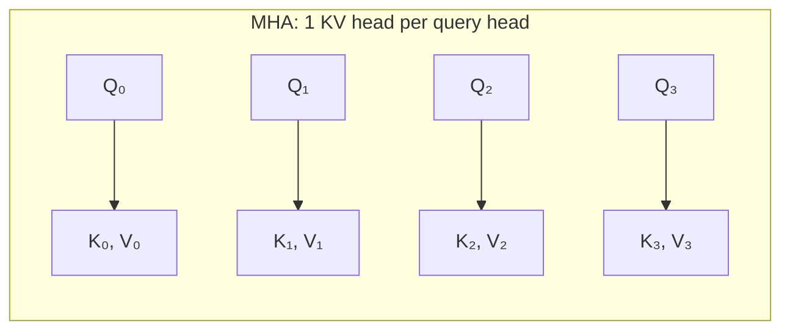
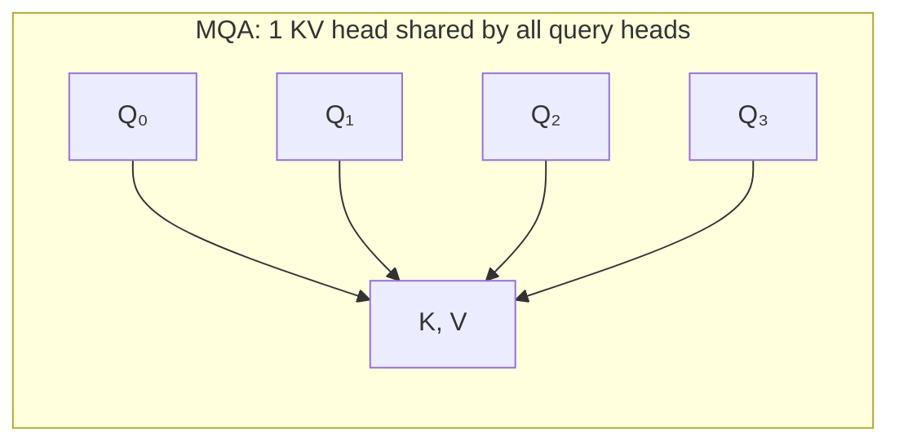
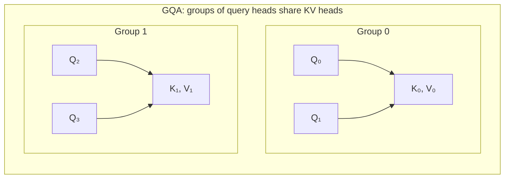
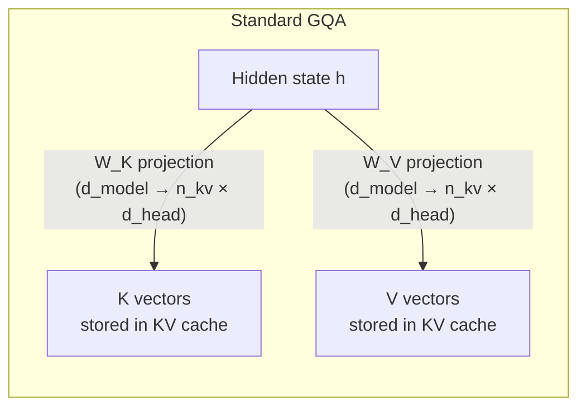
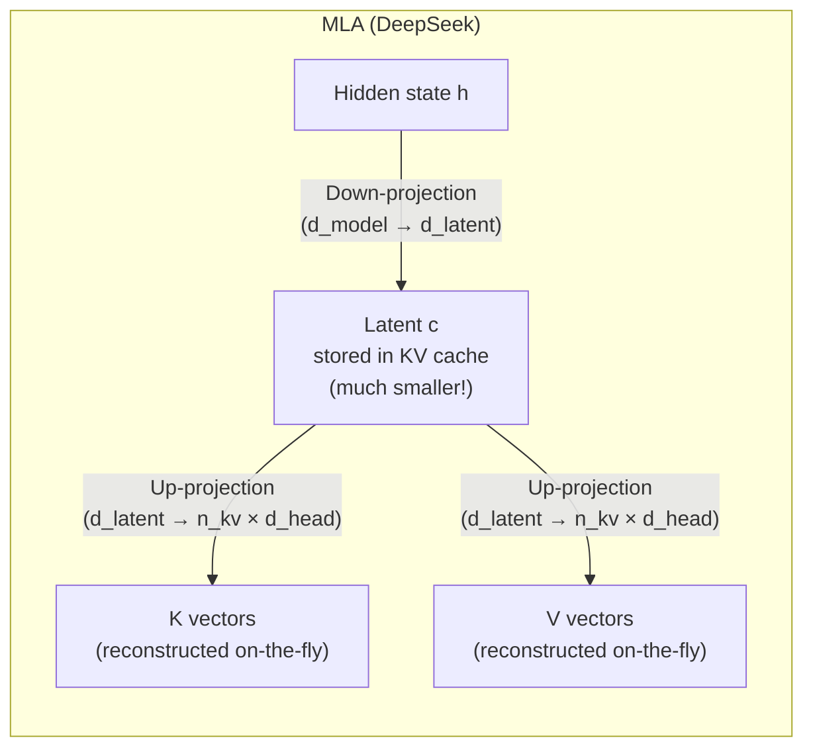
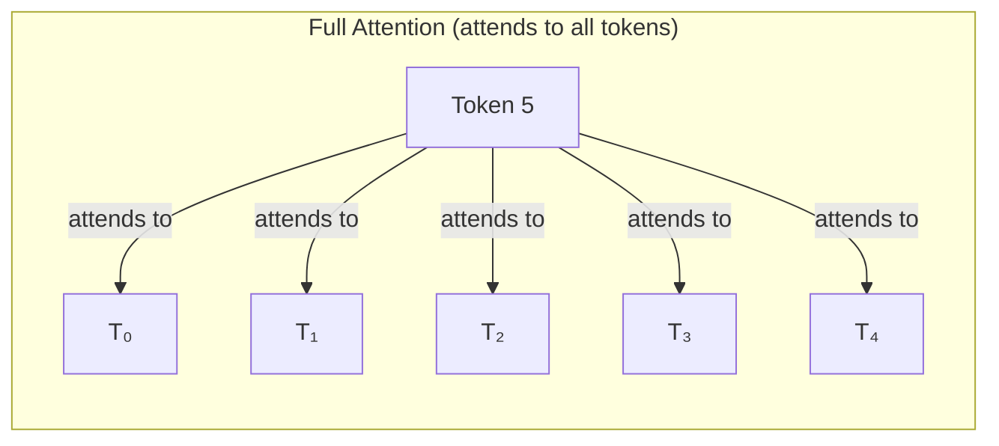
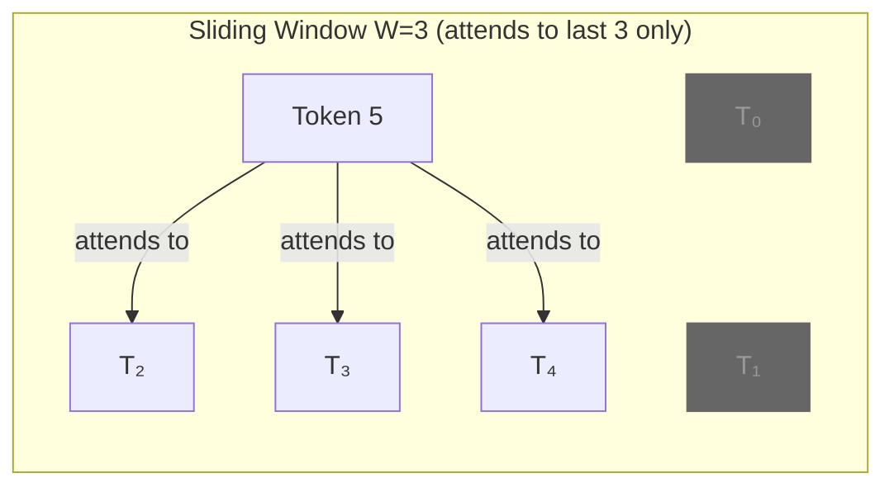

Every modern LLM generates tokens by *attending* to all previous tokens. The way this attention is computed — and the way its intermediate results are stored — is the single most important architectural decision in a transformer. It determines how much GPU memory the model needs, how many concurrent users it can serve, and how long a context it can handle.

This post covers every major attention mechanism and KV cache strategy in production today, from first principles. We finish by dissecting Google's Gemma 4 architecture as a real-world case study — using the actual `config.json` from HuggingFace.

---

## What Gets Stored in the KV Cache

During inference, each token generates a **Key** (K) and a **Value** (V) vector **for every KV head in every layer**. In [MHA](#multi-head-attention-mha--the-original-2017), that means one K and one V per attention head — so a 32-head, 80-layer model stores `32 × 2 × 80 = 5,120` vectors per token. These vectors encode what information the token holds (K) and the actual content to retrieve (V). Once computed, they're stored in the KV cache so future tokens can attend to them without recomputation.

The total KV cache per token depends on the attention mechanism:

```
KV cache per token = n_layers × n_kv_heads × 2 × d_head × bytes_per_element
                     ────────   ──────────   ─   ──────   ─────────────────
                     depth      how many     K+V  vector   FP16 = 2 bytes
                                heads store       size     FP8  = 1 byte
                                K,V
```

The `n_kv_heads` is where attention mechanisms diverge. Everything below is about reducing this number without destroying quality.

> **Terminology note**: "attention heads" and "query heads" are the same thing. In HuggingFace configs, `num_attention_heads` is the number of query heads — it's a fixed architectural constant for a given model. What varies between MHA, GQA, and MQA is **only** `num_key_value_heads`. The query head count determines how many different patterns the model can search for simultaneously. The KV head count determines how much memory that search costs.
{: .prompt-info }

---

## The Attention Mechanism Spectrum

### Multi-Head Attention (MHA) — The Original (2017)

Introduced in [*Attention Is All You Need*](https://arxiv.org/abs/1706.03762), MHA gives every query head its own dedicated K and V head. If you have 32 query heads, you have 32 KV heads.



**KV cache**: `n_layers × n_heads × 2 × d_head` — maximum memory usage. Every head maintains full independent KV vectors.

**Used by**: GPT-2, GPT-3, original BERT, early open models.

**Problem**: KV cache scales linearly with head count. A 96-head model stores 96 K vectors and 96 V vectors per token per layer. At 128K context, this becomes unservable.

---

### Multi-Query Attention (MQA) — Maximum Compression (2019)

Introduced by [Noam Shazeer](https://arxiv.org/abs/1911.02150), MQA takes the extreme approach: **all query heads share a single K and V head.**



**KV cache**: `n_layers × 1 × 2 × d_head` — minimum possible. Regardless of how many query heads exist, you store only 1 K and 1 V per layer per token.

**Used by**: StarCoder (GPTBigCode), PaLM, Falcon (early versions).

**Problem**: Quality degrades. The single KV head becomes an information bottleneck — all the diversity of what query heads can look for is channeled through one shared representation. Noticeable on reasoning tasks.

---

### Grouped-Query Attention (GQA) — The Sweet Spot (2023)

Introduced by [Ainslie et al.](https://arxiv.org/abs/2305.13245) at Google, GQA is the generalization between MHA and MQA. Query heads are divided into **groups**, and each group shares one KV head.



**KV cache**: `n_layers × n_kv_heads × 2 × d_head` — tunable between MHA and MQA. Typical ratios:

| Model | Query Heads | KV Heads | Ratio | KV Savings vs MHA |
|---|---|---|---|---|
| Llama 3.1 8B | 32 | 8 | 4:1 | 4× less KV cache |
| Llama 3.1 70B | 64 | 8 | 8:1 | 8× less |
| Mistral 7B | 32 | 8 | 4:1 | 4× less |
| Gemma 4 12B | 16 | 8 (local) / 1 (global) | 2:1 / 16:1 | varies by layer |

**Used by**: Llama 2/3, Mistral, Gemma, Qwen, most 2024-2026 models.

**Why it works**: Most of the "diversity" in attention comes from the query heads — each head learns to look for different patterns. The KV heads just store what's there to be found. Having 8 independent representations of "what's in the context" turns out to be almost as good as having 64.

---

### Multi-Latent Attention (MLA) — Latent Compression (2024)

Introduced by DeepSeek in [DeepSeek-V2](https://arxiv.org/abs/2405.04434), MLA takes a fundamentally different approach: instead of reducing the *number* of KV heads, it reduces the *dimensionality* of what's stored.

Standard attention stores K and V directly. MLA compresses them into a low-rank **latent vector** `c` that's much smaller:





**KV cache**: `n_layers × d_latent × bytes_per_element` — where `d_latent << n_kv_heads × d_head`. DeepSeek V3 uses `d_latent = 512` to represent what would otherwise require `n_kv_heads × d_head = 128 × 128 = 16,384` dimensions. That's a **32× compression** of the KV cache.

**The tradeoff**: During attention computation, you need to *decompress* the latent back into full K and V vectors. This adds compute (matrix multiplications at every attention step). But it wins on two fronts: 

(1) **memory space** — the KV cache is 32× smaller, so you can serve more concurrent requests and longer contexts; 

(2) **memory bandwidth** — during decode, the GPU must read the entire KV cache from HBM for every attention step, and reading a 512-dim latent is 32× cheaper than reading 16,384 dims of full K,V. Since decode is memory-bandwidth-bound (the GPU's compute units are underutilized), the extra decompression math is essentially "free" — the ALUs would otherwise be idle while waiting for memory reads.

**Used by**: DeepSeek V2, V3, V4.

**Why it's novel**: GQA reduces KV heads (discrete reduction). MLA reduces KV dimensionality (continuous reduction, learned during training). MLA can achieve much higher compression ratios than GQA while maintaining quality, because the compression is *trained* — the model learns what information to preserve.

---

### Sliding Window Attention — Bounded Memory (2020+)

Instead of attending to ALL previous tokens, sliding window attention only attends to the last `W` tokens. Tokens older than the window are "forgotten" by that layer.





**KV cache**: `n_layers × n_kv_heads × 2 × d_head × W` — bounded by window size, not sequence length. A 512-token window means at most 512 tokens of KV cache per layer, regardless of whether the total context is 2K or 128K.

**How information flows beyond the window**: Even though layer 1 only sees the last `W` tokens, the hidden states passed to layer 2 carry information from those `W` tokens — which themselves carried information from their `W` predecessors. So across `L` layers, information can propagate up to `L × W` tokens back. This is called **dilated attention** or information diffusion.

```
Layer 3: token 100 attends to tokens 98-100 (W=3)
Layer 2: token 98 attended to tokens 96-98
Layer 1: token 96 attended to tokens 94-96

→ At layer 3, token 100 has indirect access to token 94
  (3 layers × 3 window = 9 tokens of reach)
```

**Used by**: Mistral (all versions), Gemma 3/4 (for local attention layers).

**The catch**: Sliding window alone loses information on tasks requiring precise recall of early context ("What was the third paragraph about?"). That's why modern models don't use it exclusively — they alternate with full attention layers.

---

## Combining Strategies: Hybrid Architectures

No production model uses just one strategy. The state of the art is to **combine** multiple attention types across layers.

### The Pattern: Local + Global Alternation

The insight: most attention operations are local — a token mostly needs its recent context. But occasionally, the model needs to reach all the way back to the system prompt or an earlier instruction. So you alternate:

- **Local (sliding window) layers**: Cheap, bounded KV cache. Handle the common case.
- **Global (full attention) layers**: Expensive, unbounded KV cache. Handle long-range dependencies.

The ratio matters enormously for KV cache size:

| Model | Ratio (local:global) | Effect |
|---|---|---|
| Gemma 2 (9B) | 1:1 (alternating) | 50% of layers need full KV |
| Gemma 3/4 | **5:1** | Only ~17% of layers need full KV |
| Mistral | all sliding window | 0% full KV (but limited long-range) |

Going from 1:1 to 5:1 dramatically reduces KV cache for long contexts, which is why Gemma 3/4 can handle 128K+ context on hardware that Gemma 2 couldn't.

---

## KV Cache Management Strategies

The attention mechanism determines *what* gets stored. KV cache management determines *how* it's stored and reused.

### Static Allocation

The naive approach: allocate `max_seq_len × n_layers × n_kv_heads × 2 × d_head` contiguously in GPU memory per request. If `max_seq_len = 128K`, you allocate for 128K tokens even if the actual sequence is 200 tokens. Wastes 60-80% of memory.

### PagedAttention (vLLM)

Treats KV cache like virtual memory: allocates fixed-size pages (e.g., 16 tokens per block) on demand. Pages are freed when requests complete and can be shared across requests with common prefixes. Near-zero waste.

### Automatic Prefix Caching (APC)

When two requests share the same prefix (system prompt + tool definitions), the KV cache for that prefix is computed once and reused. Pages are hashed by their token content — identical prefix blocks hit the cache automatically. Critical for agentic workloads where the system prompt is identical across every turn.

### KV Cache Quantization

Model weights are quantized once (static). KV cache is generated during inference (dynamic) and can also be quantized:

| Method | Compression | Quality Impact |
|---|---|---|
| **FP16** (baseline) | 1× | None |
| **FP8 KV cache** | 2× | <1% degradation on most tasks |
| **INT4 KV cache** | 4× | Noticeable on needle-in-a-haystack |
| **TurboQuant (2-bit)** | 8× | Model-dependent (see below) |

Why is 2-bit KV cache quantization model-dependent? At 2 bits, each KV element can only represent 4 distinct values. Whether that's enough depends on the architecture:
- **Number of KV heads**: More heads = more redundancy. A GQA model with 8 KV heads tolerates quantization better than an MQA model with 1 — errors in one head are compensated by others.
- **Head dimension**: Larger head dimensions (like Gemma 4's 512-dim global heads) have more values to quantize, so the relative error per head is smaller.
- **MLA models**: Already compress KV into a latent. Quantizing on top of MLA compounds two lossy compressions — the model was trained assuming the latent is high-precision.
- **K=V sharing**: When K and V are the same tensor, quantization error is perfectly correlated between them, amplifying the distortion in attention scores.
- **Sliding window layers**: More tolerant because errors only persist for `W` tokens before being discarded. Global layers are more sensitive since errors affect long-range recall permanently.

### KV Cache Eviction

When the KV cache is full and new tokens arrive, something must be evicted:

| Strategy | How It Works | Tradeoff |
|---|---|---|
| **Sliding window** | Drop tokens outside the window | Simple, but loses early context |
| **H2O (Heavy Hitter Oracle)** | Keep tokens with highest cumulative attention scores | Smart eviction, but requires tracking scores |
| **StreamingLLM** | Keep first few tokens ("attention sinks") + recent window | Enables infinite context, but middle context is lost |
| **Scissorhands** | Drop tokens with consistently low attention across heads | Prunes unimportant tokens, keeps key information |

---

## Case Study: Gemma 4 12B — Dissecting a Real Architecture

Let's look at what Google actually shipped. The following is from the [actual `config.json`](https://huggingface.co/google/gemma-4-12b-it) on HuggingFace:

### The Raw Architecture

| Parameter | Value | What It Means |
|---|---|---|
| `num_hidden_layers` | 48 | 48 transformer layers |
| `num_attention_heads` | 16 | 16 query heads per layer |
| `num_key_value_heads` | 8 | 8 KV heads for sliding window layers (GQA, 2:1 ratio) |
| `num_global_key_value_heads` | 1 | **1 KV head** for full attention layers (MQA!) |
| `head_dim` | 256 | Each head in sliding window layers has 256 dimensions |
| `global_head_dim` | 512 | Each head in full attention layers has 512 dimensions |
| `hidden_size` | 3840 | Model dimension |
| `sliding_window` | 1024 | Local attention sees only the last 1024 tokens |
| `max_position_embeddings` | 262144 | 256K maximum context |
| `attention_k_eq_v` | true | K and V are identical (shared projection) |
| `layer_types` | 40× sliding, 8× full | 5:1 ratio of local to global layers |

### The Layer Pattern

```
Layer  0: sliding_attention  (local, W=1024)
Layer  1: sliding_attention
Layer  2: sliding_attention
Layer  3: sliding_attention
Layer  4: sliding_attention
Layer  5: full_attention     ← GLOBAL (sees all 256K tokens)
Layer  6: sliding_attention
...
Layer 11: full_attention     ← GLOBAL
...
Layer 47: full_attention     ← GLOBAL (8th and final)
```

40 sliding layers + 8 full attention layers = 48 total. The 5:1 ratio means only 17% of layers maintain full-length KV cache.

### What This Means for KV Cache

Here's the concrete memory calculation at 128K context in FP16:

**Sliding window layers (40 layers):**
```
Each layer stores KV for at most 1024 tokens:
40 layers × 8 KV heads × 2 (K+V) × 256 dims × 1024 tokens × 2 bytes
= 40 × 8 × 2 × 256 × 1024 × 2
= 671 MB  (bounded, doesn't grow with context)
```

But wait — `attention_k_eq_v = true` means K and V are the **same tensor** in the 12B model. This deserves explanation because K and V serve *different roles* in standard attention:

In normal attention, K (Key) determines *which* tokens get attended to, and V (Value) determines *what information* flows to the output. They're computed by separate projection matrices: `K = x · W_K` and `V = x · W_V`.

```
Standard:  Attention = softmax(Q · Kᵀ / √d) · V
                       ├── scoring ──────────┤  ├ retrieval ┤
                       K decides the weights     V decides the output

K=V:       Attention = softmax(Q · Kᵀ / √d) · K   ← K replaces V
```

With K=V, there's a single projection `W_KV` and both K and V equal `x · W_KV`. The model is saying: "the representation that makes a token *findable* is the same representation I want to *retrieve* from it." This works because for many tokens, key and value are naturally correlated — the word "Paris" is findable *because* it's about Paris, and the information you want from it is... that it's about Paris. The query heads still provide all the search diversity.

Gemma 4 uses K=V **only on sliding window layers** (1024-token context), where the information is local and K/V overlap is high. The global layers maintain separate K and V with different head configurations. Notably, the smaller E4B model does **not** use K=V (`attention_k_eq_v = false`) — it apparently doesn't have enough capacity to compensate for the information loss.

The result: instead of storing both K and V, you store one tensor. This halves the KV cache for these layers:

```
With K=V: 40 × 8 × 1 × 256 × 1024 × 2 = 335 MB
```

**Full attention layers (8 layers):**
```
Each layer stores KV for ALL tokens (up to 128K):
8 layers × 1 KV head × 2 (K+V) × 512 dims × 128K tokens × 2 bytes
= 8 × 1 × 2 × 512 × 131072 × 2
= 2,147 MB ≈ 2.1 GB
```

**Total KV cache at 128K context: ~2.4 GB**

Compare this to what a hypothetical MHA design would need:
```
48 layers × 16 KV heads × 2 × 256 dims × 128K × 2 bytes = 201 GB
```

> Gemma 4 achieves an **84× reduction** in KV cache versus naive MHA through three combined techniques: GQA (2:1 ratio on local layers), MQA (single KV head on global layers), sliding window (1024 token cap on 83% of layers), and K=V sharing.
{: .prompt-tip }

### The Dual Head Dimension Trick

Notice that sliding window layers use `head_dim = 256` while global layers use `global_head_dim = 512`. Why?

- **Sliding layers** process only 1024 tokens — the attention matrix is small. Larger head dimensions give each head more representational capacity without blowing up memory, since the sequence dimension is bounded.
- **Global layers** process up to 256K tokens — the attention matrix is huge. But they only have 1 KV head (MQA), so the per-head dimension can be large (512) while still keeping total KV cache manageable: `1 head × 512 dims` = 512 values per token, which is much less than `8 heads × 256 dims` = 2048 values for the sliding layers.

This is a deliberate design: allocate representational capacity where it's cheap (bounded-length layers) and be aggressive about compression where it's expensive (unbounded-length layers).

### The Dual RoPE Configuration

**Quick RoPE primer**: Transformers are position-agnostic by default — the self-attention operation treats tokens as a set, not a sequence. Without position information, "the cat sat on the mat" and "mat the on sat cat the" produce the same attention scores. **RoPE** (Rotary Position Embedding) solves this by rotating the Q and K vectors by an angle that depends on their position in the sequence. Token at position 5 gets rotated differently than token at position 500.

The key parameter is **theta (θ)**: it controls the wavelengths of the rotation. A small theta (10,000) creates fast-rotating high-frequency patterns — good for encoding nearby positions precisely. A large theta (1,000,000) creates slow-rotating low-frequency patterns — needed to distinguish positions that are far apart (like position 1 vs position 200,000) without the angles "wrapping around" and aliasing.

```
Position 0:    rotate Q,K by 0°
Position 1:    rotate Q,K by ~0.01° (θ=10K) or ~0.001° (θ=1M)
Position 100K: rotate Q,K by ~1000° (θ=10K, wraps!) or ~100° (θ=1M, fine)
```

With that context, here's Gemma 4's dual configuration:

```json
"rope_parameters": {
  "full_attention": {
    "partial_rotary_factor": 0.25,
    "rope_theta": 1000000.0,
    "rope_type": "proportional"
  },
  "sliding_attention": {
    "rope_theta": 10000.0,
    "rope_type": "default"
  }
}
```

Two different RoPE configurations for the two layer types:
- **Sliding layers**: Standard RoPE with `theta=10000`. Classic, optimized for local patterns. Only needs to encode positions up to 1024 — small theta gives precise nearby-position discrimination.
- **Global layers**: Extended RoPE with `theta=1000000` and `partial_rotary_factor=0.25`. The much higher theta extends the wavelengths to handle 256K positions without aliasing. Only 25% of the head dimension gets rotary encoding (the rest carries no positional information) — this reduces interference between positional and semantic information at extreme context lengths, since most of the head's capacity is devoted to *what* the token means rather than *where* it is.

### Variant Comparison: E4B vs 12B

The Gemma 4 E4B (efficient 4B) uses the same architectural *pattern* but with even more aggressive optimizations:

| Parameter | E4B | 12B |
|---|---|---|
| Layers | 42 | 48 |
| Query heads | 8 | 16 |
| KV heads (local) | 2 | 8 |
| KV heads (global) | null (same as local) | 1 |
| `head_dim` | 256 | 256 |
| `sliding_window` | 512 | 1024 |
| `attention_k_eq_v` | false | true |
| `num_kv_shared_layers` | 18 | 0 |
| `hidden_size` | 2560 | 3840 |

The E4B introduces `num_kv_shared_layers = 18`, meaning **18 consecutive layers share the same KV cache** instead of each computing their own. This is a different KV compression strategy than MLA — instead of compressing the representation, you literally reuse the same K,V tensors across multiple layers. The bet is that adjacent layers attend to similar patterns.

---

## The Full Taxonomy

Here's every major attention/KV strategy in production today, ordered by KV cache efficiency:

| Strategy | KV Size per Token per Layer | Quality vs MHA | Who Uses It |
|---|---|---|---|
| **MHA** | `n_heads × d_head × 2` | Baseline | GPT-2/3, BERT |
| **GQA** | `n_kv_heads × d_head × 2` | ~99% of MHA | Llama 2/3, Gemma, Qwen, Mistral |
| **MQA** | `1 × d_head × 2` | ~96-98% of MHA | StarCoder, PaLM, Gemma 4 (global layers) |
| **K=V Sharing** | `n_kv_heads × d_head × 1` | ~98-99% of GQA | Gemma 4 12B |
| **MLA** | `d_latent × 1` (d_latent << n_kv × d_head) | ~99% of MHA | DeepSeek V2/V3/V4 |
| **Sliding Window** | `n_kv_heads × d_head × 2 × W/seq_len` | Depends on ratio | Mistral, Gemma (local layers) |
| **Cross-Layer KV Sharing** | amortized across shared layers | Under study | Gemma 4 E4B |
| **SSM (no KV cache)** | Fixed-size state | Lower on some tasks | Mamba, Jamba (hybrid) |

Modern architectures combine multiple strategies. Gemma 4 12B uses GQA + MQA + sliding window + K=V sharing simultaneously. DeepSeek V3 uses MLA + MoE. The trend is clear: every new architecture invests more design effort into KV cache reduction, because it's the binding constraint on serving scale.

---

## Further Reading

- [*Attention Is All You Need*](https://arxiv.org/abs/1706.03762) — The original MHA paper (Vaswani et al., 2017)
- [*Fast Transformer Decoding: One Write-Head is All You Need*](https://arxiv.org/abs/1911.02150) — MQA (Shazeer, 2019)
- [*GQA: Training Generalized Multi-Query Transformer Models from Multi-Head Checkpoints*](https://arxiv.org/abs/2305.13245) — GQA (Ainslie et al., 2023)
- [*DeepSeek-V2: A Strong, Economical, and Efficient Mixture-of-Experts Language Model*](https://arxiv.org/abs/2405.04434) — MLA
- [*Gemma 3 Technical Report*](https://arxiv.org/abs/2503.19786) — Sliding window + GQA architecture
- [*Efficient Memory Management for Large Language Model Serving with PagedAttention*](https://arxiv.org/abs/2309.06180) — PagedAttention (vLLM)
