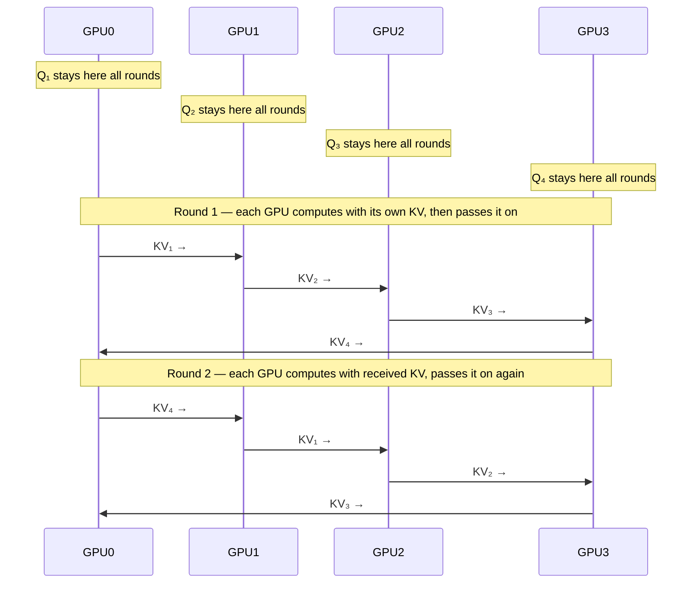

> This article is **Part 12 of 15** in the [Generative AI in Depth](/categories/generative-ai-in-depth/) series.
{: .prompt-info }


Context length has become one of the most visible axes of LLM competition. Frontier models now commonly support context windows of 128K to 1M+ tokens — a range that would have seemed implausible just a few years ago. But what does it actually cost to serve these context lengths, and what technical machinery makes it possible?

This article explains the full stack: why naive transformers fail at long context, how Rotary Position Embeddings (RoPE) work, how frequency interpolation and YaRN extend them without retraining, and how Ring Attention makes million-token context practical across multiple GPUs.

---

## Why Standard Attention Fails at Long Context

A standard transformer with context length $T$ has two scaling problems:

**1. Memory — the KV cache:**

The KV cache stores keys and values for all previous tokens. For each layer, per token:

$$\text{KV cache} = 2 \times d_{\text{head}} \times n_{\text{heads}} \times \text{bytes per value}$$

For the full sequence of $T$ tokens, across $L$ layers, in BF16:

$$\text{KV cache memory} = T \times L \times 2 \times d_{\text{head}} \times n_{\text{heads}} \times 2 \text{ bytes}$$

For Llama 3 70B ($L=80$, $n_{\text{heads}}=64$, $d_{\text{head}}=128$, GQA with $n_{\text{kv}}=8$):

$$T \times 80 \times 2 \times 128 \times 8 \times 2 = T \times 327,680 \text{ bytes} \approx 0.32 \text{ GB per 1K tokens}$$

| Context length | KV cache (Llama 3 70B) |
|---|---|
| 8K tokens | 2.6 GB |
| 32K tokens | 10.5 GB |
| 128K tokens | 42 GB |
| 1M tokens | 327 GB |

At 1M tokens, the KV cache alone exceeds the capacity of 4 × A100 80 GB. This is the **memory wall**.

> **Serving a single 1M-token context requires more KV memory than fits on 4 A100 80 GB GPUs.** This is why million-token context is currently only viable at inference centres with high-memory-bandwidth interconnects and Ring Attention to distribute the KV cache across GPU clusters. It is not a one-GPU problem.
{: .prompt-info }

**2. Compute — the attention operation:**

Attention between a query at position $t$ and all previous keys is O(T) per token, giving O(T²) total for a sequence of length $T$. Specifically, for a batch of $B$ sequences, $L$ layers, $H$ heads:

$$\text{Attention FLOPs} = 4 \times B \times L \times H \times T^2 \times d_{\text{head}}$$

This is the **quadratic bottleneck**: increasing context length by 16× (from 8K to 128K tokens) increases attention compute by 256× — because both the sequence length squared terms scale together. To see it concretely: 8,000² = 64 million operations per layer per head; 128,000² = 16.4 billion — a 256× jump from a 16× longer sequence.

---

## Position Embeddings: The Foundation

For a transformer to generalise beyond its training context length, it needs a way of encoding position that stays meaningful at positions it's never seen before.

**Absolute position embeddings** (original Transformer): each position slot has a fixed encoding baked in at training time. There is no mechanism to extrapolate — position 5000 simply has no representation if the model was only trained up to position 4096.

**Learned position embeddings**: similar problem. Each position ID has a learned vector. Positions beyond the training length have no learned vector at all. Hard failure beyond the training context.

**Rotary Position Embeddings (RoPE)** (Su et al., 2021): the approach used by most modern open-weight models. RoPE is different in a fundamental way — it doesn't attach a position tag to each token. Instead, it encodes position directly *into how tokens relate to each other during attention*.

---

## RoPE: Rotary Position Embeddings

### The Intuition

Think of it this way: when you read a sentence, what matters is not "this word is at position 1,247 in the document" — what matters is "this word is 5 words before that one". RoPE is built around exactly that insight.

The way it works mechanically: before a query token attends to a key token, both are rotated by an angle determined by their position. Two tokens that are close together get similar rotations; two tokens far apart get very different rotations. When the attention score is computed (a dot product between query and key), the rotation difference cancels out in a way that makes the score depend only on **how far apart** the two tokens are — not where they are in absolute terms.

This is powerful because "5 positions ago" is a concept that transfers across all positions. A model trained on sequences up to 8K tokens still understands what "5 positions ago" means at position 50,000 — as long as the relative relationship is encoded the same way.

### The Frequency Spectrum

RoPE uses different rotation speeds for different parts of the token's internal representation. Some dimensions rotate fast (completing a full cycle over just a few tokens) — these capture fine-grained, short-range position. Other dimensions rotate very slowly (taking hundreds of thousands of tokens to complete one cycle) — these carry long-range position information.

You can think of it like a clock: the seconds hand spins fast and tells you short-term time; the hour hand moves slowly and tells you where you are in the day. RoPE stacks many such "clocks" with different speeds, giving the model a rich multi-scale sense of position.

### Key Parameters

Two numbers control how RoPE behaves, and you'll encounter them in model cards and extension techniques:

**Base frequency (`b`)** controls how slow the slowest "clock" is — and therefore how long a sequence the model can meaningfully distinguish positions in.

Going back to the clock analogy: imagine the slowest clock in the RoPE stack completes one full rotation every N tokens. Once it has gone all the way around, it's back to where it started — and the model can no longer tell the difference between, say, token 500 and token 500 + N. That's a problem.

- With the **original base of 10,000**, the slowest dimension completes a full cycle roughly every 60,000 tokens. Fine for 4K or 8K contexts — the clock hasn't come close to wrapping. But push to 128K, and it has wrapped twice, creating positional ambiguity.
- With **LLaMA 3's base of 500,000**, that same slowest clock completes a cycle every ~3 million tokens. Even at 128K context, it has barely moved a fraction of its full rotation — no ambiguity, no extrapolation required.

In short: **a higher base = longer sequences before things go wrong**. This is why raising the base is the simplest way to extend context range, and why you'll see the base reported in model cards for any long-context model.

**Dimension count (`d`)** determines how many distinct "clocks" there are — but why do you need more than one?

Consider what a single clock can do. A fast clock tells you the fine-grained local position — "this token is 3 positions after that one" — but it wraps around quickly and can't distinguish positions that are far apart. A slow clock tells you the coarse, long-range position — "this token is somewhere in the second half of the document" — but it can't resolve whether two nearby tokens are 1 or 5 positions apart.

Neither alone is sufficient. You need both simultaneously, the same way you need seconds *and* minutes *and* hours to know exactly what time it is. The seconds hand tells you the fine detail; the hour hand tells you where you are in the day; together they uniquely identify every moment.

RoPE's dimension pairs are exactly that: a stack of clocks at different speeds, each resolving a different scale of position. The fastest ones distinguish tokens that are 1–10 positions apart; the middle-speed ones handle the 100s to 1,000s range; the slowest ones handle the very long range. All together, they give the attention mechanism a complete multi-scale picture of where every token sits relative to every other.

More dimensions (larger `d`) means more clock speeds in between — a finer-grained spectrum with fewer "blind spots" at any particular scale. But this is set by the model's head dimension and can't be changed after training.

When you see [NTK-aware scaling](#ntk-aware-interpolation) or [YaRN](#yarn-yet-another-rope-extension) described as "changing the base", they are raising `b` — making the slowest clocks spin even more slowly so they don't wrap around at longer context lengths.

**Where it breaks down:** the model is trained on certain rotation patterns. If you push the sequence well beyond the training length, the fast-spinning dimensions wrap around into angles the model has never seen during training. Extrapolation fails — not catastrophically, but noticeably. This is the problem that the following techniques solve.

---

## Extending Context: Frequency Interpolation

All the techniques for making a model handle sequences longer than it was originally trained on — without retraining from scratch — share the same core idea: rather than extrapolating into unseen rotation angles, **compress the position range** so that the new longer sequence still maps onto the rotation angles the model was trained on.

**Why "interpolation"?** In mathematics, *interpolation* means estimating a value that falls *between* known data points. *Extrapolation* means estimating a value *beyond* the known range. If the model has only seen rotation angles for positions 0–4,000 during training, using position 20,000 directly is extrapolation — asking the model to reason about an angle it's never encountered. Scaling that position down so it falls within 0–4,000 is interpolation — the model is now queried at a position *between* things it has seen, not outside them. The intuitive effect is compression; "interpolation" is just the mathematical label for why it works.

Imagine the training context like a ruler that goes from 0 to 1. The model has learned to read positions anywhere on that ruler. You want to use a longer ruler — but instead of extending past 1 (where the model has no idea what to do), you **relabel** the longer ruler so its positions still fall in the 0–1 range. The model can now handle the longer sequence because every position it sees is still one it recognises.

### Linear Interpolation (Position Interpolation)

Chen et al. (2023) proposed the simplest version: uniformly shrink all positions to fit. If you want to handle 4× more context, divide every position by 4. Position 4000 becomes position 1000; position 16000 becomes position 4000. Everything lands within the trained range.

**The downside:** shrinking positions uniformly also squashes the short-range signals. The fast-spinning dimensions that normally distinguish "1 token ago" from "2 tokens ago" now spin 4× slower — those fine-grained distinctions become blurry. Performance on short contexts degrades slightly, and a short fine-tuning run (about 1,000 steps on long sequences) is needed to fully recover.

### NTK-Aware Interpolation

**NTK** stands for **Neural Tangent Kernel** — a theoretical framework from machine learning research that describes how neural networks behave when you make small changes to their inputs or parameters. You don't need to understand the theory to use this technique; what matters is the practical insight it provides: when you compress the position range to extend context, you shouldn't treat all frequency dimensions the same way.

The key insight: you don't need to shrink all dimensions equally. The fast-spinning dimensions are already discriminating fine-grained positions that the model understands well — leave them alone. Only slow down the slower dimensions, which are the ones that actually overflow at longer contexts.

In practice, NTK-aware scaling achieves this by changing a single parameter in RoPE — the "base" — to a larger value. This leaves high-frequency dimensions nearly untouched while automatically stretching the low-frequency ones to cover the longer context.

The big practical benefit: **no fine-tuning required**. Just swapping in the new base value gives reasonable long-context performance immediately, zero-shot. It's the easiest drop-in context extension technique.

### Dynamic NTK

A small but useful refinement: instead of committing to a fixed scale factor upfront, compute it on the fly based on the actual sequence length of each request. Short sequences use normal RoPE (no degradation at all); longer sequences automatically get the scaled version. The model gracefully handles any length up to a maximum, without trading off short-context quality.

---

## YaRN: Yet Another RoPE extensioN

YaRN (Peng et al., 2023) takes the ideas above and combines them more carefully.

**1. Per-group frequency treatment:**

Rather than applying the same adjustment to all dimensions, YaRN sorts the dimensions into three buckets based on how fast they spin:

- **Fast-spinning dimensions** (cycle many times within the training context): leave completely untouched — they're already working correctly
- **Medium-frequency dimensions**: apply linear interpolation (stretch to fit the longer context)
- **Slow-spinning dimensions** (near the context boundary): apply NTK-aware scaling

Each group gets exactly the treatment it needs, rather than a one-size-fits-all compromise.

**2. Attention temperature adjustment:**

When you spread attention over many more tokens, the attention scores can become either too sharp (the model focuses on almost nothing) or too diffuse (it tries to attend to everything equally). YaRN adds a small temperature correction that keeps the attention distribution well-behaved at extended lengths. Think of it as re-normalising the scores so the model doesn't "panic" when it suddenly has 128K tokens to look at instead of 8K.

**3. A short fine-tuning run is needed:**

Unlike NTK-aware (which is zero-shot), YaRN requires about 400 steps of fine-tuning on long sequences after applying the new scaling. This is still far cheaper than pretraining from scratch — but it's not completely free.

**YaRN results (from the paper):**

| Setting | Base context | Extended context | Method | Passkey retrieval |
|---|---|---|---|---|
| 7B model | 4K | 64K | YaRN | Near-perfect |
| 7B model | 4K | 128K | YaRN | Good |
| 7B model | 4K | 128K | Linear interpolation | Degrades |

**Modern defaults:**

LLaMA 3 takes a different approach: rather than extending after training, it uses a much larger base frequency from the start (50× larger than the original RoPE). This pushes the slow-spinning dimensions' effective range out so far that the model can handle much longer contexts right from pretraining, supplemented by a dedicated long-context fine-tuning stage.

---

## The Sliding Window and Sparse Attention

For very long contexts, even with RoPE extensions, full attention is quadratically expensive. **Sparse attention** patterns reduce compute by restricting which tokens can attend to which.

### Sliding Window Attention (Mistral)

Mistral 7B uses sliding window attention: each token attends only to the $W$ most recent tokens (e.g., $W = 4096$), not the full sequence. Information beyond $W$ tokens is accessible indirectly — through multiple layers, earlier tokens "pass forward" their information via the residual stream.

For a model with $L$ layers and window size $W$, the effective receptive field is $L \times W$ — much larger than $W$, because each layer can aggregate information from different windows.

**Compute:** $O(T \times W)$ instead of $O(T^2)$ — linear in sequence length for fixed window size.

**Trade-off:** Some long-range dependencies are harder to capture — information from the beginning of a very long document may be attenuated by the time it reaches the end.

### Combined Patterns

Mistral and some other models use alternating full and sliding window attention:
- Even layers: sliding window attention (cheap, captures local)
- Odd layers: full attention (captures global, applied sparsely)

This gives both local and global receptive fields at reduced cost.

---

## Ring Attention: Distributing Long Context Across GPUs

Ring Attention (Liu et al., 2023) solves the **memory** problem of long context: when the KV cache doesn't fit on a single GPU, distribute it across multiple GPUs arranged in a logical ring.

### The Mechanism

For a sequence of $T$ tokens distributed across $G$ GPUs, each GPU holds a **segment** of $T/G$ tokens. Importantly: **each GPU's query (Q) vectors stay fixed on that GPU throughout**. Only the key and value (KV) blocks travel around the ring.

Attention computation proceeds in G sequential rounds:
1. Each GPU computes attention between its local Q and the KV block it currently holds, accumulating the partial result
2. Each GPU passes its KV block to the next GPU in the ring (point-to-point, neighbor to neighbor — not broadcast)
3. Repeat until every GPU has seen every KV block — after G rounds, each GPU holds the complete attention output for its Q segment

The critical innovation: **communication and computation are overlapped**. While GPU i is computing with the KV block it just received, it simultaneously sends that block to the next GPU. The transfer cost is effectively hidden behind the compute.


*(After G rounds, every GPU's Q has attended over all KV blocks. Q never moves — only KV rotates.)*

**Memory:** Each GPU holds only $T/G$ tokens' worth of KV — memory scales linearly with GPU count, not with total sequence length.

**Communication:** G rounds of point-to-point ring transfers (each GPU sends to its one neighbor, not to all others). The total data transferred is O(T × d), and because it's overlapped with computation, it adds negligible wall-clock time.

**Combined with FlashAttention:** Ring Attention operates at the block level, feeding local KV blocks into FlashAttention's tiled computation. This maintains the memory-efficient on-SRAM attention computation of FlashAttention while distributing across GPUs.

### Striped Ring Attention

Standard Ring Attention distributes **contiguous** segments. This causes load imbalance: causal attention means earlier segments have less work (they attend to fewer past tokens). Striped Ring Attention interleaves the segments across GPUs so each GPU has an equal mix of "busy" (late in sequence) and "light" (early in sequence) tokens.

---

## Alternative Architectures: Rethinking the Attention Problem

The approaches covered so far all work within the attention paradigm — they scale, compress, or distribute the standard attention mechanism. But a parallel body of research asks a more radical question: what if you replace attention entirely?

### MLA: Multi-Head Latent Attention

MLA (introduced in DeepSeek-V2) keeps standard attention but aggressively compresses the KV cache. Instead of storing full key and value vectors for every token, it stores a compact latent representation and reconstructs the keys and values from it on demand. The result is a KV cache roughly 5–13× smaller than standard multi-head attention — comparable in memory savings to GQA, but without the quality penalty of having fewer heads.

**What MLA solves:** The memory wall. A 128K-token context that would saturate 42 GB of VRAM with standard MHA can fit in a fraction of that with MLA. This directly enables longer contexts on the same hardware.

**What MLA doesn't solve:**
- The *compute* is still quadratic. You're still attending over all T tokens — just with smaller vectors. The T² FLOPs are unchanged.
- RoPE extrapolation is still required for contexts beyond training length. In fact, MLA complicates RoPE: you can't apply position-dependent rotations to a shared compressed representation. DeepSeek solves this with "decoupled RoPE" — some dimensions carry position encoding separately, bypassing the compression — but you still need YaRN or NTK-aware scaling to extend context further.

**In short:** MLA is a very effective memory optimisation. It's not a long-context architecture in the deeper sense.

### State Space Models: Mamba

Mamba (Gu & Dao, 2023) represents a fundamentally different philosophy. Instead of attending over all previous tokens, Mamba maintains a **fixed-size hidden state** that is continuously updated as tokens are processed — similar to an RNN, but with carefully designed selective gating.

**The key advantages:**
- **Linear time and memory**: processing a sequence of T tokens takes O(T) time and O(1) memory (the hidden state is fixed size). This completely eliminates the quadratic bottleneck and the KV cache memory wall.
- **Fast inference**: at decode time, generating each new token requires only updating the fixed-size state — no need to load growing KV caches from memory.

**The fundamental trade-off:** the fixed hidden state is a bottleneck. It's a compressed summary of everything the model has seen, and like any compression, it's lossy. Transformers can always look back at any previous token verbatim (via the KV cache). Mamba cannot. This creates a structural disadvantage on tasks that require precise recall of specific details buried in long contexts — "what exactly did the third paragraph of this 200-page document say about X?" — because that information may have been overwritten in the hidden state.

In practice, Mamba matches or exceeds transformers on many standard language benchmarks at equivalent parameter count, but underperforms on tasks explicitly designed to test long-range retrieval (like Needle in a Haystack).

**Mamba-2** (Dao & Gu, 2024) showed that selective SSMs and attention are actually mathematically closely related — they're both special cases of a broader family of structured matrix operations. This theoretical connection enabled a cleaner, 2–8× faster implementation, and opened the door to architectures that blend both.

### Hybrid Architectures: The Best of Both Worlds

The most practical direction emerging from this research is hybrid models that interleave SSM layers with occasional full-attention layers. The idea: SSM layers handle the bulk of the processing cheaply in O(T), while the sparse attention layers provide the precise long-range recall that SSMs struggle with.

**Jamba** (AI21 Labs, 2024) is a well-studied example: it interleaves Transformer and Mamba layers with a Mixture-of-Experts component, achieving strong performance on 256K-token contexts while fitting in a single 80 GB GPU. The ratio of attention to Mamba layers is a design choice — more attention layers improve recall quality; more Mamba layers reduce memory and compute cost.

The practical implication of all this: the "one architecture for everything" assumption is weakening. Long-context serving in 2025–2026 increasingly involves architectural choices — full attention with RoPE extension and Ring Attention for maximum recall quality; MLA for memory-efficient standard attention; hybrid SSM-Transformer models for throughput-sensitive deployments where some loss of precise recall is acceptable.

| Architecture | Compute scaling | Memory scaling | Long-range recall | RoPE extension needed? |
|---|---|---|---|---|
| Standard attention | O(T²) | O(T) KV cache | Perfect (verbatim) | Yes |
| MLA | O(T²) | O(T) but ~5–13× smaller | Perfect (verbatim) | Yes |
| Mamba (pure SSM) | O(T) | O(1) hidden state | Lossy (compressed) | No |
| Hybrid (e.g. Jamba) | Between | Between | Near-perfect | Partial |

---

## Context Length and Retrieval Quality

Simply extending the context length doesn't mean the model can use it effectively. Two phenomena make long-context reasoning hard:

### The Lost in the Middle Problem

Liu et al. (2023) showed that when relevant information is placed in the **middle** of a long context, models perform significantly worse than when it's at the beginning or end. Models develop a U-shaped performance curve by position — they're good at the start and end, poor in the middle.

This is a training data phenomenon: most training documents are short. Long-context fine-tuning helps, but the bias persists.

### Needle in a Haystack

The canonical benchmark for long-context evaluation: a specific fact ("the needle") is placed at a random position in a long document (the "haystack"), and the model is asked to recall the fact. Performance is reported as a 2D heatmap over (context length, position).

```
Context length →
          8K    16K   32K   64K   128K
Position ↓
10%      100%  100%  99%   97%   92%
30%      100%  99%   97%   93%   85%
50%      100%  99%   94%   87%   74%  ← the "lost in the middle"
70%      100%  100%  98%   94%   88%
90%      100%  100%  100%  99%   96%
```

*(Hypothetical, for illustration — actual numbers vary by model)*

Models with dedicated long-context training stages achieve near-100% retrieval accuracy across all positions at their maximum supported context. General-purpose models that merely support long context through RoPE extension but without long-context fine-tuning often fail in the middle.

> **RoPE extension is necessary but not sufficient.** A model that supports 128K tokens via NTK-aware RoPE scaling but was only fine-tuned on 8K sequences will show the "lost in the middle" degradation at long contexts — it can process the tokens but not reliably retrieve information from the middle. Long-context *capability* requires dedicated fine-tuning stages on long sequences, not just a RoPE base frequency change. Check the model card for explicit long-context training stages before assuming full retrieval quality.
{: .prompt-warning }

---

## The Full Cost of Long Context

Putting it all together — what does it actually cost to serve a 128K context?

**For one request with 128K input tokens (Llama 3 70B, GQA):**

| Cost component | Value |
|---|---|
| Prefill compute (attention) | ~16.4B operations/layer/head × 80 layers × 8 heads ≈ huge |
| KV cache memory | ~42 GB per request |
| Time-to-first-token (TTFT) | Scales as O(T²) vs O(T) for short context |

**Practical consequence:** A single 128K request can consume the full KV cache budget of dozens of 4K requests. Long-context requests are **much more expensive per request** and must be priced/throttled accordingly. Most production APIs charge more per token for long-context inputs, or have separate long-context tier pricing.

**Per-token inference cost at different context lengths:**

| Phase | Short context (4K) | Long context (128K) | Ratio |
|---|---|---|---|
| Prefill (first token) | Fast | ~32× slower (T²) | 32× |
| Decode (per token) | KV cache 2.6 GB | KV cache 42 GB | 16× more VRAM |
| TTFT latency | ~100ms | ~3+ seconds | >30× |

> **A single 128K request can displace ~16 concurrent 4K requests.** If you're building a multi-tenant serving system and one user sends a 128K prompt, they can consume the KV budget of 16 standard users for the duration of their request. Rate-limit long-context requests separately from short-context ones, and consider per-request KV byte quotas rather than per-request token quotas.
{: .prompt-warning }

---

## Key Takeaways

- Standard transformer attention is O(T²) in compute and O(T) in memory — both scale badly with context length
- **RoPE** encodes relative position via rotation matrices applied to Q and K vectors, with per-dimension frequencies $\theta_i = b^{-2i/d}$
- Extending context requires modifying RoPE: **linear interpolation** scales all positions; **NTK-aware** scaling adjusts high and low frequencies differently; **YaRN** applies dimension-group-specific scaling with temperature correction
- **LLaMA 3's** approach: use a very large base ($b = 500K$) plus dedicated long-context fine-tuning stages
- **Sliding window attention** limits attention to the $W$ most recent tokens — O(TW) instead of O(T²) at the cost of weakening long-range dependencies
- **Ring Attention** distributes KV cache across GPUs in a ring, enabling linear memory scaling with GPU count for arbitrarily long contexts
- Even with extended context support, models often show **"lost in the middle"** degradation — relevant content in the middle of long documents is recalled less well
- Long-context requests are 10–30× more expensive in VRAM and latency — this shapes pricing and serving architecture

---

## Further Reading

- [Inside LLM Inference](/posts/decoder-forward-pass-dimensions) — the forward pass that context length affects
- [Attention Mechanisms and KV Cache](/posts/attention-mechanisms-and-kv-architectures) — KV cache structure and GQA
- [The Memory Math](/posts/llm-memory-math) — KV cache memory budgeting at scale
- [CUDA Kernels and FlashAttention](/posts/cuda-kernels-and-flashattention) — how FlashAttention tiles attention to fit in SRAM
- RoPE paper: Su et al., [arXiv 2104.09864](https://arxiv.org/abs/2104.09864)
- Position Interpolation: Chen et al., [arXiv 2306.15595](https://arxiv.org/abs/2306.15595)
- YaRN: Peng et al., [arXiv 2309.00071](https://arxiv.org/abs/2309.00071)
- Ring Attention: Liu et al., [arXiv 2310.01889](https://arxiv.org/abs/2310.01889)
