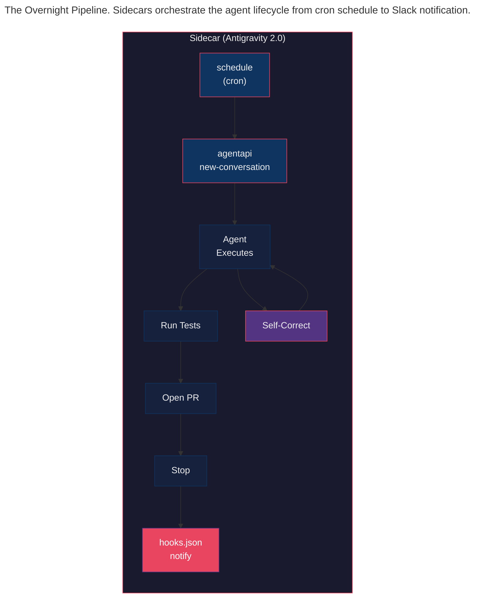
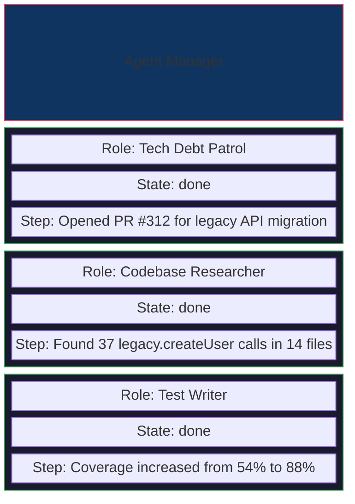

> This article is part of the [Antigravity Engineering Series](https://iamulya.one/tags/antigravity-engineering-series). 
{: .prompt-info }

You're still prompting your AI agent like it's 2024.

Every morning you open your IDE, type a request, watch the agent work, approve the changes, and move on. You're the scheduler. You're the retry logic. You're the verification gate. And when you close the laptop, the agent stops.

What if it didn't?

Antigravity 2.0 introduced **Sidecars** — background processes that run alongside the agent, automatically launched, monitored, and restarted by the platform. Combined with the **`schedule` builtin** and the **`agentapi`** CLI, sidecars turn your agent from an interactive pair programmer into persistent engineering infrastructure. You define the work. The platform runs it on a cron schedule. The agent reasons about it. You wake up to pull requests.

This post walks through building an autonomous tech debt pipeline: a system that works through your backlog overnight — migrating deprecated APIs, expanding test coverage, updating documentation — and has PRs waiting for you in the morning.

---

## The Prompt Trap

Interactive prompting is the wrong abstraction for repetitive engineering tasks.

Every codebase has a backlog that never gets prioritized:

- 37 calls to `legacy.createUser()` that should be `userService.create()`
- 12 modules below 60% test coverage
- 8 config files still referencing the old environment variable naming convention
- Documentation that hasn't been updated since the last major refactor

Nobody disputes these need fixing. Nobody has time. And each individual fix is *exactly* the kind of mechanical, well-scoped task an AI agent excels at. But doing them one by one — prompt, wait, review, prompt, wait, review — takes longer than just doing it manually.

The mental model shift: **agents aren't collaborators you watch work. They're background processes that work while you don't.** Antigravity 2.0 gives you the infrastructure to treat them that way.

---

## Architecture: The Overnight Pipeline

Here's the system we're building:



Three products, three roles:

- **Antigravity 2.0** provides the Sidecar runtime — background processes with automatic lifecycle management, the `schedule` builtin for cron, and `agentapi` for programmatic agent interaction. It also provides the permission system (`Allow`/`Deny`/`Ask`) and hooks (`hooks.json`) for safety gates.
- **Antigravity CLI** provides the interactive development and debugging surface — `/agents` for monitoring subagents, `/tasks` for background processes, `/skills` for discovering available agent skills, and the sandbox for safe command execution.
- **Antigravity IDE** provides the visual workspace — designing the pipeline, testing individual tasks interactively, reviewing overnight results through the subagent panel, and approving permission requests.

---

## Step 1: Create a Tech Debt Skill

Before anything runs autonomously, encode your team's tech debt patterns as an agent Skill. Skills are reusable packages of instructions — the agent discovers them automatically and follows them when relevant.

Create the skill:

```
.agents/skills/tech-debt-patrol/
├── SKILL.md
├── scripts/
│   └── verify-migration.sh
└── resources/
    └── migration-map.json
```

The `SKILL.md` defines what the agent should do:

```markdown
---
name: tech-debt-patrol
description: >
  Migrates deprecated API calls, expands test coverage, and fixes
  suppressed linting warnings. Use when asked to work through tech
  debt, clean up deprecated code, or improve test coverage.
---

# Tech Debt Patrol

## When to use this skill

- Migrating deprecated API calls to new interfaces
- Expanding test coverage for modules below target thresholds
- Removing eslint-disable comments by fixing underlying issues
- Updating stale documentation to match current implementations

## Migration workflow

For each deprecated API migration:

1. Read `resources/migration-map.json` for the old→new mapping
2. Search for all calls to the deprecated API in `src/`
3. For each call site:
   a. Update the import to the new module
   b. Refactor the function call to match the new signature
   c. If the file has tests, update test mocks to use the new API
4. Run `scripts/verify-migration.sh` to confirm zero deprecated calls remain
5. Run `npm test` to verify nothing is broken
6. If tests fail, analyze the failure and fix — do NOT revert the migration

## Test coverage workflow

1. Run: `npx jest --coverage --collectCoverageFrom='<target>/**/*.ts'`
2. Identify uncovered lines and branches
3. Write tests for uncovered paths — focus on error handling and edge cases
4. Do NOT modify source code — only add test files
5. Re-run coverage and verify the target threshold is met

## Pull request conventions

- Branch name: `auto/tech-debt/<task-description>`
- Commit message: `chore(auto): <description>`
- PR labels: `automated`, `tech-debt`
- PR body: include before/after metrics (coverage %, deprecated call count)
```

The `migration-map.json` resource:

```json
{
  "migrations": [
    {
      "deprecated": "legacy.createUser(name, email, role)",
      "replacement": "userService.create({ name, email, role, createdBy: 'migration' })",
      "old_import": "import { legacy } from '@app/legacy'",
      "new_import": "import { userService } from '@app/services/user'",
      "notes": "New API uses object signature instead of positional args"
    },
    {
      "deprecated": "config.get('DB_HOST')",
      "replacement": "config.get('DATABASE_HOST')",
      "old_import": null,
      "new_import": null,
      "notes": "Add fallback: config.get('DATABASE_HOST') ?? config.get('DB_HOST')"
    }
  ]
}
```

The verification script:

```bash
#!/bin/bash
# scripts/verify-migration.sh
# Verifies that no deprecated API calls remain outside the legacy module

set -euo pipefail

DEPRECATED_PATTERNS=(
  "legacy.createUser"
  "legacy.deleteUser"
  "legacy.updateUser"
)

EXIT_CODE=0

for pattern in "${DEPRECATED_PATTERNS[@]}"; do
  COUNT=$(grep -r "$pattern" src/ --include='*.ts' | grep -v 'src/services/legacy/' | wc -l | tr -d ' ')
  if [ "$COUNT" -gt 0 ]; then
    echo "❌ Found $COUNT remaining calls to $pattern:"
    grep -rn "$pattern" src/ --include='*.ts' | grep -v 'src/services/legacy/'
    EXIT_CODE=1
  else
    echo "✅ Zero calls to $pattern outside legacy module"
  fi
done

exit $EXIT_CODE
```

Test this interactively first. In the IDE or CLI, ask the agent:

```
> Migrate all legacy.createUser() calls using the tech-debt-patrol skill.
> Do a dry run first — show me what you'd change without modifying anything.
```

The agent discovers the skill, reads the migration map, and reports what it would change. Once you're confident the skill works, automate it.

---

## Step 2: Configure the Sidecar (Antigravity 2.0)

Sidecars are background processes managed by Antigravity. They live in `~/.gemini/config/sidecars/<name>/` and are configured with a `sidecar.json` file.

Create the sidecar directory:

```
~/.gemini/config/sidecars/
└── tech-debt-patrol/
    ├── sidecar.json
    └── prompt.txt
```

The `sidecar.json` uses the `schedule` builtin to run on a cron:

```json
{
  "description": "Nightly tech debt patrol — runs at 11 PM weeknights",
  "builtin": "schedule",
  "args": [
    "0 23 * * 1-5",
    "agentapi",
    "new-conversation",
    "You are the nightly tech debt patrol. Read the tech-debt-patrol skill instructions carefully. Then:\n\n1. Run scripts/verify-migration.sh to check for remaining deprecated API calls.\n2. If any deprecated calls remain, migrate them following the skill's migration workflow.\n3. After each migration, run npm test to verify.\n4. If all migrations pass, create a branch auto/tech-debt/migrate-legacy-api, commit, push, and open a PR.\n5. Then check test coverage for src/auth/ — if below 85%, follow the test coverage workflow.\n6. If coverage is improved, create a separate branch and PR for the test changes.\n7. Stop after opening PRs. Do not merge."
  ],
  "restart_policy": "on-failure"
}
```

The `schedule` builtin takes a standard 5-field cron expression as its first argument. The remaining arguments are the command and arguments to execute on that schedule. Here, `agentapi new-conversation` starts a fresh agent session with the given prompt.

### Enable the sidecar

Sidecars are disabled by default. Enable it in `~/.gemini/config/config.json`:

```json
{
  "sidecars": {
    "tech-debt-patrol": {
      "enabled": true,
      "projectId": "tech-debt-patrol"
    }
  }
}
```

The `projectId` tells `agentapi` which project context to use — the agent will have access to that project's workspace, permissions, and skills.

### What happens at runtime

When the cron fires at 11 PM:

1. The `schedule` builtin executes `agentapi new-conversation` with the prompt
2. A new agent conversation starts in the `payment-platform` project
3. The agent discovers the `tech-debt-patrol` skill and follows its instructions
4. It runs the verification script, migrates code, runs tests, and opens PRs
5. Antigravity manages the sidecar lifecycle — if it crashes, `on-failure` restarts it

Runtime data is stored in `~/.gemini/antigravity/sidecar_data/tech-debt-patrol/`:
- `data/` — persistent state (via `ANTIGRAVITY_EXECUTABLE_DATA_DIR`)
- `logs/` — timestamped stdout/stderr logs
- `events/` — JSON records of `agentapi` interactions

---

## Step 3: Safety Gates with Hooks (Antigravity 2.0)

The agent running overnight needs guardrails. Hooks let you run custom scripts at critical points in the agent's execution loop — before a tool is called, after it completes, and when the agent stops.

Create `hooks.json` in your workspace's `.agents/` directory:

```json
{
  "safety-gate": {
    "PreToolUse": [
      {
        "matcher": "run_command",
        "hooks": [
          {
            "type": "command",
            "command": ".agents/hooks/command-gate.sh",
            "timeout": 5
          }
        ]
      }
    ]
  },
  "completion-notify": {
    "Stop": [
      {
        "type": "command",
        "command": ".agents/hooks/notify-slack.sh",
        "timeout": 10
      }
    ]
  },
  "retry-on-failure": {
    "PostToolUse": [
      {
        "matcher": "run_command",
        "hooks": [
          {
            "type": "command",
            "command": ".agents/hooks/check-test-failure.sh",
            "timeout": 5
          }
        ]
      }
    ]
  }
}
```

The `command-gate.sh` hook runs before every terminal command. It receives the proposed command as JSON on stdin and returns a decision:

```bash
#!/bin/bash
# .agents/hooks/command-gate.sh
# PreToolUse hook — gates dangerous commands

INPUT=$(cat)
COMMAND=$(echo "$INPUT" | jq -r '.toolCall.args.CommandLine')

# Block destructive commands
if echo "$COMMAND" | grep -qE '(rm -rf|drop table|git push.*main|npm publish)'; then
  echo '{"decision": "deny", "reason": "Blocked by safety gate: destructive command not allowed in automated runs"}'
  exit 0
fi

# Allow known-safe commands
if echo "$COMMAND" | grep -qE '^(npm test|npx jest|npx eslint|grep|git (checkout|branch|add|commit|push origin auto/)|gh pr create)'; then
  echo '{"decision": "allow"}'
  exit 0
fi

# Everything else requires manual approval
echo '{"decision": "ask", "reason": "Unrecognized command in automated run — requesting approval"}'
```

The `notify-slack.sh` hook fires when the agent stops:

```bash
#!/bin/bash
# .agents/hooks/notify-slack.sh
# Stop hook — posts results to Slack

INPUT=$(cat)
REASON=$(echo "$INPUT" | jq -r '.terminationReason')
CONV_ID=$(echo "$INPUT" | jq -r '.conversationId')
FULLY_IDLE=$(echo "$INPUT" | jq -r '.fullyIdle')

# Only notify when fully done
if [ "$FULLY_IDLE" = "true" ]; then
  curl -s -X POST "https://hooks.slack.com/services/T00/B00/xxx" \
    -H 'Content-Type: application/json' \
    -d "{\"text\": \"🤖 Tech Debt Patrol completed\\nReason: ${REASON}\\nConversation: ${CONV_ID}\"}"
fi

# Allow the stop to proceed
echo '{"decision": "stop"}'
```

### Permission configuration

The permission system controls what the agent can do. Configure permissions for the project to allow automated git operations while blocking dangerous ones:

**Allow list** — auto-approved without prompting:
```text
command(git checkout -b auto/)
command(git add)
command(git commit)
command(git push origin auto/)
command(gh pr create)
command(npm test)
command(npx jest)
command(npx eslint)
command(grep)
read_file(src/)
write_file(src/)
write_file(tests/)
```

**Deny list** — permanently blocked:
```text
command(rm -rf)
command(git push origin main)
command(git merge)
command(npm publish)
command(npm install)
command(sudo)
write_file(.git/)
write_file(.env)
write_file(package.json)
```

This is defense in depth: hooks gate at the tool level, permissions gate at the action level.

---

## Step 4: The `/agents` Panel (CLI Monitoring)

The Antigravity CLI gives you full visibility into what the agent did overnight.

Type `/agents` in the CLI prompt to open the Agent Manager Panel:



Select an agent and press `Enter` for the full reasoning trace — every tool call, every decision, every self-correction. Press `Ctrl+J` to teleport to any subagent waiting for approval.

Check the sidecar logs directly:

```bash
# View the latest sidecar run
ls ~/.gemini/antigravity/sidecar_data/tech-debt-patrol/logs/

# Tail the current log
tail -f ~/.gemini/antigravity/sidecar_data/tech-debt-patrol/logs/2026-06-09T23:00:00.log
```

---

## Step 5: Multi-Task Orchestration with agentapi

For more complex nightly runs, the sidecar can execute a script that calls `agentapi` multiple times — one conversation per task:

```bash
#!/bin/bash
# run-patrol.sh — executed by the sidecar on schedule
# Creates a separate agent conversation for each tech debt task

set -euo pipefail

TASKS=(
  "Migrate all legacy.createUser() calls using the tech-debt-patrol skill. Create a PR when done."
  "Check test coverage for src/auth/. If below 85%, write tests to reach 85%. Create a PR."
  "Find all eslint-disable-next-line comments in src/. Fix the underlying issues and remove the comments. Create a PR for every 5 files."
  "Audit all JSDoc comments in src/routes/ against actual implementations. Fix any that are outdated. Create a PR."
)

for TASK in "${TASKS[@]}"; do
  echo "[$(date)] Starting task: ${TASK:0:60}..."
  
  # Start a new conversation for each task
  agentapi new-conversation "$TASK"
  
  echo "[$(date)] Task conversation started."
done

echo "[$(date)] All tasks dispatched."
```

Update the `sidecar.json` to use this script:

```json
{
  "description": "Nightly tech debt patrol — dispatches multiple agent tasks",
  "builtin": "schedule",
  "args": [
    "0 23 * * 1-5",
    "/bin/bash",
    "/path/to/project/.agents/scripts/run-patrol.sh"
  ],
  "restart_policy": "on-failure",
  "env": {
    "PROJECT_ROOT": "/path/to/project"
  }
}
```

Each `agentapi new-conversation` call creates an independent agent session. The agent in each session discovers the relevant skill, does the work, and stops. Tomorrow's `/agents` panel shows all of them.

---

## Step 6: The Stop Hook — Preventing Premature Exits

One subtle problem with automated runs: the agent might decide it's "done" before actually finishing. The `Stop` hook lets you override this:

```bash
#!/bin/bash
# .agents/hooks/keep-going.sh
# Stop hook — prevents the agent from stopping before PRs are opened

INPUT=$(cat)
REASON=$(echo "$INPUT" | jq -r '.terminationReason')
FULLY_IDLE=$(echo "$INPUT" | jq -r '.fullyIdle')
ARTIFACTS_DIR=$(echo "$INPUT" | jq -r '.artifactDirectoryPath')

# If the agent stopped because it thinks it's done, check if it actually opened PRs
if [ "$REASON" = "model_stop" ] && [ "$FULLY_IDLE" = "true" ]; then
  # Check if any PRs were created in this session
  PR_COUNT=$(gh pr list --author "@me" --label "automated" --json number --created "$(date +%Y-%m-%d)" 2>/dev/null | jq 'length')
  
  if [ "$PR_COUNT" -eq 0 ]; then
    echo '{"decision": "continue", "reason": "No PRs have been opened yet. Check if there are remaining deprecated API calls or coverage gaps. If work remains, continue. If everything is already clean, you may stop."}'
    exit 0
  fi
fi

# Allow the stop
echo '{"decision": "allow"}'
```

The hook returns `{"decision": "continue"}` to force the agent back into the execution loop with an injected message explaining why. This is the closed loop — the agent doesn't just run, it's *required* to finish.

---

## The Product Surface

| Capability | Product | Role |
|-----------|---------|------|
| Sidecar lifecycle, `schedule` builtin, `agentapi`, permissions, hooks.json | **2.0** | The execution platform — background processes, cron, safety gates |
| `/agents` panel, `/tasks`, `/skills`, sandbox, interactive debugging | **CLI** | The monitoring surface — visibility into what agents did |
| Visual workspace, subagent panel, permission approvals, skill design | **IDE** | The development surface — build, test, and review the pipeline |

---

## What You've Built

An overnight tech debt pipeline that:

1. **Runs every weeknight at 11 PM** via a sidecar with the `schedule` builtin (2.0)
2. **Starts fresh agent conversations** using `agentapi new-conversation` with task-specific prompts
3. **Follows structured instructions** from a SKILL.md — migration maps, coverage workflows, PR conventions
4. **Self-corrects** — when a migration breaks a test, the agent fixes the test and retries
5. **Is gated by hooks** — `PreToolUse` blocks dangerous commands, `Stop` prevents premature exits, `PostToolUse` catches test failures
6. **Respects permissions** — `Deny` blocks destructive ops, `Allow` auto-approves safe commands
7. **Produces reviewable PRs** — not raw diffs, but proper pull requests with passing CI
8. **Never merges its own work** — `command(git merge)` is on the deny list

You didn't clear your tech debt backlog by finding three spare weeks. You cleared it by letting the agent work the hours you aren't. The same codebase. The same test suite. The same PR workflow. Just a different schedule.

That's not a code completion tool. That's a second shift.

---

> Companion code for this post is available at [antigravity-sidecar-pipeline](https://github.com/iamulya/antigravity-sidecar-pipeline).
{: .prompt-tip }
