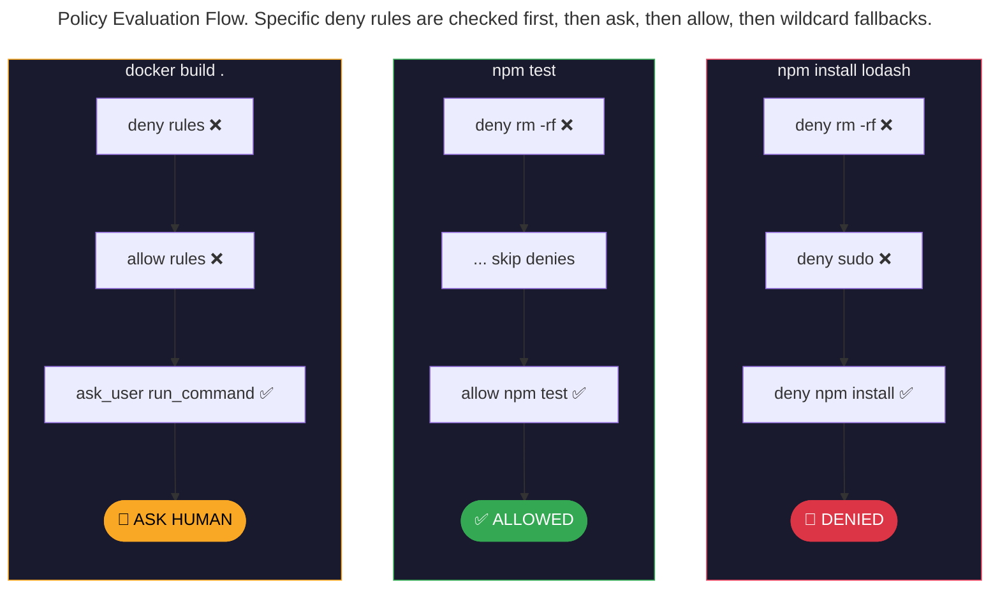
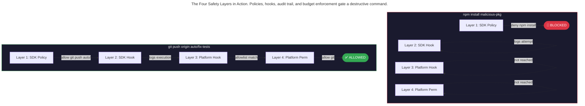

> This article is part of the [Antigravity Engineering Series](https://iamulya.one/tags/antigravity-engineering-series).
{: .prompt-info }

The moment you give an agent write access to your codebase, you're making a security decision. The question isn't *if* the agent will attempt something destructive — it's whether your system is designed to catch it before it happens.

Most AI coding tools default to permissive. The agent can run whatever commands it wants, write wherever it pleases, and the only guardrail is your attention. That works for interactive use. It fails catastrophically for autonomous pipelines, overnight sidecars, and multi-agent teams.

Antigravity takes the opposite approach: **deny by default, allow by exception.** The SDK provides a programmatic Python policy engine with three layers of hooks — Inspect, Decide, and Transform. Antigravity 2.0 adds a platform-level permission system (`Allow`/`Deny`/`Ask`) and JSON hooks that gate every tool call through custom shell scripts. Together, they create defense in depth: the SDK enforces policies in code, the platform enforces them in infrastructure.

---

## The Three Failures of Permissive Agents

### 1. The Eager Delete
You ask the agent to clean up unused code. It runs `rm -rf src/utils/` — deleting the utils directory that contained helper functions other modules depend on. The tests still passed because those modules haven't been imported in the current test suite.

### 2. The Secret Leak
You ask the agent to debug a deployment issue. It runs `cat .env` and includes the contents in its reasoning trace. Your database credentials are now in the conversation transcript that gets synced to the cloud.

### 3. The Package Injection
You ask the agent to fix a dependency issue. It runs `npm install some-package` — a package it found in a Stack Overflow answer. The package exists, installs cleanly, and contains a post-install script that exfiltrates your SSH keys.

These aren't hypothetical. They're the natural consequence of permissive defaults in autonomous systems. The fix isn't telling the agent to "be careful." It's making destructive actions structurally impossible.

---

## Layer 1: SDK Safety Policies (Python)

The Antigravity SDK is a Python framework for building autonomous agents. Its policy system lets you define what the agent can and cannot do before it ever starts:

```python
# safety_policies.py
# Declarative deny-by-default safety policy for autonomous agent execution

import asyncio
from google.antigravity import Agent, LocalAgentConfig
from google.antigravity.types import CapabilitiesConfig
from google.antigravity.hooks.policy import deny, allow, ask_user


def build_policies(approval_handler=None):
    """
    Build a layered safety policy.
    Policies are evaluated by priority:
      Specific Deny > Specific Ask > Specific Allow >
      Wildcard Deny > Wildcard Ask > Wildcard Allow
    Within each priority group, first match wins.
    """
    return [
        # --- HARD DENY: structurally impossible ---
        deny("run_command", when=lambda args: "rm -rf" in args.get("CommandLine", "")),
        deny("run_command", when=lambda args: args.get("CommandLine", "").startswith("sudo")),
        deny("run_command", when=lambda args: "npm install" in args.get("CommandLine", "")),
        deny("run_command", when=lambda args: "npm publish" in args.get("CommandLine", "")),
        deny("run_command", when=lambda args: "git push origin main" in args.get("CommandLine", "")),
        deny("write_to_file", when=lambda args: ".env" in args.get("TargetFile", "")),
        deny("write_to_file", when=lambda args: ".git/" in args.get("TargetFile", "")),
        deny("write_to_file", when=lambda args: "package.json" in args.get("TargetFile", "")),
        deny("read_file", when=lambda args: ".env" in args.get("AbsolutePath", "")),
        deny("read_file", when=lambda args: ".ssh/" in args.get("AbsolutePath", "")),
        # --- AUTO-ALLOW: known-safe operations ---
        allow("view_file"),
        allow("list_dir"),
        allow("grep_search"),
        allow("search_web"),
        allow("run_command", when=lambda args: args.get("CommandLine", "").startswith("npm test")),
        allow("run_command", when=lambda args: args.get("CommandLine", "").startswith("npx jest")),
        allow("run_command", when=lambda args: args.get("CommandLine", "").startswith("npx eslint")),
        allow("run_command", when=lambda args: args.get("CommandLine", "").startswith("git checkout")),
        allow("run_command", when=lambda args: args.get("CommandLine", "").startswith("git add")),
        allow("run_command", when=lambda args: args.get("CommandLine", "").startswith("git commit")),
        allow("run_command", when=lambda args: args.get("CommandLine", "").startswith("git push origin auto/")),
        allow("run_command", when=lambda args: args.get("CommandLine", "").startswith("gh pr create")),
        allow("write_to_file", when=lambda args: "/src/" in args.get("TargetFile", "")),
        allow("write_to_file", when=lambda args: "/tests/" in args.get("TargetFile", "")),
        # --- ASK: everything else requires human approval ---
        ask_user("run_command", handler=approval_handler),
        ask_user("write_to_file", handler=approval_handler),
        # --- CATCH-ALL: deny everything not explicitly handled ---
        deny("*"),
    ]


async def terminal_approval_handler(tool_call) -> bool:
    """Handler receives a ToolCall object, returns True to approve."""
    print(f"\n⚠️  Agent wants to execute: {tool_call.name}")
    print(f"   Args: {tool_call.args}")
    response = input("   Allow? [y/N]: ").strip().lower()
    return response == "y"


async def main():
    policies = build_policies(approval_handler=terminal_approval_handler)
    config = LocalAgentConfig(
        capabilities=CapabilitiesConfig(),
        policies=policies,
    )

    async with Agent(config) as agent:
        response = await agent.chat(
            "Migrate all legacy.createUser() calls to the new userService.create() API. "
            "Run the tests after each migration. Create a PR when done."
        )
        print(await response.text())


if __name__ == "__main__":
    asyncio.run(main())
```

### How policies are evaluated



---

## Layer 2: SDK Lifecycle Hooks (Python)

Policies are binary (allow/deny). Hooks give you continuous visibility and control across nine lifecycle points. The SDK organizes hooks into three categories:

### Inspect Hooks (`PostToolCallHook` — Non-Blocking)

For logging, audit trails, and metrics. They observe tool results but can't block anything. Must subclass `PostToolCallHook` and implement `async def run(self, context, data)`:

```python
# audit_hook.py
# PostToolCallHook — logs every tool call to an append-only audit trail

import json
from datetime import datetime, timezone

from google.antigravity.hooks.hooks import PostToolCallHook, HookContext
from google.antigravity import types


class AuditTrailHook(PostToolCallHook):
    """
    Non-blocking inspect hook that writes every tool call to a JSONL file.
    This produces a complete, tamper-evident record of agent activity.
    """

    def __init__(self, log_path: str = "audit-trail.jsonl"):
        self.log_path = log_path

    async def run(self, context: HookContext, data: types.ToolResult) -> None:
        """Called after every tool execution. Cannot block."""
        entry = {
            "timestamp": datetime.now(timezone.utc).isoformat(),
            "event": "post_tool",
            "tool": data.tool_name if hasattr(data, 'tool_name') else "unknown",
            "success": data.success if hasattr(data, 'success') else True,
        }
        self._append(entry)

    def _append(self, entry: dict):
        with open(self.log_path, "a") as f:
            f.write(json.dumps(entry) + "\n")
```

### Decide Hooks (`PreTurnHook` + `PostTurnHook` — Blocking)

For custom approval logic. `PreTurnHook` can block execution by returning `HookResult(allow=False)`. `PostTurnHook` observes results. Each must be a separate class:

```python
# budget_hook.py
# PreTurnHook + PostTurnHook — enforces a token budget and velocity limit

from datetime import datetime, timezone

from google.antigravity.hooks.hooks import (
    PreTurnHook, PostTurnHook, HookContext, HookResult,
)
from google.antigravity import types


class TokenBudgetPreTurn(PreTurnHook):
    """Check token budget before each model invocation."""

    def __init__(self, max_tokens: int = 200_000, velocity_limit: int = 2000):
        self.max_tokens = max_tokens
        self.velocity_limit = velocity_limit

    async def run(self, context: HookContext, data: types.Content) -> HookResult:
        tokens_used = context.get("tokens_used", 0)
        if tokens_used >= self.max_tokens:
            return HookResult(
                allow=False,
                reason=f"Budget exhausted: {tokens_used:,}/{self.max_tokens:,}",
            )

        # Velocity check (rolling 60-second window)
        recent_tokens = context.get("recent_tokens", [])
        now = datetime.now(timezone.utc).timestamp()
        recent = [t for t in recent_tokens if t[0] > now - 60]
        total_recent = sum(c for _, c in recent)
        if total_recent > self.velocity_limit:
            return HookResult(
                allow=False,
                reason=f"Velocity exceeded: {total_recent}/min (limit {self.velocity_limit})",
            )
        return HookResult(allow=True)


class TokenBudgetPostTurn(PostTurnHook):
    """Accumulate token usage after each model invocation."""

    async def run(self, context: HookContext, data: str) -> None:
        token_count = len(data) // 4 if data else 0
        tokens_used = context.get("tokens_used", 0) + token_count
        context.set("tokens_used", tokens_used)

        recent_tokens = context.get("recent_tokens", [])
        recent_tokens.append((datetime.now(timezone.utc).timestamp(), token_count))
        context.set("recent_tokens", recent_tokens)


def TokenBudgetHook(max_tokens=200_000, velocity_limit=2000):
    """Factory: returns both pre-turn and post-turn hooks."""
    return [
        TokenBudgetPreTurn(max_tokens, velocity_limit),
        TokenBudgetPostTurn(),
    ]
```

### Secret Detection (`PreToolCallDecideHook` — Blocking)

The SDK's hook model is **observe-or-decide**, not transform — hooks cannot silently modify tool arguments. For secret protection, use a `PreToolCallDecideHook` that **blocks** writes containing secrets:

```python
# sanitize_hook.py
# PreToolCallDecideHook — blocks file writes that contain secrets

import re

from google.antigravity.hooks.hooks import PreToolCallDecideHook, HookContext, HookResult
from google.antigravity import types


class SecretSanitizer(PreToolCallDecideHook):
    """
    Detects secrets in write operations and blocks them.
    The agent receives the denial reason and can fix the content.
    """

    SECRET_PATTERNS = [
        r'(?i)(password|secret|token|api_key)\s*=\s*["\']([^"\']+)["\']',
        r'(?i)(Authorization:\s*Bearer\s+)(\S+)',
        r'(?i)(DATABASE_URL\s*=\s*)(postgres://[^\s]+)',
    ]

    async def run(self, context: HookContext, data: types.ToolCall) -> HookResult:
        if data.name in ("write_to_file", "replace_file_content"):
            content_key = "CodeContent" if data.name == "write_to_file" else "ReplacementContent"
            content = data.args.get(content_key, "")
            for pattern in self.SECRET_PATTERNS:
                if re.search(pattern, content):
                    target = data.args.get("TargetFile", "unknown")
                    print(f"⚠️  Blocked secret in {target}")
                    return HookResult(
                        allow=False,
                        reason=f"Secret detected in {target}. Remove secrets before writing.",
                    )
        return HookResult(allow=True)
```

### Composing the full agent

All hooks go in a single `hooks=[]` list. The `HookRunner` uses `isinstance` checks to dispatch each hook to the right lifecycle point:

```python
# agent_with_hooks.py
# Complete agent with policies + hooks (all four safety layers)

import asyncio
from google.antigravity import Agent, LocalAgentConfig
from google.antigravity.types import CapabilitiesConfig
from google.antigravity.hooks.policy import deny, allow

from audit_hook import AuditTrailHook
from budget_hook import TokenBudgetHook
from sanitize_hook import SecretSanitizer


async def main():
    policies = [
        deny("run_command", when=lambda a: "rm -rf" in a.get("CommandLine", "")),
        deny("run_command", when=lambda a: a.get("CommandLine", "").startswith("sudo")),
        deny("run_command", when=lambda a: "npm install" in a.get("CommandLine", "")),
        deny("write_to_file", when=lambda a: ".env" in a.get("TargetFile", "")),
        deny("read_file", when=lambda a: ".ssh/" in a.get("AbsolutePath", "")),
        allow("view_file"),
        allow("grep_search"),
        allow("run_command", when=lambda a: a.get("CommandLine", "").startswith("npm test")),
        allow("write_to_file", when=lambda a: "/src/" in a.get("TargetFile", "")),
        deny("*"),
    ]

    config = LocalAgentConfig(
        capabilities=CapabilitiesConfig(
            enable_subagents=False,
        ),
        policies=policies,
        hooks=[
            # All hooks in one list — HookRunner dispatches by base class
            AuditTrailHook(log_path="./agent-audit.jsonl"),
            *TokenBudgetHook(max_tokens=100_000, velocity_limit=2000),
            SecretSanitizer(),
        ],
    )

    async with Agent(config) as agent:
        response = await agent.chat("Fix the failing tests in src/auth/")
        print(await response.text())


if __name__ == "__main__":
    asyncio.run(main())
```

> Hooks must subclass the SDK's base classes (`PostToolCallHook`, `PreTurnHook`, `PostTurnHook`, `PreToolCallDecideHook`, etc.) and implement `async def run(self, context, data)`. The SDK does **not** support convention-method hooks (`on_pre_tool`, `on_post_turn`) or transform hooks that modify tool arguments.
{: .prompt-warning }

---

## Layer 3: Platform Hooks (Antigravity 2.0)

SDK policies run in your Python code. Platform hooks run in the Antigravity 2.0 runtime — they gate *every* agent, including those started by sidecars and scheduled tasks.

Hooks are configured in `hooks.json` (in `.agents/` or `~/.gemini/config/`):

```json
{
  "secret-scanner": {
    "PreToolUse": [
      {
        "matcher": "write_to_file|replace_file_content",
        "hooks": [
          {
            "type": "command",
            "command": ".agents/hooks/scan-secrets.sh",
            "timeout": 10
          }
        ]
      }
    ]
  },
  "command-allowlist": {
    "PreToolUse": [
      {
        "matcher": "run_command",
        "hooks": [
          {
            "type": "command",
            "command": ".agents/hooks/command-allowlist.sh",
            "timeout": 5
          }
        ]
      }
    ]
  },
  "invocation-guard": {
    "PostInvocation": [
      {
        "type": "command",
        "command": ".agents/hooks/check-budget.sh",
        "timeout": 5
      }
    ]
  }
}
```

The `scan-secrets.sh` hook runs before every file write:

```bash
#!/bin/bash
# .agents/hooks/scan-secrets.sh
# PreToolUse hook — scans file content for secrets before writing

INPUT=$(cat)
TOOL_NAME=$(echo "$INPUT" | jq -r '.toolCall.name')
FILE_CONTENT=""

if [ "$TOOL_NAME" = "write_to_file" ]; then
  FILE_CONTENT=$(echo "$INPUT" | jq -r '.toolCall.args.CodeContent // empty')
elif [ "$TOOL_NAME" = "replace_file_content" ]; then
  FILE_CONTENT=$(echo "$INPUT" | jq -r '.toolCall.args.ReplacementContent // empty')
fi

# Check for common secret patterns
if echo "$FILE_CONTENT" | grep -qiE '(password|secret|token|api_key)\s*=\s*["\x27][^\s"'\'']{8,}'; then
  TARGET=$(echo "$INPUT" | jq -r '.toolCall.args.TargetFile // .toolCall.args.targetFile // "unknown"')
  echo "{\"decision\": \"deny\", \"reason\": \"Secret detected in write to ${TARGET}. Redact the secret before writing.\"}"
  exit 0
fi

echo '{"decision": "allow"}'
```

The `check-budget.sh` PostInvocation hook monitors token velocity:

```bash
#!/bin/bash
# .agents/hooks/check-budget.sh
# PostInvocation hook — monitors execution and can force termination

INPUT=$(cat)
INVOCATION_NUM=$(echo "$INPUT" | jq -r '.invocationNum')

# After 50 invocations, force terminate to prevent runaway sessions
if [ "$INVOCATION_NUM" -gt 50 ]; then
  echo '{"injectSteps": [{"ephemeralMessage": "Budget limit reached after 50 invocations."}], "terminationBehavior": "terminate"}'
  exit 0
fi

# Normal: no injection, no termination
echo '{"injectSteps": [], "terminationBehavior": ""}'
```

---

## Layer 4: Platform Permissions (Antigravity 2.0)

The permission system is the final layer. It operates at the platform level and applies to all agents regardless of how they were started:

| Precedence | List | Behavior |
|-----------|------|----------|
| 1 (highest) | **Deny** | Blocked immediately. No prompt, no override. |
| 2 | **Ask** | Agent pauses for explicit human approval. |
| 3 (lowest) | **Allow** | Auto-approved without prompting. |

Configure in the project settings:

```text
# Deny list — permanently blocked
command(rm -rf)
command(sudo)
command(npm publish)
write_file(.git/)
write_file(.env)

# Allow list — auto-approved
command(git)
command(npm run (build|lint|test))
read_file(src/)
write_file(src/)
mcp(linter/*)

# Everything else → Ask (default)
```

The `command()` target supports regex for flexible matching: `command(npm run (build|lint|test))` matches `npm run build`, `npm run lint`, and `npm run test` but blocks `npm run deploy`.

---

## Defense in Depth

The four layers work together:



If any layer says no, the action is blocked. The agent never gets to choose whether to obey a policy — the policy is enforced structurally.

---

## The Product Surface

| Capability | Product | Role |
|-----------|---------|------|
| Python policy engine (`deny`, `allow`, `ask_user`), lifecycle hooks (Inspect/Decide/Transform), programmatic agent execution | **SDK** | The safety framework — define policies in code |
| Platform permissions (Allow/Deny/Ask), hooks.json with shell script gates, sidecar safety inheritance | **2.0** | The safety platform — enforce policies in infrastructure |

---

## What You've Built

A four-layer safety architecture where:

1. **SDK policies** define the rules — `deny("*")` as the default, explicit `allow()` for safe operations
2. **SDK hooks** provide visibility — audit trails, budget enforcement, secret sanitization
3. **Platform hooks** gate every tool call — shell scripts that run before/after every operation, even in sidecar-started agents
4. **Platform permissions** enforce the floor — Deny/Ask/Allow lists that no agent can override

The agent that can reason about your codebase is powerful. The agent that *can't* run `rm -rf` regardless of what it reasons is safe. You need both.

---

> Companion code for this post is available at [antigravity-safety-architecture](https://github.com/iamulya/antigravity-safety-architecture).
{: .prompt-tip }
