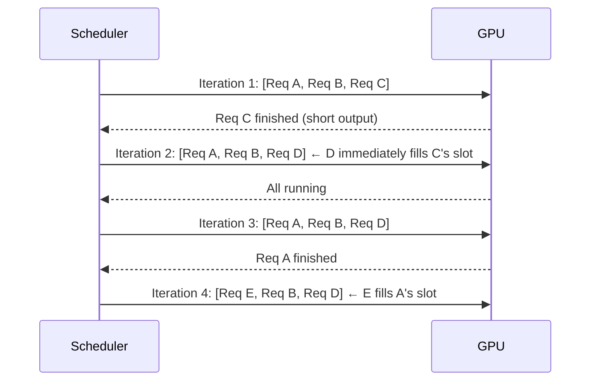
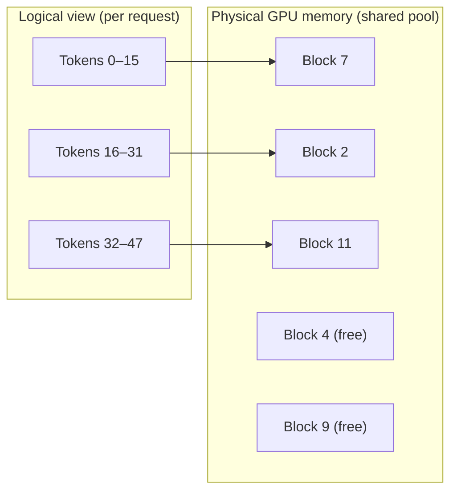
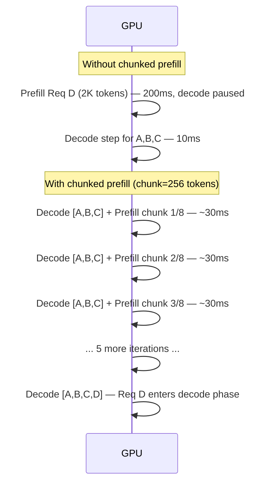
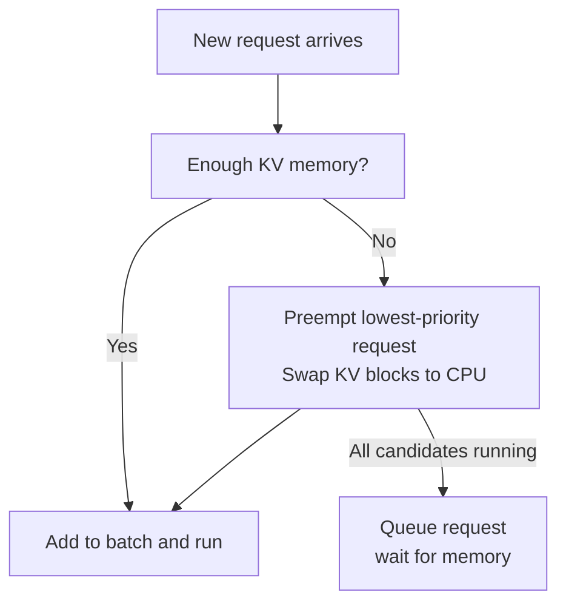
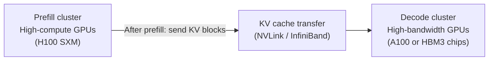
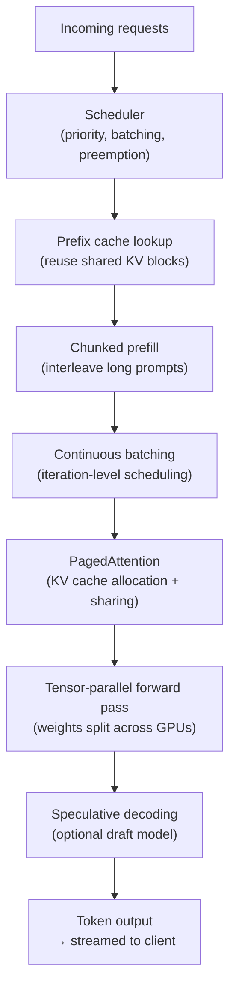

> This article is **Part 13 of 15** in the [Generative AI in Depth](/categories/generative-ai-in-depth/) series.
{: .prompt-info }


Running a single LLM query in isolation is straightforward. Running hundreds or thousands of queries simultaneously — with unpredictable lengths, mixed prefill and decode phases, and shared GPU memory — is an engineering problem with a decade of research behind it. This article explains how modern LLM serving systems work and why each design decision exists.

We use Gemma 4 12B numbers throughout, building on the KV cache and memory analysis from [The Memory Math](/posts/llm-memory-math).

---

## The Core Problem: Decode is Serial and Variable

The fundamental tension in LLM serving comes from two properties of the decode phase:

**Serial**: each token depends on the previous one. You cannot generate token N+1 until you know token N. This makes the decode phase inherently sequential — you cannot parallelize across output positions within a single sequence.

**Variable**: different requests generate different numbers of output tokens, and you cannot know in advance how many tokens a request will generate.

These two properties make LLM serving very different from serving a standard neural network classifier, where inputs and outputs are fixed-size and independent.

---

## Static Batching: The Naïve Approach

The simplest strategy is **static batching**: collect a fixed number of requests, pad them all to the same length, run them together, return results when the entire batch is done.

```mermaid
gantt
    title Static Batching — 4 requests, padded to longest
    dateFormat X
    axisFormat %s

    section Request A (100 tokens)
    Compute       : 0, 100
    Waiting (pad) : 100, 200

    section Request B (200 tokens)
    Compute       : 0, 200

    section Request C (50 tokens)
    Compute       : 0, 50
    Waiting (pad) : 50, 200

    section Request D (80 tokens)
    Compute       : 0, 80
    Waiting (pad) : 80, 200
```



The GPU is idle for requests A, C, and D once they finish — waiting for B to complete. GPU utilisation collapses to `mean_output_length / max_output_length`. For typical chat workloads where output lengths vary dramatically, this can be 20–40% effective utilisation.

Static batching also forces a choice: either wait until you have a full batch (adding latency for every request) or run partial batches (wasting GPU capacity).

---

## Continuous Batching

**Continuous batching** (also called iteration-level batching) solves the GPU waste problem by making a key insight: you don't need to batch at the request level — you can batch at the **iteration** (decode step) level.

After every single decode step, the scheduler checks:
1. Which requests just finished (output an EOS token)?
2. Which new requests are waiting to start?

Finished requests are immediately evicted. New requests are inserted to fill the freed slot. The batch size stays approximately constant across iterations, with requests flowing in and out continuously.



Continuous batching raises effective GPU utilisation from 20–40% (static) to 80–95% on typical workloads. It is the single most important serving optimisation and is now standard in all production LLM serving systems (vLLM, TGI, TensorRT-LLM).

The original paper proposing this for LLMs was Orca (Yu et al., 2022), which called it "iteration-level scheduling". vLLM refined it and popularised the term "continuous batching".

> **If you're running your own serving stack and haven't enabled continuous batching, you're likely leaving 60–70% of your GPU throughput on the table.** Static batching on typical chat workloads (where output lengths vary from 10 to 500+ tokens) idles the GPU for the majority of the batch's lifetime. Enable continuous batching — it's the default in vLLM, SGLang, TGI, and TensorRT-LLM — before tuning anything else.
{: .prompt-tip }

---

## The KV Cache Fragmentation Problem

Continuous batching creates a new problem: **KV cache fragmentation**.

Recall from [The Memory Math](/posts/llm-memory-math) that the KV cache for Gemma 4 12B at BF16 costs roughly:
- 4 KB per token per local layer (40 layers)
- 2 KB per token per global layer (8 layers)
- Total: ~224 KB per token at 4K context

With static batching, each request got a pre-allocated contiguous block of GPU memory for its KV cache. With continuous batching, requests arrive and depart unpredictably. If you pre-allocate contiguous blocks at request start:

- You must guess the maximum output length (and over-allocate)
- Gaps form as short requests free their memory and longer requests cannot use those gaps
- Memory fragmentation leaves GPU memory partially used even when it appears to have free space


Req D needs more space than the freed gap provides — fragmentation strands the memory.

---

## PagedAttention

**PagedAttention** (introduced by the vLLM team in their 2023 SOSP paper) borrows the key idea from operating system virtual memory: instead of requiring contiguous physical memory, map logical addresses to physical pages.

The KV cache is divided into fixed-size **blocks** (pages). Each block holds the KV data for a fixed number of tokens (typically 16 or 32 tokens). A page table maps each request's logical token sequence to physical blocks scattered anywhere in GPU memory.



**What this buys:**
- **No pre-allocation**: blocks are allocated only when a page is actually needed
- **No fragmentation**: any free block can be used by any request, regardless of size
- **Immediate reclamation**: when a request finishes, its blocks are instantly available for new requests
- **Sharing**: two requests with the same prompt prefix (e.g., a system prompt) can share physical blocks for that prefix — their KV cache for the shared prefix is computed once and referenced by a page table, not duplicated

For Gemma 4 12B with a 16-token block size:
```
Block size = 16 tokens × 224 KB/token = 3.6 MB per block
A100 80GB with 53.8 GB available for KV: ~14,900 blocks
```

Without PagedAttention, internal fragmentation typically wastes 20–30% of KV memory. PagedAttention reduces this to under 5%, directly increasing the number of concurrent requests you can serve.

> **Fragmentation without PagedAttention wastes 20–30% of KV memory** — memory that shows as "allocated" but is unusable for new requests. On an A100 with 53.8 GB available for KV, that's 10–16 GB stranded. PagedAttention's block-level allocation recovers most of this. All major frameworks (vLLM, SGLang, TensorRT-LLM) use PagedAttention or an equivalent paged allocator by default.
{: .prompt-info }

### Prefix caching with PagedAttention

PagedAttention's block structure enables **automatic prefix caching** (sometimes called KV caching). When a new request starts with the same prefix as a previous request (e.g., the same system prompt), the serving system checks if those blocks already exist in the block table. If they do, the physical blocks are simply referenced — no recomputation needed.

This is implemented with a hash-based block index: each block is identified by a hash of its token sequence. On a hit, the block's reference count is incremented; on a miss, the block is computed and inserted.

```
System prompt: "You are a helpful assistant..." (512 tokens)
  → Hashed to block IDs [7, 2, 11, 5]
  → Stored in block pool on first use

Request 1: [system prompt] + [user query A]
  → Block IDs [7, 2, 11, 5] (reused) + [new blocks for query A]

Request 2: [system prompt] + [user query B]
  → Block IDs [7, 2, 11, 5] (reused) + [new blocks for query B]
  ← KV computation for the system prompt: done once only
```

For a 512-token system prompt with Gemma 4 12B serving 100 concurrent users:
```
Without prefix caching: 100 × (512 tokens × ~224 KB/token) ≈ 11.5 GB for system prompt KV
With prefix caching:      1 × (512 tokens × ~224 KB/token) ≈ 0.11 GB
Savings: ~11.4 GB → room for ~50 more concurrent requests at 4K context
```

---

## Chunked Prefill

Continuous batching has a latency problem: **prefill monopolises the GPU**.

When a long-prompt request enters the system, its prefill phase processes hundreds or thousands of tokens in a single forward pass. This is compute-intensive and takes proportionally longer. During this time, all other requests in the batch are blocked — their decode steps pause.

Prefill is roughly compute-bound (the attention and FFN compute scales with T), while decode is memory-bandwidth bound. Running a long prefill in one shot therefore:
1. Blocks decode for an extended period
2. Uses compute mode that's different from steady-state decode mode, complicating scheduling

**Chunked prefill** (Sarathi-Serve, 2023) splits long prefill phases into smaller chunks, interleaved with regular decode steps:



The prefill for a 2K-token request is split into 8 chunks of 256 tokens each. Each chunk is processed together with normal decode steps. Existing requests continue generating tokens with no perceptible pause; the new request's prefill completes after 8 iterations.

The trade-off: total time to complete the long prefill is slightly higher (8 × 30ms = 240ms vs 200ms in one shot). But time-to-first-token for the *other* requests drops dramatically, and tail latency improves.

> Chunked prefill is the key change in vLLM v0.4+ and Sarathi-Serve. Without it, a single 128K-token request entering a busy server would block all other users for seconds.
{: .prompt-info }

---

## Latency Metrics: TTFT and TPOT

Two latency metrics dominate LLM serving SLAs:

**TTFT (Time To First Token)**: the delay from request submission to the first token of the response appearing. This is dominated by:
- Queueing time (waiting for a batch slot)
- Prefill time (processing the prompt)
- Any chunked prefill overhead

**TPOT (Time Per Output Token)**: the delay between successive output tokens once generation has started. For a user reading the output as it streams, TPOT determines whether the experience feels smooth. This is dominated by:
- One decode step per token
- Memory bandwidth (for B=1, ~2.25 ms per token for Gemma 4 12B on A100)

```
User-perceived latency for a response with P prompt tokens and G output tokens:
  Total ≈ TTFT + G × TPOT

Example: TTFT=500ms, TPOT=30ms, G=200 tokens:
  Total ≈ 500ms + 200 × 30ms = 6,500ms = 6.5 seconds
```

Different workloads prioritise different metrics:
- **Interactive chat**: TTFT is critical (the user sees the spinner); TPOT matters for smooth streaming
- **Batch processing**: total throughput (tokens/second) matters more than TTFT; individual latency is irrelevant

Chunked prefill directly reduces TTFT for other concurrent requests by preventing monopolisation. Continuous batching reduces TPOT by maximising batch size (more weight-reads are amortised over more useful outputs).

### The latency-throughput trade-off

Serving systems must navigate a fundamental tension:

- **Higher batch size** → higher throughput (tokens/s) → higher TPOT per request (each step takes longer because more requests run simultaneously)
- **Lower batch size** → lower throughput → lower TPOT per request

For Gemma 4 12B on A100 at BF16:

| Batch size | TPOT | Throughput |
|---|---|---|
| B=1 | ~2.25 ms/token | ~0.44 tokens/s per GPU |
| B=8 | ~2.8 ms/token | ~2.8 tokens/s |
| B=32 | ~5 ms/token | ~6.4 tokens/s |
| B=128 | ~15 ms/token | ~8.5 tokens/s (approaching compute-bound) |

Production systems typically target a TPOT SLA and maximise batch size within that constraint.

---

## Request Scheduling and Preemption

When available KV cache memory runs low, a serving system faces a choice:

1. **Reject** new requests until existing ones finish
2. **Preempt** a running request — evict its KV cache blocks, freeing memory, and re-run its prefill when memory becomes available again

Preemption wastes the prefill compute for the preempted request but avoids starvation of the overall system. vLLM uses preemption with a priority scheme: longest-running requests are preempted last (to avoid wasting work), and preempted requests are re-run with prefix caching recovering any already-computed KV blocks from disk or CPU memory.



**CPU-GPU KV swapping** (vLLM's swap mechanism) offloads preempted KV blocks to CPU DRAM (typically 256–512 GB on a server), then swaps them back in when the request resumes. CPU DRAM ↔ GPU bandwidth is the bottleneck (~50 GB/s on PCIe 4.0 vs 2 TB/s HBM), so this is expensive for large KV caches but feasible for short pauses.

> **CPU-GPU KV swapping is a last resort, not a steady-state strategy.** At PCIe 4.0 bandwidth (~50 GB/s), swapping a 4K-context KV cache (224 MB) takes ~4.5 ms — about 2 full decode steps of latency. For 128K contexts (4.1 GB), a single swap takes ~82 ms. If your serving system is swapping KV blocks regularly, you need more GPU memory, not faster swapping. Treat repeated preemption as a signal to reduce batch size or add GPU capacity.
{: .prompt-warning }

---

## Multi-GPU Serving

When a model is too large for a single GPU (or when you need more throughput than a single GPU can provide), the computation is split across multiple GPUs.

### Tensor Parallelism

Tensor parallelism (TP) splits individual weight matrices across GPUs. For the attention Q projection in a local Gemma 4 12B layer:

```
W_Q: [3840 × 4096] — 16 query heads

With 2-way tensor parallelism:
  GPU 0: W_Q_0 [3840 × 2048] — heads 0–7
  GPU 1: W_Q_1 [3840 × 2048] — heads 8–15

Each GPU computes its half of the attention, then an AllReduce
synchronises the results before the output projection.
```

Similarly, the FFN matrices split along their inner dimension:
```
W_gate: [3840 × 15360]

GPU 0: [3840 × 7680]  — experts in "left half" of latent space
GPU 1: [3840 × 7680]  — experts in "right half"
```

Tensor parallelism requires fast interconnect (NVLink between A100/H100 GPUs) because every layer requires a synchronisation step (AllReduce). For Gemma 4 12B on 2× A100 NVLink:

```
AllReduce per layer: ~7.68 KB × 48 layers = 369 KB per decode step
NVLink bandwidth: 600 GB/s bidirectional → <1 μs per AllReduce
Overhead: negligible
```

On machines without NVLink (PCIe 4.0, ~64 GB/s), the same AllReduce takes:
```
369 KB / 64 GB/s ≈ 5.8 μs per layer × 48 layers ≈ 278 μs total
= ~12% of a 2.25 ms decode step
```

Significant but not catastrophic for 2-GPU TP; for 8-GPU TP without NVLink it becomes unacceptably high.

### Pipeline Parallelism

Pipeline parallelism (PP) assigns whole layers to GPUs rather than splitting individual layers:

With 2-way pipeline parallelism, GPU 0 runs layers 1–24 and GPU 1 runs layers 25–48. GPU 0 processes input and sends activations `[B × T × 3840]` to GPU 1, which produces the final output.

Communication is lighter (activations sent once per layer boundary, not every layer) but GPU utilisation is lower — GPU 1 sits idle while GPU 0 runs, and vice versa. **Micro-batching** (breaking each batch into sub-batches that pipeline through) improves utilisation:

```mermaid
gantt
    title Pipeline with micro-batching (2 GPUs, 4 micro-batches)
    dateFormat X
    axisFormat %s

    section GPU 0
    μB1 fwd : 0, 25
    μB2 fwd : 25, 50
    μB3 fwd : 50, 75
    μB4 fwd : 75, 100

    section GPU 1
    Wait    : 0, 25
    μB1 fwd : 25, 50
    μB2 fwd : 50, 75
    μB3 fwd : 75, 100
    μB4 fwd : 100, 125
```



Pipeline parallelism is preferred across nodes (interconnected by InfiniBand, ~200–400 GB/s) while tensor parallelism is preferred within a node (NVLink, ~600 GB/s+).

### Expert Parallelism (for MoE)

For the Gemma 4 26B-A4B MoE model, a third parallelism strategy applies: **expert parallelism** (EP). Each GPU hosts a subset of the expert FFNs. The router selects experts, tokens are dispatched to the GPU holding the selected expert via all-to-all communication, computed, and gathered back.

Expert parallelism introduces variable communication volume (tokens go to whichever GPU holds the expert they need) which makes scheduling more complex than TP or PP.

---

## Disaggregated Prefill and Decode

A fundamental insight: prefill and decode have completely different hardware needs.

- **Prefill** is compute-bound (large T processed in parallel → high arithmetic intensity). It wants GPUs with high TFLOPS.
- **Decode** is memory-bandwidth bound (B=1 per request → low arithmetic intensity). It wants GPUs with high HBM bandwidth.

**Disaggregated serving** (Splitwise, 2024; PD-Disaggregation in vLLM) separates the two phases onto different hardware:



This allows:
- Running prefill with high batch sizes (more context processed per step) on compute-optimised hardware
- Running decode with optimised bandwidth on memory-bandwidth-optimised hardware
- Independent scaling of each fleet based on traffic patterns

The cost: KV cache must be transferred between clusters for every request after its prefill completes. The transfer bandwidth requirement is:

```
KV per Gemma 4 12B request (4K context): 224 MB
Transfer at 100 GB/s InfiniBand: 2.24 ms
                                 ← roughly one decode step — acceptable
```

At very long contexts (256K), the KV transfer becomes 4.1 GB / 100 GB/s = 41 ms — the main latency cost of disaggregation.

---

## Speculative Decoding (Brief Overview)

One more serving optimisation worth mentioning: **speculative decoding** proposes multiple candidate tokens using a cheap draft model, then verifies them all in a single forward pass of the large model. If the large model agrees with all N proposals, N tokens are emitted in the time of one decode step.

This is covered in depth in the [Speculative Decoding](/posts/speculative-decoding) article.

---

## How the Pieces Fit Together

A production serving stack layers all of these optimisations:



Each layer addresses a specific bottleneck:
- **Continuous batching** → eliminates batch-level idle time
- **PagedAttention** → eliminates KV cache fragmentation
- **Prefix caching** → eliminates redundant KV computation for shared prefixes
- **Chunked prefill** → eliminates latency spikes from long prompts
- **Tensor parallelism** → splits model across GPUs for memory and throughput
- **Disaggregated prefill/decode** → matches hardware characteristics to workload phase
- **Speculative decoding** → increases tokens-per-second in latency-sensitive settings

---

## Key Numbers for Gemma 4 12B

| Configuration | Throughput driver | TPOT | TTFT |
|---|---|---|---|
| 1× A100 80GB, BF16, B=1 | KV limit ~240 requests | ~2.25 ms | Prefill time only |
| 1× A100 80GB, BF16, B=32 | Approaching compute-bound | ~5 ms | Prefill + queue |
| 2× A100, tensor parallel | KV limit ~580 requests | ~2.25 ms | Prefill (parallelised) |
| 1× H100, BF16 | Same KV as A100 | ~1.35 ms | ~1.5× faster prefill |
| 1× A10G, INT8 | KV limit ~92 requests (INT8 KV) | ~2.8 ms | Slower prefill (less BW) |

---

## Further Reading

- [Which LLM Serving Framework Should You Use?](/posts/llm-serving-frameworks-comparison) — practical comparison of llama.cpp, Ollama, vLLM, SGLang, TensorRT-LLM, TGI, LMDeploy, and mlx-lm
- [The Memory Math](/posts/llm-memory-math) — where the batch size limits and KV cache numbers in this article come from
- [Inside LLM Inference](/posts/decoder-forward-pass-dimensions) — what runs inside each forward pass
- [Speculative Decoding](/posts/speculative-decoding) — draft models and verification in detail
- [CUDA Kernels and FlashAttention](/posts/cuda-kernels-and-flashattention) — why memory bandwidth, not compute, is the serving bottleneck
- [Training vs Inference](/posts/training-vs-inference) — what changes when the same model is used for training

