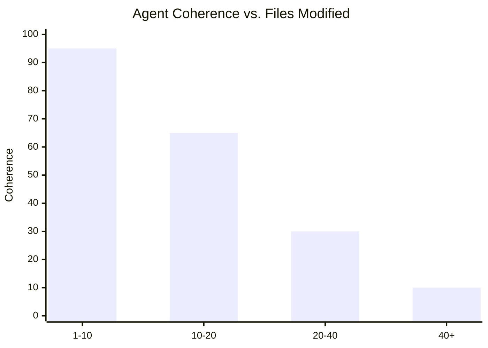
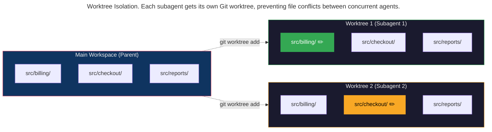
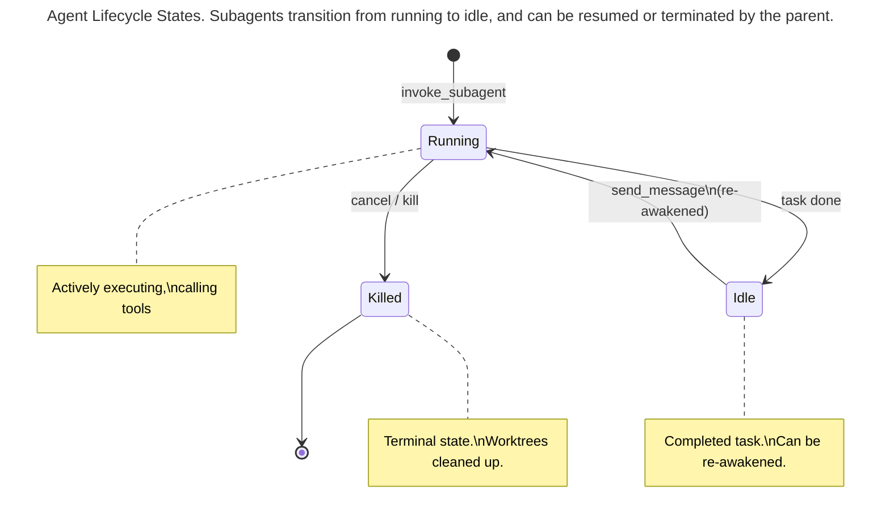

> This article is part of the [Antigravity Engineering Series](https://iamulya.one/tags/antigravity-engineering-series).
{: .prompt-info }

You have a refactoring task that touches 47 files across 3 modules. The agent starts at file 1. By file 30, its context window is saturated with the memory of files 1–29 — code it no longer needs but can't forget. Coherence drops. It starts making contradictory changes. By file 40, it's undoing work it did at file 15.

This is the **context pollution problem**, and it's the primary failure mode of single-agent architectures on large tasks. The solution isn't a bigger context window. It's *more agents with smaller scopes.*

Antigravity 2.0's **subagent system** lets the parent agent spawn concurrent child agents, each with an independent context window, optional Git worktree isolation, and a defined role. The **Antigravity SDK** extends this programmatically — building multi-agent teams with custom roles, tool restrictions, and communication patterns. 

---

## The Context Pollution Problem

Single-agent coherence degrades predictably with task size:



| Files Modified | Coherence | Failure Mode |
|:-:|:-:|:--|
| 1–10 | 🟢 High | Rarely fails |
| 10–20 | 🟡 Medium | Occasional inconsistencies |
| 20–40 | 🟠 Low | Contradicts earlier changes |
| 40+ | 🔴 Critical | Undoes own work |

The fix is structural: decompose the task into scoped subtasks, each handled by an agent that only knows about its piece. The parent agent coordinates. The child agents execute. Nobody's context window holds 47 files of accumulated state.

---

## Subagent Architecture (Antigravity 2.0)

### Built-In Subagent Types

Antigravity ships three built-in subagent types:

| Type | Purpose | Capabilities |
|------|---------|-------------|
| `research` | Codebase research, navigation, exploration | Read-only. Cannot write files or run commands. |
| `browser` | Interactive browser tasks | Operates sandboxed Chrome via `/browser` command. |
| `self` | Clone of the parent agent | Same system prompt, same toolset as the caller. |

### Spawning Subagents

The parent agent uses `invoke_subagent` to spawn concurrent sessions:

```
Parent agent receives:
  "Refactor the payment module to use the new billing API"

Parent agent reasons:
  "This touches src/billing/, src/checkout/, and src/reports/.
   I'll spawn three subagents — one per module — working in 
   parallel on isolated worktrees."

Parent agent calls invoke_subagent with:
  Subagent 1: { Role: "Billing Module Refactor", Workspace: "worktree" }
  Subagent 2: { Role: "Checkout Module Refactor", Workspace: "worktree" }
  Subagent 3: { Role: "Reports Module Refactor", Workspace: "worktree" }
```

Each subagent gets:
- **Independent context window** — starts clean, no inherited conversation history
- **Optional Git worktree** — an isolated filesystem copy of the repo, so agents can't stomp on each other's changes
- **Inherited permissions** — the parent's Allow/Deny/Ask rules carry over automatically
- **The same model** — subagents use the parent's configured model

### Worktree Isolation

When a subagent specifies `Workspace: "worktree"`, Antigravity creates an isolated Git worktree:



No shared filesystem state. No merge conflicts during work. The parent integrates the results after all subagents complete.

---

## Custom Subagents with define_subagent

The built-in types cover common patterns. For specialized work, agents can define custom subagent types at runtime using `define_subagent`:

```
The parent agent calls define_subagent:
  name: "migration-specialist"
  description: "Specializes in API migration with test verification"
  system_prompt: |
    You are a migration specialist. Your job is to:
    1. Find all calls to the deprecated API in your assigned module
    2. Migrate each call to the new API signature
    3. Update any test mocks that reference the old API
    4. Run the module's tests: npm test -- --testPathPattern=<module>
    5. Report: files changed, tests passed/failed, any issues
    
    Rules:
    - Never modify files outside your assigned module
    - If a test fails, fix the test — don't revert the migration
    - If you encounter an ambiguous case, report it and move on
  enable_write_tools: true
  enable_mcp_tools: false
  enable_subagent_tools: false
```

Once defined, the custom subagent can be invoked repeatedly:

```
Parent: invoke_subagent(
  TypeName: "migration-specialist",
  Prompt: "Migrate legacy.createUser() in src/billing/",
  Workspace: "worktree"
)

Parent: invoke_subagent(
  TypeName: "migration-specialist",
  Prompt: "Migrate legacy.createUser() in src/checkout/",
  Workspace: "worktree"
)
```

### Tool Restrictions

Custom subagents have fine-grained tool control:

| Setting | Effect |
|---------|--------|
| `enable_write_tools: true` | Can edit files and run terminal commands |
| `enable_write_tools: false` | Read-only — can only search and view |
| `enable_mcp_tools: true` | Can use connected MCP servers |
| `enable_subagent_tools: true` | Can spawn its own sub-subagents (up to 10 levels deep) |

---

## Inter-Agent Communication

Agents communicate using `send_message` with unique agent IDs:

```
Subagent 1 (billing migration) finishes:
  send_message(
    Recipient: <parent-agent-id>,
    Message: "Migration complete. 12 calls migrated in 5 files. 
              All tests passing. Branch: worktree-1/auto/migrate-billing"
  )

Subagent 2 (checkout migration) hits an issue:
  send_message(
    Recipient: <parent-agent-id>,
    Message: "Found ambiguous case in src/checkout/express-checkout.ts:42.
              The legacy.createUser() call passes a callback as the 4th arg.
              The new API doesn't support callbacks. Need guidance."
  )
```

Key communication features:

- **Flexible routing**: Agents can message any active agent, not just their parent
- **Auto-wake**: Sending a message to an idle agent re-awakens it
- **Shared transcripts**: Agents can read each other's conversation logs for context

### Agent Lifecycle States



- **Running**: Actively executing, calling tools
- **Idle**: Completed its task, sent results to parent. Can be re-awakened.
- **Killed**: Permanently terminated. Worktrees are cleaned up. Transcripts remain readable.

---

## Programmatic Orchestration with the SDK (Python)

The Antigravity SDK lets you build multi-agent systems programmatically:

```python
# multi_agent_refactor.py
# Gives the agent a high-level refactoring goal and lets it
# autonomously decide how to decompose, delegate, and coordinate.

import asyncio
from google.antigravity import Agent, LocalAgentConfig
from google.antigravity.types import CapabilitiesConfig
from google.antigravity.hooks.policy import deny, allow


async def main():
    config = LocalAgentConfig(
        capabilities=CapabilitiesConfig(),
        policies=[
            # Safety boundaries — inherited by any subagents the agent spawns
            deny("run_command", when=lambda a: "rm -rf" in a.get("CommandLine", "")),
            deny("run_command", when=lambda a: "git push origin main" in a.get("CommandLine", "")),
            deny("run_command", when=lambda a: "npm publish" in a.get("CommandLine", "")),
            deny("write_to_file", when=lambda a: ".env" in a.get("TargetFile", "")),
            allow("view_file"),
            allow("grep_search"),
            allow("list_dir"),
            allow("run_command", when=lambda a: a.get("CommandLine", "").startswith("npm test")),
            allow("run_command", when=lambda a: a.get("CommandLine", "").startswith("git ")),
            allow("run_command", when=lambda a: a.get("CommandLine", "").startswith("gh pr create")),
            allow("write_to_file", when=lambda a: "/src/" in a.get("TargetFile", "")),
            allow("write_to_file", when=lambda a: "/tests/" in a.get("TargetFile", "")),
            deny("*"),
        ],
    )

    async with Agent(config) as agent:
        # One high-level goal. The agent decides on its own:
        # - Whether to spawn subagents (and how many)
        # - Whether to use worktrees for isolation
        # - How to coordinate research, execution, and integration
        response = await agent.chat(
            "Migrate all legacy.createUser() calls across the codebase to the "
            "new userService.create() API. The old API uses positional args "
            "(name, email, role), the new one uses an object ({ name, email, "
            "role, createdBy: 'migration' }). Update imports from '@app/legacy' "
            "to '@app/services/user'. Update test mocks. All tests must pass. "
            "Open one PR per module when done."
        )
        async for chunk in response:
            print(chunk, end="", flush=True)


if __name__ == "__main__":
    asyncio.run(main())
```

Notice what's *not* in this code: no explicit "spawn a research subagent," no "define a migration-specialist," no manual phase orchestration. The agent receives the goal and autonomously decides how to decompose it. On a task this size, it will typically:

1. Spawn a read-only research subagent to map the codebase
2. Define custom specialist subagents based on what it finds
3. Spawn them in parallel worktrees to avoid filesystem collisions
4. Coordinate the results and open PRs

The SDK's role is to set the **safety boundary** (policies) and the **goal** (prompt). The agent handles the orchestration.

---

## Multi-Agent Teamwork (Ultra Plan)

For extremely complex tasks, Antigravity 2.0 offers the `/teamwork-preview` command (Ultra plan, $200/mo). Instead of manually orchestrating subagents, you define the high-level goal and the platform manages agent coordination:

```
> /teamwork-preview
> Refactor the entire payment platform from the legacy API 
> to the new service layer. Migrate all modules, update tests,
> and open one PR per module.
```

The platform automatically:
- Decomposes the task into parallelizable subtasks
- Spawns coordinated subagents with appropriate roles
- Manages error recovery and automatic retries
- Coordinates result integration

## What We Built

A multi-agent refactoring system where:

1. **Research subagents** scan the codebase read-only — mapping the work without modifying anything
2. **Custom specialist subagents** execute scoped tasks in isolated Git worktrees — no filesystem collisions
3. **Inter-agent messaging** enables coordination — subagents report results and escalate ambiguous cases
4. **The parent agent integrates** — merging worktree branches, running the full test suite, opening a consolidated PR
5. **The SDK enables programmatic orchestration** — defining custom agents, spawning parallel tasks, collecting results
6. **Permissions inherit automatically** — every subagent respects the parent's safety boundaries

The agent that tries to refactor 47 files in one context window fails. The team of 5 agents, each handling 10 files with clean context, succeeds. Worktree isolation ensures they can't interfere with each other. Permission inheritance ensures they can't escape the safety boundary.

That's not just parallel execution. That's the difference between one overwhelmed engineer and a coordinated team.
