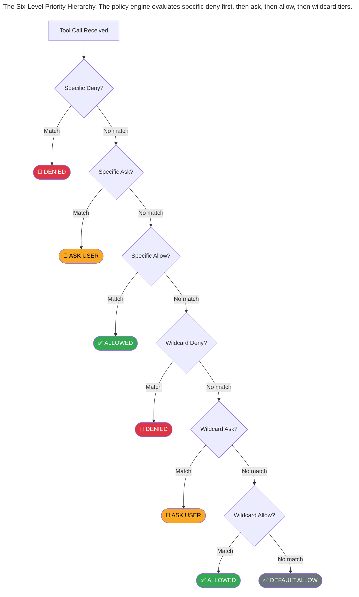
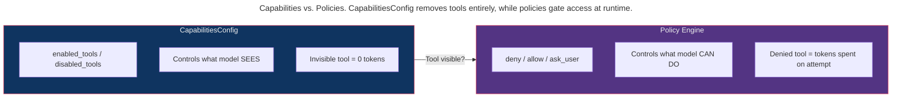

> This article is part of the [Antigravity Engineering Series](https://iamulya.one/tags/antigravity-engineering-series). For any issues or if you'd like the pdf/epub version, contact me on [LinkedIn](https://www.linkedin.com/in/amulya-bhatia-01627a42/)
{: .prompt-info }

You have 15 policies. The agent calls `run_command` with `npm install lodash`. Which policy fires? Why *that* one and not the three others that also match `run_command`?

The Antigravity SDK's policy engine isn't a flat list. It's a **six-level priority hierarchy** with specificity rules, wildcard semantics, and first-match-wins within each tier. Understanding how it resolves is the difference between a safety policy that works and one that silently allows what you thought was blocked.

This post opens the source code of `google.antigravity.hooks.policy` and traces exactly how every policy decision is made.

---

## The Six-Level Priority Hierarchy

When the agent calls a tool, the policy engine evaluates every registered policy against the tool call. But not in the order you registered them. The engine groups policies by **specificity** and **decision type**, then evaluates in this strict order:



The key insight: **deny always beats allow at the same specificity level.** A specific deny beats a specific allow, even if the allow was registered first. And specific policies always beat wildcards, regardless of decision type.

### What counts as "specific" vs "wildcard"?

- **Specific**: targets a named tool — `deny("run_command")`, `allow("view_file")`
- **Wildcard**: targets all tools — `deny("*")`, `allow("*")`

The `"*"` string is the only wildcard. Everything else is specific.

### Within a priority group: first match wins

When multiple policies occupy the same priority level (e.g., two specific denies), the first one that matches wins. This is where registration order matters:

```python
from google.antigravity.hooks.policy import deny

policies = [
    # Both are "specific deny" — same priority level
    deny("run_command", when=lambda a: "rm" in a.get("CommandLine", "")),
    deny("run_command", when=lambda a: "sudo" in a.get("CommandLine", "")),
]

# Agent calls: run_command("sudo rm -rf /")
# Both predicates match, but the FIRST one wins.
# The denial reason will reference the "rm" rule, not the "sudo" rule.
```

---

## The `when=` Predicate

The `when=` parameter turns a blanket policy into a conditional one. Without `when=`, a policy matches any call to the named tool. With `when=`, it only matches when the predicate returns `True`.

### Basic predicates

```python
from google.antigravity.hooks.policy import deny, allow

# Deny rm -rf specifically
deny("run_command", when=lambda args: "rm -rf" in args.get("CommandLine", ""))

# Allow writes only to src/
allow("write_to_file", when=lambda args: "/src/" in args.get("TargetFile", ""))

# Deny reads of dotfiles
deny("view_file", when=lambda args: args.get("AbsolutePath", "").startswith("."))
```

The predicate receives the tool call's **argument dictionary** — the same key-value pairs the agent passes to the tool. Keys match the tool's parameter names exactly (e.g., `CommandLine`, `TargetFile`, `AbsolutePath`).

### Async predicates

Predicates can be async. The SDK detects this via `inspect.iscoroutinefunction` and awaits accordingly:

```python
import aiohttp
from google.antigravity.hooks.policy import allow

async def check_deploy_window(args: dict) -> bool:
    """Only allow deploys during the deploy window (checked via API)."""
    async with aiohttp.ClientSession() as session:
        async with session.get("https://internal.api/deploy-window") as resp:
            data = await resp.json()
            return data["is_open"]

allow("run_command",
    when=check_deploy_window,
    name="deploy_window_check"
)
```

### What happens when a predicate throws?

If a `when=` predicate raises an exception, the policy is treated as **non-matching**. The engine logs the error and moves to the next policy. This is a safety decision: a broken predicate should not accidentally block safe operations.

```python
deny("run_command",
    when=lambda args: args["CommandLine"].startswith("rm")  # KeyError if no CommandLine
)
# If the tool call has no "CommandLine" key, this predicate throws KeyError.
# The deny is skipped, and evaluation continues to the next policy.

# SAFER: use .get() with a default
deny("run_command",
    when=lambda args: args.get("CommandLine", "").startswith("rm")
)
```

### Type-safe predicates with Pydantic

If your predicate's first parameter is annotated with a `pydantic.BaseModel` subclass, the SDK auto-deserializes the argument dict into that model:

```python
from pydantic import BaseModel
from google.antigravity.hooks.policy import deny

class RunCommandArgs(BaseModel):
    CommandLine: str = ""
    Cwd: str = ""

def is_destructive(args: RunCommandArgs) -> bool:
    """Type-safe predicate — args is auto-deserialized."""
    return any(pattern in args.CommandLine for pattern in [
        "rm -rf", "drop table", "truncate", "format"
    ])

deny("run_command", when=is_destructive)
```

This gives you autocomplete, type checking, and validation — the SDK handles the deserialization.

---

## MCP-Scoped Policies

When the target is an MCP server instead of a string, the SDK generates structured target strings internally:

```python
from google.antigravity.hooks.policy import deny, allow
from google.antigravity.types import McpStdioServer

db_server = McpStdioServer(name="database", command="npx", args=["db-mcp-server"])

# Deny all tools on this server
deny(db_server)
# Internally generates: Policy(tool="database/*", decision=DENY)

# Allow only read operations
allow(db_server, mcp_tools=["query_table", "describe_schema"])
# Internally generates TWO policies:
#   Policy(tool="database/query_table", decision=APPROVE)
#   Policy(tool="database/describe_schema", decision=APPROVE)

# Deny write operations specifically
deny(db_server, mcp_tools=["insert_record", "delete_record"])
# Internally generates TWO policies:
#   Policy(tool="database/insert_record", decision=DENY)
#   Policy(tool="database/delete_record", decision=DENY)
```

The `_mcp_policies()` helper function handles this expansion. Note that `mcp_tools` must be a **list**, not a string — passing a string raises `ValueError`.

---

## `policy.enforce()` — Compiling Policies into a Hook

The `enforce()` function takes a list of `Policy` objects and returns a hook that can be registered with the `HookRunner`:

```python
from google.antigravity.hooks.policy import deny, allow, enforce

policies = [
    deny("run_command", when=lambda a: "rm" in a.get("CommandLine", "")),
    allow("view_file"),
    deny("*"),
]

# Compile into a pre_tool_call hook
hook = enforce(policies)
```

At compile time, `enforce()` validates:
- Every `ASK_USER` policy has a `handler` (raises if missing)
- Tool names are strings (not accidentally passing a server config to a deny-string overload)

---

## The `confirm_run_command()` Default

`LocalAgentConfig` ships with a default policy: `confirm_run_command()`. This means **`run_command` requires user confirmation by default** — even if you don't set any policies.

```python
from google.antigravity import LocalAgentConfig

# This agent will PROMPT the user before every run_command call
config = LocalAgentConfig()

# To allow autonomous shell access, explicitly override:
from google.antigravity.hooks.policy import allow

config = LocalAgentConfig(
    policies=[allow("*")]  # Allow everything (dangerous!)
)
```

The rationale from the source code: "the most dangerous tool" should require explicit opt-in for autonomous execution.

---

## Capabilities vs. Policies: Two Different Layers



- **Use `CapabilitiesConfig.disabled_tools`** when a tool is irrelevant to the agent's purpose. The model never sees it, never wastes tokens on it.
- **Use `policy.deny()`** when a tool is relevant but dangerous under certain conditions. The model knows it exists but gets a denial message if it tries something unsafe.

---

## Common Mistakes

### 1. Thinking registration order overrides priority

```python
# MISCONCEPTION: people think deny("*") blocks everything below it
policies = [
    deny("*"),           # Wildcard deny (priority 4)
    allow("view_file"),  # Specific allow (priority 3)
]
# view_file is ALLOWED — specific allow (priority 3) beats wildcard deny (priority 4)
# Registration order doesn't matter. Priority level does.
```

The real bug version of this is the opposite — thinking you can override a **specific deny** with a **specific allow**:

```python
# ACTUAL BUG: trying to allow something that's already specifically denied
policies = [
    deny("run_command", when=lambda a: "npm" in a.get("CommandLine", "")),
    allow("run_command", when=lambda a: a.get("CommandLine", "").startswith("npm test")),
]
# "npm test" is DENIED — both are specific, but deny (priority 1) beats allow (priority 3)
# Fix: make the deny more specific so it doesn't match "npm test"
```

### 2. Missing the catch-all

```python
# BUG: Anything not explicitly denied or allowed is DEFAULT ALLOWED
policies = [
    deny("run_command", when=lambda a: "rm" in a.get("CommandLine", "")),
    allow("view_file"),
]
# What happens when the agent calls write_to_file?
# No policy matches → default allow → ALLOWED
# Fix: add deny("*") at the end
```


---

## Complete Example: Production Policy Set

```python
# production_policies.py
# A complete deny-by-default policy set for an overnight sidecar agent.

import asyncio
from google.antigravity import Agent, LocalAgentConfig
from google.antigravity.types import CapabilitiesConfig
from google.antigravity.hooks.policy import deny, allow, ask_user


async def slack_approval(tool_call) -> bool:
    """Posts to Slack and waits for emoji reaction."""
    # In production, this would use the Slack API
    print(f"⚠️  Approval needed: {tool_call.name}({tool_call.args})")
    return True  # Auto-approve for demo


policies = [
    # === SPECIFIC DENIES (Priority 1 — always win) ===
    deny("run_command", when=lambda a: "rm -rf" in a.get("CommandLine", ""),
         name="block_rm_rf"),
    deny("run_command", when=lambda a: a.get("CommandLine", "").startswith("sudo"),
         name="block_sudo"),
    deny("run_command", when=lambda a: "npm install" in a.get("CommandLine", ""),
         name="block_npm_install"),
    deny("run_command", when=lambda a: "git push origin main" in a.get("CommandLine", ""),
         name="block_push_main"),
    deny("write_to_file", when=lambda a: ".env" in a.get("TargetFile", ""),
         name="block_env_writes"),
    deny("write_to_file", when=lambda a: ".git/" in a.get("TargetFile", ""),
         name="block_git_writes"),
    deny("read_file", when=lambda a: ".ssh/" in a.get("AbsolutePath", ""),
         name="block_ssh_reads"),

    # === SPECIFIC ALLOWS (Priority 3) ===
    allow("view_file", name="allow_reads"),
    allow("list_dir", name="allow_listing"),
    allow("grep_search", name="allow_search"),
    allow("run_command", when=lambda a: a.get("CommandLine", "").startswith("npm test"),
          name="allow_tests"),
    allow("run_command", when=lambda a: a.get("CommandLine", "").startswith("git add"),
          name="allow_staging"),
    allow("run_command", when=lambda a: a.get("CommandLine", "").startswith("git commit"),
          name="allow_commits"),
    allow("run_command",
          when=lambda a: a.get("CommandLine", "").startswith("git push origin auto/"),
          name="allow_auto_push"),
    allow("write_to_file", when=lambda a: "/src/" in a.get("TargetFile", ""),
          name="allow_src_writes"),
    allow("write_to_file", when=lambda a: "/tests/" in a.get("TargetFile", ""),
          name="allow_test_writes"),

    # === SPECIFIC ASK (Priority 2 — between deny and allow) ===
    ask_user("run_command", handler=slack_approval, name="ask_unknown_commands"),
    ask_user("write_to_file", handler=slack_approval, name="ask_unknown_writes"),

    # === WILDCARD DENY (Priority 4 — catch-all) ===
    deny("*", name="deny_everything_else"),
]


async def main():
    config = LocalAgentConfig(
        capabilities=CapabilitiesConfig(),
        policies=policies,
    )

    async with Agent(config) as agent:
        response = await agent.chat(
            "Migrate all legacy.createUser() calls to userService.create(). "
            "Run tests after each change. Push to auto/migrate-users."
        )
        print(await response.text())


if __name__ == "__main__":
    asyncio.run(main())
```

---

## The Product Surface

| Feature | Source |
|---------|--------|
| `deny()`, `allow()`, `ask_user()` builders | `google.antigravity.hooks.policy` |
| Six-level priority resolution | `policy.enforce()` internals |
| `when=` predicates (sync + async) | `Policy.when` field |
| MCP-scoped policies | `_mcp_policies()` helper |
| `confirm_run_command()` default | `LocalAgentConfig` defaults |
| `CapabilitiesConfig` | `google.antigravity.types` |

---

## What You Now Know

The policy engine isn't a filter list — it's a priority resolver. Specific beats wildcard. Deny beats allow at the same level. First match wins within a group. Predicates that throw are silently skipped. The `"*"` wildcard is the only catch-all. And `run_command` is gated by default because it's the most dangerous tool in the box.

The next time you write `deny("*")` at the end of your policy list and wonder "does this actually work?" — now you know it does, and you know exactly which priority level it occupies.
