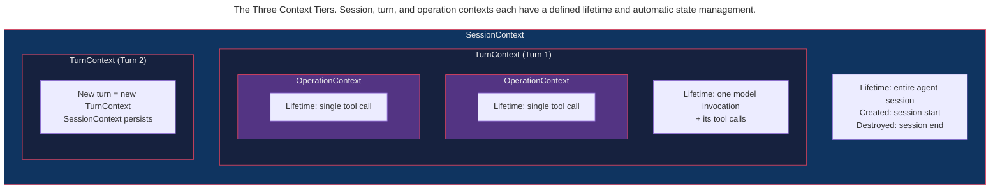

> This article is part of the [Antigravity Engineering Series](https://iamulya.one/tags/antigravity-engineering-series). 
{: .prompt-info }

You're building a token budget hook. It needs to track total tokens across the entire session. But it also needs to track tokens *per turn* to catch retry loops. And it needs to time individual tool calls to detect slow operations.

Three different lifetimes. Three different scopes. If you use instance variables, you end up resetting the wrong thing at the wrong time. If you use globals, you've got shared state between concurrent sessions.

The SDK solves this with **Hook Contexts** — a three-tier state system where each tier has a defined lifetime and automatic parent-chain lookup.

---

## The Three Tiers



| Context | Lifetime | Use Case |
|---------|----------|----------|
| `SessionContext` | Entire agent session | Total token budget, conversation memory, session-wide counters |
| `TurnContext` | One model invocation + tool calls | Per-turn token tracking, retry detection, turn-level rate limiting |
| `OperationContext` | Single tool call | Tool call timing, per-operation metadata, error tracking |

### Parent-chain lookup

Contexts form a chain via `HookContext.parent`. When you call `context.get("key")`, it searches the current context first, then walks up the chain:

```python
from google.antigravity.hooks.hooks import HookContext

session = HookContext()
session.set("project", "payment-platform")

turn = HookContext(parent=session)
turn.set("turn_number", 1)

op = HookContext(parent=turn)
op.set("tool", "run_command")

# Parent-chain lookup
op.get("tool")        # "run_command"    (found in op)
op.get("turn_number") # 1               (found in turn)
op.get("project")     # "payment-platform" (found in session)
op.get("missing")     # None             (not found anywhere)
```

Values set on a child context **do not propagate up**. Setting a key on `OperationContext` does not modify the parent `TurnContext`.

---

## Building Stateful Hooks

### Example 1: Session-level token budget

Track total token usage across the entire session. Reject new turns when the budget is exhausted.

```python
# session_budget_hook.py

from google.antigravity.hooks.hooks import (
    OnSessionStartHook, PreTurnHook, PostTurnHook,
    HookContext, HookResult,
)
from google.antigravity import types


class SessionBudgetStart(OnSessionStartHook):
    """Initialize the budget counter at session start."""

    def __init__(self, max_tokens: int = 200_000):
        self.max_tokens = max_tokens

    async def run(self, context: HookContext, data: None) -> None:
        context.set("total_tokens", 0)
        context.set("max_tokens", self.max_tokens)


class SessionBudgetPreTurn(PreTurnHook):
    """Check budget before each model invocation."""

    def __init__(self, max_tokens: int = 200_000):
        self.max_tokens = max_tokens

    async def run(self, context: HookContext, data: types.Content) -> HookResult:
        total = context.get("total_tokens", 0)
        if total >= self.max_tokens:
            return HookResult(
                allow=False,
                reason=f"Token budget exhausted: {total:,}/{self.max_tokens:,}",
            )
        return HookResult(allow=True)


class SessionBudgetPostTurn(PostTurnHook):
    """Accumulate tokens after each model invocation."""

    def __init__(self, max_tokens: int = 200_000):
        self.max_tokens = max_tokens

    async def run(self, context: HookContext, data: str) -> None:
        token_count = len(data) // 4 if data else 0
        total = context.get("total_tokens", 0)
        new_total = total + token_count
        context.set("total_tokens", new_total)
        remaining = self.max_tokens - new_total
        if remaining < 10_000:
            print(f"⚠️  Token budget low: {remaining:,} remaining")
```

> Hooks must subclass the SDK's base classes — `OnSessionStartHook`, `PreTurnHook`, `PostTurnHook`, etc. — and implement `async def run(self, context, data)`. Plain classes with convention methods (`on_pre_turn`, `on_post_tool`) are **not recognized** by the `HookRunner`.
{: .prompt-warning }

### Example 2: Turn-level retry detector

Detect when the agent is stuck in a retry loop within a single turn by counting tool calls per turn.

```python
# turn_retry_detector.py

from google.antigravity.hooks.hooks import (
    PreToolCallDecideHook, HookContext, HookResult,
)
from google.antigravity import types


class TurnRetryDetector(PreToolCallDecideHook):
    """
    Detects retry loops within a single turn.
    Counts tool calls and blocks if threshold exceeded.
    """

    def __init__(self, max_tool_calls_per_turn: int = 20):
        self.max_calls = max_tool_calls_per_turn

    async def run(self, context: HookContext, data: types.ToolCall) -> HookResult:
        count = context.get("tool_call_count", 0) + 1
        names = context.get("tool_call_names", [])

        context.set("tool_call_count", count)
        names.append(data.name)
        context.set("tool_call_names", names)

        if count > self.max_calls:
            recent = names[-5:]
            if len(set(recent)) == 1:
                return HookResult(
                    allow=False,
                    reason=(
                        f"Retry loop detected: {recent[0]} called "
                        f"{count} times this turn. Breaking loop."
                    ),
                )
            return HookResult(
                allow=False,
                reason=f"Tool call limit ({self.max_calls}/turn) exceeded.",
            )
        return HookResult(allow=True)
```

### Example 3: Operation-level tool timer

Measure how long each individual tool call takes. Flag slow operations.

```python
# operation_timer.py

from google.antigravity.hooks.hooks import PostToolCallHook, HookContext
from google.antigravity import types


class ToolCallTimer(PostToolCallHook):
    """
    Times individual tool calls using PostToolCallHook.
    Logs slow operations that exceed the configured threshold.
    """

    def __init__(self, slow_threshold_ms: int = 5000):
        self.slow_threshold_ms = slow_threshold_ms

    async def run(self, context: HookContext, data: types.ToolResult) -> None:
        duration_ms = data.duration_ms if hasattr(data, 'duration_ms') else 0

        if duration_ms > self.slow_threshold_ms:
            print(
                f"🐌 Slow tool call: {data.tool_name} took {duration_ms:.0f}ms "
                f"(threshold: {self.slow_threshold_ms}ms)"
            )
```

---

## Interaction Hooks: Structured Questions

Beyond simple allow/deny, hooks can present **structured questions** to the user using `AskQuestionInteractionSpec`:

```python
# interaction_hook.py

from google.antigravity.types import (
    AskQuestionInteractionSpec,
    AskQuestionEntry,
    AskQuestionOption,
    QuestionHookResult,
)


class MigrationStrategyHook:
    """
    When the agent encounters an ambiguous migration case,
    presents a structured multi-choice question to the user.
    """

    def on_ambiguous_migration(self, old_api: str, new_api: str) -> QuestionHookResult:
        """Present migration strategy options to the user."""
        question = AskQuestionInteractionSpec(
            questions=[
                AskQuestionEntry(
                    question=(
                        f"The migration from `{old_api}` to `{new_api}` "
                        f"has multiple valid approaches. Which strategy?"
                    ),
                    options=[
                        AskQuestionOption(
                            text="Direct replacement — swap the call in-place"
                        ),
                        AskQuestionOption(
                            text="Wrapper function — create a compatibility shim"
                        ),
                        AskQuestionOption(
                            text="Skip — flag for manual review"
                        ),
                    ],
                    is_multi_select=False,
                )
            ]
        )
        return QuestionHookResult(interaction=question)
```

The IDE and CLI both render these as interactive selection dialogs — the user picks an option, and the hook receives the response.

---

## Composing All Three Levels

```python
# composed_hooks.py
# Combines session, turn, and operation-level hooks into one agent.

import asyncio
from google.antigravity import Agent, LocalAgentConfig
from google.antigravity.types import CapabilitiesConfig
from google.antigravity.hooks.policy import allow, deny

from session_budget_hook import SessionBudgetStart, SessionBudgetPreTurn, SessionBudgetPostTurn
from turn_retry_detector import TurnRetryDetector
from operation_timer import ToolCallTimer


async def main():
    config = LocalAgentConfig(
        capabilities=CapabilitiesConfig(
            enable_subagents=False,
        ),
        policies=[
            allow("view_file"),
            allow("grep_search"),
            allow("run_command", when=lambda a: a.get("CommandLine", "").startswith("npm test")),
            allow("write_to_file", when=lambda a: "/src/" in a.get("TargetFile", "")),
            deny("*"),
        ],
        hooks=[
            # Each hook is a separate instance subclassing its base
            SessionBudgetStart(max_tokens=150_000),
            SessionBudgetPreTurn(max_tokens=150_000),
            SessionBudgetPostTurn(max_tokens=150_000),
            TurnRetryDetector(max_tool_calls_per_turn=25),
            ToolCallTimer(slow_threshold_ms=3000),
        ],
    )

    async with Agent(config) as agent:
        response = await agent.chat(
            "Find all TODO comments in src/ and fix the top 5 by priority."
        )
        print(await response.text())


if __name__ == "__main__":
    asyncio.run(main())
```

---

## Hook Registration and Dispatch

The `HookRunner` uses `isinstance` checks to register each hook by its base class:

| Base Class | Lifecycle Point | Type | Blocking? |
|------------|----------------|------|-----------|
| `OnSessionStartHook` | Session begins | `InspectHook[None]` | No |
| `OnSessionEndHook` | Session ends | `InspectHook[None]` | No |
| `PreTurnHook` | Before model invocation | `DecideHook[Content]` | Yes (can reject) |
| `PostTurnHook` | After model invocation | `InspectHook[str]` | No |
| `PreToolCallDecideHook` | Before tool execution | `DecideHook[ToolCall]` | Yes (can reject) |
| `PostToolCallHook` | After tool execution | `InspectHook[ToolResult]` | No |

All hooks implement `async def run(self, context: HookContext, data: T)`. `DecideHook` subclasses return `HookResult(allow=True/False)`. `InspectHook` subclasses return `None`.

Multiple hooks on the same point run in registration order. For `DecideHook` types, the first to return `HookResult(allow=False)` short-circuits — remaining hooks are skipped.

`InspectHook` types always run, even if a previous hook reported an error.

---

## What You Now Know

Hook Contexts are the SDK's answer to "where do I put state?" without globals or instance variables leaking between sessions. `SessionContext` survives across turns. `TurnContext` resets every model invocation. `OperationContext` is scoped to a single tool call. Parent-chain lookup means operation-level code can read session-level data without explicit plumbing.

The three tiers map directly to the three questions you ask when debugging an agent: "What happened in this session?" (SessionContext), "What happened in this turn?" (TurnContext), "What happened in this tool call?" (OperationContext).
