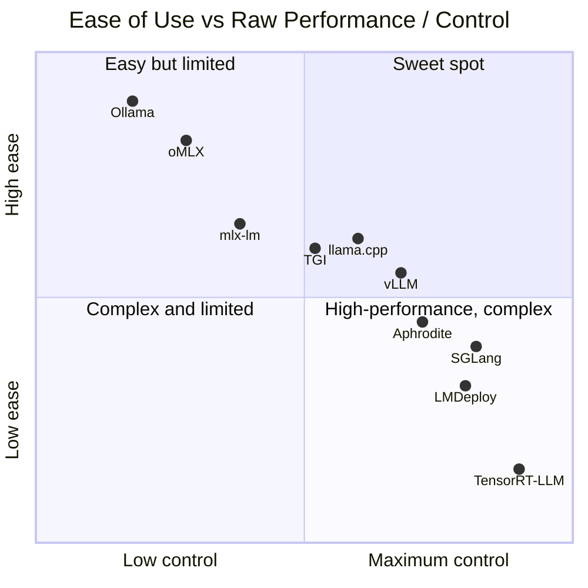
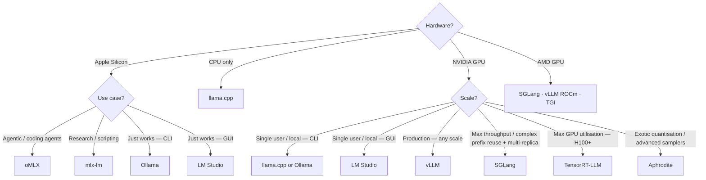
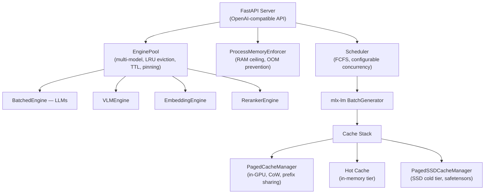
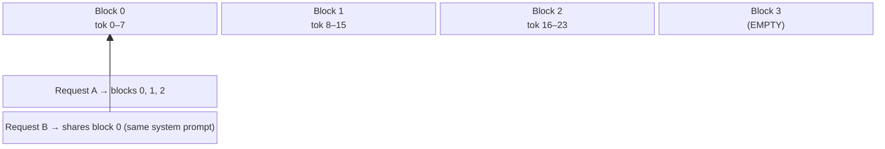
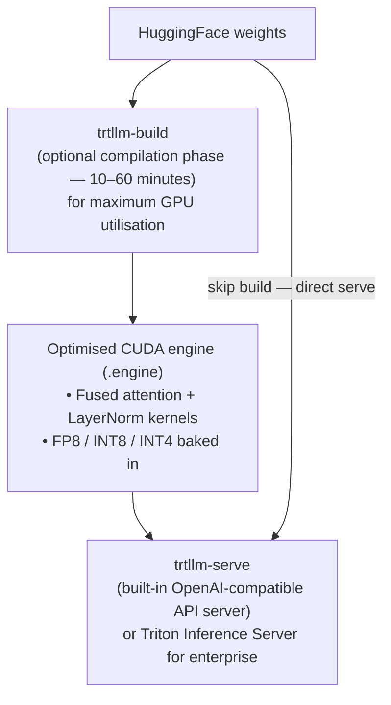
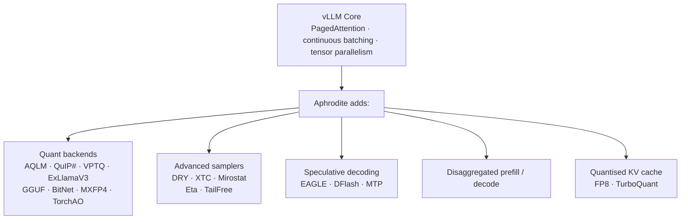
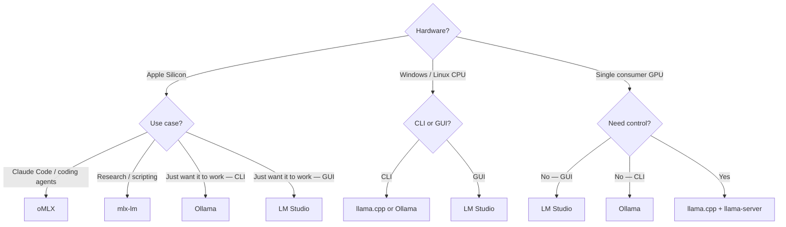
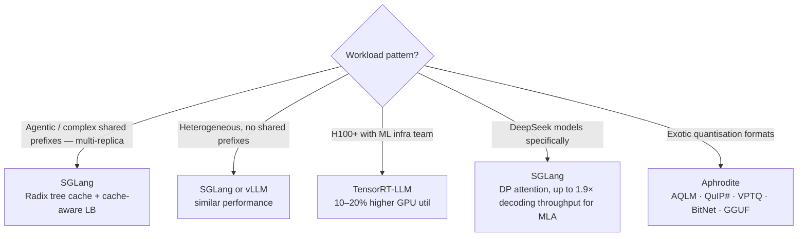

> This article is **Part 15 of 15** in the [Generative AI in Depth](/categories/generative-ai-in-depth/) series.
{: .prompt-info }


The LLM serving landscape has fragmented into at least a dozen serious frameworks, each with genuine trade-offs. Picking the wrong one for your workload doesn't just mean leaving performance on the table — it can mean 10× worse latency or 3× higher cloud costs.

This article covers the eleven most important frameworks as of mid-2026:

| Framework | Primary audience | Hardware target | Paradigm |
|---|---|---|---|
| **llama.cpp** | Developers, researchers | CPU, any GPU, Apple Silicon | Low-level, portable |
| **Ollama** | Practitioners, local users | CPU + GPU, Apple Silicon | Zero-friction llama.cpp wrapper |
| **LM Studio** | End users, GUI-first practitioners | CPU + GPU (llama.cpp) · Apple Silicon (MLX) | GUI desktop app, llama.cpp + MLX backends |
| **oMLX** | Agentic coding on Apple Silicon | Apple Silicon only | MLX + SSD-tiered KV caching |
| **mlx-lm** | Apple Silicon researchers | Apple Silicon only | Apple-native, raw MLX |
| **vLLM** | ML engineers, production teams | NVIDIA · AMD · Intel XPU · Google TPU · CPU · plugins (Gaudi, Ascend, IBM Spyre) | PagedAttention, broad model support |
| **SGLang** | Production, agentic, structured output | NVIDIA · AMD (MI300/MI355) · Intel Xeon · Google TPU · Ascend NPU | Radix-tree prefix cache, max throughput, cache-aware LB |
| **TensorRT-LLM** | NVIDIA-only production | NVIDIA GPU only | Compiled, highest peak GPU util |
| **TGI** | HuggingFace ecosystem, API | NVIDIA · AMD · Intel GPU · Intel Gaudi · AWS Inferentia | Broad model support, HF-native |
| **LMDeploy** | Production, Chinese/MoE models | NVIDIA · Ascend NPU | TurboMind engine, MoE specialist |
| **Aphrodite** | Heavy quantisation, exotic samplers | NVIDIA GPU | vLLM fork, widest quant support |

---

## The Decision Landscape

Before diving into each framework, it helps to understand the **fundamental trade-offs** that separate them:



There is also a **hardware dimension** that immediately eliminates options:



---

## llama.cpp

**What it is:** A C/C++ inference engine built on the `ggml` tensor library. Started as a port of LLaMA to run on a MacBook, but has evolved into the most portable LLM runtime in existence — running on CPUs, NVIDIA/AMD GPUs, Apple Silicon, Vulkan, and even WebGPU in-browser.

**Core architecture:**

llama.cpp's key architectural decisions are:

1. **GGUF quantization format**: All models are stored in GGUF, a single-file format that bundles weights, tokeniser, and metadata. Quantisations range from 1.5-bit to 8-bit, with mixed-precision variants (e.g., Q4_K_M is a mixed-precision variant: most weight tensors are stored at 4-bit (Q4_K), but two sets of critical layers are kept at higher precision — attention value projections at 6-bit (Q6_K) and FFN gate weights at 5-bit (Q5_K) — to preserve quality where it matters most).

2. **CPU-first KV cache**: On CPU or when VRAM is insufficient, the KV cache lives in system RAM. The GPU executes attention and FFN layers; the CPU handles everything else. This hybrid mode lets you run models far larger than your VRAM.

3. **Custom CUDA/Metal kernels with FlashAttention**: For GPU acceleration, llama.cpp uses FlashAttention natively (auto mode is the default — `--flash-attn auto`, env: `LLAMA_ARG_FLASH_ATTN`). It also maintains hand-written CUDA kernels for dequantization and matrix multiply (via `ggml-cuda`).

4. **Server mode**: `llama-server` provides an OpenAI-compatible HTTP API. It supports continuous batching (enabled by default via `--cont-batching`) and multi-slot parallel requests. Prompt caching (`--cache-prompt`) is also enabled by default, providing prefix reuse within a session.

**Performance characteristics:**

The key distinction: llama.cpp is optimised for **single-user latency** (tokens/s for one request) at a wide range of quantisations. It is not optimised for **multi-user throughput** (total tokens/s across many concurrent requests).

At single-user latency (one request, Q4/Q5 quantisation), llama.cpp is competitive with or faster than vLLM (which is optimised for batched throughput). At multi-user throughput (batch > 8–16), vLLM/SGLang significantly outperform llama.cpp, because PagedAttention's memory management enables much larger effective batch sizes before VRAM fills.

> The throughput gap at high concurrency is real and well-established, but specific tok/s numbers vary dramatically with model size, quantisation, hardware, and context length. Always benchmark on your specific workload rather than relying on published figures.
{: .prompt-warning }

The gap stems from two factors: llama.cpp's KV cache is not paged (each slot pre-allocates a contiguous block), which limits concurrent slots; and its scheduler, while having continuous batching, does not have the same degree of memory efficiency as vLLM's PagedAttention.

**Unique strengths:**
- **Runs anywhere**: CPU, GPU, Apple Silicon, Vulkan, AMD (via HIP/ROCm), even browser (WebGPU)
- **Most quantisation options**: 1.5-bit through 8-bit, K-quants, IQ-quants (imatrix-based)
- **Widest model support**: Nearly every architecture eventually gets GGUF support
- **Speculative decoding**: Supported natively (`--spec-draft-model` / `--model-draft`)
- **No Python required**: Pure C++, minimal dependencies, easy to embed
- **Advanced samplers**: DRY (`--dry-multiplier`), XTC (`--xtc-probability`), Mirostat (`--mirostat`), min-p, locally typical, and more
- **GGUF natively readable** by Aphrodite and oMLX too — broadest interoperability

**Limitations:**
- KV cache is not paged (contiguous per-slot allocation) — limits concurrent slots at high batch sizes vs PagedAttention
- Multi-GPU tensor parallelism is experimental (`--split-mode tensor`); layer-split mode works but with pipeline bubbles
- Lower peak throughput than Python-based engines at high concurrency

**Best for:**
- Running models on CPU (only serious option)
- Consumer GPU setups (1× GPU, modest VRAM)
- Embedding in C++ applications
- Research/experimentation across quantisation levels
- Edge deployment

---

## Ollama

**What it is:** A user-friendly wrapper primarily backed by llama.cpp. Ollama handles model downloads, GPU detection, server lifecycle management, and provides a dead-simple CLI and REST API. It is not a new inference engine — it primarily calls llama.cpp under the hood (though Ollama has added its own model runners for some architectures).

**Architecture:**


The Ollama daemon manages:
- Model library (downloads, caching in `~/.ollama/models`)
- Automatic GPU/CPU selection
- Server lifecycle (starts/stops llama.cpp server processes)
- Model keep-alive and swapping

**The Modelfile:** Ollama uses a `Modelfile` (similar to a Dockerfile) to define model configurations — system prompts, parameters, quantisation variants. This makes it easy to share reproducible model configurations.

**Performance:** Essentially identical to llama.cpp for the same model and quantisation. The daemon overhead is negligible.

**Unique strengths:**
- `ollama run gemma2:9b` — one command to download and run any supported model
- Automatic hardware detection and VRAM allocation
- Model library at ollama.com with thousands of pre-quantised models
- Works identically on macOS (Apple Silicon), Linux, and Windows
- Native multimodal support (LLaVA, etc.)

**Limitations:**
- Everything that applies to llama.cpp applies here (KV cache not paged, weaker memory efficiency at high concurrency than vLLM/SGLang)
- Less control than using llama.cpp directly
- Model library quantisation choices are fixed (you can't easily run Q2_K_XS unless it's pre-built)

**Best for:**
- Local development — the "just works" option
- Quickly testing a new model
- Providing a local API for personal tools (coding assistants, RAG prototypes)
- Teams where "install and go" matters more than peak performance

---

## LM Studio

**What it is:** A proprietary desktop GUI application for running LLMs locally. LM Studio wraps two backends — **llama.cpp** (for GGUF models on any platform) and an **Apple MLX engine** (`mlx-engine`, built on top of `mlx-lm`) on Apple Silicon since v0.3.4. It is the most popular GUI-first local LLM tool, particularly dominant on Windows where there are fewer GUI alternatives.

**Core architecture:**

LM Studio ships as a self-contained app with:

1. **GUI model browser**: Search and download models directly from HuggingFace within the app. Displays quantisation options, file sizes, and estimated VRAM requirements before downloading.

2. **Dual inference backends**:
   - **llama.cpp** (GGUF): Used on Windows, Linux, and macOS for GGUF-format models. Inherits llama.cpp's hardware breadth — CPU, NVIDIA GPU (CUDA), AMD GPU (ROCm/Vulkan), Apple Silicon Metal.
   - **mlx-engine** (MLX): Used on Apple Silicon for MLX-format models. Built on top of `mlx-lm`; ships bundled with LM Studio 0.3.4 and newer.

3. **Built-in chat UI**: Conversation history, system prompt editor, model comparison (side-by-side chat), and parameter controls (temperature, top-p, etc.) — all in-app.

4. **OpenAI-compatible local server**: Start via the GUI or `lms server start`. Exposes the standard `/v1/chat/completions`, `/v1/completions`, and `/v1/embeddings` endpoints.

5. **CLI (`lms`)**: Ships bundled with LM Studio. Supports `lms server start/stop`, `lms ls` (list models), `lms ps` (list loaded models), and model downloads.

6. **JS and Python SDKs**: `npm install @lmstudio/sdk` / `pip install lmstudio` for programmatic access beyond the raw OpenAI API.

**Performance:**

Performance is determined entirely by the underlying backend:
- On GGUF models: equivalent to bare llama.cpp.
- On Apple Silicon MLX models: equivalent to bare mlx-lm (LM Studio adds negligible overhead).

LM Studio is **not** designed for production multi-user serving. It targets single-user workloads.

**Unique strengths:**
- **Best GUI experience** for local LLMs, especially on Windows
- **No terminal required**: model download, server start, and inference all via the GUI
- MLX backend on Apple Silicon (unlike Ollama, which uses llama.cpp for all platforms)
- Built-in model browser with HuggingFace integration and VRAM estimator
- In-app chat with system prompt editor, multi-model comparison, and parameter sliders
- **JS and Python SDKs** for scripted use beyond the OpenAI API

**Limitations:**
- **Closed-source** (proprietary application — not open source)
- Not suitable for headless server or container deployments
- No production serving features (no prefix caching at scale, no multi-user throughput optimisation)
- Performance ceiling is llama.cpp/mlx-lm — no vLLM-style scheduling
- Less control than raw llama.cpp or Ollama for advanced configurations

**Best for:**
- Windows users who want a GUI (the primary use case — Ollama's CLI is less friendly on Windows)
- Non-technical users who want to run LLMs locally without any terminal work
- Quickly evaluating and comparing models before committing to a deployment stack
- Mac users who want an Ollama-like experience but with the MLX backend automatically selected for Apple Silicon

---

## oMLX

**What it is:** A macOS-native MLX inference server built specifically for the way **coding agents** use LLMs. oMLX (GitHub: [jundot/omlx](https://github.com/jundot/omlx), v0.4.4 as of June 2026, 16.8k stars) adds features that neither mlx-lm nor Ollama provide: proper continuous batching, a **two-tier (RAM + SSD) paged KV cache**, multi-model serving with LRU eviction, and a macOS menu-bar app.

**Why it exists:** Coding agents like Claude Code invalidate and re-issue prompts with long shared prefixes dozens of times per session. On plain mlx-lm or Ollama, each cache invalidation recomputes the full prefix from scratch. oMLX persists KV cache blocks to SSD so that even after a context change, matching prefixes are restored from disk in milliseconds — not recomputed.

**Core architecture:**



Key design points:

1. **Tiered KV cache (RAM → SSD)**: Block-based KV cache inspired by vLLM's PagedAttention, but extended across two tiers. Hot blocks stay in RAM; when the hot cache fills, blocks are offloaded to SSD in `safetensors` format. On a subsequent request whose prefix matches, the blocks are restored from SSD rather than recomputed. The cache survives server restarts — giving you persistent prefix caching across sessions.

2. **Multi-model serving**: Load LLMs, VLMs, embedding models, and rerankers from the same server instance. Models are managed with LRU eviction, manual pinning, per-model TTL, and model aliases. You can serve `qwen3-8b:thinking` and `qwen3-8b` as separate API endpoints backed by the same loaded model, with different per-profile sampling params.

3. **Continuous batching**: Uses mlx-lm's `BatchGenerator` with configurable max concurrent requests — a step above plain mlx-lm's sequential inference.

4. **Claude Code / agentic optimisation**: Context scaling support ensures auto-compact triggers correctly when context windows fill, and SSE keep-alive prevents read timeouts during long prefills.

5. **MCP integration**: Supports Model Context Protocol tools natively, making it useful as a local backend for agentic pipelines.

**Performance:**

On Apple Silicon (benchmarks on Apple Silicon, up to M4 Ultra 512 GB), oMLX is faster than mlx-lm at multi-request concurrency because of its proper batching layer. For single-request latency, it is comparable to raw mlx-lm. The SSD cache benefit is most dramatic when running coding agents with long, frequently re-used prefixes — what would be a 2–4 second TTFT becomes a disk-restore in < 100 ms.

| Prefix state | TTFT |
|---|---|
| Cold (first request) | similar to mlx-lm — full recompute |
| Warm (in-memory hot cache hit) | ~0 recomputation |
| Cold after eviction (SSD restore) | < 100 ms vs 2–4 s recompute |

**Unique strengths:**
- **SSD-tiered KV cache**: the only framework that persists KV cache blocks across restarts
- **Multi-model serving** with LRU eviction and model pinning — run 5 models from one server
- **macOS-native app**: menu-bar app with admin dashboard at `/admin` (full offline, no CDN)
- **OpenAI-compatible API** — any OpenAI client works out of the box
- **VLM support** with same batching/KV stack as text LLMs
- **DFlash speculative decoding** on Apple Silicon via [dflash-mlx](https://github.com/bstnxbt/dflash-mlx)
- Integrations one-click configured: Claude Code, OpenClaw, OpenCode, Codex, Hermes Agent, Copilot

**Limitations:**
- Apple Silicon + macOS 15+ only — no Linux, no GPU servers
- Smaller community than mlx-lm (though growing fast)
- Throughput ceiling is still the M-series GPU — no match for data-centre GPUs at scale
- SSD caching only helps if your workload has re-used long prefixes

**Best for:**
- Running coding agents (Claude Code, OpenCode, Copilot) locally on Apple Silicon
- Multi-model developer setups on Mac (LLM + embeddings + reranker from one server)
- Long agentic sessions where prefix recomputation is the bottleneck
- Anyone who wants a "proper" serving stack on Mac rather than a basic wrapper

---

## mlx-lm

**What it is:** Apple's MLX framework applied to LLM inference. MLX is Apple's ML framework designed specifically for the unified memory architecture of Apple Silicon (M1/M2/M3/M4 chips). mlx-lm is the reference Python library for running and fine-tuning models on MLX.

**Core architecture:**

Apple Silicon's key characteristic is **unified memory**: the CPU and GPU share the same physical RAM pool. There is no PCIe transfer overhead between host and device — model weights and KV cache live in one place accessible to both.

MLX exploits this:
- **Lazy evaluation**: Operations are built into a computation graph and executed lazily, enabling fusion
- **Unified memory model**: No GPU VRAM limit separate from system RAM (an M4 Max with 128 GB RAM can run a 70B model)
- **Metal backend**: GPU kernels run on Apple's Metal GPU API


mlx-lm is consistently faster than Ollama/llama.cpp on Apple Silicon for equivalent model configurations because the Metal kernels are tuned specifically for M-series chips. The exact margin depends heavily on model architecture, quantisation, and chip generation; always benchmark on your specific setup.

> Specific tok/s numbers are not given here because they vary significantly by chip (M3 Max vs M4 Ultra), RAM configuration, model size, and quantisation. Always benchmark on your own hardware with your target model.
{: .prompt-info }

**Unique strengths:**
- Fastest single-request performance on Apple Silicon
- Can run large models (70B+) in full precision on high-RAM configurations using unified memory (e.g., M3 Ultra 192 GB or M4 Ultra 512 GB); lower-RAM chips require quantisation
- Active development and Apple investment
- Works with most HuggingFace models (converted to MLX format via `mlx_lm.convert`)
- DFlash speculative decoding available as community implementation

**Limitations:**
- Apple Silicon only — completely non-portable
- Server-mode continuous batching is minimal compared to oMLX (no SSD cache, no multi-model serving, no admin UI)
- No persistent KV cache across requests/restarts

**Best for:**
- Research and scripting: generating text, fine-tuning LoRAs, quick experiments on Mac
- When you want the raw MLX API without an opinionated server on top
- Single-model, single-user use cases on Apple Silicon

---

## vLLM

**What it is:** The production-grade Python serving engine from UC Berkeley, built around the **PagedAttention** memory manager. Introduced in 2023 and now the most widely deployed open-source LLM serving framework in enterprise settings.

**Core architecture:**

vLLM's central innovation is **PagedAttention**, which manages KV cache memory the same way an OS manages virtual memory — in fixed-size "pages" (blocks of tokens) that can be allocated, freed, and shared between requests. This eliminates KV cache fragmentation and enables:

1. **Continuous batching**: Requests join and leave a running batch at every decode step, not at request boundaries. VRAM is always fully utilised.

2. **KV cache sharing**: Multiple requests with the same prefix (e.g., a shared system prompt) can share physical KV cache blocks — called **prefix caching** or **prompt caching**.

3. **Chunked prefill**: Long prompts are chunked and interleaved with ongoing decode steps, preventing head-of-line blocking.



**vLLM V1 engine (2024–2025):**

The engine underwent a significant rewrite in 2024 ("V1 engine", default since 2025) with async-first scheduling, disaggregated prefill/decode support, and a new prefix caching implementation. The V1 engine eliminates much of the Python scheduling overhead that caused vLLM to lose throughput benchmarks to SGLang in earlier releases.

**Unique strengths:**
- **Widest model support**: Every new HuggingFace architecture typically lands in vLLM within weeks
- **Multi-GPU**: Tensor parallelism, pipeline parallelism, and expert parallelism out of the box
- **Broad hardware**: NVIDIA CUDA, AMD ROCm (with W4A16 AWQ support), Intel XPU (Intel discrete GPU via oneAPI), Google TPU, and x86/ARM/PowerPC CPUs; hardware plugins for Intel Gaudi, Huawei Ascend, IBM Spyre, and more
- **Apple Silicon** (experimental): community-maintained [vLLM-Metal](https://github.com/vllm-project/vllm-metal) plugin exists, but is not part of core vLLM
- **Ecosystem**: Most tutorials, blog posts, cloud integrations (AWS, GCP, Azure all have vLLM guides)
- **Production mature**: Used at scale at Anyscale (co-creator), Replicate, Lambda Labs, and many cloud platforms

**Limitations:**
- Historically slightly behind SGLang on throughput (gap is closing with V1 engine)
- Python overhead at high concurrency
- Quantisation support narrower than Aphrodite (fewer exotic formats such as AQLM, QuIP#, VPTQ; GGUF support was added but is more limited than Aphrodite's native implementation)

**Best for:**
- Production API serving (the "safe" default choice for most teams)
- Heterogeneous model support requirements (you need to serve 5 different architectures)
- AMD GPU users who need serious throughput
- Teams already heavily invested in HuggingFace ecosystem
- When you need the broadest community support and tutorials

---

## SGLang

**What it is:** A serving framework from the LMSys team (the people who built Chatbot Arena), optimised for maximum throughput and agentic/multi-turn workloads. SGLang's standout feature is **RadixAttention** — a KV cache built on a radix tree rather than hash-based block matching.

> **vLLM also has prefix caching** — its Automatic Prefix Caching (APC) uses a hash-based block index and is enabled by default in the V1 engine. The difference is in the data structure and scope: vLLM matches at block granularity (16–32 tokens); SGLang's radix tree matches any length prefix, including those that cross block boundaries, and finds the *longest matching prefix* rather than just exact block hashes. SGLang additionally has a cache-aware load balancer (see below) which vLLM does not.
{: .prompt-info }

**Core architecture:**

SGLang's key innovations:

1. **RadixAttention**: KV cache is managed as a radix tree keyed by token sequences. When a new request arrives, the engine walks the tree to find and reuse the longest matching prefix — not just block-aligned matches, but any shared token sequence.

   ```
   Radix tree of cached KV prefixes:
   
   "You are a helpful assistant"  → cached (4 requests share this)
     └── "You are a helpful assistant. Answer: "  → cached (2 requests)
     └── "You are a helpful assistant. The capital of France"  → cached (1 req)
   
   New request "You are a helpful assistant. The capital of Germany" 
   → Matches first 7 tokens → reuse KV, only compute "The capital of Germany"
   ```

2. **Zero-overhead batch scheduler**: The CPU scheduler runs one batch ahead of the GPU worker. All scheduling decisions (radix cache lookup, memory allocation) are computed during the previous GPU step. GPU is never idle waiting for CPU work.

3. **Cache-aware load balancer**: In multi-replica deployments, requests are routed to the replica most likely to have a cache hit (tracked via an approximate radix tree in the router, implemented in Rust).

4. **XGrammar integration**: Up to 10× faster structured output (JSON) than vLLM's default Outlines backend. (Note: vLLM v0.6+ can also use XGrammar as a backend, which narrows the gap considerably.)

5. **DFlash native support**: SGLang was among the first major frameworks to productionise DFlash block-diffusion speculative decoding. vLLM supports it as well.

**Unique strengths:**
- Highest throughput of any open-source framework for prefix-heavy workloads
- **Massive production scale**: Generates trillions of tokens daily, trusted by xAI, NVIDIA, AMD, Google Cloud, Microsoft Azure, AWS, Modal, Cursor, LinkedIn, and others (per SGLang README)
- Best structured output when using XGrammar (10× faster than vLLM's Outlines default; comparable when both use XGrammar)
- Best speculative decoding support (EAGLE, DFlash, Spec V2). vLLM has however caught up in this area as well, supporting them through the [Speculators project](https://docs.vllm.ai/projects/speculators/en/latest/)
- DeepSeek MLA + DP attention optimisation (significant speedup for MLA-based models; exact figure depends on hardware)
- Disaggregated prefill/decode support
- Rust-based load balancer (cache-aware routing)

**Limitations:**
- Slightly narrower model support than vLLM (new architectures lag by a few weeks)
- Steeper learning curve than vLLM
- Some advanced features (e.g., DP attention) are architecture-specific

**Best for:**
- Maximum throughput production serving on NVIDIA GPUs
- Agentic workloads with repeated system prompts, tool schemas, or RAG prefixes
- Structured output APIs (JSON schemas, grammar-constrained generation)
- DeepSeek model serving
- Teams where throughput/cost efficiency is the primary constraint

---

## TensorRT-LLM

**What it is:** NVIDIA's official high-performance inference engine. Unlike Python-based engines, TensorRT-LLM **compiles** the model into optimised CUDA kernels at deploy time, producing a static engine tuned for specific hardware, batch sizes, and sequence lengths.

**Core architecture:**

The deploy-time compilation pipeline:



What compilation enables:
- **Kernel fusion**: Operations that run as separate CUDA kernels in Python engines can be fused into single kernels, reducing memory round-trips
- **Custom attention kernels**: Multi-head, GQA, MLA all compiled into CUDA-native implementations
- **FP8 with hardware SMs**: On H100/H200/Blackwell, FP8 Tensor Cores deliver ~2× the throughput of BF16 at similar quality
- **In-flight batching**: TensorRT-LLM's term for continuous batching

**Performance:**

TensorRT-LLM consistently wins on raw GPU utilisation metrics, particularly on H100/H200:

| Framework | H100 GPU utilisation (decode-heavy) | Relative throughput |
|---|---|---|
| TensorRT-LLM | ~85–92% | 1.0× (baseline) |
| SGLang | ~75–82% | ~0.85–0.9× |
| vLLM | ~68–75% | ~0.75–0.85× |

*(Representative estimates consistent with NVIDIA MLPerf Inference submission trends; see [NVIDIA MLPerf Inference](https://developer.nvidia.com/deep-learning-performance-training-inference) for measured figures. Workload configuration significantly impacts utilisation.)*

**Unique strengths:**
- Highest raw GPU utilisation (when compilation matches workload)
- FP8 support with calibration (best quality/speed ratio on H100+)
- Used internally at NVIDIA and many cloud providers
- Triton integration (NVIDIA's inference serving infrastructure)
- Support for speculative decoding and in-flight batching

**Limitations:**
- **Compilation adds complexity**: `trtllm-build` (10–60 min) is optional but required for maximum GPU utilisation; `trtllm-serve` can load HuggingFace weights directly
- **NVIDIA-only**: No AMD, no CPU, no Apple Silicon
- **Enterprise deployment**: For Triton-based serving, config files and NVIDIA-specific tooling are needed
- **Model support lags**: New architectures take longer to land (must implement CUDA kernels)

**Best for:**
- NVIDIA cloud deployments where peak GPU utilisation = minimum cost per token
- Stable, well-defined workloads (known max sequence length, known batch characteristics)
- H100/H200/Blackwell deployments where FP8 provides a genuine 2× advantage
- Teams with ML infrastructure engineers to manage the build pipeline
- High-volume production where compile time is amortised over millions of requests

---

## TGI (Text Generation Inference)

**What it is:** HuggingFace's official serving framework. TGI predates vLLM (2022), is tightly integrated with HuggingFace Hub, and is used to power HuggingFace's own inference endpoints.

**Core architecture:**

TGI is implemented in Rust (server) + Python (model workers), with:
- **Continuous batching** (implemented independently from vLLM)
- **Flash Attention** and **Paged Attention** (added after vLLM pioneered it)
- **Tensor parallelism** via NCCL (multi-GPU)
- **Safetensors** weight loading (no format conversion from HuggingFace models needed)
- Multiple hardware backends: AMD ROCm, Intel GPU, Intel Gaudi (integrated in `backends/gaudi`), and AWS Inferentia/Trainium (via Optimum Neuron)
- A TensorRT-LLM backend (`backends/trtllm`) for NVIDIA deployments

TGI popularised token-by-token streaming for LLM APIs and its Server-Sent Events (SSE) response format was widely adopted by other frameworks — though SSE itself is a W3C web standard.

**Performance:**

TGI historically lagged vLLM slightly on throughput but the gap has narrowed. TGI's main advantage is first-class HuggingFace Hub integration — pull model by repo name, no format conversion needed.

**Unique strengths:**
- Best HuggingFace Hub integration (model download, tokeniser, config all automatic)
- **Broadest hardware support** among production frameworks: AMD ROCm, Intel GPU, Intel Gaudi, AWS Inferentia/Trainium — not just NVIDIA
- Used in HuggingFace Inference Endpoints — easiest path to hosted deployment
- Good multimodal support (LLaVA, Idefics)
- Structured output via JSONSchema/grammar
- TensorRT-LLM backend available for NVIDIA peak performance

**Limitations:**
- Throughput generally below SGLang; roughly comparable to vLLM
- Less community momentum than vLLM in 2025–2026 for pure serving workloads

**Best for:**
- Teams deeply invested in HuggingFace Hub workflows
- **Intel Gaudi / AWS Inferentia / AMD** deployments — TGI has the broadest non-NVIDIA coverage of any production framework
- Deploying to HuggingFace Inference Endpoints
- When you want HuggingFace’s managed hosting to match your local serving setup exactly

---

## LMDeploy

**What it is:** A high-performance serving toolkit from the Shanghai AI Lab (InternLM team). Comprises two engines: **TurboMind** (C++/CUDA, for dense models) and **PyTorch** (for broader model support and MoE).

**Core architecture:**

LMDeploy's TurboMind engine differentiates itself with:

1. **Continuous batching with W4A16 quantisation**: LMDeploy's W4A16 (4-bit weights, 16-bit activations) is implemented at the CUDA kernel level, making it one of the fastest options for quantised dense models.

2. **MoE specialisation**: LMDeploy has historically had strong MoE support (InternLM 2 MoE, DeepSeek, Mixtral). Expert parallelism support was added early.

3. **Speculative decoding**: Supports typical draft-model approaches.

**Performance:**

For **quantised models** (W4A16), LMDeploy's TurboMind is often the fastest option — sometimes beating vLLM and SGLang with the same quantised model because of its kernel-level INT4 implementation. For BF16 models, vLLM/SGLang are typically faster.

**Unique strengths:**
- Best W4A16 quantised model throughput
- Strong MoE model support (InternLM, DeepSeek, Mixtral)
- High-quality AWQ quantisation pipeline (not just serving, also quantisation)
- Good documentation for Chinese models and HuggingFace models
- **Ascend NPU support** (PyTorchEngine, added Sep 2024)

**Limitations:**
- Smaller English-language community than vLLM
- Less broad model architecture support than vLLM/TGI
- AMD GPU (ROCm) not supported; Intel GPU/Gaudi not supported

**Best for:**
- Serving heavily quantised models (W4A16 AWQ) for cost reduction
- InternLM model families
- MoE models where expert parallelism matters
- Teams where quantised throughput is the primary metric

---

## Aphrodite Engine

**What it is:** A vLLM fork maintained by [dphnAI](https://github.com/dphnAI/aphrodite-engine) (formerly PygmalionAI), originally built to power Pygmalion.chat's API infrastructure. Aphrodite tracks vLLM closely but adds the **widest quantisation support of any serving engine** and a suite of advanced sampling methods that vanilla vLLM lacks.

**Relationship to vLLM:**



Aphrodite intentionally stays close to vLLM's architecture so that upstream engine improvements (scheduling, memory management, speculative decoding) can be merged in. The project releases frequently and tracks vLLM's main branch aggressively.

**Quantisation support (as of v0.x, 2026):**

Aphrodite supports more quantisation formats than any other engine:

| Format | Description |
|---|---|
| GPTQ | Post-training weight quantisation (typically 4-bit; 2- and 3-bit also supported) |
| AWQ | Activation-aware weight quantisation |
| AQLM | Additive Quantisation for Language Models (extreme compression) |
| QuIP# | Hadamard incoherence + lattice codebook quantisation (sub-4-bit, down to 2-bit) |
| VPTQ | Vector Post-Training Quantisation |
| ExLlamaV3 | turboderp-org's EXL3 format — high-efficiency quantisation for consumer GPUs |
| Bitsandbytes | NF4/INT8 load-time quantisation |
| GGUF | llama.cpp format served natively |
| FP8 | NVIDIA 8-bit float (H100+) |
| NVFP4 | NVIDIA 4-bit float (Blackwell B100/B200+) |
| MXFP4 | Microscaling FP4 (Blackwell) |
| Marlin | Optimised INT4 × FP16 kernel |
| BitNet b1.58 | 1.58-bit ternary weights |
| TorchAO | PyTorch-native quantisation |
| compressed_tensors | vLLM-compatible compressed storage |

**Sampling extensions:**

Beyond standard temperature/top-p/top-k, Aphrodite adds:
- **DRY** (Don't Repeat Yourself): penalises repeated n-gram sequences in output
- **XTC** (eXclude Top Choices): randomly removes high-probability tokens above a configurable threshold (`--xtc-threshold`, default 0.1), forcing the model to choose less "obvious" continuations and increasing output diversity
- **Mirostat**: dynamic perplexity-targeting sampler that adapts temperature per-token
- **TailFree sampling, Eta sampling**: additional alternatives to nucleus sampling

These are particularly useful for creative writing and chat applications where output quality matters as much as throughput.

**Speculative decoding:**

Aphrodite supports EAGLE, DFlash, ngram speculation, and MTP (Multi-Token Prediction) — matching SGLang's speculative decoding breadth.

**Disaggregated inference:**

Like SGLang and vLLM, Aphrodite supports disaggregated prefill/decode — separating the compute-intensive prefill phase onto dedicated machines from the memory-bandwidth-intensive decode phase.

**KV cache quantisation:**

Quantised KV cache using FP8 (scale-aware and scale-less variants) and TurboQuant, reducing KV cache memory pressure and enabling larger batch sizes without increasing VRAM.

**Unique strengths:**
- **Widest quantisation format support** of any serving engine (GGUF, ExLlamaV3, AQLM, QuIP#, VPTQ, MXFP4, BitNet...)
- Advanced sampling methods (DRY, XTC, Mirostat) in a **production multi-user serving context** (llama.cpp also has these for single-user workloads)
- EAGLE + DFlash + MTP speculative decoding
- Quantised KV cache support
- Serves GGUF models natively (no conversion to safetensors required)
- Drop-in `aphrodite run <model>` experience

**Limitations:**
- Smaller community than vLLM (~1,767 stars vs vLLM's ~83k+)
- NVIDIA GPU only (no AMD, no Apple Silicon)
- Some quantisation backends require specific CUDA versions
- Less documentation and fewer cloud provider integrations than vLLM
- Tracking vLLM means occasional instability during aggressive merges

**Best for:**
- Serving exotic quantisation formats (AQLM, QuIP#, VPTQ, BitNet) that no other engine supports
- Creative writing / chat applications needing DRY, Mirostat, or XTC samplers **at production scale** (llama.cpp covers single-user)
- Serving GGUF-format models without converting to safetensors
- Users who need vLLM's throughput but also need quantisation breadth
- Agentic pipelines that want EAGLE+DFlash speculative decoding with exotic quants

---

## Head-to-Head Comparison Matrix

| Feature | llama.cpp | Ollama | **LM Studio** | oMLX | mlx-lm | vLLM | SGLang | TRT-LLM | TGI | LMDeploy | Aphrodite |
|---|:---:|:---:|:---:|:---:|:---:|:---:|:---:|:---:|:---:|:---:|:---:|
| **CPU support** | ✓ | ✓ | ✓ | ✗ | ✗ | Limited | ✗ | ✗ | ✗ | ✗ | ✗ |
| **Apple Silicon** | ✓ | ✓ | ✓✓ (MLX engine) | ✓✓ | ✓✓ | Plugin | ✗ | ✗ | ✗ | ✗ | ✗ |
| **Non-NVIDIA GPU** | ✓ (ROCm/HIP) | ✓ (ROCm/HIP) | ✓ (ROCm/Vulkan) | ✗ | ✗ | ✓ (ROCm) | ✓ (MI300/MI355, Ascend NPU) | ✗ | ✓ (ROCm, Gaudi, Inferentia) | ✓ (Ascend NPU) | ✗ |
| **Multi-GPU (TP)** | Limited | ✗ | ✗ | ✗ | ✗ | ✓✓ | ✓✓ | ✓✓ | ✓ | ✓ | ✓✓ |
| **Continuous batching** | ✓ | ✓ (via llama.cpp) | ✓ (via llama.cpp) | ✓ | Basic | ✓✓ | ✓✓ | ✓✓ | ✓ | ✓ | ✓✓ |
| **Prefix caching** | ✓ (in-session) | ✓ (in-session) | ✓ (in-session) | ✓✓ (SSD-tier) | ✗ | ✓ | ✓✓✓ (RadixAttn) | ✓ | ✓ | ✓ | ✓ |
| **Speculative decoding** | ✓ | ✗ | ✗ | DFlash (MLX) | Community | ✓ (EAGLE) | ✓✓ (EAGLE/DFlash) | ✓ | ✓ | ✓ | ✓✓ (EAGLE/DFlash/MTP) |
| **Structured output** | ✗ | ✗ | Basic (grammar) | Tool calling | ✗ | ✓ (Outlines) | ✓✓ (XGrammar) | Limited | ✓ | ✗ | ✓ |
| **OpenAI-compatible API** | ✓ | ✓ | ✓ | ✓ | ✓ | ✓ | ✓ | ✓ | ✓ | ✓ | ✓ |
| **GGUF model serving** | ✓✓ | ✓✓ | ✓✓ | ✗ | ✗ | ✓ | ✗ | ✗ | ✗ | ✗ | ✓ |
| **Quant format breadth** | ✓✓ | ✓✓ | ✓✓ (via llama.cpp) | N/A (MLX) | N/A (MLX) | ✓ | ✓ | FP8 | Limited | AWQ/W4A16 | ✓✓✓ |
| **Advanced samplers** | ✓✓ (DRY/XTC/Mirostat) | ✗ | GUI sliders | ✗ | ✗ | ✗ | ✗ | ✗ | ✗ | ✗ | ✓✓ (DRY/XTC/Mirostat) |
| **Multi-model serving** | ✗ | Swap | Swap (GUI) | ✓✓ (LRU+pin) | ✗ | ✗ | ✗ | ✗ | ✗ | ✗ | ✗ |
| **SSD KV caching** | ✗ | ✗ | ✗ | ✓ | ✗ | ✗ | ✗ | ✗ | ✗ | ✗ | ✗ |
| **Setup complexity** | Medium | Low | **Very Low** (GUI installer) | Low | Low | Medium | High | Very High | Medium | Medium | Medium |
| **Single-user latency** | ✓✓ | ✓✓ | ✓✓ | ✓✓ (Apple) | ✓✓ (Apple) | ✓ | ✓ | ✓✓ | ✓ | ✓ | ✓ |
| **Multi-user throughput** | ✗ | ✗ | ✗ | ✓ (Apple) | ✗ | ✓✓ | ✓✓✓ | ✓✓✓ | ✓✓ | ✓✓ | ✓✓ |

---

## The Decision Framework

Use this decision tree for your specific situation:

### Scenario 1: Local development / personal use



### Scenario 2: Small production API (< 100 req/min, single GPU)

Start with **vLLM**. It handles 90% of cases well, has the most documentation, and is the easiest to troubleshoot. Only switch if you hit specific limitations.

- **NVIDIA GPU (BF16/FP16)** → vLLM
- **AMD GPU** → SGLang (MI300/MI355), vLLM (ROCm), or TGI
- **W4A16 quantised model** → LMDeploy TurboMind
- **AQLM / QuIP# / ExLlamaV3 / GGUF serving** → Aphrodite
- **DRY / Mirostat / XTC samplers, production multi-user** → Aphrodite
- **DRY / Mirostat / XTC samplers, single-user** → llama.cpp (`--dry-multiplier`, `--mirostat`, `--xtc-probability`)

### Scenario 3: High-throughput production (> 1000 req/min, multi-GPU)

The choice depends on your workload pattern:



### Scenario 4: Structured output API (tool calling, JSON, grammars)

- **SGLang + XGrammar** — fastest vs Outlines (~10×); use SGLang or vLLM if both use XGrammar
- **vLLM + Outlines** — good, well-supported
- **TGI** — decent grammar support
- **oMLX** — tool calling on Apple Silicon

### Scenario 5: Speculative decoding for latency reduction

- **SGLang** — EAGLE + DFlash (block diffusion) + Spec V2
- **Aphrodite** — EAGLE + DFlash + MTP (same breadth as SGLang)
- **vLLM** — Support same through Speculators project
- **oMLX** — DFlash on Apple Silicon via dflash-mlx
- **llama.cpp** — `--spec-draft-model` / `--model-draft`, works well for single user

### Scenario 6: Non-NVIDIA GPU production

**AMD (RDNA3 / MI300 / MI355):**
- **SGLang** — production AMD MI300/MI355 support (deployed at AMD itself)
- **vLLM** — ROCm backend with W4A16 AWQ support on AMD GPUs
- **TGI** — AMD ROCm container; slightly simpler setup than vLLM

**Intel Gaudi (Gaudi2 / Gaudi3):**
- **TGI** — Gaudi backend integrated into TGI main (`backends/gaudi`), first-class support
- **vLLM** — Intel Gaudi hardware plugin (experimental; see vLLM plugin docs)

**AWS Inferentia / Trainium:**
- **TGI** — via Optimum Neuron integration

### Scenario 7: Exotic quantisation / unusual model formats

- **Aphrodite** — AQLM, QuIP#, VPTQ, ExLlamaV3, GGUF, BitNet, MXFP4
- **llama.cpp** — GGUF only, but all K-quant and IQ-quant variants
- **LMDeploy** — W4A16 AWQ, best throughput for that specific format

---

## What Do Cloud Providers Actually Use?

| Provider | Framework (public info) |
|---|---|
| Replicate | vLLM + custom orchestration |
| Modal | SGLang (officially listed as deployment partner in SGLang README), vLLM |
| AWS Bedrock | Custom (SageMaker-based), TensorRT-LLM for NVIDIA |
| Google Cloud (Vertex) | Custom (TPU/GPU), vLLM for GPU |
| Together AI | Custom high-performance engine |
| Fireworks AI | Custom (highly optimised for throughput) |
| HuggingFace Inference Endpoints | TGI |
| Lambda Labs | vLLM |
| Pygmalion.chat | Aphrodite |

The cloud provider data tells a story: **vLLM and SGLang dominate**, with TensorRT-LLM appearing where NVIDIA relationships and engineering resources allow for its build pipeline. Aphrodite serves a niche (primarily creative/chat platforms) that needs quantisation depth.

---

## Performance Benchmarks: The Honest Picture

Benchmarks are notoriously workload-dependent. Four scenarios that change the rankings dramatically:

### Scenario A: Short outputs, no shared prefix (classification API)

TensorRT-LLM ≈ SGLang &gt; vLLM ≈ Aphrodite &gt; TGI &gt; LMDeploy &gt;&gt; llama.cpp

### Scenario B: Long chat sessions, shared system prompt (chatbot)

SGLang &gt;&gt; TensorRT-LLM &gt; vLLM &gt; TGI ≈ LMDeploy ≈ Aphrodite &gt;&gt; llama.cpp

SGLang's radix-tree prefix matching finds longer reusable prefixes than vLLM's block-aligned hashing, and its cache-aware load balancer routes requests to the replica with the best cache hit — compounding the advantage at scale.

### Scenario C: Quantised model on single GPU (cost-sensitive)

LMDeploy (W4A16) ≈ TensorRT-LLM (FP8) &gt; vLLM (AWQ) ≈ Aphrodite (AWQ/ExLlamaV3) &gt; llama.cpp (Q4)

### Scenario D: Apple Silicon, any use case

oMLX (multi-request) ≈ mlx-lm (single-request) &gt; Ollama / llama.cpp &gt;&gt; everything else (N/A)

oMLX wins at concurrency; mlx-lm wins for single-request latency.

> Framework benchmarks are published by the framework authors and are often cherry-picked. Whenever you see "X is Y× faster than Z", check the workload characteristics carefully — input length, output length, concurrency, model size, quantisation, and hardware all matter.
{: .prompt-warning }

---

## Summary Recommendation

If you have to pick one and can't be bothered to read the whole article:

- **Local use / prototyping — CLI**: Ollama
- **Local use / prototyping — GUI (especially Windows)**: **LM Studio**
- **Apple Silicon + coding agents** (Claude Code, etc.): **oMLX**
- **Apple Silicon + research/scripting**: mlx-lm
- **Production, first framework**: vLLM
- **Production, maximum throughput**: SGLang
- **Production, NVIDIA H100+ with engineering team**: TensorRT-LLM
- **AMD GPU production**: SGLang (MI300/MI355) or vLLM ROCm — TGI for Intel Gaudi / AWS Inferentia
- **Quantised models (W4A16)**: LMDeploy
- **Exotic quant formats (AQLM, QuIP#, ExLlamaV3, GGUF)**: Aphrodite
- **Creative / chat needing DRY/Mirostat samplers, production serving**: Aphrodite
- **Creative / chat needing DRY/Mirostat samplers, single-user**: llama.cpp (also has DRY/XTC/Mirostat natively)
- **HuggingFace Inference Endpoints**: TGI

For **local / single-user use cases** — consumer GPU, CPU, edge, embedded applications — llama.cpp is the right tool. For **production multi-user serving** (batch > 8–16), you will leave significant throughput on the table compared to vLLM or SGLang, because llama.cpp's non-paged KV cache limits concurrent slots. The right question is not "which is better" but "which fits your workload."

The second most common mistake is starting with TensorRT-LLM before the team is ready for it. The build pipeline is real engineering work — plan for it.

> **When switching frameworks, re-validate model output quality.** Different frameworks apply chat templates, sampling parameters, and tokenizer padding rules differently. A model that behaves correctly in Ollama may produce subtly different outputs in vLLM if the chat template is not applied identically. Always run a quality check (even a quick 50-question benchmark or a targeted set of known-good prompts) after switching frameworks before declaring the migration successful.
{: .prompt-tip }

---

## Further Reading

- [LLM Serving in Depth](/posts/llm-serving-in-depth) — continuous batching, PagedAttention, and scheduling in detail
- [Speculative Decoding](/posts/speculative-decoding) — how DFlash, EAGLE, MTP, and other methods cut latency
- [CUDA Kernels and FlashAttention](/posts/cuda-kernels-and-flashattention) — why these frameworks all care so much about memory bandwidth
- [The Memory Math](/posts/llm-memory-math) — understanding VRAM requirements that constrain your serving choices
- [A Quantization Primer](/posts/a-quantization-primer) — GPTQ, AWQ, AQLM, and why quantisation format matters for serving
