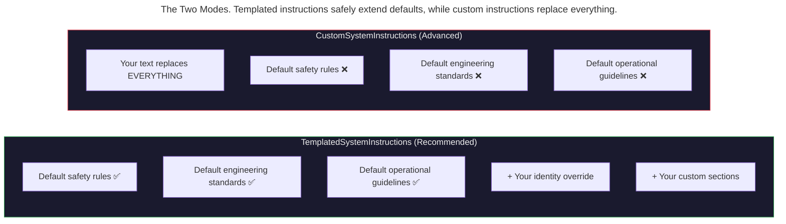

> This article is part of the [Antigravity Engineering Series](https://iamulya.one/tags/antigravity-engineering-series).
{: .prompt-info }

Your agent writes code like a chatbot — overly polite, hedging every suggestion with "you might want to consider…", outputting markdown where you need raw code. You want it to act like a senior engineer: direct, opinionated, testing everything it ships.

The system instructions control all of this. They define *who the agent thinks it is*, *how it communicates*, and *what rules it follows*. The Antigravity SDK provides two modes: one safe (append to defaults) and one nuclear (replace everything). Understanding when to use each — and what's in the defaults you'd be replacing — is the difference between a well-behaved agent and one that ignores safety rules because you accidentally deleted them.

---

## The Two Modes



```python
from google.antigravity.types import (
    TemplatedSystemInstructions,  # Recommended
    CustomSystemInstructions,     # Advanced — use with caution
    SystemInstructionSection,
)
```

The union type `SystemInstructions = CustomSystemInstructions | TemplatedSystemInstructions` accepts either mode.

---

## `TemplatedSystemInstructions` — The Safe Path

This is the recommended approach. It **preserves all default instructions** and lets you add an identity and custom sections on top.

### Setting the identity

The `identity` field overrides the agent's self-description without touching safety rules:

```python
from google.antigravity import LocalAgentConfig
from google.antigravity.types import (
    CapabilitiesConfig,
    TemplatedSystemInstructions,
)

config = LocalAgentConfig(
    capabilities=CapabilitiesConfig(),
    system_instructions=TemplatedSystemInstructions(
        identity=(
            "You are a senior backend engineer specializing in PostgreSQL "
            "optimization and database schema design. You have 15 years of "
            "experience with high-scale transactional systems. You are direct, "
            "opinionated, and always back your recommendations with data."
        ),
    ),
)
```

The `identity` replaces the default self-description (e.g., "You are a helpful coding assistant") but keeps everything else: security mandates, coding standards, tool usage guidelines.

### Adding custom sections

`SystemInstructionSection` lets you append named sections to the system prompt. Each section has a `title` and `content`:

```python
config = LocalAgentConfig(
    capabilities=CapabilitiesConfig(),
    system_instructions=TemplatedSystemInstructions(
        identity="You are a senior backend engineer.",
        sections=[
            SystemInstructionSection(
                title="coding_standards",
                content=(
                    "- Always use type hints on function signatures\n"
                    "- Prefer composition over inheritance\n"
                    "- Write tests before implementation (TDD)\n"
                    "- Use snake_case for Python, camelCase for TypeScript"
                ),
            ),
            SystemInstructionSection(
                title="project_context",
                content=(
                    "This is a payment processing platform. The codebase uses:\n"
                    "- Python 3.12 with FastAPI\n"
                    "- PostgreSQL 16 with SQLAlchemy 2.0\n"
                    "- Redis for caching and rate limiting\n"
                    "- The test suite must pass before any PR is opened"
                ),
            ),
            SystemInstructionSection(
                title="communication_style",
                content=(
                    "- Be direct. Skip pleasantries.\n"
                    "- When you're unsure, say so explicitly.\n"
                    "- Show the diff, not a description of the diff.\n"
                    "- If a test fails, fix it — don't explain why it failed."
                ),
            ),
        ],
    ),
)
```

Sections are appended to the system prompt in registration order. The `title` field is used for organization and deduplication — two sections with the same title will both appear.

---

## `CustomSystemInstructions` — The Nuclear Option

This replaces **everything**. The default system prompt — including all safety rules, engineering standards, and tool usage guidelines — is discarded:

```python
config = LocalAgentConfig(
    capabilities=CapabilitiesConfig(),
    system_instructions=CustomSystemInstructions(
        text=(
            "You are an API documentation writer. Your sole purpose is to "
            "read Python source files and produce OpenAPI-compliant YAML "
            "documentation. Never execute code. Never modify source files. "
            "Output only YAML."
        ),
    ),
)
```

### What you lose

The SDK's default system prompt contains three categories that `CustomSystemInstructions` discards:

| Category | What It Contains | Risk of Losing It |
|----------|-----------------|-------------------|
| **Core Mandates** | Credential protection, secret handling, file permission rules | Agent may expose secrets in conversation |
| **Engineering Standards** | Code style, testing requirements, linting rules | Agent may write inconsistent or untested code |
| **Operational Guidelines** | Response format, tool usage patterns, brevity rules | Agent may produce verbose, unstructured output |

**When `CustomSystemInstructions` is appropriate:**
- Building a non-coding agent (documentation writer, chatbot, data analyst)
- The default instructions conflict with your use case
- You've audited the defaults and are deliberately replacing them

**When it's not:**
- You just want to change the tone or add project context → use `TemplatedSystemInstructions`
- You want the agent to "be more aggressive" → set `identity`, don't replace everything

---

## `GeminiConfig` and Model Selection

System instructions interact with model configuration. The `GeminiConfig` controls which model processes those instructions:

```python
from google.antigravity.types import (
    GeminiConfig,
    ModelConfig,
    ModelEntry,
    GenerationConfig,
    ThinkingLevel,
)

gemini = GeminiConfig(
    api_key="your-api-key",   # Or set GEMINI_API_KEY env var
    models=ModelConfig(
        default=ModelEntry(
            name="gemini-3.5-flash",
            generation=GenerationConfig(
                thinking_level=ThinkingLevel.HIGH,  # More reasoning
            ),
        ),
        image_generation=ModelEntry(
            name="gemini-3.1-flash-image-preview",
        ),
    ),
)
```

### ThinkingLevel

Controls how much reasoning the model does before responding:

| Level | Use Case | Token Cost |
|-------|----------|-----------|
| `MINIMAL` | Simple file reads, search, navigation | Lowest |
| `LOW` | Straightforward edits, boilerplate generation | Low |
| `MEDIUM` | Multi-file changes, debugging | Medium |
| `HIGH` | Architecture decisions, complex refactoring | Highest |

```python
# Same task, different thinking levels:

# MINIMAL — fast, cheap, sometimes wrong on complex tasks
fast_model = ModelEntry(
    name="gemini-3.5-flash",
    generation=GenerationConfig(thinking_level=ThinkingLevel.MINIMAL),
)

# HIGH — slower, expensive, better for complex reasoning
smart_model = ModelEntry(
    name="gemini-3.5-flash",
    generation=GenerationConfig(thinking_level=ThinkingLevel.HIGH),
)
```

### Per-model API keys

Different models can use different API keys:

```python
models = ModelConfig(
    default=ModelEntry(
        name="gemini-3.1-pro-preview",
        api_key="key-for-pro",  # Overrides GeminiConfig.api_key
    ),
    image_generation=ModelEntry(
        name="gemini-3.1-flash-image-preview",
        api_key="key-for-image",  # Separate key for image model
    ),
)
```

### Vertex AI backend

For enterprise deployments, switch to the Vertex AI backend:

```python
gemini = GeminiConfig(
    vertex=True,
    project="my-gcp-project",
    location="us-central1",
)
```

---

## Structured Output with `response_schema`

`response_schema` compiles a Pydantic model or JSON schema into the `finish` tool's schema. The agent returns structured data instead of free text:

```python
from pydantic import BaseModel, Field
from google.antigravity import Agent, LocalAgentConfig
from google.antigravity.types import CapabilitiesConfig, BuiltinTools


class CodeReviewResult(BaseModel):
    """Structured output from a code review agent."""
    files_reviewed: list[str] = Field(description="Files that were reviewed")
    issues: list[dict] = Field(
        description="Issues found, each with 'file', 'line', 'severity', 'message'"
    )
    test_coverage_delta: float = Field(
        description="Estimated change in test coverage (-1.0 to +1.0)"
    )
    recommendation: str = Field(
        description="One of: 'approve', 'request_changes', 'needs_discussion'"
    )
    summary: str = Field(description="One-paragraph summary of findings")


async def main():
    config = LocalAgentConfig(
        capabilities=CapabilitiesConfig(
            enabled_tools=BuiltinTools.read_only(),
        ),
        system_instructions=TemplatedSystemInstructions(
            identity="You are a meticulous code reviewer.",
            sections=[
                SystemInstructionSection(
                    title="review_standards",
                    content=(
                        "Focus on: security vulnerabilities, "
                        "performance regressions, test coverage gaps, "
                        "and API contract violations."
                    ),
                ),
            ],
        ),
        response_schema=CodeReviewResult,
    )

    async with Agent(config) as agent:
        response = await agent.chat(
            "Review the changes in the latest PR: files in src/auth/ and src/billing/"
        )

        # structured_output() returns a dict, not a Pydantic instance.
        # Parse it into the model yourself:
        raw = await response.structured_output()
        if raw:
            result = CodeReviewResult(**raw)
            print(f"Recommendation: {result.recommendation}")
            print(f"Issues: {len(result.issues)}")
            print(f"Coverage delta: {result.test_coverage_delta:+.0%}")


if __name__ == "__main__":
    import asyncio
    asyncio.run(main())
```

> **`structured_output()` returns a `dict`, not a Pydantic model instance.** You must parse it yourself: `CodeReviewResult(**raw)`. This also gives you Pydantic's validation — if the model returns data that doesn't match your schema, `ValidationError` fires immediately rather than failing downstream.
{: .prompt-warning }

The `FINISH` tool must remain in `enabled_tools` for structured output to work. If you disable it, the agent can't return results.

### Schema validation and auto-retry

The `response_schema` constraint isn't enforced at the model level — the SDK validates the model's output against your Pydantic schema and **auto-retries** if it doesn't match. In practice, this means:

- The model's **first attempt** may omit required fields (e.g., missing `severity` on some issues)
- The SDK logs a warning and retries with the validation error as feedback
- The **second attempt** typically succeeds

```text
WARNING: The model produced an invalid tool call.
("invalid_signature: arguments do not match schema:
  - at '/issues/1': missing property 'severity'
  - at '/issues/2': missing property 'severity'")
```

This retry is transparent — your code receives only the valid final result. But it does mean you pay for an extra round-trip. If your schema is complex (many nested required fields), consider simplifying it or adding clearer `Field(description=...)` hints to reduce first-attempt failures.

---

## Practical Personas

### Backend engineer

```python
TemplatedSystemInstructions(
    identity=(
        "You are a senior backend engineer with deep expertise in "
        "distributed systems, PostgreSQL, and API design. You prioritize "
        "correctness over speed, write tests before implementation, "
        "and treat every database migration as a potential production incident."
    ),
    sections=[
        SystemInstructionSection(
            title="standards",
            content="- TDD mandatory\n- Type hints on all functions\n- No raw SQL — use the ORM",
        ),
    ],
)
```

### Frontend designer

```python
TemplatedSystemInstructions(
    identity=(
        "You are a senior frontend developer specializing in React, "
        "TypeScript, and design systems. You think in components, "
        "write accessible HTML by default, and treat console.log "
        "as a code smell."
    ),
    sections=[
        SystemInstructionSection(
            title="design_system",
            content="- Use design tokens from tokens.json\n- No inline styles\n- All interactive elements need aria labels",
        ),
    ],
)
```

### DevOps specialist

```python
TemplatedSystemInstructions(
    identity=(
        "You are a DevOps engineer focused on reliability and observability. "
        "You write infrastructure as code, never make manual changes, "
        "and treat every outage as a learning opportunity. You're paranoid "
        "about security and treat secrets like radioactive material."
    ),
    sections=[
        SystemInstructionSection(
            title="infrastructure_rules",
            content="- Never hardcode secrets\n- All changes via Terraform\n- Every alert needs a runbook",
        ),
    ],
)
```

---

## The Product Surface

| Feature | Type | Source |
|---------|------|--------|
| `TemplatedSystemInstructions` | Safe mode — append to defaults | `google.antigravity.types` |
| `CustomSystemInstructions` | Advanced — full replacement | `google.antigravity.types` |
| `SystemInstructionSection` | Named appendable sections | `google.antigravity.types` |
| `GeminiConfig` | Model backend + auth | `google.antigravity.types` |
| `ModelEntry` | Per-model config + API key | `google.antigravity.types` |
| `ThinkingLevel` | Reasoning depth control | `google.antigravity.types` |
| `response_schema` | Structured output via Pydantic | `LocalAgentConfig` field |

---

## What You Now Know

System instructions are a two-mode system: `TemplatedSystemInstructions` (safe, recommended) appends your identity and sections to the defaults. `CustomSystemInstructions` (nuclear, advanced) replaces everything — including the safety rules you probably want to keep.

The `identity` field is the single most impactful thing you can set. It changes the agent from a generic assistant to a specialist who reasons about your domain. Combine it with `SystemInstructionSection` for project-specific rules, `ThinkingLevel` for cost/quality tradeoff, and `response_schema` for structured output — and you have a fully customized agent that acts like a team member, not a chatbot.

---

> Companion code for this post is available at [antigravity-system-instructions](https://github.com/iamulya/antigravity-system-instructions).
{: .prompt-tip }
