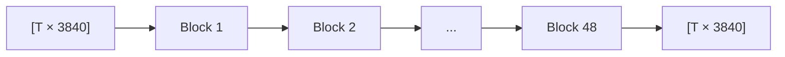

When you send a message to an LLM, it runs a very specific sequence of matrix multiplications. Not approximately — *exactly*. Every number that flows through the model has a precise shape at every point.

This article traces all of it: from raw text to a sampled token, tracking exact tensor dimensions at each step. We use **Gemma 4 12B** as the concrete reference — the same model from the [attention mechanisms](/posts/attention-mechanisms-and-kv-architectures) and [quantization](/posts/a-quantization-primer) articles — with dimensions pulled directly from its `config.json`.

---

## The Two Modes: Prefill and Decode

An LLM inference run has two distinct phases:

**Prefill**: The full prompt is processed in one shot. All `T` tokens move through the model in parallel. The Key and Value matrices for every token in every layer are computed and stored in the KV cache.

**Decode**: One new token is generated at a time. Each decode step processes only **1 token**, but uses the stored KV cache to attend over all `T_prev` previous tokens.

This article traces **one decode step** in detail. Where shapes differ between prefill and decode, both are shown.

> **Analogy**: Prefill is reading the whole question before answering. Decode is composing your reply one word at a time, glancing back at the question as you go.
{: .prompt-tip }

---

## Gemma 4 12B Reference Dimensions

Everything that follows uses these exact values from the [actual `config.json`](https://huggingface.co/google/gemma-4-12b-it):

| Symbol | Value | Meaning |
|---|---|---|
| `d_model` | 3,840 | Width of every hidden state vector — also the size of each embedding vector |
| `n_layers` | 48 | Transformer blocks (40 local + 8 global) |
| `n_heads` | 16 | Query heads per layer |
| `n_kv_heads` | 8 | KV heads, local/sliding layers (GQA, 2:1) |
| `n_global_kv_heads` | 1 | KV heads, global layers (MQA) |
| `d_head` | 256 | Per-head dimension, local layers |
| `d_global_head` | 512 | Per-head dimension, global layers |
| `d_ff` | 15,360 | FFN intermediate width |
| `sliding_window` | 1,024 | Max tokens seen by local layers |
| `vocab_size` | 262,144 | Number of distinct tokens |

The 48 layers follow a **5:1 pattern**: five local (sliding-window) layers, then one global (full-attention) layer, repeated 8 times.

---

## Stage 0: Raw Text → Token IDs

The tokenizer converts your text into a sequence of integers. It never sees whole words — it uses **Byte Pair Encoding (BPE)**, which splits text into subword pieces learned during training.

```
Input:   "The Eiffel Tower is in Paris"
Tokens:  ["The", " Eiffel", " Tower", " is", " in", " Paris"]
IDs:     [651, 115369, 13522, 603, 575, 5470]

Shape:   [6]   ← a list of 6 integers, nothing more
```

During decode, only the most recently generated token is fed in:

```
Shape (prefill): [T]     ← all T prompt tokens
Shape (decode):  [1]     ← the single new token
```

**No maths happen here.** The tokenizer is a lookup table.

> **Analogy**: Token IDs are barcodes. "Paris" scans to barcode 5470. The model never reads the word — only the number.
{: .prompt-tip }

---

## Stage 1: Token IDs → Embeddings

The **embedding matrix** `E` has one row per token in the vocabulary. Each row is a 3,840-dimensional vector the model learned during training to represent that token.

```
Shape of E:  [262,144 × 3,840]   ← one row per token in the vocabulary

Token ID 5470  →  row 5470 of E  →  a vector of 3,840 floats
```

For a full prompt:

```
Shape (prefill): [6]       →  [6 × 3,840]    ← 6 embedding vectors
Shape (decode):  [1]       →  [1 × 3,840]    ← 1 embedding vector
```

This is a **table lookup**, mathematically equivalent to: `one_hot(token_id, 262144) @ E`.

> **Analogy**: The embedding matrix is a dictionary where every word's "definition" is a 3,840-dimensional numerical description — learned from billions of examples. Looking up "Paris" gives you a vector that has learned to encode concepts like city, France, proper noun, and everything else the model associates with it.
{: .prompt-tip }

> **Note**: Gemma 4 sets `tie_word_embeddings = true`. The embedding matrix `E` and the final LM head matrix are the **same tensor**. The model learns one shared representation that works both for input lookup and output scoring.
{: .prompt-info }

---

## Stage 2: Through 48 Transformer Blocks

The hidden state — a matrix of shape `[T × 3840]`, where **T is the number of tokens being processed** — now passes through 48 transformer blocks. During prefill, T equals the full prompt length. During every decode step, **T = 1**: only the single new token moves through the model (all previous tokens are already in the KV cache). The key insight is:

> **The shape entering a transformer block and the shape exiting it are always the same.**

Every block takes `[T × 3840]` and returns `[T × 3840]`. The 48 blocks don't change dimensions — they refine meaning.



> **Analogy**: A transformer block is like an editorial pass over a manuscript. After each pass, the manuscript has the same number of pages (same shape), but the content has been revised — ideas refined, context integrated.
{: .prompt-tip }

Inside each block, the structure is:

```
input:  x                                            ← shape [T × 3840]

x = x + Attention(RMSNorm(x))   ← attend, then add back (residual)
x = x + FFN(RMSNorm(x))         ← transform, then add back (residual)

output: x                                            ← shape [T × 3840], unchanged
```

Let's unpack each component.

---

### RMSNorm

Before attention and before the FFN, the hidden state is normalised with **Root Mean Square Normalization**.

```
In:  [T × 3840]
Out: [T × 3840]   ← same shape, values rescaled
```

For each token's 3,840-dim vector, compute its RMS (a single number), divide every element by it, then multiply by a learned scale vector `γ` of shape `[3840]`:

```
rms   = sqrt( mean(x²) )            ← one scalar per token
x_hat = x / rms                      ← normalised vector
out   = x_hat × γ                    ← learned rescaling
```

RMSNorm has `3,840` learnable parameters (the scale vector `γ`). There are two RMSNorms per block (one before attention, one before FFN) → `2 × 48 = 96` RMSNorms total, plus one final one after all blocks.

> **Analogy**: RMSNorm is a volume normaliser. The music (information) is unchanged — only the amplitude is standardised so no single dimension dominates downstream operations.
{: .prompt-tip }

---

### Self-Attention

This is where tokens look at each other. The full computation breaks into seven steps.

> **Notation used in the code blocks below**: `A @ B` means matrix multiplication (multiplying matrix A by matrix B). `→` shows the output shape. `←` is a comment. These blocks are pseudocode, not runnable Python.
{: .prompt-info }


#### Step 1: Q, K, V Projections

Each token's hidden vector is linearly projected into three roles: **Query** (what am I looking for?), **Key** (what do I contain?), **Value** (what do I give to others?).

Gemma 4 12B has two attention configurations depending on layer type:

**Local (sliding window) layers** — 40 of the 48 blocks:

```
x:    [T × 3840]
W_Q:  [3840 × 4096]   ← 16 heads × 256 d_head
W_KV: [3840 × 2048]   ← 8 KV heads × 256 d_head  (Gemma 4 only: K and V share one matrix)

step 1 — multiply:   Q = x @ W_Q            → [T × 4096]
step 2 — split heads: Q into 16 groups       → [T × 16 × 256]  (16 × 256 = 4096 ✓)

step 1 — multiply:   K = x @ W_KV           → [T × 2048]
step 2 — split heads: K into 8 groups        → [T × 8 × 256]   (8 × 256 = 2048 ✓)
V = K                ← K equals V (not standard — most models use separate W_K and W_V)
```

Each projection is two operations: a matrix multiply that produces a flat result, followed by splitting that result into per-head slices. No data is copied in the split — it is a reinterpretation of the same numbers already in memory.

The `attention_k_eq_v = true` flag means **K and V are the same tensor** in local layers. One projection, half the KV cache.

**Global (full attention) layers** — 8 of the 48 blocks:

```
x:   [T × 3840]
W_Q: [3840 × 8192]   ← 16 heads × 512 d_global_head
W_K: [3840 × 512]    ← 1 KV head × 512 d_global_head  (MQA)
W_V: [3840 × 512]    ← 1 KV head × 512 d_global_head

step 1 — multiply:   Q = x @ W_Q            → [T × 8192]
step 2 — split heads: Q into 16 groups       → [T × 16 × 512]  (16 × 512 = 8192 ✓)

step 1 — multiply:   K = x @ W_K            → [T × 512]
step 2 — split heads: K into 1 group         → [T × 1 × 512]

step 1 — multiply:   V = x @ W_V            → [T × 512]
step 2 — split heads: V into 1 group         → [T × 1 × 512]
```

Global layers use **MQA** (Multi-Query Attention) — just a single KV head serves all 16 query heads.


#### Step 2: Head Structure

After the reshape, the flat result is now organised into heads — each head has its own 256-dimensional slice of the Q tensor to work with independently:

```
Local layer:
  Q: [T × 16 × 256]  — 16 heads, each with a 256-dim query vector per token
  K: [T × 8 × 256]   — 8 KV groups; each group serves 2 query heads (GQA 2:1)

Global layer:
  Q: [T × 16 × 512]  — 16 independent query heads, each with 512 dims
  K: [T × 1 × 512]   — 1 KV head shared by all 16 query heads (MQA)
```

No data is copied in this step — splitting into heads is purely a reinterpretation of the same memory block.

#### Step 3: RoPE — Baking Position into Q and K

Transformers are position-agnostic by default. **Rotary Position Embedding (RoPE)** fixes this by rotating the Q and K vectors based on their position in the sequence.

The rotation angle depends on position `t` and a base frequency `θ`. A higher `θ` creates slower rotations — needed to distinguish positions that are far apart without the angles wrapping around.

Gemma 4 uses different RoPE configs per layer type:

```
Local layers:   rope_theta = 10,000   (standard, up to 1,024 tokens)
Global layers:  rope_theta = 1,000,000 (extended, up to 262,144 tokens)
                partial_rotary_factor = 0.25
                → only 512 × 0.25 = 128 of the 512 head dims get RoPE
                → the other 384 dims carry no positional encoding
```

The 75% non-rotated dims in global layers carry purely semantic content — at very long context lengths, blending too much positional information into every dimension degrades recall.

**Shape is unchanged by RoPE** — it's a rotation applied to Q and K vectors in-place.

#### Step 4: KV Cache Update

During decode, K and V from previous steps are already stored. The current step adds one new row:

```
(Decode, local layer)
K cache before: [T_prev × 8 × 256]           ← all past tokens, bounded by sliding window
New K:          [1 × 8 × 256]                ← current token
K cache after:  [min(T_prev+1, 1024) × 8 × 256]   ← window caps at 1024

V cache: same shape as K cache               ← for local layers, V = K, so only one
                                                  copy is stored (not two separate tensors)

(Decode, global layer)
K cache before: [T_prev × 1 × 512]
New K:          [1 × 1 × 512]
K cache after:  [(T_prev+1) × 1 × 512]       ← no cap, grows with context

V cache before: [T_prev × 1 × 512]           ← V is separate from K in global layers
New V:          [1 × 1 × 512]
V cache after:  [(T_prev+1) × 1 × 512]
```

During prefill, all T tokens compute and store their K (and V, which follows the same shape as K) in one pass.

#### Step 5: Attention Scores

For each query head, compute a dot product against all keys it can see, scale, and softmax. Taking one local-layer head as an example (decode step):

```
Q for one head: [1 × 256]          ← the new token's query
K for all:      [T_window × 256]   ← keys in the sliding window (≤ 1024)

scores = Q @ Kᵀ    → [1 × T_window]   ← one score per past token
scores /= √256                          ← scale by √d_head (prevents vanishing gradients)
scores = softmax(scores) → [1 × T_window]  ← probabilities, sum = 1
```

The `√d_head` scaling is necessary: with 256-dimensional vectors, raw dot products grow large, pushing softmax into near-zero gradient regions.

**Prefill**: compute `[T × T]` scores per head (causal masking zeros out the upper triangle so token `i` only attends to tokens `0..i`).

**Decode**: compute `[1 × T_window]` per head — just one row. This is why decode is so much cheaper than prefill.

> **Analogy**: The attention scores are like a relevance vote. "How much does the word I'm generating now relate to each past word?" The softmax turns raw votes into a probability distribution over past tokens.
{: .prompt-tip }

#### Step 6: Weighted Sum of Values

The attention probabilities are used to take a weighted average of the Value vectors:

```
scores: [1 × T_window]        ← probabilities over past tokens
V:      [T_window × 256]      ← value vectors for each past token

context = scores @ V   → [1 × 256]   ← a single vector blending past information
```

This is done independently for each head. After all 16 heads compute their contexts, concatenate:

```
Local layer:  [1 × 16 heads × 256]  →  reshape  →  [1 × 4096]
Global layer: [1 × 16 heads × 512]  →  reshape  →  [1 × 8192]
```

**GQA in local layers**: 16 query heads share 8 KV heads (2:1 ratio). Heads 0–1 share KV group 0, heads 2–3 share KV group 1, etc. Each group of 2 query heads attends to the same K and V.

**MQA in global layers**: All 16 query heads share the single KV head. Each head computes its own Q but they all attend to the same K and V.

#### Step 7: Output Projection

Project the concatenated heads back to `d_model`:

```
Local layer:
W_O: [4096 × 3840]
[1 × 4096] @ [4096 × 3840] → [1 × 3840]

Global layer:
W_O: [8192 × 3840]
[1 × 8192] @ [8192 × 3840] → [1 × 3840]
```

The attention sublayer is done. Shape: `[T × 3840]` — which is `[1 × 3840]` during decode (T = 1), or `[T × 3840]` during prefill where T equals the full prompt length.

---

### Residual Connection

The attention output is added back to the input that went into RMSNorm:

```
x = x_before_attention + attention_output
  = [1 × 3840] + [1 × 3840]
  = [1 × 3840]   (element-wise sum)
```

> **Analogy**: A highway bypass. The attention sublayer is one lane — it processes information and returns a result. The residual is the original highway that runs in parallel. The merge point adds both together. This allows early layers to pass raw signal through to later layers without it being destroyed by each transformation.
{: .prompt-tip }

Without residual connections, the gradient signal would vanish through 48 layers during training. With them, each layer only needs to learn a small *correction* to the existing representation.

---

### FFN — The Feed-Forward Network (GeGLU)

After the second RMSNorm, the hidden state passes through the Feed-Forward Network. Gemma 4 uses **GeGLU** (Gated Linear Unit with GELU activation) — structurally the same as the widely-used SwiGLU but with GELU instead of SiLU.

The FFN has three weight matrices:

```
W_gate: [3840 × 15360]
W_up:   [3840 × 15360]
W_down: [15360 × 3840]
```

The computation:

```
gate   = x @ W_gate               [1×3840] @ [3840×15360]  →  [1×15360]
up     = x @ W_up                 [1×3840] @ [3840×15360]  →  [1×15360]

hidden = GELU(gate) × up          element-wise product      →  [1×15360]

out    = hidden @ W_down          [1×15360] @ [15360×3840]  →  [1×3840]
```

> **Simplification note**: The shapes above show a single token (the decode case). During prefill, the same weight matrices process all T token vectors at once — `[T×3840] @ [3840×15360] → [T×15360]` — because the matrix multiply naturally handles any number of rows. There is, however, a critical difference from attention: **the FFN never mixes information between tokens**. Each token's vector is transformed entirely on its own using the same weights. Attention is the only operation that gathers information across positions.
{: .prompt-info }

**Why three matrices instead of two?**

A classic FFN would just be:
```
hidden = GELU(x @ W_1)   [1 × d_ff]
out    = hidden @ W_2    [1 × d_model]
```

The gating variant adds a *gate* that controls which dimensions of the expanded representation survive. For each of the 15,360 dimensions in the expanded space:

- `up` computes the candidate value: "here is the feature"
- `GELU(gate)` computes a soft switch: "here is how much this feature matters"
- Their product is the gated output: "here is the feature, weighted by its relevance"

**GELU vs SiLU**: Both are smooth, non-linear activation functions with near-zero output for very negative inputs and near-linear output for large positive inputs. GELU (used in Gemma) has a slightly different curve shape from SiLU (used in Llama 3), but the architectural role is identical. The suffix "glu" in both GeGLU and SwiGLU refers to the *gating structure*, not the specific activation.

```
SwiGLU (Llama): GELU(gate) × up
GeGLU  (Gemma): GELU(gate) × up   ← same structure, different activation name
```

**Parameter count for one FFN block:**

```
3 × (3840 × 15360) = 3 × 58,982,400 = 176,947,200 ≈ 177M parameters
```

The FFN contains **more parameters than the attention sublayer** in every layer. For a local layer:
- Attention (Q+KV+O): `3840×4096 + 3840×2048 + 4096×3840` ≈ 47M
- FFN: ≈ 177M

The FFN is where the model stores most of its "knowledge" — attention decides *what to look at*, FFN decides *what to do with it*.

> **Analogy**: The FFN is a specialist library. Attention identifies the relevant books; the FFN opens them, selects the relevant paragraphs (gating), combines their insights (element-wise product), and writes a concise summary (down projection).
{: .prompt-tip }

**What about Mixture of Experts (MoE)?**

The Gemma 4 family is not all dense. The **26B-A4B** variant replaces the single FFN in each block with a pool of multiple smaller expert FFNs. A small router network looks at each token's hidden state and picks a fixed number of experts (typically 2–4 out of, say, 32 total). Only the selected experts run; the rest are skipped entirely.

```
Dense FFN (this article — Gemma 4 12B):
  one FFN per block: gate + up + down (3 matrices)

MoE FFN (Gemma 4 26B-A4B):
  router → selects top-k experts from N total
  each expert: its own gate + up + down (smaller d_ff per expert)
  weighted sum of their outputs → [T × d_model]
```

The name **26B-A4B** captures exactly this trade-off: 26 billion total parameters across all experts in all layers, but only ~4 billion are *active* (computed) for any given token. This gives the model the capacity of a 26B model at roughly the inference cost of a 4B one. The FFN dimensions per expert are smaller than a dense FFN of equivalent total parameter count, because cost is paid only for the activated experts.

The 12B model covered in this article has `enable_moe_block: false` — every token runs through the same single FFN in every layer. All 177M FFN parameters per block are active, all the time.

After the FFN output, the second residual connection adds it back:

```
x_before_ffn: [1 × 3840]   ← hidden state entering the FFN sublayer
ffn_output:   [1 × 3840]   ← result of gate/up/down projection

x = x_before_ffn + ffn_output   → [1 × 3840]   (element-wise sum, decode step)
```

The transformer block is complete. The hidden state has the same shape as when it entered: `[T × 3840]` — `[1 × 3840]` for decode, `[T × 3840]` for prefill.

---

## Stage 3: Final RMSNorm

After all 48 blocks, one more normalisation:

```
In:  [T × 3840]
Out: [T × 3840]   ← normalised, ready for the LM head
```

---

## Stage 4: LM Head → Logits

The LM head converts the final hidden state into a score for every token in the vocabulary. Because Gemma 4 sets `tie_word_embeddings = true`, this is just the embedding matrix transposed:

```
W_lm_head = Eᵀ   [3840 × 262,144]   ← same weights, transposed

[T × 3840] @ [3840 × 262,144] → [T × 262,144]
```

During prefill this produces logits for all T tokens, but only the **last row** is used — the score for what comes after the final token in the prompt. During decode (T = 1) the single row is the only one, so no row selection is needed.

Each of the 262,144 values is a **logit** — a raw score for how likely that token is to come next.

**Gemma-specific: Logit Soft-Capping**

Before anything else, Gemma applies a soft cap to prevent extreme logit values from dominating:

```
logits = 30.0 × tanh(logits / 30.0)
```

This clips logits to the range `(−30, +30)` with a smooth function rather than a hard clip. A logit of 100 becomes `30 × tanh(100/30) ≈ 30 × 1.0 = 30`. A logit of 5 becomes `30 × tanh(5/30) ≈ 4.93` — barely changed.

> Why soft-cap? Without it, a single very high logit can push all other probabilities to near-zero through the softmax, making the distribution extremely peaked. Soft-capping tames outlier logits while leaving moderate ones nearly untouched.
{: .prompt-info }

Output shape: `[1 × 262,144]` — 262,144 raw scores.

---

## Stage 5: Temperature Scaling + Softmax

**Temperature** controls randomness. Scale the logits before softmax:

```
scaled_logits = logits / temperature

temperature = 0.0:  special case — division by zero, so frameworks skip sampling
                    entirely and just return the highest-scoring token (greedy / argmax)
temperature = 1.0:  unchanged — sample from the model's raw distribution
temperature < 1.0:  sharpened — high-probability tokens get relatively higher
temperature > 1.0:  flattened — probabilities become more uniform
```

**Softmax** converts scores to probabilities:

```
p_i = exp(logit_i) / Σ exp(logit_j)   for all j in vocab

Input:  [262,144]  ← logits (any real value)
Output: [262,144]  ← probabilities (all positive, sum = 1.0)
```

The highest-probability token might be "Paris" with `p = 0.34`, followed by "Rome" with `p = 0.18`, and so on across all 262,144 tokens.

> **Analogy**: Temperature is a confidence dial. At 0, the model answers like an exam student who only writes what they're certain of — the single highest-scoring token, every time, no variation. At 1.0, it answers honestly: probable tokens appear often, unlikely ones rarely but occasionally. Turned up high, it answers like a random word generator — all tokens become nearly equally likely, regardless of what the model actually learned.
{: .prompt-tip }

---

## Stage 6: Sampling → Next Token

**Top-k sampling**: Keep only the `k` highest-probability tokens, renormalise, sample.

**Top-p (nucleus) sampling**: Keep the smallest set of tokens whose probabilities sum to ≥ `p`, renormalise, sample.

```
probabilities:  [262,144]
After top-p=0.9:  keep the top tokens summing to 90% of probability mass
Renormalise:    kept tokens now sum to 1.0
Sample:         draw one token ID according to these probabilities

Output: a single integer (e.g., 5470 = "Paris")
```

The integer 5470 is decoded back to the string "Paris" via the tokeniser's vocabulary. It is appended to the context. The entire process repeats from Stage 1 — but now with `T_prev + 1` tokens in the KV cache, and only the new token as input.

---

## The Full Dimension Map

```mermaid
flowchart TD
    INPUT["Text input<br/>'The Eiffel Tower is in Paris'"]
    TOK["Tokenizer — BPE<br/>output shape: [T]"]
    EMBED["Embedding lookup  E: [262,144 × 3,840]<br/>output shape: [T × 3,840]<br/>prefill: T = prompt length · decode: T = 1"]

    subgraph BLOCK["Repeat × 48 Transformer Blocks"]
        RN1["① RMSNorm<br/>[T × 3,840] → [T × 3,840]"]
        QKVP["② Q / K / V Projections<br/>Q local → [T × 16 × 256]<br/>K=V local → [T × 8 × 256]  (Gemma 4: K equals V)<br/>Q global → [T × 16 × 512]<br/>K,V global → [T × 1 × 512]"]
        ROPE["③ RoPE positional encoding<br/>shape unchanged"]
        KVC["④ KV Cache append<br/>Local: sliding window, max [1,024 × 8 × 256]<br/>Global: grows by 1 each decode step"]
        ATTN["⑤ Attention scores<br/>Prefill: [T × T] · Decode: [1 × T_cache]<br/>→ softmax → weighted sum of V"]
        OPROJ["⑥ Output projection → [T × 3,840]"]
        RES1["⑦ Residual add → [T × 3,840]"]
        RN2["⑧ RMSNorm → [T × 3,840]"]
        FFN["⑨ GeGLU FFN<br/>gate, up: [T × 15,360]<br/>GELU(gate) × up → [T × 15,360]<br/>down projection → [T × 3,840]"]
        RES2["⑩ Residual add → [T × 3,840]"]
    end

    FNORM["Final RMSNorm → [T × 3,840]"]
    LMHEAD["LM Head  W = Eᵀ: [3,840 × 262,144]<br/>output: logits [T × 262,144]"]
    SOFTCAP["Soft-cap 30 × tanh(logit/30)<br/>Temperature scaling · Softmax<br/>output: probabilities [T × 262,144]"]
    SAMPLE["Top-p sampling<br/>→ 1 token ID → text"]

    INPUT --> TOK --> EMBED --> RN1
    RN1 --> QKVP --> ROPE --> KVC --> ATTN --> OPROJ --> RES1 --> RN2 --> FFN --> RES2
    RES2 --> FNORM --> LMHEAD --> SOFTCAP --> SAMPLE
```



---

## Prefill vs. Decode: Side by Side

| Stage | Prefill shape | Decode shape | Note |
|---|---|---|---|
| After tokenizer | `[T]` | `[1]` | — |
| After embedding | `[T × 3840]` | `[1 × 3840]` | — |
| Q (local layer) | `[T × 16 × 256]` | `[1 × 16 × 256]` | — |
| K/V (local, new) | `[T × 8 × 256]` | `[1 × 8 × 256]` | — |
| K cache (local, total) | `[T × 8 × 256]` | `[≤1024 × 8 × 256]` | Window bounded |
| K cache (global, total) | `[T × 1 × 512]` | `[(T_prev+1) × 1 × 512]` | Grows unbounded |
| Attention scores (local) | `[T × T]` | `[1 × T_window]` | Causal mask in prefill |
| After FFN | `[T × 3840]` | `[1 × 3840]` | — |
| After LM head | `[T × 262,144]` | `[1 × 262,144]` | Only last row used |
| Sampled token | 1 integer | 1 integer | — |

Prefill processes all `T` tokens in parallel — the attention matrix is `[T × T]`, which is why long contexts are expensive. Decode is cheap per step: the attention is just `[1 × T_window]` — one row.

---

## Case Study: What Makes Gemma 4 12B's Dimension Flow Unusual

Having traced the generic decoder pass, here's what's architecturally distinctive about Gemma 4 12B vs. a standard transformer:

### 1. Two completely different attention configurations

Most models have one attention type. Gemma 4 12B has two:

| | Local layer (×40) | Global layer (×8) |
|---|---|---|
| W_Q shape | [3840 × 4096] | [3840 × 8192] |
| W_K shape | [3840 × 2048] | [3840 × 512] |
| W_V shape | same as W_K | [3840 × 512] |
| W_O shape | [4096 × 3840] | [8192 × 3840] |
| KV head count | 8 (GQA 2:1) | 1 (MQA) |
| KV per token | `8 × 256 = 2,048 floats` | `1 × 512 = 512 floats` |
| Context window | 1,024 tokens | 256,144 tokens |

The KV cache for global layers is expensive per-slot (512 dims) but there are only 8 global layers. The KV cache for local layers is cheap per-slot but bounded to 1024 tokens regardless of context length.

### 2. K=V sharing halves local KV cache

Because `attention_k_eq_v = true` for local layers, a single `[3840 × 2048]` projection generates both K and V — one tensor is used twice. This halves the weight count for local KV projections and halves the KV cache storage for those layers.

### 3. The embedding and LM head share weights

`tie_word_embeddings = true` means the model has **one fewer large matrix** to store. The `[262,144 × 3840]` embedding matrix `E` is used at the start (lookup) and its transpose `Eᵀ [3840 × 262,144]` at the end (LM head). Same memory, used twice.

This is common in smaller models; larger models often untie them to allow the output projection to specialise.

### 4. Logit soft-capping before softmax

Most decoders go straight from logits to softmax. Gemma 4 inserts:

```python
logits = 30.0 * torch.tanh(logits / 30.0)
```

This is a learned architectural choice — the `30.0` is a hyperparameter baked into the model design. It prevents the model from becoming over-confident on any single token by clipping extreme logit values.

### 5. Partial RoPE in global layers

In standard transformers, all head dimensions get positional encoding. In global layers, Gemma 4 only encodes position in `0.25 × 512 = 128` of the 512 head dimensions. The other 384 dimensions carry purely semantic information.

At context lengths of 100K+, mixing too much positional encoding into every dimension can interfere with semantic similarity — tokens far apart positionally may be semantically identical, and the rotated vectors may score them as dissimilar. Partial RoPE keeps a "pure" semantic subspace.

---

## Parameter Count: Where Does 12B Come From?

Now that we have all the shapes, we can verify the 12B parameter count:

```
Embedding (shared with LM head):   262,144 × 3,840        ≈  1,007M

Per LOCAL layer (×40):
  Q projection:    3,840 × 4,096                          =   15.7M
  KV projection:   3,840 × 2,048  (shared K=V)            =    7.9M
  O projection:    4,096 × 3,840                          =   15.7M
  FFN (3 matrices):  3 × 3,840 × 15,360                   =  176.9M
  RMSNorm (×2):    2 × 3,840                              =    0.008M
  Subtotal:                                               ≈  216.2M
  × 40 layers:                                            ≈  8,648M

Per GLOBAL layer (×8):
  Q projection:    3,840 × 8,192                          =   31.5M
  K projection:    3,840 × 512                            =    2.0M
  V projection:    3,840 × 512                            =    2.0M
  O projection:    8,192 × 3,840                          =   31.5M
  FFN (3 matrices):  3 × 3,840 × 15,360                   =  176.9M
  RMSNorm (×2):    2 × 3,840                              =    0.008M
  Subtotal:                                               ≈  243.9M
  × 8 layers:                                             ≈  1,951M

Final RMSNorm:                                            ≈    0.004M

Total:  1,007M + 8,648M + 1,951M ≈ 11,606M ≈ 11.6B ✓
```

The small discrepancy (~400M) comes from bias terms, normalisation scales, and vision/audio encoder components included in the full multimodal model.

---

## Further Reading

- [Gemma 4 12B config.json](https://huggingface.co/google/gemma-4-12b-it) — All dimensions used in this article
- [*Attention Is All You Need*](https://arxiv.org/abs/1706.03762) — Original transformer paper
- [*GLU Variants Improve Transformers*](https://arxiv.org/abs/2002.05202) — SwiGLU and GeGLU (Noam Shazeer, 2020)
- [*RoFormer: Enhanced Transformer with Rotary Position Embedding*](https://arxiv.org/abs/2104.09864) — RoPE
- [*GQA: Training Generalized Multi-Query Transformer Models*](https://arxiv.org/abs/2305.13245) — Grouped-Query Attention
- [Attention Mechanisms and KV Cache](/posts/attention-mechanisms-and-kv-architectures) — How the KV cache and GQA/MQA fit into the bigger picture
- [A Quantization Primer](/posts/a-quantization-primer) — How the weight matrices and KV cache in this article are quantized for serving
