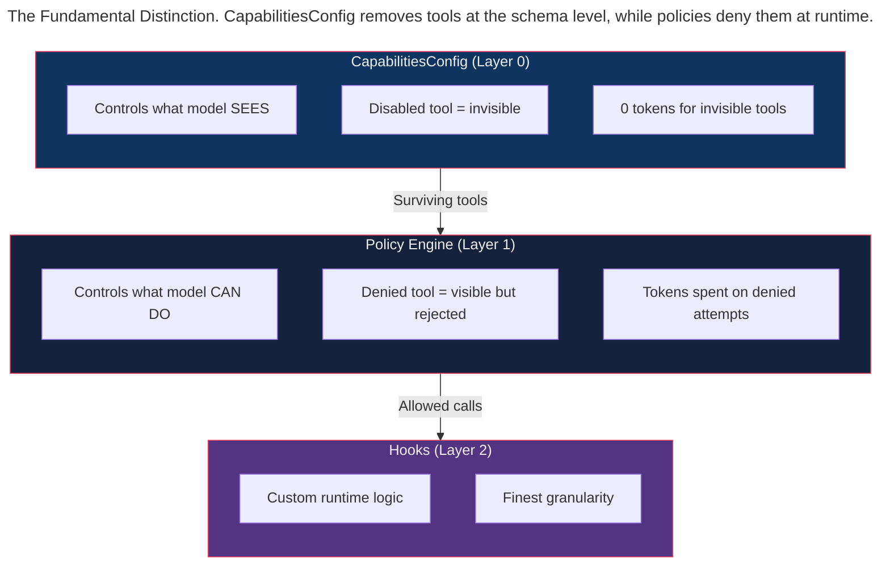

> This article is part of the [Antigravity Engineering Series](https://iamulya.one/tags/antigravity-engineering-series).
{: .prompt-info }

Your agent has access to 15 tools. It's a code reviewer — it only needs `view_file`, `grep_search`, and `list_dir`. The other 12 tools (shell access, file creation, subagents, image generation) are irrelevant. You have two options:

1. Use `policy.deny()` to block the 12 tools
2. Use `CapabilitiesConfig.disabled_tools` to remove them entirely

Both achieve the same functional outcome: the agent can't use those tools. But option 1 costs you ~1,600 extra tokens per turn for tool schemas the model will never use. Over a 40-turn review session, that's **64,000 wasted tokens**.

The difference seems cosmetic until you examine it architecturally. This post explains when to use each approach — and why the distinction matters for cost, reliability, and agent behavior. If you've ever debated whether to remove an API endpoint from a service contract versus protecting it with authorization, you'll recognize the tradeoff.

---

## The Fundamental Distinction



| | `disabled_tools` | `policy.deny()` |
|---|---|---|
| **Model sees the tool?** | No | Yes |
| **Model can attempt it?** | No | Yes (gets denial message) |
| **Token cost** | 0 tokens | ~130-200 tokens per tool schema per turn |
| **Model learns from denial?** | N/A | Yes — sees why it was blocked |
| **Conditional?** | No — binary on/off | Yes — `when=` predicates |

**Rule of thumb:**
- Tool is irrelevant to the task → `disabled_tools` (save tokens)
- Tool is relevant but dangerous in some conditions → `policy.deny(when=...)` (let model learn)

The first is a *contract-level* decision: this service doesn't offer that operation. The second is an *authorization-level* decision: this service offers the operation but you don't have permission right now.

---

## `BuiltinTools` — The Tool Enum

Every builtin tool has an enum value in `BuiltinTools`:

```python
from google.antigravity.types import BuiltinTools

# Individual tools
BuiltinTools.VIEW_FILE        # "view_file"
BuiltinTools.EDIT_FILE        # "edit_file"
BuiltinTools.CREATE_FILE      # "create_file"
BuiltinTools.LIST_DIR         # "list_directory"
BuiltinTools.SEARCH_DIR       # "search_directory"
BuiltinTools.FIND_FILE        # "find_file"
BuiltinTools.RUN_COMMAND      # "run_command"
BuiltinTools.ASK_QUESTION     # "ask_question"
BuiltinTools.START_SUBAGENT   # "start_subagent"
BuiltinTools.GENERATE_IMAGE   # "generate_image"
BuiltinTools.FINISH           # "finish"
```

### Presets

The enum provides convenience presets — pre-assembled capability profiles for common agent roles:

```python
# Read-only: list, search, find, view, finish
BuiltinTools.read_only()
# → [LIST_DIR, SEARCH_DIR, FIND_FILE, VIEW_FILE, FINISH]

# Non-destructive: everything except run_command
BuiltinTools.nondestructive()
# → [LIST_DIR, SEARCH_DIR, FIND_FILE, VIEW_FILE, CREATE_FILE, 
#     EDIT_FILE, ASK_QUESTION, START_SUBAGENT, GENERATE_IMAGE, FINISH]

# File tools only: view, create, edit
BuiltinTools.file_tools()
# → [VIEW_FILE, CREATE_FILE, EDIT_FILE]

# All tools
BuiltinTools.all_tools()
# → [every tool]

# No tools
BuiltinTools.none()
# → []
```

---

## `enabled_tools` vs `disabled_tools`

`CapabilitiesConfig` has two mutually exclusive fields — an allowlist and a denylist:

```python
from google.antigravity.types import CapabilitiesConfig, BuiltinTools

# ALLOWLIST approach: only these tools are visible
config = CapabilitiesConfig(
    enabled_tools=[
        BuiltinTools.VIEW_FILE,
        BuiltinTools.SEARCH_DIR,
        BuiltinTools.LIST_DIR,
        BuiltinTools.FINISH,
    ]
)

# DENYLIST approach: everything EXCEPT these tools
config = CapabilitiesConfig(
    disabled_tools=[
        BuiltinTools.RUN_COMMAND,
        BuiltinTools.START_SUBAGENT,
        BuiltinTools.GENERATE_IMAGE,
    ]
)

# Using both raises a validation error
# config = CapabilitiesConfig(
#     enabled_tools=[...],
#     disabled_tools=[...],  # ERROR: mutually exclusive
# )
```

**When to use which:**
- `enabled_tools` (allowlist): when you know exactly which 3-5 tools the agent needs — fewer tools means fewer tokens and less ambiguity
- `disabled_tools` (denylist): when you want most tools but need to remove a few dangerous ones

---

## The Default: Read-Only

`AgentConfig` defaults to read-only capabilities — an intentionally conservative starting point:

```python
from google.antigravity.connections.connection import AgentConfig

# Default capabilities — defined in the AgentConfig base class:
# capabilities = CapabilitiesConfig(
#     enabled_tools=BuiltinTools.read_only()
# )
```

This means a bare `LocalAgentConfig()` creates an agent that can **only read files and search**. It cannot write, run commands, or spawn subagents. You must explicitly opt in to write access:

```python
from google.antigravity import LocalAgentConfig
from google.antigravity.types import CapabilitiesConfig

# Read-only (default)
config = LocalAgentConfig()

# Full access
config = LocalAgentConfig(
    capabilities=CapabilitiesConfig()  # No enabled/disabled = all tools
)

# Custom: read + write, no shell
config = LocalAgentConfig(
    capabilities=CapabilitiesConfig(
        disabled_tools=[BuiltinTools.RUN_COMMAND]
    )
)
```

---

## `enable_subagents` — The Separate Toggle

Subagent spawning has its own dedicated toggle, separate from the tool list:

```python
config = CapabilitiesConfig(
    enable_subagents=False,  # Agent cannot spawn subagents
)
```

Even if `START_SUBAGENT` is in `enabled_tools`, setting `enable_subagents=False` blocks it. This double-gate exists because subagent spawning has recursive implications — a subagent could spawn its own subagents, up to 10 levels deep. The extra gate makes this *opt-in at two levels*, preventing accidental recursion.

---

## Token Cost Analysis

Each tool in the model's context costs tokens for its schema definition. The economics are straightforward:

| Tool | Schema Tokens (approx) |
|------|----------------------|
| `view_file` | ~150 |
| `edit_file` | ~200 |
| `create_file` | ~180 |
| `run_command` | ~170 |
| `list_dir` | ~120 |
| `search_dir` | ~130 |
| `start_subagent` | ~250 |
| `generate_image` | ~160 |
| `ask_question` | ~140 |
| **Total (all tools)** | **~1,500** |

For a read-only agent with 4 tools vs an all-tools agent with 11:

```
Read-only agent:  ~540 tokens/turn × 40 turns = ~21,600 tokens
All-tools agent:  ~1,500 tokens/turn × 40 turns = ~60,000 tokens
                                                    ________
                                         Savings:  38,400 tokens (64%)
```

At current Gemini pricing, that's meaningful for high-volume automated pipelines. Small multipliers matter at scale — the same lesson every cloud architect learns when they first see a monthly bill with six-digit line items.

---

## Practical Configurations

### Code reviewer (read-only)

```python
# No writes, no commands, no subagents. Cheapest possible agent.
config = LocalAgentConfig(
    capabilities=CapabilitiesConfig(
        enabled_tools=BuiltinTools.read_only(),
        enable_subagents=False,
    ),
)
```

### Writer agent (files only, no shell)

```python
# Can read and write files but cannot run commands.
config = LocalAgentConfig(
    capabilities=CapabilitiesConfig(
        disabled_tools=[
            BuiltinTools.RUN_COMMAND,
            BuiltinTools.START_SUBAGENT,
            BuiltinTools.GENERATE_IMAGE,
        ],
    ),
)
```

### Full autonomous agent (everything enabled, policies for safety)

```python
# All tools visible. Safety enforced by policies, not capabilities.
from google.antigravity.hooks.policy import deny, allow

config = LocalAgentConfig(
    capabilities=CapabilitiesConfig(),  # All tools
    policies=[
        deny("run_command", when=lambda a: "rm -rf" in a.get("CommandLine", "")),
        deny("run_command", when=lambda a: a.get("CommandLine", "").startswith("sudo")),
        allow("*"),
    ],
)
```

---

## `response_schema` and the Hidden `finish` Tool

When you set `response_schema` on `AgentConfig`, the SDK compiles it into `finish_tool_schema_json` on `CapabilitiesConfig`. This makes the model return structured data via a special "finish" tool:

```python
from pydantic import BaseModel
from google.antigravity import LocalAgentConfig
from google.antigravity.types import CapabilitiesConfig

class ReviewResult(BaseModel):
    files_reviewed: int
    issues_found: list[str]
    severity: str  # "low" | "medium" | "high"
    summary: str

config = LocalAgentConfig(
    capabilities=CapabilitiesConfig(
        enabled_tools=BuiltinTools.read_only(),
    ),
    response_schema=ReviewResult,
)
```

The `FINISH` tool is automatically included — don't remove it from `enabled_tools` or the agent can't return results. It's the equivalent of closing a connection after sending a response: omit it, and the conversation hangs.

---

## What You Now Know

`CapabilitiesConfig` is Layer 0 — the coarsest filter. It decides what the model even *sees*. Policies (Layer 1) decide what the model can *do*. Hooks (Layer 2) add custom runtime logic. Each layer operates at a different level of granularity, and each serves a distinct architectural purpose.

For most agents, the recipe is: use `CapabilitiesConfig` to remove irrelevant tools (save tokens), then use policies to gate the remaining tools conditionally (add safety). Never use `policy.deny()` for a tool the agent should never use in any circumstance — that's `disabled_tools` territory. The distinction between "not offered" and "not permitted" may seem pedantic, but it's the same distinction that separates well-designed APIs from those that surprise their consumers.

---

> Companion code for this post is available at [antigravity-capabilities-config](https://github.com/iamulya/antigravity-capabilities-config).
{: .prompt-tip }
