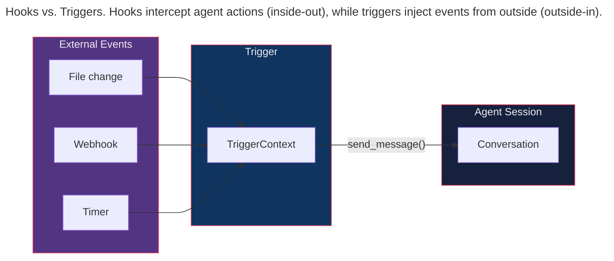
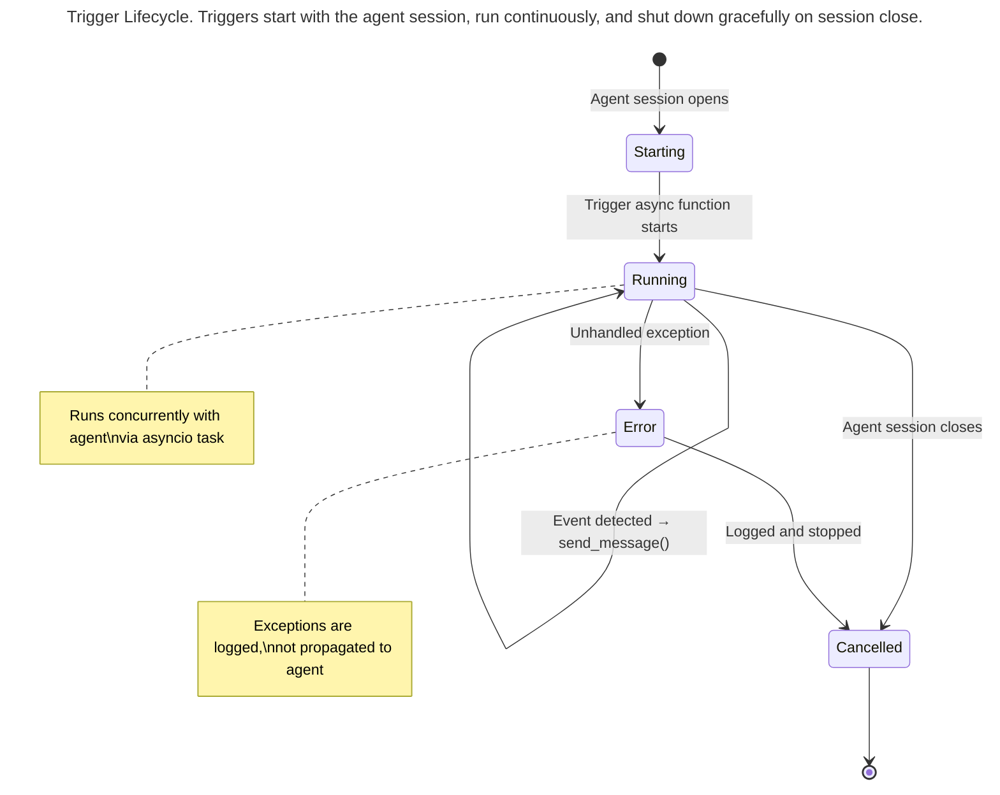

> This article is part of the [Antigravity Engineering Series](https://iamulya.one/tags/antigravity-engineering-series).
{: .prompt-info }

You're debugging a flaky test. You edit `src/auth/login.ts`, save, switch to the terminal, run `npm test`, wait, read the output, switch back, edit again. Each iteration follows the same mechanical loop: edit → save → switch → run → read → switch. The feedback loop has five steps too many.

If you've ever worked with event-driven architectures, you'll recognize this as a polling problem masquerading as a workflow. The developer is polling the file system by hand, checking whether something changed, and then triggering a downstream action. The entire sequence begs to be replaced by an event.

**Triggers** are the SDK's answer. They're long-lived async functions that run alongside the agent session, watching for external events — file changes, webhooks, timers — and pushing messages into the agent's conversation. The agent reacts to these messages exactly as it would to a user prompt. No polling. No prompting. Just: event occurs → agent acts.

---

## What Triggers Are (and Aren't)

Triggers are **not** hooks. The distinction maps to a fundamental pattern in event-driven design:

| | Hooks | Triggers |
|---|---|---|
| **When they fire** | When the agent calls a tool | When an external event occurs |
| **What they do** | Intercept and gate tool calls | Push new messages to the agent |
| **Lifetime** | Per-tool-call or per-turn | Entire session |
| **Blocking?** | Can block execution | Never block — they inject messages |
| **Direction** | Inside-out (agent → hook) | Outside-in (event → agent) |

In integration pattern terms: hooks are *message filters* on outbound channels. Triggers are *event-driven consumers* on inbound channels. Both are essential, and conflating them creates the kind of architectural confusion that's difficult to untangle later.



---

## `TriggerContext` — The Bridge to the Agent

Every trigger receives a `TriggerContext` when it starts. This is the channel adapter — the handle that converts an external event into an internal message:

```python
from google.antigravity.triggers.triggers import TriggerContext

async def my_trigger(ctx: TriggerContext):
    """A trigger is just an async function."""
    # Send a message to the agent
    await ctx.send_message("Something happened — please investigate.")
    
    # The agent receives this as a new conversational turn,
    # just as if the user had typed it.
```

`send_message()` is fire-and-forget from the trigger's perspective. The agent processes it asynchronously. Multiple triggers can send messages concurrently — they're queued and processed in order, like messages on a channel with guaranteed ordering.

---

## Built-in: File Change Triggers

The SDK provides `FileChange` and `FileChangeKind` types for file-watching triggers:

```python
from google.antigravity.types import FileChange, FileChangeKind

# FileChangeKind values:
# FileChangeKind.CREATED  — new file
# FileChangeKind.MODIFIED — existing file changed
# FileChangeKind.DELETED  — file removed
```

### Auto-test on save

```python
# file_watch_trigger.py
# Trigger that runs tests when source files change.

import asyncio
from pathlib import Path
from watchfiles import awatch  # pip install watchfiles
from google.antigravity.triggers.triggers import TriggerContext
from google.antigravity.types import FileChangeKind


async def auto_test_trigger(ctx: TriggerContext):
    """
    Watches src/ for changes and tells the agent to run tests.
    Uses the watchfiles library for efficient filesystem monitoring.
    """
    watch_path = Path("./src")
    
    async for changes in awatch(watch_path):
        # Deduplicate and filter
        changed_files = []
        for change_type, path in changes:
            if path.endswith((".ts", ".tsx", ".js", ".jsx")):
                kind = {
                    1: FileChangeKind.CREATED,
                    2: FileChangeKind.MODIFIED,
                    3: FileChangeKind.DELETED,
                }.get(change_type, FileChangeKind.MODIFIED)
                changed_files.append(f"{kind.value}: {path}")
        
        if not changed_files:
            continue
        
        # Debounce: wait 500ms for rapid saves to settle
        await asyncio.sleep(0.5)
        
        file_list = "\n".join(changed_files)
        await ctx.send_message(
            f"Files changed:\n{file_list}\n\n"
            f"Run the tests for the affected modules. "
            f"If any test fails, show me the failure and suggest a fix."
        )
```

### Registering triggers with the agent

```python
# agent_with_triggers.py

import asyncio
from google.antigravity import Agent, LocalAgentConfig
from google.antigravity.types import CapabilitiesConfig
from google.antigravity.hooks.policy import allow, deny
from file_watch_trigger import auto_test_trigger


async def main():
    config = LocalAgentConfig(
        capabilities=CapabilitiesConfig(),
        policies=[
            allow("view_file"),
            allow("grep_search"),
            allow("run_command",
                  when=lambda a: a.get("CommandLine", "").startswith("npm test")),
            allow("run_command",
                  when=lambda a: a.get("CommandLine", "").startswith("npx jest")),
            deny("*"),
        ],
        triggers=[auto_test_trigger],
    )

    async with Agent(config) as agent:
        # Initial prompt — agent starts in interactive mode
        response = await agent.chat(
            "I'm working on the auth module. Watch for file changes "
            "and run the relevant tests automatically."
        )
        print(await response.text())

        # The agent now runs indefinitely — the trigger sends messages
        # whenever files change. The agent processes each one.
        # Press Ctrl+C to stop.
        await asyncio.Event().wait()


if __name__ == "__main__":
    asyncio.run(main())
```

---

## Custom Triggers

Any async function with the `TriggerContext` signature is a trigger. The pattern is the same in every case: wait for an event, translate it into a message, send it to the agent. Here are three variations on this theme:

### Webhook trigger

```python
# webhook_trigger.py
# Receives HTTP webhooks and forwards them to the agent.

from aiohttp import web
from google.antigravity.triggers.triggers import TriggerContext


async def webhook_trigger(ctx: TriggerContext):
    """Listens for POST webhooks on port 8080."""
    
    async def handle_webhook(request: web.Request):
        payload = await request.json()
        event_type = request.headers.get("X-Event-Type", "unknown")
        
        await ctx.send_message(
            f"Webhook received: {event_type}\n"
            f"Payload:\n```json\n{payload}\n```\n\n"
            f"Analyze this event and take appropriate action."
        )
        return web.Response(text="OK")
    
    app = web.Application()
    app.router.add_post("/webhook", handle_webhook)
    
    runner = web.AppRunner(app)
    await runner.setup()
    site = web.TCPSite(runner, "0.0.0.0", 8080)
    await site.start()
    
    # Keep running until the session ends
    await asyncio.Event().wait()
```

### Polling trigger

```python
# polling_trigger.py
# Polls an API on an interval and notifies the agent of changes.

import asyncio
import aiohttp
from google.antigravity.triggers.triggers import TriggerContext


async def deployment_status_trigger(ctx: TriggerContext):
    """Polls deployment status every 30 seconds."""
    last_status = None
    
    while True:
        async with aiohttp.ClientSession() as session:
            async with session.get("https://api.internal/deploy/status") as resp:
                data = await resp.json()
                current_status = data.get("status")
                
                if current_status != last_status:
                    last_status = current_status
                    await ctx.send_message(
                        f"Deployment status changed to: {current_status}\n"
                        f"Details: {data.get('message', 'none')}\n\n"
                        f"Check if this affects our current work."
                    )
        
        await asyncio.sleep(30)
```

### Cron trigger

```python
# cron_trigger.py
# Simple cron-like trigger using asyncio.

import asyncio
from datetime import datetime
from google.antigravity.triggers.triggers import TriggerContext


async def hourly_coverage_check(ctx: TriggerContext):
    """Runs a coverage check every hour during work hours."""
    while True:
        now = datetime.now()
        
        # Only run during work hours (9 AM - 6 PM, weekdays)
        if 9 <= now.hour < 18 and now.weekday() < 5:
            await ctx.send_message(
                "Hourly coverage check: Run `npx jest --coverage` "
                "and report any modules that dropped below 80%."
            )
        
        # Sleep until the next hour
        seconds_until_next_hour = 3600 - (now.minute * 60 + now.second)
        await asyncio.sleep(seconds_until_next_hour)
```

---

## Triggers vs Sidecars

Both mechanisms initiate agent work without a human prompt, but they occupy different points in the design space:

| | Triggers | Sidecars |
|---|---|---|
| **Process** | In-process (same Python process) | Out-of-process (managed by platform) |
| **Language** | Python (SDK) | Any (shell scripts, binaries) |
| **Lifecycle** | Tied to agent session | Independent — survives session end |
| **Use when** | Reactive: "do X when Y happens" | Scheduled: "do X every night at 11 PM" |
| **Communication** | Direct `send_message()` | Via `agentapi new-conversation` |

The distinction maps cleanly to the event-driven vs. batch-processing divide. Triggers are *event-driven consumers*: they react to individual events in real time. Sidecars are *scheduled batch processors*: they run on a cron and work through a queue of tasks. Use triggers for in-session reactive behavior. Use sidecars for autonomous background work that runs independently of any user session.

---

## Trigger Lifecycle



Key behaviors:
- Triggers start when `Agent.__aenter__()` is called
- They run as `asyncio.Task` instances alongside the agent
- If a trigger raises an unhandled exception, it's logged and the task is cancelled — the agent continues
- When the session closes, all trigger tasks are cancelled via `asyncio.Task.cancel()`

---

## What You Now Know

Triggers are the SDK's event system — the mechanism that turns an agent from a request-reply service into an event-driven processor. They're async functions that receive a `TriggerContext` handle for sending messages to the agent. File watchers, webhooks, pollers, crons — anything that waits for an external event and needs to tell the agent about it.

The key mental model: hooks are *interceptors* (they gate what the agent does). Triggers are *injectors* (they push new work into the agent). Used together, you get an agent that reacts to the world while staying within safety boundaries — the event-driven architecture's promise of responsiveness combined with the policy engine's guarantee of control.

---

> Companion code for this post is available at [antigravity-triggers](https://github.com/iamulya/antigravity-triggers).
{: .prompt-tip }
