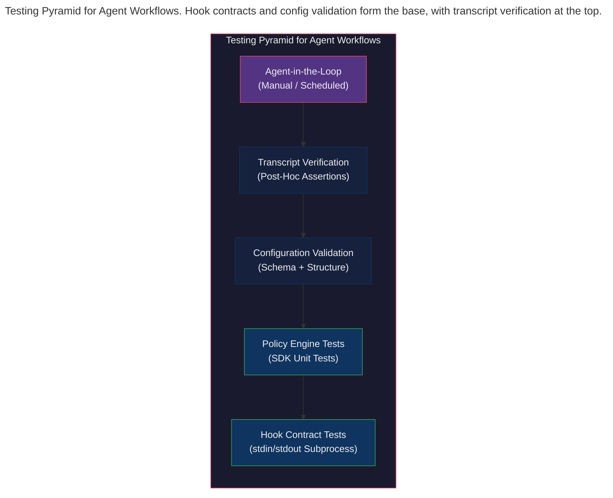

> This article is part of the [Antigravity Engineering Series](https://iamulya.one/tags/antigravity-engineering-series).
{: .prompt-info }

You built the hook scripts. You wrote the policies. You configured the sidecar. You shipped it all and went to bed.

At 3 AM, a one-character typo in your `PreToolUse` hook emitted malformed JSON, silently failing open. The agent — now ungated — ran `npm publish` against your production registry. You woke up to 47 Slack messages.

The hook logic was sound. You just never tested it.

Anyone who has operated a production system long enough knows this failure pattern. The safety mechanism that was never tested is the safety mechanism that fails when you need it most. In integration architecture, we call this the *untested dead-letter channel* — the error handler that's never handled an error.

Antigravity workflows are built from composable pieces: shell scripts that consume stdin JSON and emit stdout JSON, Python policies that resolve to allow/deny decisions, configuration files that wire everything together, and SKILL.md files that teach agents what to do. Every one of these is **locally testable** — without an API key, without a running agent, without deploying anything. But the testing patterns aren't obvious because the pieces look different from traditional application code.

This post walks through seven strategies for testing Antigravity customizations, from subprocess-based hook contract verification to transcript-based post-hoc assertions. Each strategy targets a specific failure mode and uses a specific product surface.

---

## The Testing Pyramid for Agent Workflows

Traditional testing pyramids have unit tests at the base, integration tests in the middle, and E2E tests at the top. Agent workflows need a different model — one that accounts for the fact that agent behavior is non-deterministic while the infrastructure around it is fully deterministic:



The bottom two layers are pure, deterministic, and fast. They run in CI in seconds. The top layers involve agent behavior, which is non-deterministic — you verify properties, not exact outputs. This post focuses on the bottom four layers — the ones you can fully automate and run on every commit.

---

## Strategy 1: Hook Contract Testing

**What it tests**: Shell hook scripts that gate agent tool calls  
**Failure mode**: Malformed JSON output, wrong decision for a given input, unhandled edge cases  
**Product surface**: Antigravity 2.0, IDE (hooks.json)

Hooks follow a strict I/O contract documented in the [Hooks documentation](https://antigravity.google/docs/hooks):

- **Input**: JSON on stdin containing `toolCall`, `stepIdx`, and system metadata
- **Output**: JSON on stdout containing `decision`, `reason`, and optionally `permissionOverrides`

This makes hooks **pure functions** from a testing perspective — a property that any integration architect would recognize and celebrate. Spawn the script as a subprocess, pipe mock JSON to stdin, parse the JSON from stdout. No mocks. No stubs. No running agent.

### The test harness

```python
# test_hook_contracts.py
# Subprocess-based contract tests for hook shell scripts

import os
import json
import subprocess
import pytest

ROOT = os.path.abspath(os.path.join(os.path.dirname(__file__), ".."))

def run_hook(script_path, input_data, env_override=None):
    """Spawn a hook script, pipe JSON stdin, return parsed JSON stdout."""
    env = os.environ.copy()
    if env_override:
        env.update(env_override)
    proc = subprocess.Popen(
        [script_path],
        stdin=subprocess.PIPE,
        stdout=subprocess.PIPE,
        stderr=subprocess.PIPE,
        text=True,
        env=env,
    )
    stdout, stderr = proc.communicate(input=json.dumps(input_data))
    if proc.returncode != 0:
        raise RuntimeError(f"Hook failed (exit {proc.returncode}): {stderr}")
    return json.loads(stdout.strip())
```

### Testing PreToolUse decisions

A `command-gate.sh` hook gates terminal commands with three possible outcomes:

```python
COMMAND_GATE = os.path.join(ROOT, "scripts/command-gate.sh")

def test_command_gate_denies_destructive_commands():
    """Destructive commands must be hard-denied regardless of context."""
    for cmd in ["rm -rf /", "npm publish", "git push origin main"]:
        payload = {"toolCall": {"args": {"CommandLine": cmd}}}
        result = run_hook(COMMAND_GATE, payload)
        assert result["decision"] == "deny", f"Expected deny for: {cmd}"
        assert "reason" in result

def test_command_gate_allows_safe_commands():
    """Known-safe commands are auto-approved."""
    for cmd in ["npm test", "git add src/", "npx eslint ."]:
        payload = {"toolCall": {"args": {"CommandLine": cmd}}}
        result = run_hook(COMMAND_GATE, payload)
        assert result["decision"] == "allow", f"Expected allow for: {cmd}"

def test_command_gate_asks_for_unknown_commands():
    """Unrecognized commands require human approval."""
    payload = {"toolCall": {"args": {"CommandLine": "python3 mystery.py"}}}
    result = run_hook(COMMAND_GATE, payload)
    assert result["decision"] == "ask"
    assert "Unrecognized" in result["reason"]
```

### Testing Stop hook loop control

The `Stop` hook can prevent the agent from stopping prematurely by returning `{"decision": "continue"}`:

```python
KEEP_GOING = os.path.join(ROOT, "scripts/keep-going.sh")

def test_stop_hook_continues_when_no_prs_opened(tmp_path):
    """Agent must not stop until at least one PR is opened."""
    # Mock `gh` to return empty PR list
    mock_gh = tmp_path / "bin" / "gh"
    mock_gh.parent.mkdir()
    mock_gh.write_text("#!/bin/sh\necho '[]'\n")
    mock_gh.chmod(0o755)

    payload = {
        "terminationReason": "model_stop",
        "fullyIdle": "true",
    }
    result = run_hook(
        KEEP_GOING, payload,
        env_override={"PATH": f"{mock_gh.parent}:{os.environ['PATH']}"},
    )
    assert result["decision"] == "continue"
    assert "No PRs" in result["reason"]
```

---

## Strategy 2: External Command Mocking

**What it tests**: Hooks that shell out to external CLIs (`curl`, `gh`, `agentapi`)  
**Failure mode**: Hook passes wrong arguments to external tool, doesn't handle failure  
**Product surface**: Antigravity 2.0 (sidecars, agentapi)

Many hooks call external tools: `curl` for Slack notifications, `gh` for GitHub PR queries, `agentapi` for starting agent conversations. You can't (and shouldn't) call these in tests. Instead, **prepend a mock `bin/` directory to `PATH`** with dummy scripts that log their invocations. This is the test double pattern applied at the process boundary — the same technique used for testing shell-based integration pipelines.

### Mocking curl to verify Slack notifications

```python
NOTIFY_SLACK = os.path.join(ROOT, "scripts/notify-slack.sh")

def test_slack_notification_fires_on_completion(tmp_path):
    """Stop hook sends a Slack message with conversation ID when fully idle."""
    # Create a mock curl that logs its arguments
    mock_bin = tmp_path / "bin"
    mock_bin.mkdir()
    mock_curl = mock_bin / "curl"
    arg_log = tmp_path / "curl_calls.log"
    mock_curl.write_text(f'#!/bin/sh\necho "$@" >> {arg_log}\n')
    mock_curl.chmod(0o755)

    payload = {
        "terminationReason": "model_stop",
        "conversationId": "test-conv-abc123",
        "fullyIdle": "true",
    }
    result = run_hook(
        NOTIFY_SLACK, payload,
        env_override={"PATH": f"{mock_bin}:{os.environ['PATH']}"},
    )
    assert result["decision"] == "stop"

    # Verify curl was called with the right payload
    curl_args = arg_log.read_text()
    assert "test-conv-abc123" in curl_args
    assert "Tech Debt Patrol completed" in curl_args
```

### Mocking agentapi for sidecar scripts

```python
def test_sidecar_dispatches_correct_prompts(tmp_path):
    """Sidecar run script calls agentapi with the right prompts."""
    mock_bin = tmp_path / "bin"
    mock_bin.mkdir()
    mock_api = mock_bin / "agentapi"
    call_log = tmp_path / "agentapi_calls.log"
    mock_api.write_text(f'#!/bin/sh\necho "$@" >> {call_log}\n')
    mock_api.chmod(0o755)

    # Run the sidecar dispatch script
    script = os.path.join(ROOT, "scripts/run-patrol.sh")
    env = os.environ.copy()
    env["PATH"] = f"{mock_bin}:{env['PATH']}"

    proc = subprocess.run([script], env=env, capture_output=True, text=True)
    assert proc.returncode == 0

    # Verify agentapi was called for each task
    calls = call_log.read_text().strip().split("\n")
    assert len(calls) >= 1
    assert any("new-conversation" in c for c in calls)
```

The pattern: **mock the binary, run the script, assert the arguments**. This verifies the integration contract without touching the network.

---

## Strategy 3: SDK Policy Engine Unit Testing

**What it tests**: Python policies using `deny()`, `allow()`, `ask_user()` from the SDK  
**Failure mode**: Priority resolution errors, wrong policy matching a tool call  
**Product surface**: Antigravity SDK

The SDK's `policy.enforce()` creates a hook from a list of policy declarations. Policies are evaluated using a priority bucket model — specific denies override broad allows. You can test this purely in Python with `pytest` and `unittest.mock`:

```python
# test_sdk_policies.py
# Unit tests for SDK declarative policy resolution

import pytest
from unittest.mock import AsyncMock
from google.antigravity import types
from google.antigravity.hooks import hooks, policy

# Import the policies module from the blog code
import safety_policies


@pytest.fixture
def make_tool_call():
    """Create mock ToolCall objects for policy testing."""
    def _make(tool_name, **kwargs):
        tc = types.ToolCall(name=tool_name, args=kwargs, canonical_path=None)
        return tc
    return _make


@pytest.mark.asyncio
async def test_deny_overrides_everything(make_tool_call):
    """Explicitly denied tools must be blocked regardless of other rules."""
    mock_handler = AsyncMock(return_value=True)
    policies = safety_policies.build_policies(approval_handler=mock_handler)
    hook = policy.enforce(policies)
    ctx = hooks.HookContext()

    # These must ALWAYS be denied
    for tool, kwargs in [
        ("run_command", {"CommandLine": "rm -rf /"}),
        ("run_command", {"CommandLine": "sudo reboot"}),
        ("write_to_file", {"TargetFile": ".env"}),
        ("read_file", {"AbsolutePath": "/home/.ssh/id_rsa"}),
    ]:
        result = await hook.run(ctx, make_tool_call(tool, **kwargs))
        assert not result.allow, f"Expected deny for {tool}({kwargs})"

    # Handler should never be called for denied tools
    assert mock_handler.call_count == 0


@pytest.mark.asyncio
async def test_allow_bypasses_ask(make_tool_call):
    """Explicitly allowed tools skip the ask_user handler."""
    mock_handler = AsyncMock(return_value=True)
    policies = safety_policies.build_policies(approval_handler=mock_handler)
    hook = policy.enforce(policies)
    ctx = hooks.HookContext()

    result = await hook.run(ctx, make_tool_call("view_file", AbsolutePath="/src/main.py"))
    assert result.allow
    assert mock_handler.call_count == 0  # Handler not invoked


@pytest.mark.asyncio
async def test_unknown_commands_trigger_ask(make_tool_call):
    """Commands not in allow or deny lists invoke the ask_user handler."""
    mock_handler = AsyncMock(return_value=True)
    policies = safety_policies.build_policies(approval_handler=mock_handler)
    hook = policy.enforce(policies)
    ctx = hooks.HookContext()

    result = await hook.run(ctx, make_tool_call("run_command", CommandLine="docker build ."))
    assert result.allow  # Handler returned True
    assert mock_handler.call_count == 1
```

### Testing the priority bucket model

The Policy Priority Model article introduced priority levels. Test that higher-priority rules take precedence:

```python
@pytest.mark.asyncio
async def test_priority_resolution(make_tool_call):
    """Priority 1 (specific deny) beats Priority 3 (broad allow)."""
    import production_policies
    import dataclasses

    mock_handler = AsyncMock(return_value=True)

    # Inject mock handler into ask_user policies
    mocked = []
    for p in production_policies.policies:
        if p.decision == policy.Decision.ASK_USER:
            mocked.append(dataclasses.replace(p, ask_user=mock_handler))
        else:
            mocked.append(p)

    hook = policy.enforce(mocked)
    ctx = hooks.HookContext()

    # sudo is Priority 1 deny — must block even though run_command has Priority 3 allow
    result = await hook.run(ctx, make_tool_call("run_command", CommandLine="sudo rm -rf /"))
    assert not result.allow

    # generate_image is Priority 4 wildcard deny — blocks unrecognized tools
    result = await hook.run(ctx, make_tool_call("generate_image", Prompt="test"))
    assert not result.allow
```

---

## Strategy 4: Configuration Schema Validation

**What it tests**: `hooks.json`, `sidecar.json`, `plugin.json`, and `mcp_config.json` files  
**Failure mode**: Invalid event names, missing required fields, non-existent command paths  
**Product surface**: Antigravity 2.0, IDE (configuration files)

Configuration errors are silent killers — the *integration anti-pattern* where a system fails by doing nothing instead of throwing an error. A typo in a hook event name (`"PreTooluse"` instead of `"PreToolUse"`) means the hook never fires. A sidecar with both `command` and `builtin` set will fail at runtime. These are trivially checkable with structural tests.

```python
# test_config_schemas.py
# Schema validation for Antigravity configuration files

import os
import json
import glob
import re
import pytest

ROOT = os.path.abspath(os.path.join(os.path.dirname(__file__), ".."))

VALID_HOOK_EVENTS = {"PreToolUse", "PostToolUse", "PreInvocation", "PostInvocation", "Stop"}
VALID_RESTART_POLICIES = {"always", "on-failure", "never"}
VALID_DECISIONS = {"allow", "deny", "ask", "force_ask", "continue", "stop"}


class TestHooksJson:
    """Validate all hooks.json files in the workspace."""

    @pytest.fixture
    def hooks_files(self):
        return glob.glob(os.path.join(ROOT, "**", "hooks.json"), recursive=True)

    def test_hooks_json_is_valid_json(self, hooks_files):
        for path in hooks_files:
            with open(path) as f:
                data = json.load(f)  # Raises on invalid JSON
            assert isinstance(data, dict), f"{path}: root must be object"

    def test_hook_events_are_valid(self, hooks_files):
        """Every event key must be a recognized hook event or 'enabled'."""
        for path in hooks_files:
            with open(path) as f:
                data = json.load(f)
            for hook_name, config in data.items():
                for key in config:
                    if key == "enabled":
                        continue
                    assert key in VALID_HOOK_EVENTS, (
                        f"{path}: hook '{hook_name}' has invalid event '{key}'. "
                        f"Valid events: {VALID_HOOK_EVENTS}"
                    )

    def test_matchers_are_valid_regex(self, hooks_files):
        """Every matcher string must be a compilable regular expression."""
        for path in hooks_files:
            with open(path) as f:
                data = json.load(f)
            for hook_name, config in data.items():
                for event in VALID_HOOK_EVENTS:
                    for handler in config.get(event, []):
                        matcher = handler.get("matcher", "")
                        if matcher and matcher != "*":
                            try:
                                re.compile(matcher)
                            except re.error as e:
                                pytest.fail(
                                    f"{path}: hook '{hook_name}' event '{event}' "
                                    f"has invalid matcher regex '{matcher}': {e}"
                                )

    def test_hook_commands_exist(self, hooks_files):
        """Every command path must point to an existing file."""
        for path in hooks_files:
            base_dir = os.path.dirname(path)
            with open(path) as f:
                data = json.load(f)
            for hook_name, config in data.items():
                for event in VALID_HOOK_EVENTS:
                    handlers = config.get(event, [])
                    # Handle both direct handler lists and matcher-wrapped lists
                    for handler in handlers:
                        hooks_list = handler.get("hooks", [handler])
                        for h in hooks_list:
                            cmd = h.get("command", "")
                            if cmd and not cmd.startswith("/"):
                                cmd_path = os.path.join(base_dir, cmd)
                                assert os.path.exists(cmd_path), (
                                    f"{path}: command '{cmd}' not found "
                                    f"(resolved to {cmd_path})"
                                )


class TestSidecarJson:
    """Validate sidecar.json files."""

    @pytest.fixture
    def sidecar_files(self):
        return glob.glob(os.path.join(ROOT, "**", "sidecar.json"), recursive=True)

    def test_command_or_builtin_exclusive(self, sidecar_files):
        """Exactly one of 'command' or 'builtin' must be set."""
        for path in sidecar_files:
            with open(path) as f:
                data = json.load(f)
            has_command = "command" in data
            has_builtin = "builtin" in data
            assert has_command != has_builtin, (
                f"{path}: must have exactly one of 'command' or 'builtin', "
                f"got command={has_command}, builtin={has_builtin}"
            )

    def test_restart_policy_is_valid(self, sidecar_files):
        """restart_policy must be a recognized value."""
        for path in sidecar_files:
            with open(path) as f:
                data = json.load(f)
            policy = data.get("restart_policy", "always")
            assert policy in VALID_RESTART_POLICIES, (
                f"{path}: invalid restart_policy '{policy}'. "
                f"Valid: {VALID_RESTART_POLICIES}"
            )

    def test_schedule_builtin_has_cron(self, sidecar_files):
        """Sidecars using 'schedule' builtin must have a cron expression."""
        for path in sidecar_files:
            with open(path) as f:
                data = json.load(f)
            if data.get("builtin") == "schedule":
                args = data.get("args", [])
                assert len(args) >= 2, (
                    f"{path}: schedule builtin needs at least "
                    f"[cron_expr, command, ...], got {len(args)} args"
                )
                cron = args[0]
                parts = cron.split()
                assert len(parts) == 5, (
                    f"{path}: cron expression '{cron}' must have 5 fields, "
                    f"got {len(parts)}"
                )


class TestPluginJson:
    """Validate plugin.json manifest files."""

    @pytest.fixture
    def plugin_dirs(self):
        return glob.glob(os.path.join(ROOT, "**", "plugin.json"), recursive=True)

    def test_plugin_json_is_valid(self, plugin_dirs):
        for path in plugin_dirs:
            with open(path) as f:
                data = json.load(f)
            assert isinstance(data, dict)

    def test_plugin_skills_have_skill_md(self, plugin_dirs):
        """If a plugin has a skills/ directory, every skill needs SKILL.md."""
        for path in plugin_dirs:
            plugin_dir = os.path.dirname(path)
            skills_dir = os.path.join(plugin_dir, "skills")
            if os.path.isdir(skills_dir):
                for skill in os.listdir(skills_dir):
                    skill_path = os.path.join(skills_dir, skill)
                    if os.path.isdir(skill_path):
                        skill_md = os.path.join(skill_path, "SKILL.md")
                        assert os.path.exists(skill_md), (
                            f"Plugin skill '{skill}' in {plugin_dir} "
                            f"is missing SKILL.md"
                        )
```

---

## Strategy 5: Transcript Verification

**What it tests**: Agent behavior after execution — tool sequences, permission boundaries, budget compliance  
**Failure mode**: Agent used a denied tool, exceeded step limits, skipped required steps  
**Product surface**: Antigravity 2.0, CLI (transcript.jsonl)

Every agent conversation produces a `transcript.jsonl` file — a chronological log of every step, tool call, and model response. Every hook receives the `transcriptPath` in its stdin payload. This makes transcripts a **first-class testing surface**: run an agent (or simulate one), then parse the transcript and assert behavioral properties. It's *event sourcing* applied to agent verification — you can replay the entire session and check invariants after the fact.

```python
# test_transcript_verification.py
# Post-hoc assertions on agent conversation transcripts

import json
import os
import pytest

ROOT = os.path.abspath(os.path.join(os.path.dirname(__file__), ".."))
FIXTURE_PATH = os.path.join(ROOT, "fixtures", "sample_transcript.jsonl")


def load_transcript(path):
    """Parse a transcript.jsonl into a list of step dicts."""
    steps = []
    with open(path) as f:
        for line in f:
            line = line.strip()
            if line:
                steps.append(json.loads(line))
    return steps


def extract_tool_calls(steps):
    """Extract all tool calls from a transcript."""
    calls = []
    for step in steps:
        for tc in step.get("tool_calls", []):
            calls.append(tc)
    return calls


class TestTranscriptSafety:
    """Verify that a completed agent session respected safety boundaries."""

    @pytest.fixture
    def steps(self):
        return load_transcript(FIXTURE_PATH)

    @pytest.fixture
    def tool_calls(self, steps):
        return extract_tool_calls(steps)

    def test_no_denied_commands_executed(self, tool_calls):
        """No tool call should contain a known-blocked command."""
        BLOCKED = ["rm -rf", "sudo", "npm publish", "git push origin main"]
        for tc in tool_calls:
            if tc.get("name") == "run_command":
                cmd = tc.get("args", {}).get("CommandLine", "")
                for blocked in BLOCKED:
                    assert blocked not in cmd, (
                        f"Blocked command executed: {cmd}"
                    )

    def test_file_writes_within_allowed_directories(self, tool_calls):
        """All write_to_file calls must target allowed directories."""
        ALLOWED_PREFIXES = ["src/", "tests/", "blog/"]
        for tc in tool_calls:
            if tc.get("name") in ("write_to_file", "replace_file_content"):
                target = tc.get("args", {}).get("TargetFile", "")
                assert any(target.startswith(p) or f"/{p}" in target
                           for p in ALLOWED_PREFIXES), (
                    f"Write to unauthorized path: {target}"
                )

    def test_step_count_within_budget(self, steps):
        """Total steps must not exceed the configured budget."""
        MAX_STEPS = 200
        assert len(steps) <= MAX_STEPS, (
            f"Agent took {len(steps)} steps, exceeding budget of {MAX_STEPS}"
        )

    def test_required_tools_were_used(self, tool_calls):
        """For a tech debt patrol, certain tools must appear in the trace."""
        tool_names = {tc.get("name") for tc in tool_calls}
        # A proper patrol should at least search and test
        assert "grep_search" in tool_names, "Agent never searched the codebase"
        assert "run_command" in tool_names, "Agent never ran any commands"
```

### The transcript fixture

```json
{"step_index": 0, "source": "USER_EXPLICIT", "type": "USER_INPUT", "content": "Migrate deprecated API calls", "tool_calls": []}
{"step_index": 1, "source": "MODEL", "type": "TOOL_CALL", "tool_calls": [{"name": "grep_search", "args": {"SearchPath": "src/", "Query": "legacy.createUser"}}]}
{"step_index": 2, "source": "MODEL", "type": "TOOL_CALL", "tool_calls": [{"name": "replace_file_content", "args": {"TargetFile": "src/auth/login.ts", "TargetContent": "legacy.createUser", "ReplacementContent": "userService.create"}}]}
{"step_index": 3, "source": "MODEL", "type": "TOOL_CALL", "tool_calls": [{"name": "run_command", "args": {"CommandLine": "npm test"}}]}
{"step_index": 4, "source": "MODEL", "type": "TOOL_CALL", "tool_calls": [{"name": "run_command", "args": {"CommandLine": "git add src/"}}]}
{"step_index": 5, "source": "MODEL", "type": "TOOL_CALL", "tool_calls": [{"name": "run_command", "args": {"CommandLine": "git commit -m \"chore(auto): migrate legacy.createUser\""}}]}
```

This is a static fixture. In production, you'd use a `PostInvocation` hook or `Stop` hook to trigger transcript verification automatically after each agent session.

---

## Strategy 6: Skill & Workflow Smoke Testing

**What it tests**: SKILL.md frontmatter, referenced scripts, workflow step structure  
**Failure mode**: Missing `description` field, broken script references, malformed YAML  
**Product surface**: Antigravity 2.0, IDE, CLI (skills, workflows)

Skills and workflows are the instructions that teach agents what to do. A skill without a `description` is invisible to discovery. A skill that references a nonexistent script fails mid-execution. These are structural invariants that can and should be checked at build time:

```python
# test_skills_workflows.py
# Structural validation for SKILL.md and workflow files

import os
import glob
import re
import pytest

ROOT = os.path.abspath(os.path.join(os.path.dirname(__file__), ".."))


def parse_frontmatter(content):
    """Extract YAML frontmatter from a markdown file."""
    match = re.match(r'^---\s*\n(.*?)\n---\s*\n', content, re.DOTALL)
    if not match:
        return {}
    fm = {}
    for line in match.group(1).strip().split("\n"):
        if ":" in line:
            key, _, value = line.partition(":")
            fm[key.strip()] = value.strip()
    return fm


class TestSkills:
    """Validate all SKILL.md files in the workspace."""

    @pytest.fixture
    def skill_files(self):
        return glob.glob(os.path.join(ROOT, "**", "SKILL.md"), recursive=True)

    def test_skills_have_description(self, skill_files):
        """Every skill must have a description for agent discovery."""
        for path in skill_files:
            with open(path) as f:
                content = f.read()
            fm = parse_frontmatter(content)
            assert "description" in fm, (
                f"{path}: SKILL.md is missing 'description' in frontmatter. "
                f"Without it, the agent cannot discover this skill."
            )
            assert len(fm["description"]) > 10, (
                f"{path}: description is too short to be useful"
            )

    def test_referenced_scripts_exist(self, skill_files):
        """Scripts mentioned in SKILL.md instructions must exist on disk."""
        for path in skill_files:
            skill_dir = os.path.dirname(path)
            with open(path) as f:
                content = f.read()
            # Find script references like `scripts/verify.sh` or `./scripts/run.sh`
            refs = re.findall(
                r'(?:scripts/|\./)([\w\-/]+\.(?:sh|py))', content
            )
            for ref in refs:
                # Resolve relative to skill directory
                candidates = [
                    os.path.join(skill_dir, "scripts", os.path.basename(ref)),
                    os.path.join(skill_dir, ref),
                    os.path.join(ROOT, "scripts", os.path.basename(ref)),
                ]
                assert any(os.path.exists(c) for c in candidates), (
                    f"{path}: references script '{ref}' which was not found "
                    f"in any expected location"
                )

    def test_skill_body_has_content(self, skill_files):
        """SKILL.md must have substantive instructions, not just frontmatter."""
        for path in skill_files:
            with open(path) as f:
                content = f.read()
            # Strip frontmatter
            body = re.sub(r'^---.*?---\s*\n', '', content, flags=re.DOTALL)
            assert len(body.strip()) > 50, (
                f"{path}: skill body is too short ({len(body.strip())} chars). "
                f"Skills need substantive instructions."
            )


class TestWorkflows:
    """Validate workflow markdown files."""

    @pytest.fixture
    def workflow_files(self):
        patterns = [
            os.path.join(ROOT, ".agents", "workflows", "*.md"),
            os.path.join(ROOT, ".agents", "workflows", "**", "*.md"),
        ]
        files = []
        for pat in patterns:
            files.extend(glob.glob(pat, recursive=True))
        return files

    def test_workflows_have_steps(self, workflow_files):
        """Every workflow should contain numbered steps or headings."""
        for path in workflow_files:
            with open(path) as f:
                content = f.read()
            has_steps = bool(re.search(r'(?:^|\n)\s*\d+\.', content))
            has_headings = bool(re.search(r'(?:^|\n)#{1,3}\s+', content))
            assert has_steps or has_headings, (
                f"{path}: workflow has no numbered steps or section headings"
            )
```

---

## Strategy 7: Sidecar Configuration Testing

**What it tests**: Sidecar schedule definitions, cron expressions, agentapi integration  
**Failure mode**: Invalid cron expression, missing project binding, wrong command path  
**Product surface**: Antigravity 2.0 (sidecars, agentapi, schedule builtin)

Sidecars are configured via `sidecar.json` and enabled in `config.json`. A misconfigured sidecar won't crash — it just won't run. These tests catch the silent failures, turning invisible misconfigurations into visible test failures:

```python
# Included in test_config_schemas.py (see Strategy 4)

def test_schedule_cron_fields_are_valid():
    """Each cron field must contain only valid characters."""
    VALID_CRON_CHARS = re.compile(r'^[\d\*,\-/]+$')

    for path in glob.glob(os.path.join(ROOT, "**", "sidecar.json"), recursive=True):
        with open(path) as f:
            data = json.load(f)
        if data.get("builtin") == "schedule":
            cron = data["args"][0]
            for i, field in enumerate(cron.split()):
                assert VALID_CRON_CHARS.match(field), (
                    f"{path}: cron field {i} ('{field}') contains "
                    f"invalid characters"
                )

def test_agentapi_prompts_are_non_empty():
    """Sidecar scripts that call agentapi must provide a prompt."""
    for path in glob.glob(os.path.join(ROOT, "**", "sidecar.json"), recursive=True):
        with open(path) as f:
            data = json.load(f)
        if data.get("builtin") == "schedule":
            args = data.get("args", [])
            if len(args) >= 3 and args[1] == "agentapi":
                # args: [cron, "agentapi", "new-conversation", prompt]
                assert len(args) >= 4, (
                    f"{path}: agentapi new-conversation needs a prompt argument"
                )
                prompt = args[3] if len(args) > 3 else ""
                assert len(prompt) > 0, (
                    f"{path}: agentapi prompt is empty"
                )
```

---

## Running the Full Suite

Create a `pyproject.toml` to configure pytest:

```toml
[project]
name = "antigravity-workflow-tests"
version = "0.1.0"

[tool.pytest.ini_options]
testpaths = ["tests"]
asyncio_mode = "auto"
markers = [
    "slow: marks tests that spawn subprocesses or require fixtures",
]
```

Run everything:

```bash
# Install dependencies
pip install pytest pytest-asyncio google-antigravity

# Run the full suite
pytest tests/ -v

# Run only fast structural checks (no subprocesses)
pytest tests/test_config_schemas.py tests/test_skills_workflows.py -v

# Run hook contract tests with verbose subprocess output
pytest tests/test_hook_contracts.py -v -s
```

---

## The Product Surface

| Capability | Product | Testing Strategy |
|-----------|---------|-----------------|
| Shell hook stdin/stdout contracts, hooks.json config | **2.0 / IDE** | Strategy 1 (Contract), Strategy 4 (Schema) |
| External CLI integration (curl, gh, agentapi) | **2.0** | Strategy 2 (Command Mocking) |
| Python policy engine (`deny`, `allow`, `ask_user`), lifecycle hooks | **SDK** | Strategy 3 (Policy Unit Tests) |
| Sidecar scheduling, cron, agentapi orchestration | **2.0** | Strategy 7 (Sidecar Config) |
| Agent transcript (transcript.jsonl) | **2.0 / CLI** | Strategy 5 (Transcript Verification) |
| Skills (SKILL.md), workflows, plugins | **2.0 / IDE / CLI** | Strategy 6 (Smoke Tests) |

---

## What You've Built

A testing architecture that catches agent workflow failures before they reach production:

1. **Hook contract tests** spawn shell scripts as subprocesses and verify their JSON decisions — a `PreToolUse` hook that silently fails open shows up as a test failure, not a 3 AM incident
2. **External command mocks** use PATH injection to verify hooks call `curl`, `gh`, and `agentapi` with the right arguments without touching the network
3. **SDK policy unit tests** instantiate the policy engine programmatically and verify priority resolution — does `deny("run_command", when=lambda a: a.get("CommandLine", "").startswith("sudo"))` actually override a broad `allow("run_command")`?
4. **Configuration schema tests** validate `hooks.json`, `sidecar.json`, and `plugin.json` structurally — catching typos in event names, invalid cron expressions, and missing command paths
5. **Transcript verification** parses `transcript.jsonl` after agent runs to assert behavioral properties — no denied commands executed, all writes within allowed directories, step counts within budget
6. **Skill smoke tests** verify that SKILL.md files have proper frontmatter and that referenced scripts actually exist on disk
7. **Sidecar config tests** validate schedule definitions, cron syntax, and agentapi integration contracts

The agent that runs your overnight pipeline is only as reliable as the tests around it. You wouldn't deploy a web service without unit tests. You wouldn't push a database migration without a rollback plan. The same discipline applies here — the only difference is that the system under test happens to include a language model. Everything around it is deterministic, testable infrastructure. Treat it accordingly.

---

> Companion code for this post is available at [antigravity-testing-strategies](https://github.com/iamulya/antigravity-testing-strategies).
{: .prompt-tip }
